¡Hola a todos!

**Gladys Assistant 5 ya está disponible.** 🎉

Es la primera versión principal de Gladys en casi seis años, y es la que llevaba muchísimo tiempo queriendo publicar: un rediseño completo de la interfaz, desde el panel hasta la última página de ajustes.

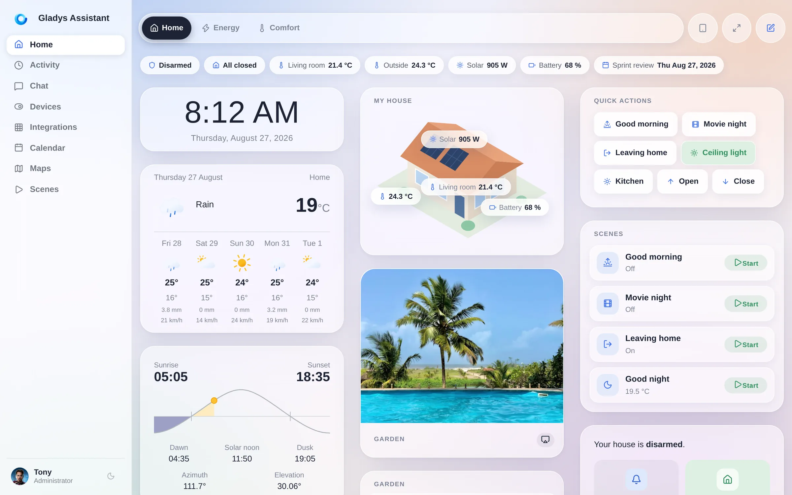

{/* truncate */}

## Un poco de historia

Gladys es público **desde 2013**. Empezó como un proyecto personal en una Raspberry Pi, en un dormitorio, con una idea muy sencilla: tu casa debería estar gestionada por una máquina **que te pertenece**, **en tu casa**, que sigue funcionando cuando se cae internet o cuando una startup es comprada por otra empresa.

Trece años después, esa idea no se ha movido ni un milímetro, y ha envejecido bien.

- **2013**: las primeras líneas de código, Gladys v1, en una Raspberry Pi.
- **2015**: Gladys v2, y se forma una comunidad a su alrededor.
- **2016**: Gladys v3.
- **3 de noviembre de 2020**: **Gladys 4**, una reescritura completa, basada en Docker, con la interfaz que la mayoría de la comunidad usa hoy.
- **27 de agosto de 2026**: **Gladys Assistant 5**.

Entre la v4 y hoy, hemos publicado **86 actualizaciones de funcionalidades**, cada una con un buen paquete de novedades, además de las versiones de corrección de errores entre medias. El motor se ha vuelto muy bueno: Zigbee, Z-Wave, Matter, MQTT, cámaras, energía, escenas, un asistente de IA, un sistema de plugins. Pero la interfaz seguía siendo la diseñada en 2020, para una pantalla de portátil, en una época en la que no me imaginaba que la gente colgaría tabletas en las paredes y controlaría su casa desde el móvil en la cama.

Y eso es exactamente lo que pasó. Así que la versión 5 está pensada para la pantalla que de verdad usas.

## ☀️ Horizon, el nuevo diseño

El nuevo diseño se llama **Horizon**. Es un tema de cristal suave y luminoso: superficies esmeriladas que flotan sobre un degradado vivo, esquinas generosamente redondeadas, profundidad real y una escala tipográfica que por fin deja respirar a los números.

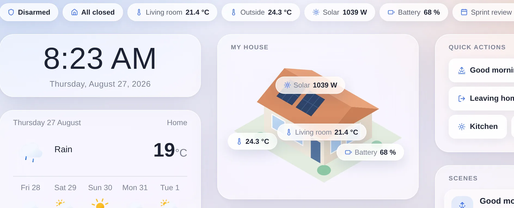

Esto es un zoom de la parte superior de un panel, a tamaño real. Cada widget es un panel esmerilado con un radio amplio, que flota sobre un degradado que recorre toda la página por detrás en lugar de repintarse tarjeta a tarjeta. En el centro está la **vista de la casa**, el widget estrella de esta versión: tu casa como ilustración, con los valores en directo colocados exactamente donde corresponden.

No es un simple cambio de aspecto de dos pantallas. **Todas las páginas de Gladys han pasado al nuevo diseño**: el panel, Dispositivos, Integraciones y cada una de sus subpáginas, Conversación, Actividad, Calendario, Planos, Escenas, Ajustes, el perfil e incluso la pantalla de inicio de sesión.

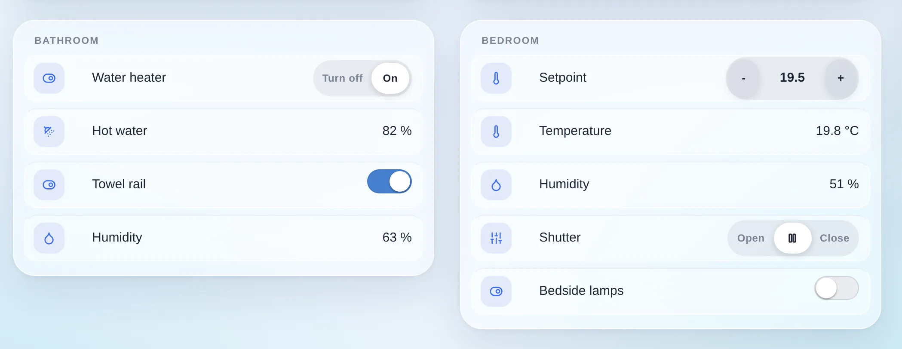

Y los controles se han redibujado uno a uno. Los antiguos grupos de botones de Bootstrap se han convertido en **controles segmentados al estilo iOS**: una pista suave y un único segmento activo en blanco. Las consignas se han convertido en **cápsulas** con un menos y un más. Cada fila de dispositivo es ahora su propia baldosa de cristal anidada. Nada de esto cambia lo que hace Gladys. Todo ello cambia la sensación de usarlo veinte veces al día.

Mi detalle favorito solo se aprecia de verdad en movimiento. El selector de paneles no está en una barra en la parte superior de la página: es una **cápsula flotante** que permanece fija mientras el panel se desplaza por debajo, y su fondo esmerila todo lo que pasa por detrás. Una foto, un gráfico, el título de una tarjeta: todo se difumina al pasar por debajo y vuelve a verse nítido al otro lado.

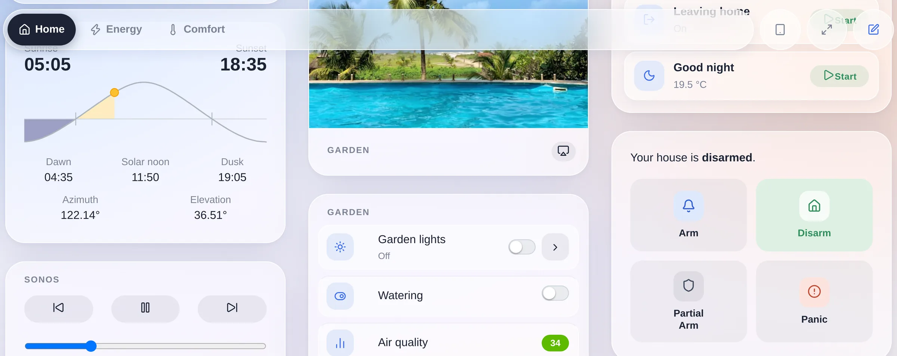

Además, la cápsula es transparente para el puntero en todas partes excepto en sus propias pastillas, así que los widgets que se deslizan por debajo siguen siendo clicables. Es un detalle pequeño. Pero también es el momento en que la interfaz deja de parecer una página web.

## 📱 Pensado para el móvil que llevas en el bolsillo

Esta es la parte que más me importa, y también la más difícil de mostrar en una captura de pantalla, así que voy a ser concreto.

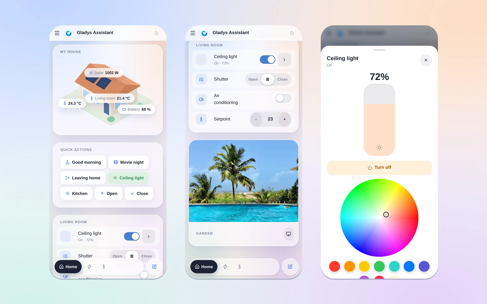

Esas tres pantallas están a un solo gesto de distancia. Abres Gladys y ves tu casa. Te desplazas una vez y estás en los controles de una habitación: una luz, una persiana, el aire acondicionado y su consigna, todo al tamaño de un dedo. Tocas la luz y aparece un panel a pantalla completa con un control deslizante de brillo que arrastras con el pulgar y una rueda de color. Esa es toda la idea de esta versión.

**El selector de paneles ha bajado.** En un móvil, el borde al que llegas es el inferior, no el superior. Así que, por debajo del punto de ruptura de escritorio, la barra de pestañas se separa de la cabecera y se convierte en un dock flotante al alcance del pulgar. Respeta `safe-area-inset-bottom`, para no chocar con el indicador de inicio de un iPhone, y sigue el **visual viewport**: Safari en iOS anima su propia barra de herramientas inferior mientras te desplazas, y sin esa corrección el dock se quedaría escondido debajo una y otra vez. Ahora ya no.

**Solo la pestaña activa conserva su nombre.** Las demás se reducen a puntos con icono. En una pantalla de 390 píxeles, esa es la diferencia entre ver dos paneles y ver cinco.

**Puedes deslizar entre paneles, y se siente nativo.** Nada de recargar la página: el panel vecino **entra deslizándose bajo tu dedo como un esqueleto**, con exactamente el mismo diseño que tendrá el real, y pasa a los datos en directo cuando llega. El gesto se bloquea en un eje tras 12 píxeles de recorrido, se confirma al 15 % del ancho de la pantalla o con un deslizamiento rápido, y rebota elásticamente cuando no hay ningún panel en ese lado. Los widgets que tienen su propio gesto horizontal (un mapa, un control deslizante, una tabla de dispositivos desplazable) lo conservan: el paginador los detecta por su geometría, no mediante una lista fija en el código, así que cualquier nuevo widget desplazable queda cubierto por diseño.

**Las zonas táctiles crecen solo para los dedos.** Cada control de un widget alcanza el mínimo de ~44 píxeles de las Apple HIG, pero solo bajo `@media (pointer: coarse)`, de modo que un portátil con pantalla táctil conserva el tamaño compacto para ratón en lugar de convertirse en un quiosco. La misma idea al tocar una fila de dispositivo: en táctil, toda la fila es la zona de toque; con ratón, no, porque un clic accidental en el nombre de un dispositivo nunca debe enviar una orden en directo a tus luces.

**Los controles segmentados son la excepción a la regla de los 44 píxeles**, a propósito: dentro de una pista segmentada, *toda la pista* es la zona táctil, así que sus segmentos mantienen la altura de los controles segmentados de iOS en lugar de apilarse en una torre de botones gordos.

**Las ventanas emergentes escapan de su tarjeta.** Los selectores de fecha, los selectores de periodo y los menús desplegables se renderizan en la parte superior del documento y no dentro del widget que los abrió, así que en una pantalla pequeña nunca quedan cortados por la tarjeta a la que pertenecen.

**El menú de ajustes se desplaza lateralmente** con flechas de desbordamiento en lugar de repartirse en seis líneas, y las columnas que ya no caben **pasan a la línea siguiente** en lugar de quedar aplastadas.

Veinte pequeñas decisiones. Juntas, marcan la diferencia entre una interfaz que *funciona* en un móvil y una que ha sido *hecha* para él.

## 🌙 Claro u oscuro, tú decides

Horizon viene en ambas versiones. El tema oscuro no es un filtro invertido, está diseñado a conciencia: el mismo cristal, la misma profundidad, algo más cálido en los bordes.

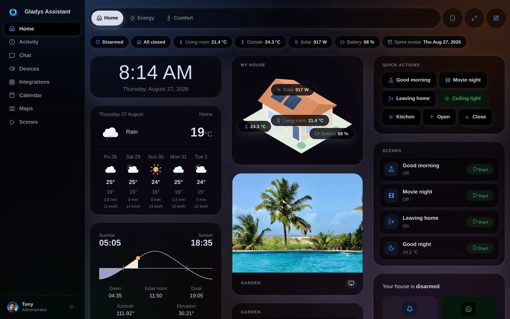

## 🧱 Un panel que por fin puedes organizar

El antiguo panel eran N columnas iguales, y punto. Si querías una gran vista de la casa a la izquierda y una pila de pequeñas baldosas a la derecha, no podías.

Ahora un panel se compone de **secciones**, y cada sección tiene sus propias columnas:

- **Anchos de columna ponderados.** Una columna es *normal* o *ancha*. Una sección `ancha | normal` coloca un panel grande a la izquierda y una pila de baldosas a la derecha. Dos clics, dos valores, sin pelearse con los píxeles.
- **Una barra de chips.** Pastillas de estado compactas en la parte superior de un panel: estado de la alarma, "todo cerrado", una temperatura, la producción solar, el próximo evento del calendario. En un móvil se reorganizan en lugar de desbordarse.
- **Acciones rápidas y escenas con estado en directo.** Un botón de escena ahora te dice lo que ha hecho la escena: `Salir de casa · Activada`.
- **Un widget de vista de la casa**: una ilustración de tu casa con valores en directo colocados encima.
- **El editor muestra el resultado real.** El lienzo de edición y la vista comparten ahora un único diseño de columnas, con los mismos porcentajes, así que lo que organizas es lo que obtienes.
- **Un selector de widgets con búsqueda**, con un icono y un nombre por tipo, en lugar de un simple desplegable.

Además, ahora los paneles **requieren un icono** al crearlos, y los paneles existentes cuyo nombre empezaba por un emoji ven ese emoji convertido automáticamente en su icono.

## 🎬 El editor de escenas, reescrito

Las escenas eran la parte más potente y, a la vez, la más intimidante de Gladys. El editor es ahora un **flujo vertical**: un bloque **CUANDO** para los disparadores, un bloque **ENTONCES** para los pasos, cada paso plegable y cada acción elegida desde un **selector organizado por categorías** en lugar de una lista plana.

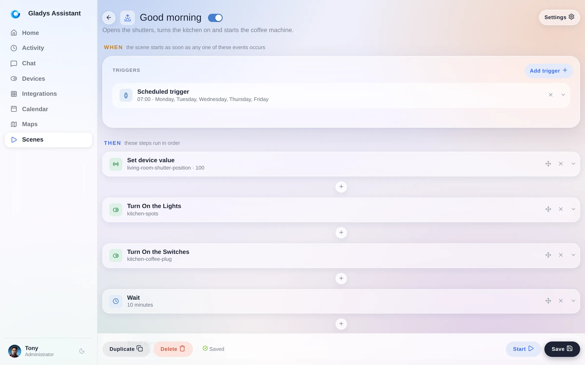

También hay novedades en las escenas:

- **Ver y detener las escenas en ejecución**, por fin.
- Una acción **"Obtener la fecha y hora actuales"**.
- Un modo **"cualquier cambio de estado"** en el disparador de estado de un dispositivo.
- El selector de canal de mensajes solo muestra los servicios de mensajería que de verdad has configurado.
- Puedes eliminar el primer bloque de acciones de una escena.
- Los eventos del calendario se devuelven como una lista legible en las variables de la escena.

## 🧩 67 integraciones de la comunidad, y subiendo

Hace dos versiones abrimos las **integraciones externas**: cualquiera puede empaquetar la compatibilidad con un dispositivo como una pequeña imagen Docker, publicarla, y aparece en el catálogo de todas las instancias de Gladys del planeta.

El catálogo ha pasado de 20 a **67 integraciones en poco más de dos semanas**. Airzone, Apple TV, Daikin, De Dietrich, estaciones de carga, CallMeBot, Docker, inversores solares: casi todo escrito por la comunidad, no por mí.

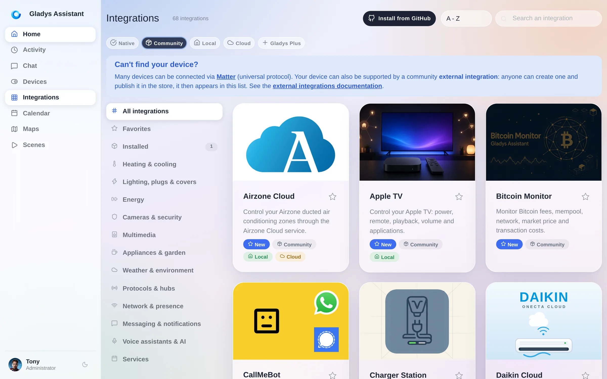

Esta versión pule todo ese ciclo: una vista **Instaladas** que muestra lo que realmente se ejecuta en tu instancia, números de versión **enlazados a su changelog**, la nueva versión indicada en el banner "actualización disponible", una **retención del historial por función** en los dispositivos externos y un **seguimiento energético automático** para las funciones que informan de su potencia.

Si tu dispositivo aún no es compatible, [puedes crear la integración tú mismo en una tarde](/es/docs/dev/external-integrations/).

## 🤖 El asistente estrena micrófono

La página de Conversación ha pasado a Horizon como todo lo demás: la conversación descansa sobre el mismo cristal, y las herramientas que ha usado el asistente para responderte se muestran como chips que puedes desplegar.

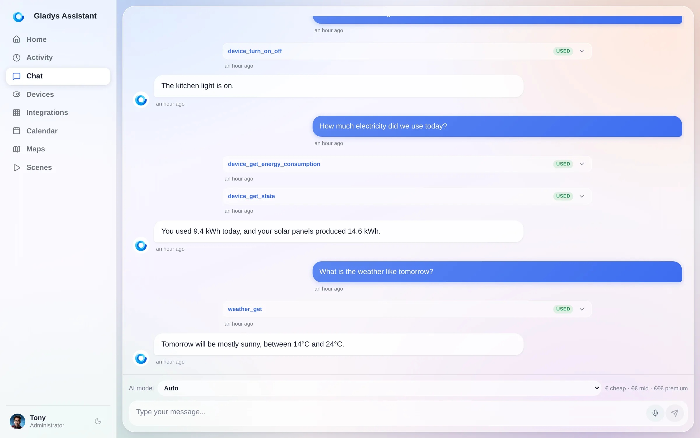

La novedad está justo al lado del botón de enviar: un **micrófono**. Tócalo y dicta tu mensaje en lugar de escribirlo. En un móvil, esa es la diferencia entre usar el asistente y no molestarse en hacerlo.

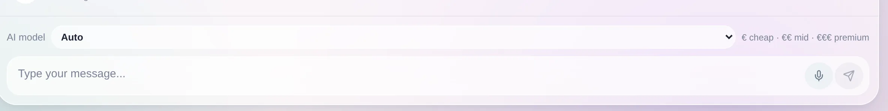

El asistente también ha aprendido una nueva herramienta: puede leer el **nivel de batería de tus dispositivos**, así que "¿qué sensores necesitan pilas nuevas?" ahora obtiene una respuesta de verdad.

## ⚡ Energía

Los widgets de energía también han recibido el tratamiento Horizon, además de una mejora que notarás cada mes: el periodo de seguimiento ahora puede **empezar cualquier día del mes**, para que coincida con tu periodo de facturación real en lugar del calendario.

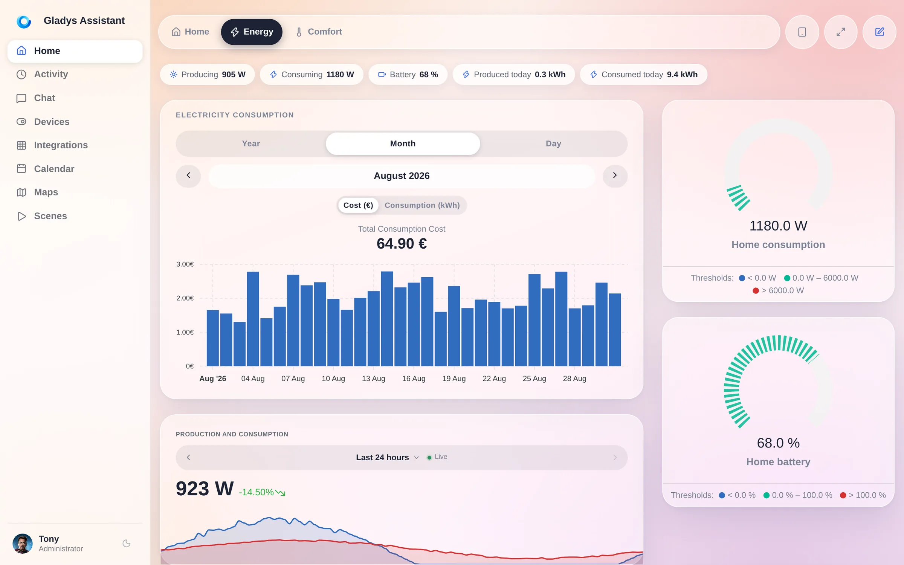

Para los usuarios de Enedis: ahora es compatible el nuevo callback de consentimiento **DataConnect 2026**, y una sincronización solo recalcula los costes de los dispositivos que realmente ha modificado, en lugar de todo el historial.

## 🔌 Dispositivos, protocolos, sistema

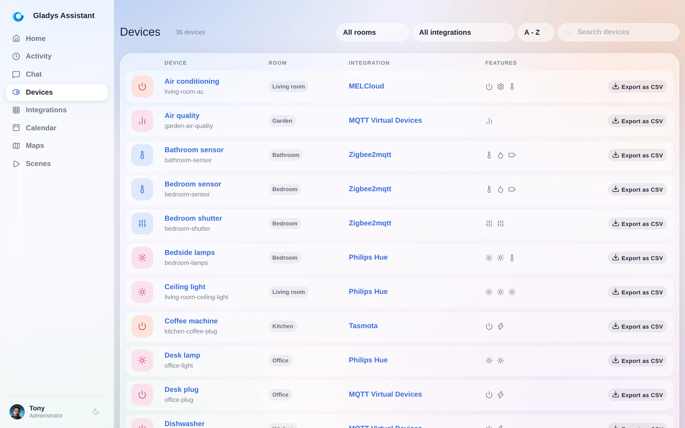

- **Exporta el historial de un dispositivo en CSV**, directamente desde la lista de dispositivos.
- **Matter**: detectores de fugas de agua, sensores de contacto y de lluvia, y **cerraduras**.
- **Zigbee2MQTT 2.13**, compatibilidad con **coordinadores de red** (SMLIGHT SLZB-06/07 y similares), sirenas solares de exterior y el Heiman HS2WD-E.
- **MQTT**: topics de estado con comodines en el descubrimiento de Home Assistant.
- **Google Home**: se exponen los sensores de temperatura y humedad.
- **Cámaras**: desactiva una cámara sin eliminarla, un verdadero modo privado.
- **Reinicia o apaga el equipo anfitrión** desde los ajustes del Sistema, y ahora también funciona en instalaciones Docker estándar.
- **Gladys se anuncia en tu red local mediante mDNS**, así que encontrar tu instancia deja de ser una caza de direcciones IP.
- **Códigos de recuperación para la autenticación en dos pasos** en Gladys Plus, y Gladys ahora recomienda aplicaciones 2FA populares.
- Los iconos del tiempo se han redibujado y se han ampliado las condiciones de pivote.

Y todo lo demás: habitaciones ordenadas alfabéticamente, nombres de las integraciones mostrados en la lista de dispositivos, la pestaña de casas convertida en una lista legible, la tarjeta de migración a DuckDB que se oculta en cuanto no queda nada por migrar, y un montón de correcciones.

**92 pull requests, 720 archivos, unas 52 000 líneas añadidas, en 12 días.**

## 🏡 ¿Vienes de Home Assistant?

La objeción habitual es el número de integraciones. Ese argumento se está quedando sin recorrido: el catálogo de la comunidad ha pasado de 20 a **67 integraciones en poco más de dos semanas**, escritas por personas que nunca antes habían abierto el código de Gladys, y sigue acelerando. Estamos cerrando esa brecha a propósito, y rápido. Mientras tanto, esto es todo lo que obtienes hoy.

- **Una interfaz que no tienes que construir tú.** Sin YAML, sin un lenguaje propio para los paneles, sin un catálogo de tarjetas que aprender. Instalas Gladys y ya se ve como en las capturas de este artículo, en tu móvil, en modo oscuro, sin un solo archivo de configuración.
- **Probablemente tus dispositivos actuales ya funcionan.** Gladys habla **Home Assistant Discovery sobre MQTT**: tus dispositivos ESPHome, Tasmota y Zigbee2MQTT se detectan automáticamente, sin ninguna configuración manual. También habla de forma nativa Zigbee2MQTT, Matter y Z-Wave, y puede comunicarse con HomeKit y Google Home.
- **Un único botón de actualización.** Gladys es una imagen Docker. Se actualiza sola, con un clic o automáticamente con Watchtower.
- **Un asistente de IA realmente integrado**, que ve tus dispositivos, puede actuar sobre ellos y te dice qué herramientas ha usado.
- **La misma promesa desde 2013**: local primero, código abierto, sin nube obligatoria, sin cuenta obligatoria, tus datos en tu hardware.

La forma más rápida de juzgar no es leerme a mí. Es hacer clic en el siguiente enlace.

## 👉 Pruébalo ahora mismo

**[Abre la demo en directo](https://demo.gladysassistant.com/dashboard)**. Es un Gladys Assistant 5 completo que funciona íntegramente en tu navegador, con una casa real, paneles reales y escenas reales. Nada que instalar, sin registro.

Y cuando te hayas convencido: **[instala Gladys](/es/docs/)**. En una Raspberry Pi, un NAS, un portátil viejo, cualquier cosa que ejecute Docker. Solo lleva unos minutos.

## ❤️ Gracias

La versión 5 existe gracias a las personas que han reportado errores, debatido, probado en sus propias tabletas de pared y me han enviado capturas de cosas que no funcionaban en el móvil.

Muchísimas gracias a [@Dreamthy](https://github.com/Dreamthy), [@William-De71](https://github.com/William-De71), [@callemand](https://github.com/callemand), [@cicoub13](https://github.com/cicoub13), [@vincentBesseau](https://github.com/vincentBesseau), Stéphane Escandell y Valentin Hutter por el código de esta versión, y a todas las personas que publican integraciones externas: gracias a ustedes el catálogo se ha triplicado en dos semanas.

Como siempre, Gladys se actualiza automáticamente en un plazo de 24 horas si usas Watchtower; si no, puedes hacerlo con un clic desde los ajustes.

¡No olvides configurar Telegram para recibir una alerta en tu móvil cuando Gladys se actualice!

[Ver las notas de la versión completas en GitHub](https://github.com/GladysAssistant/Gladys/releases/tag/v5.0.0)
