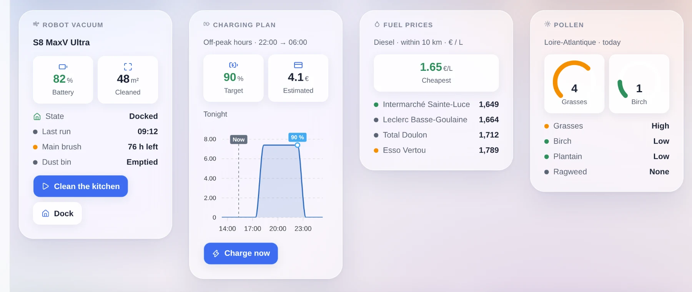
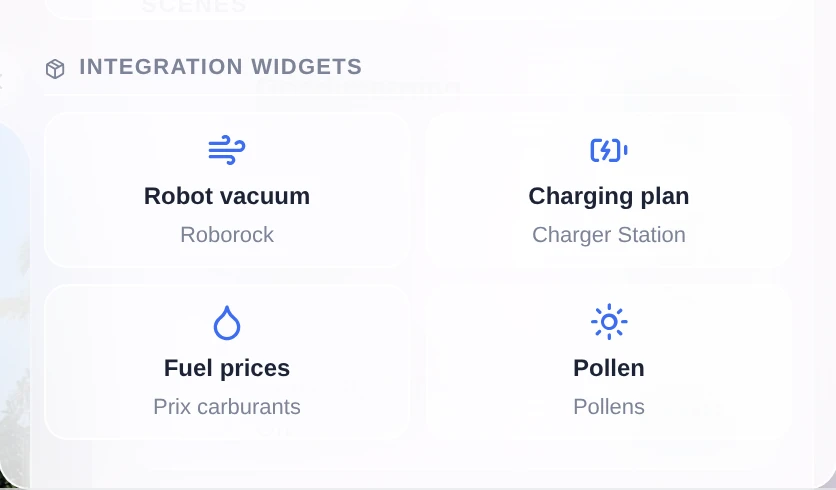
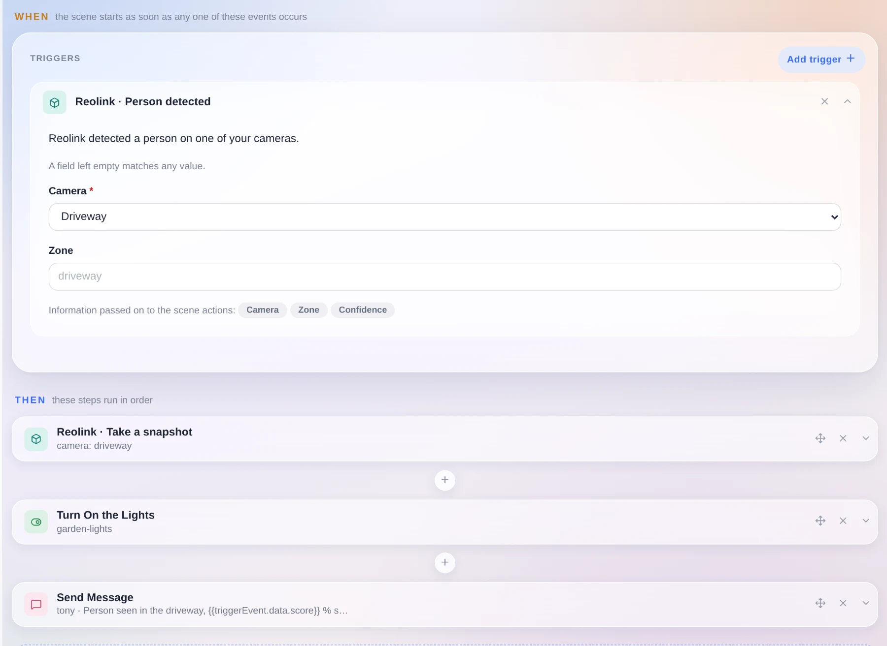
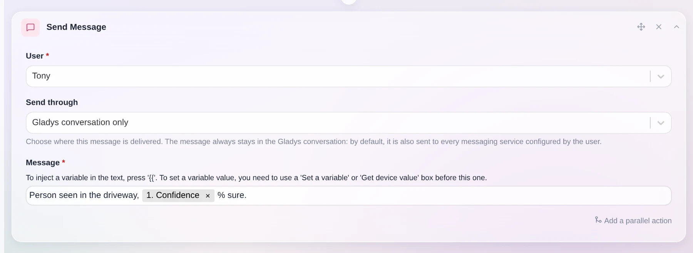
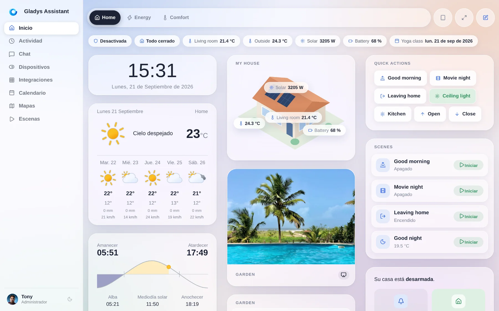
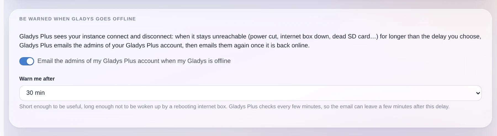
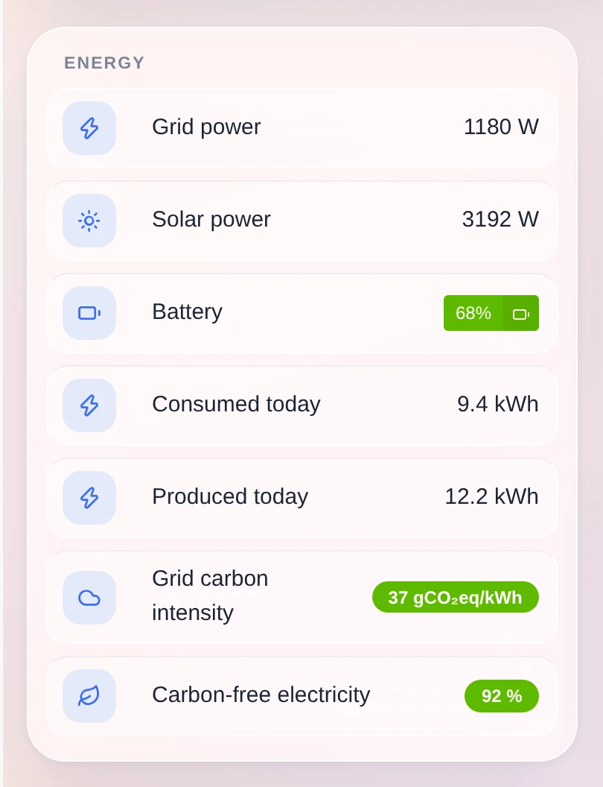
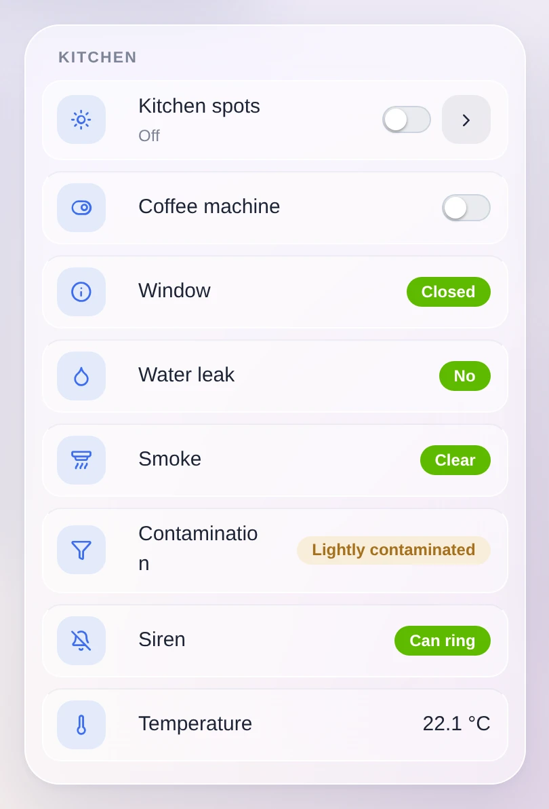

¡Hola a todos!

Hoy llega una nueva versión de Gladys, la 5.1 🎉

La versión 5 fue un gran rediseño de la interfaz. Esta se centra sobre todo en las integraciones. Hasta ahora, una integración de la comunidad podía hacer exactamente una cosa: publicar dispositivos. Ahora puede colocar sus propios widgets en tu panel de control y añadir sus propios disparadores y acciones a tus escenas.

{/* truncate */}

## Widgets del panel de control publicados por las integraciones

Un breve recordatorio: desde la 4.84, cualquiera puede empaquetar una integración en una pequeña imagen Docker, publicarla en GitHub, y aparece en el catálogo de todas las instancias de Gladys. Hoy vamos por 81, escritas casi en su totalidad por la comunidad.

El problema es que muchas cosas útiles no son dispositivos. Una previsión de producción solar, el mapa de limpieza de un robot aspirador, el diésel más barato cerca de ti, el riesgo de polen de hoy, el plan que seguirá tu coche esta noche: nada de eso encaja en "una temperatura y un interruptor", y todo eso es justo lo que quieres ver en un panel de control.

Así que una integración ahora puede declarar sus propios widgets, que aparecen en el editor del panel de control junto a los integrados:

Aparecen en el selector de widgets del editor del panel de control, en su propia sección, con el nombre de la integración que los proporciona. Se añaden como cualquier otro widget. Y si tienen ajustes (qué aspirador, qué región, qué periodo), los rellenas ahí mismo, en un formulario descrito por la integración y generado por Gladys.

### La integración dice qué mostrar, Gladys decide cómo

Esta es la parte importante de la función, y fue una decisión deliberada, no algo que salió así por casualidad.

Ninguna integración de terceros inyecta HTML en tu Gladys. Ni iframe, ni script, ni CSS, ni colores o tamaños personalizados. La integración envía una descripción de su contenido con un pequeño vocabulario: un título, mosaicos de valores, un indicador, una lista de estados, un gráfico, una cuadrícula de imágenes, botones. Gladys se encarga de la representación.

Así, cada widget, incluso uno escrito por alguien de quien nunca has oído hablar, obtiene automáticamente el tema Horizon, el modo oscuro, el diseño para móvil, tu idioma y tu zona horaria. Y sigue funcionando cuando cambia la interfaz. Es el modelo de widgets de iOS y Android.

También hay un presupuesto de contenido, para evitar tarjetas sobrecargadas: 8 componentes como máximo, un único componente principal (un gráfico o una lista o una imagen, no dos), 6 mosaicos de valores como máximo, 4 botones como máximo, listas acotadas y textos cortos. Y Gladys decide el orden de visualización: cabecera, mosaicos, componente principal, estados, botones. Dos widgets que muestran un valor, una curva y dos botones tienen, por tanto, el mismo aspecto.

Algunos detalles técnicos:

- El contenido se calcula al vuelo, no queda fijado en el manifiesto. Un aspirador que está limpiando puede devolver un diseño distinto al de un aspirador en su base.
- Nada se considera de confianza. Cada payload se verifica y se acota antes de llegar a la interfaz: solo componentes conocidos, textos y listas de tamaño limitado, números finitos, fechas válidas, enlaces https e imágenes servidas por tu Gladys en lugar de que tu navegador las obtenga de un tercero.
- Un botón puede actuar: llamar a la integración o escribir un valor en una de las funciones de sus dispositivos. El resultado se muestra en la tarjeta.
- Un widget puede trazar una curva a partir de tu historial de Gladys, o a partir de datos que Gladys no tiene (una previsión, un plan de carga, los precios de mañana) enviando directamente los puntos, con anotaciones y un marcador de "ahora".
- Una integración sin ningún dispositivo, como un índice de precios de combustible o un feed de estrenos de cine, por fin tiene su lugar gracias al nuevo tipo `provider`.

Una nota sobre las capturas de pantalla de arriba: son ejemplos de lo que permite el vocabulario. El mecanismo está disponible desde hoy, pero las integraciones que lo usen todavía están por escribir.

## Disparadores y acciones de escenas publicados por las integraciones

En las escenas pasaba exactamente lo mismo. Hasta ahora, cada disparador y cada acción del editor de escenas estaban programados de forma fija en Gladys. Una integración externa no tenía forma de añadir uno, y las dos superficies genéricas de las que disponía no bastaban:

- Una función de un dispositivo es un estado. Una temperatura, un interruptor, una presencia: eso funciona muy bien con el disparador "cambio de estado". Pero una matrícula reconocida en la entrada, un timbre con una captura, una etiqueta NFC escaneada o un comando de voz entendido son eventos puntuales con datos asociados. Convertirlos en una función hace que se pierdan los datos, se mezclan cuando llegan dos eventos seguidos y ensucian tu historial.
- Escribir un valor no es ejecutar una operación. "Haz una captura y dame la imagen", "limpia estas tres habitaciones", "anuncia esto en ese altavoz": hay parámetros y un resultado.

Así que una integración ahora puede declarar sus disparadores y sus acciones en su manifiesto, y aparecen en el editor de escenas como todo lo demás.

Gladys genera la tarjeta a partir de la declaración. Los campos se convierten en un formulario, un campo vacío coincide con cualquier valor y los datos que trae el evento se convierten en variables de escena que puedes reutilizar en los pasos siguientes. La puntuación de confianza de la captura viene directamente del disparador.

En cuanto al diseño, es Gladys quien hace la comparación: la integración envía un evento tipado con sus datos y Gladys lo compara con los disparadores que has configurado. La integración nunca sabe qué escenas existen, así que no hay nada que pueda filtrarse ni nada que resincronizar cuando se reconecta, y tu configuración se queda en Gladys. Una acción se envía una sola vez, y un timeout solo hace fallar esa acción.

Un efecto secundario muy útil: una escena ahora puede combinar un evento de una integración, una acción de otra y los pasos habituales de Gladys entre medias.

## "Solo conversación de Gladys"

Muchos de ustedes lo pedían. Cuando una escena te envía un mensaje, por defecto va a todos los servicios de mensajería que has configurado (Telegram, SMS...).

Ahora puedes elegir. Con "Solo conversación de Gladys", el mensaje se queda en Gladys y en ningún otro sitio. Es práctico si instalas Telegram más adelante y no quieres que tus escenas antiguas empiecen a enviar notificaciones a tu móvil. La opción funciona incluso si no tienes ningún canal de mensajería configurado, y también existe en la acción "Preguntar a la IA".

También en las escenas: las escenas creadas por la IA ahora llevan la etiqueta "IA", lo que facilita encontrarlas. Y el filtro por etiqueta ahora busca la etiqueta exacta, en lugar de conservar todo lo que contenga la palabra.

## Gladys habla español

Gladys ya está traducido al español, el cuarto idioma después del inglés, el francés y el alemán. Se ha traducido toda la interfaz: panel de control, dispositivos, editor de escenas, ajustes, páginas de integraciones e incluso las palabras clave de búsqueda de iconos.

Muchísimas gracias a Nestor Alonso Torres por esta contribución. Si quieres Gladys en tu idioma, los archivos de traducción son simples archivos JSON en el repositorio, ¡anímate!

## Recibe un aviso cuando tu Gladys deja de responder

Gladys Plus ve cuándo tu instancia se conecta y se desconecta. Ahora puede enviarte un correo electrónico cuando lleva sin responder más tiempo del que tú elijas, de 10 minutos a un día, y volver a escribirte cuando vuelve a estar en línea.

Corte de luz, router caído, tarjeta SD muerta, una actualización de Docker que salió mal: te enteras el mismo día, en lugar de descubrirlo por la noche al llegar a casa.

El ajuste pertenece a tu cuenta de Gladys Plus, así que se cambia desde Gladys Plus, y Gladys te da un enlace directo a la página correcta.

## Una nueva categoría de dispositivo: la huella de carbono de la red

Gladys incorpora una categoría "sensor de carbono de la red", con tres valores: la intensidad de carbono de tu red eléctrica en gCO₂eq/kWh, la proporción de electricidad libre de carbono y la proporción de renovables. Cada uno tiene su unidad, su historial y sus gráficos.

Y, sobre todo, una escena puede leerlos. "Pon en marcha la lavadora cuando la red esté limpia" se vuelve posible, y las integraciones que publican esas cifras para tu país por fin tienen dónde guardarlas.

## Los detectores de humo envían más información

Los detectores de humo Zigbee envían mucho más que la propia alarma, y Gladys ya puede leerlo: el nivel de contaminación de la cámara de detección (un detector contaminado ya no detecta nada, así que te avisa de cuándo limpiarlo o sustituirlo), si el detector se ha silenciado solo, y un comando para silenciar la alarma durante el tiempo que permita el dispositivo.

Este último se mantiene deliberadamente fuera de la categoría de interruptores. Silenciar una alarma de incendio no debe ser posible con un "apagar todo" en una escena o con un asistente de voz.

## Dispositivos, protocolos, sistema

- **Matter**: matter.js se actualiza a la 0.17.9, lo que corrige los errores `Node ID X is already commissioned` que bloqueaban algunos emparejamientos.
- **HomeKit**: los aires acondicionados se exponen como HeaterCooler. Si le pides a Siri que encienda uno, ahora mantiene el modo en el que estaba.
- **Zigbee2MQTT**: se gestionan las etiquetas trifásicas del ZLinky_TIC (`SINSTS1`, `SMAXSN*`, `IINST1`, `IMAX1`), `probe_temperature` tiene su propio tipo de temperatura en lugar de sobrescribir el principal, y el contenedor ahora se ejecuta en la zona horaria de tu instancia. Sus logs y programaciones ya no van desfasados un par de horas.
- **Panel de control**: el control deslizante y el campo numérico respetan el paso declarado por la función del dispositivo. Una consigna que se mueve de 0,5 en 0,5 ya no salta de 1 en 1.
- **Sonos**: la integración incluida ahora tiene una insignia de "obsoleta" y un botón para migrar a la integración de la comunidad, que hace más cosas. La ventana de migración avisa de lo que cambia en las notificaciones de reproducción.
- **Calendario**: se ha corregido una regresión por la que cargar el plugin de zonas horarias de dayjs rompía el calendario.
- **Gladys Plus**: el bloqueo de pago en el que se quedaban atascadas algunas cuentas por el bug 402 del plan Lite ahora se levanta automáticamente. Y cada versión se publica en Gladys Plus directamente desde el flujo de publicación.
- **Seguridad**: se ha corregido un fallo en el restablecimiento de la contraseña por el que un origen elegido por un atacante podía manipular el enlace enviado por correo electrónico.

En cuanto a la documentación, se han publicado las rutas de la API que faltaban en la apidoc generada, y la especificación de las integraciones externas se ha dividido en un archivo por tema.

## Y todo lo que ya corrigió la 5.0.x

Entre la 5.0 y hoy han salido cuatro versiones de corrección (de la 5.0.1 a la 5.0.4) con una cincuentena de correcciones, casi todas a raíz de sus comentarios sobre la nueva interfaz: tabletas en vertical, nombres de dispositivos largos, el dock móvil, los iconos del tiempo, el ConBee III, la renumeración de las variables de escena, los menús desplegables que se salían por la parte inferior de la pantalla, los tirones al desplazarse por el panel de control.

Eso suma casi 70 pull requests desde la versión 5.0, 23 de ellas en esta versión.

## Gracias a los colaboradores

Gracias a [@cicoub13](https://github.com/cicoub13), [@William-De71](https://github.com/William-De71), [@vincentBesseau](https://github.com/vincentBesseau) y Nestor Alonso Torres por el código de esta versión, y a todos los que publican integraciones externas. El catálogo va por 81 y sigue creciendo.

Si quieres escribir la tuya, [aquí tienes la guía para desarrolladores](/es/docs/dev/external-integrations/). Ahora cubre los widgets y las declaraciones de escenas, con los campos del manifiesto, el vocabulario de contenido, los límites y los métodos del SDK.

Nos vemos en [el foro](https://community.gladysassistant.com/) si quieres hablar de esta versión :)

## ¿Cómo actualizar?

Como siempre, Gladys se actualiza automáticamente en un plazo de 24 horas si usas Watchtower; si no, puedes hacerlo con un clic desde los ajustes.

¡No olvides configurar Telegram para recibir una alerta en tu móvil cuando Gladys se actualice!

El [CHANGELOG completo de la 5.1.0](https://github.com/GladysAssistant/Gladys/releases/tag/v5.1.0) está en GitHub.
