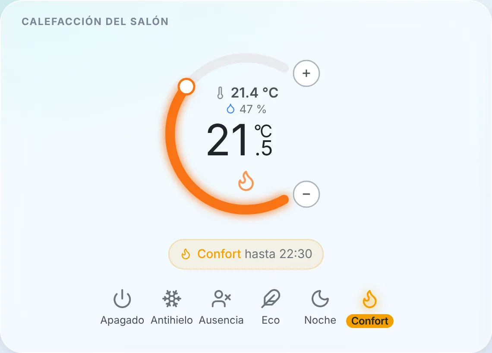
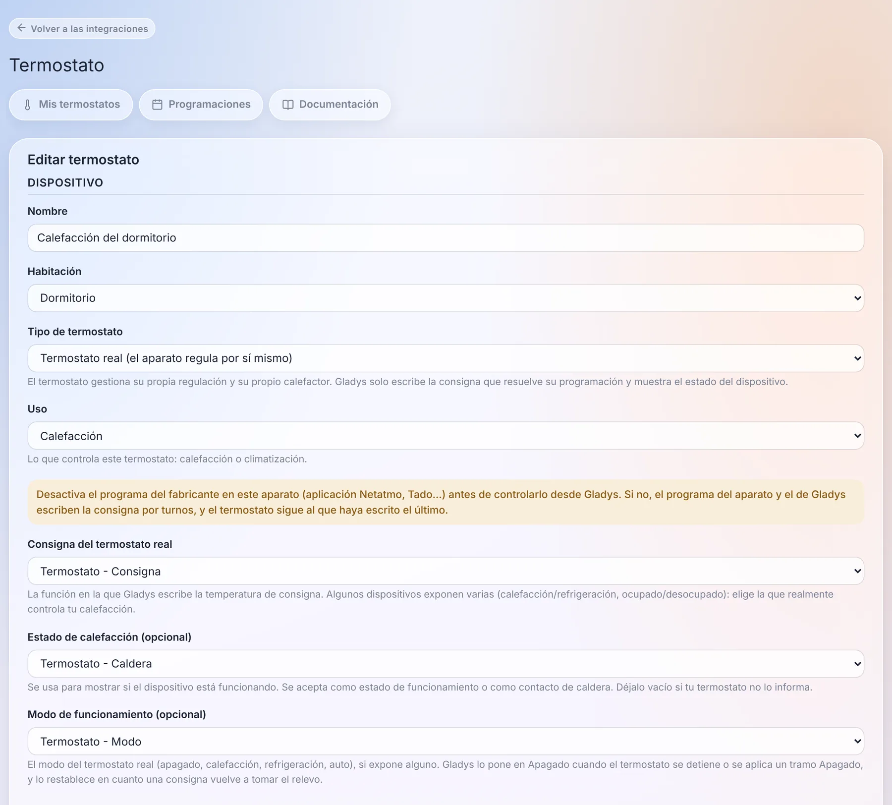
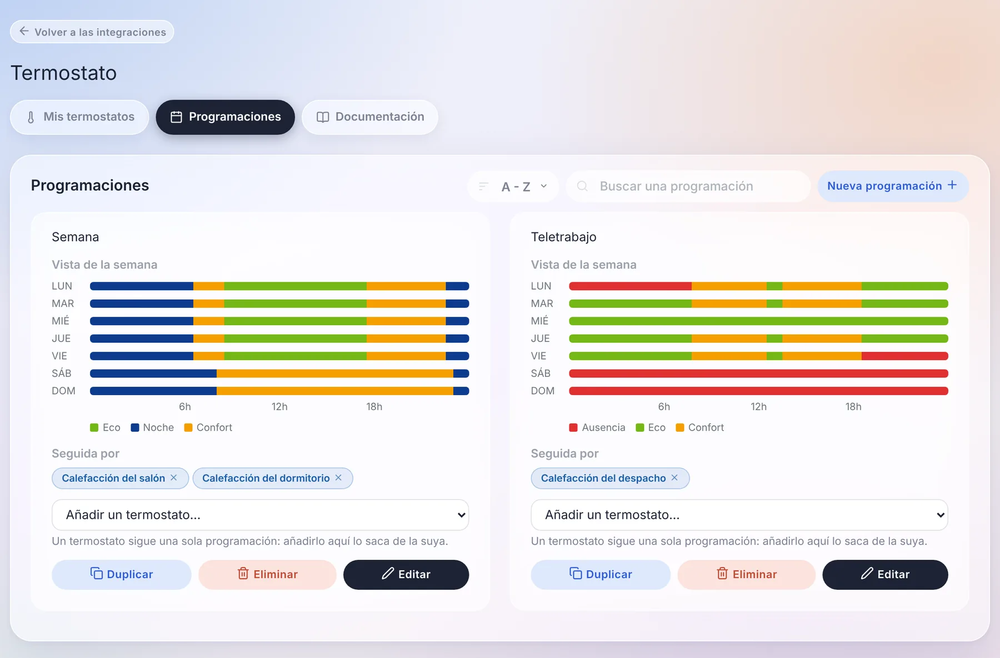
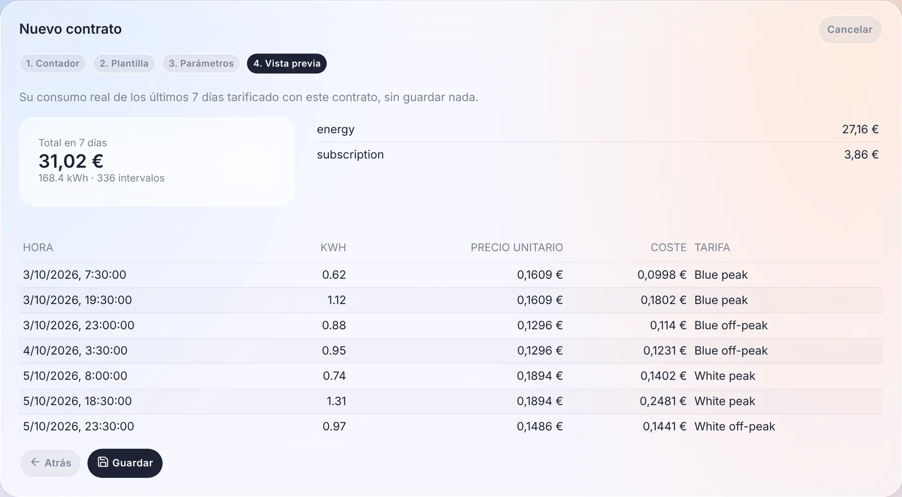
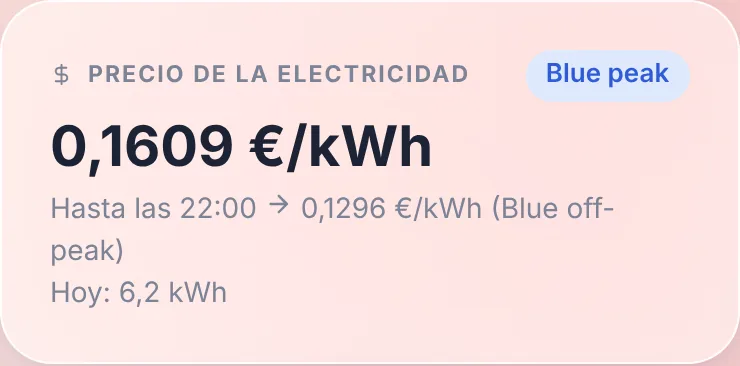
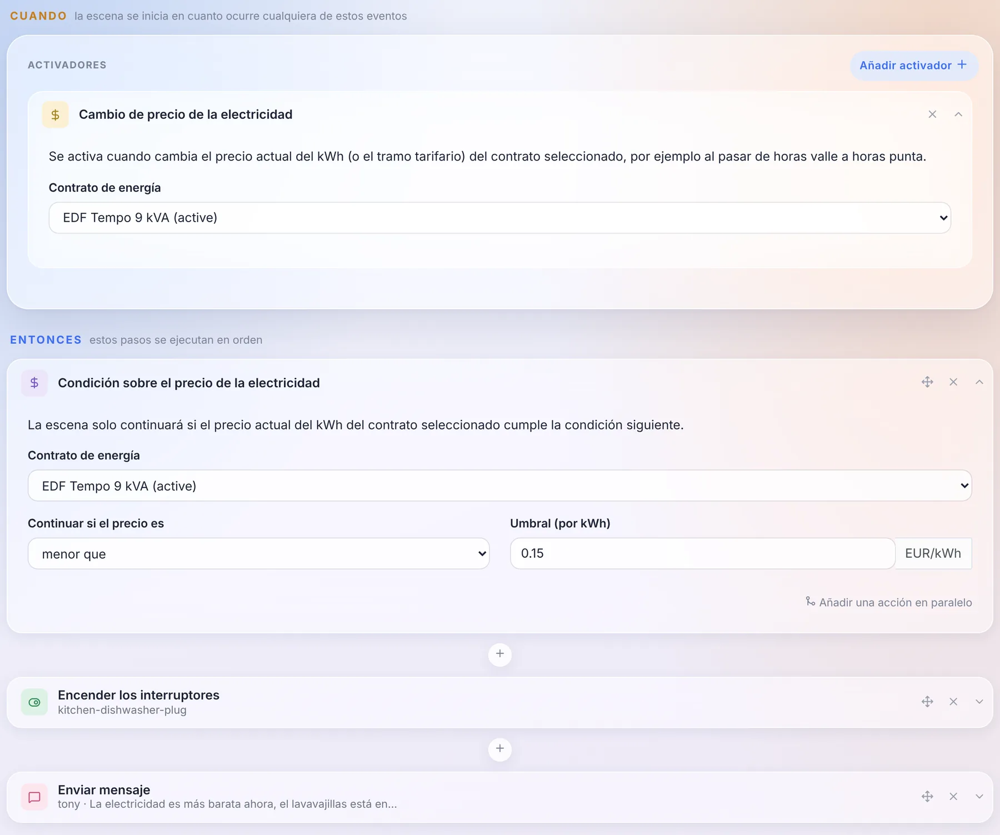
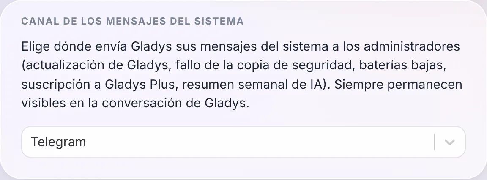
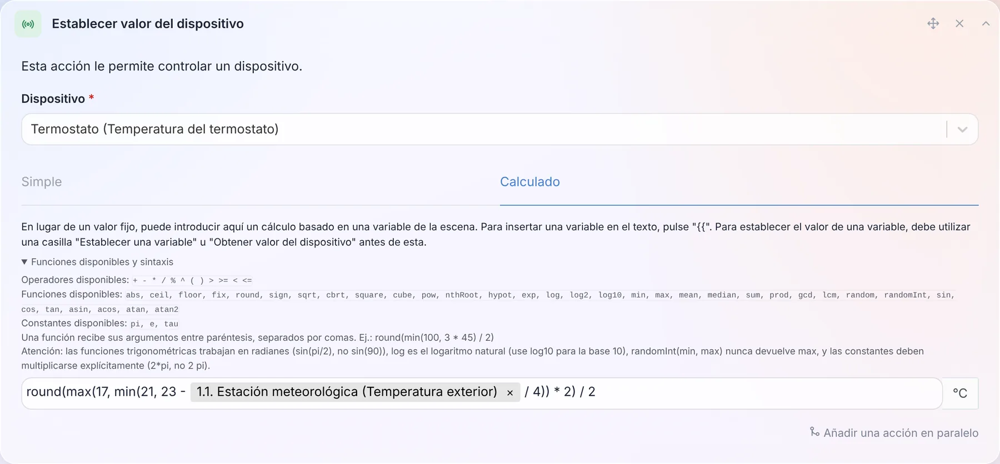
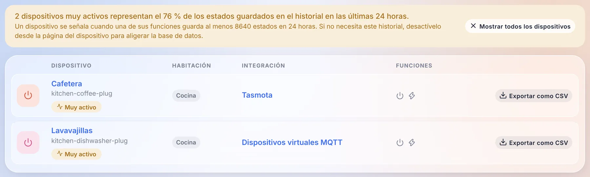

¡Hola a todos!

Hoy llega una nueva versión de Gladys, la 5.2 🎉

Esta trae dos grandes novedades, y las dos tratan de tu casa más que de la interfaz. Gladys ya puede **ser tu termostato**, o programar el que ya tienes, con programaciones semanales. Y **la supervisión de energía se abre a cualquier contrato de electricidad**: ya no solo los tres contratos franceses que Gladys conocía hasta ahora, sino franjas horarias, estaciones, tramos y precios spot de casi cualquier país.

{/* truncate */}

## Gladys se convierte en un termostato

Era una de las peticiones más antiguas del foro, y probablemente la instalación más habitual en Francia: un radiador eléctrico controlado por un relé o un enchufe inteligente, un sensor de temperatura en algún lugar de la habitación y ningún termostato de marca. Hasta ahora, la respuesta en Gladys era una escena por cada umbral de temperatura. Sin programación, sin histéresis, y con un radiador que se encendía y apagaba sin parar alrededor de 21 °C.

Ahora hay una integración nativa **Termostato**, y cubre dos casos.

**Gladys es el termostato.** Eliges un sensor de temperatura y un interruptor (un relé, un enchufe, un contacto de caldera), y Gladys regula: lee la temperatura cada minuto y enciende o apaga la calefacción para alcanzar la consigna. Puedes elegir entre una histéresis (calienta por debajo de 20,5 °C y para por encima de 21,5 °C) y una regulación TPI, que calienta durante una parte de un ciclo fijo proporcional a la diferencia. Esta última trata mejor a los radiadores con mucha inercia. Un sensor de apertura corta la calefacción en cuanto se abre la ventana.

**Gladys programa tu termostato actual.** Un Netatmo, un cabezal termostático Zigbee, un termostato Matter o MQTT ya se regulan muy bien solos. Lo que les faltaba era una programación que viviera en Gladys, junto al resto de la casa, en lugar de en la aplicación del fabricante. Gladys escribe ahora su consigna según la programación, cambia su modo a Apagado cuando hace falta y muestra si está calentando.

Un detalle del que estoy bastante contento: si alguien gira la rueda del termostato real, o cambia la temperatura desde la aplicación del fabricante, Gladys lo ve y lo trata como un cambio manual. No lo sobrescribe un minuto después, que es el bug clásico de los termostatos con dos amos.

### Programaciones semanales, por casa

Las programaciones pertenecen a una casa. Con dos casas, cada una tiene su propia «Semana», y un termostato solo puede seguir una programación de su casa.

Por dentro, una programación es una lista de **puntos de cambio**, como en Netatmo y Tado: «a partir del lunes a las 06:30, Confort, hasta el siguiente punto». Parece un detalle, pero elimina toda una familia de bugs:

- una noche de 22:30 a 06:30 es un único tramo, no dos mitades pegadas a medianoche;
- no hay huecos ni solapamientos: añadir un tramo acorta los que cubre, y borrar un tramo alarga el anterior;
- un día sin tramo propio conserva el último preajuste del día anterior. Una programación de oficina sin tramo el fin de semana conserva su preajuste del viernes por la tarde todo el fin de semana, y la vista de la semana muestra exactamente eso.

«Copiar a...» copia un día en los demás: escribes el lunes, lo copias a toda la semana y listo.

### El widget, y todo lo demás

El nuevo widget del panel muestra la temperatura y la humedad de la habitación, la consigna en grande y un halo naranja cuando la calefacción está funcionando. El banner dice lo que está haciendo el termostato («Confort hasta 22:30»), y la barra inferior ofrece los preajustes: Apagado, Antihielo, Ausencia, Eco, Noche, Confort.

Elegir un preajuste o girar la rueda es un cambio manual, que por defecto dura **hasta el siguiente tramo de la programación**, como en Tado o Netatmo. También puedes fijar una duración en su lugar. Y sin programación, un cambio manual se mantiene, como en un termostato clásico.

Lo que más me importa no se ve en pantalla: el preajuste, el modo y la consigna son **funciones de dispositivo estándar**. Una escena puede poner la casa en «Ausencia» cuando todo el mundo se va, y la IA, MQTT, Gladys Plus y los asistentes de voz ven un termostato como cualquier otro, con su preajuste y su estado de calefacción.

¡Un enorme gracias a [@William-De71](https://github.com/William-De71), que ha escrito la mayor parte de esta integración: 84 commits y mucha paciencia durante la revisión!

La [documentación del termostato está aquí](/es/docs/integrations/thermostat).

## Contratos de energía para todos los países

La supervisión de energía de Gladys conocía tres contratos: base, punta / valle y EDF Tempo. Todo lo demás exigía una pull request en Gladys y una nueva versión. Unas horas valle el fin de semana, una tarifa de verano / invierno en Estados Unidos, los tramos de Hydro-Québec, un precio spot por horas en Noruega: imposible.

En la 5.2, un contrato ya no es una lista de precios sino **un conjunto de reglas**, interpretadas por un motor de tarificación que no conoce a ningún proveedor por su nombre. Una regla puede depender de la hora, del día de la semana, de la estación, de un rango de fechas, de un calendario tarifario (color Tempo, festivos, días de punta), de tramos de consumo por día, por mes o por periodo de facturación, o de la potencia máxima. A eso se suman las cuotas fijas, los impuestos en porcentaje, los términos de potencia por kW y los precios spot con un coeficiente y un margen.

El motor está probado con contratos reales de **12 países**: Francia, Bélgica, Reino Unido, Alemania, Finlandia, Noruega, Estados Unidos, Canadá, Australia, Japón, Corea del Sur e India.

### Un asistente, y una vista previa con tu propio consumo

Crear un contrato se hace en cuatro pasos: el contador, la plantilla de contrato (filtrada por país, con buscador), sus parámetros y una **vista previa**.

La vista previa tarifica tu consumo real de los últimos 7 días con el contrato, sin guardar nada: el total, el detalle por componente y una muestra de intervalos con el precio aplicado a cada uno. Si no coincide con tu factura, lo sabes antes de guardar.

Tus precios actuales se **convierten automáticamente** en contratos en el primer arranque, sin tocar el historial de costes. Gladys comprueba ella misma la conversión comparando el cálculo antiguo y el nuevo sobre los últimos 7 días, y señala un contrato que difiere.

### El precio en el panel, y en tus escenas

Un nuevo widget **Precio de la electricidad** muestra el precio actual, el tramo en curso, hasta cuándo se aplica y el siguiente precio, además del consumo del día.

Y como Gladys conoce ahora el precio en cada momento, las escenas pueden usarlo: un disparador **«Cambio de precio de la electricidad»** y una acción **«Condición sobre el precio de la electricidad»**. Poner en marcha el lavavajillas cuando la electricidad se abarata cabe en tres bloques:

### Un contrato puede venir de cualquier sitio

Las plantillas vienen de tres sitios: el [catálogo de la comunidad](https://github.com/GladysAssistant/energy-contracts), que Gladys descarga sin necesidad de actualizarse, los servicios internos de Gladys (EDF Tempo) y las **integraciones externas**. Una integración puede ahora declarar plantillas de contrato, publicar calendarios tarifarios (colores del día, precios spot cada media hora o cada cuarto de hora, festivos) y, para los contratos que las reglas no pueden expresar, calcular el coste ella misma.

En concreto: cualquiera puede publicar una integración para Octopus Agile, Tibber o Nord Pool sin tocar Gladys. Y si falta tu contrato, también puedes escribirlo tú mismo en JSON en el asistente y después exportarlo como plantilla para compartirlo.

La [documentación de la supervisión de energía](/es/docs/integrations/energy-monitoring) está al día.

## Elige adónde van los mensajes del sistema

Gladys envía mensajes a los administradores por su cuenta: una actualización, una copia de seguridad fallida, baterías bajas, la suscripción a Gladys Plus, el resumen semanal de la IA. Hasta ahora, se enviaban a todos los canales de mensajería que tuvieras configurados.

Ahora eliges el canal en `Configuración / Sistema`: todos, solo Telegram o solo la conversación de Gladys. De todos modos, siempre siguen visibles en la conversación de Gladys.

¡Gracias a [@cicoub13](https://github.com/cicoub13) por esta!

## 35 funciones matemáticas en las fórmulas de escena

Los valores calculados de las escenas (esperar, establecer el valor de un dispositivo, establecer una variable, condiciones, volumen de un altavoz) solo conocían `+ - * / % ^` y cinco funciones. Ahora hay 35, más 3 constantes: `min`, `max`, `mean`, `median`, `sum`, `sqrt`, `pow`, `log10`, `exp`, las funciones trigonométricas, `pi`… Y un enlace «Funciones disponibles y sintaxis» despliega la lista completa justo debajo del campo.

Así, una consigna que sigue la temperatura exterior sin salir de 17 a 21 °C, redondeada al medio grado, cabe en una línea, como en la captura: `round(max(17, min(21, 23 - exterior / 4)) * 2) / 2`, donde `exterior` es la temperatura leída en el paso anterior de la escena.

Otro cambio: una fórmula que no se puede calcular **detiene ahora la escena**, en lugar de dejar que continúe con el valor anterior.

[La lista completa está en la documentación](/es/docs/scenes/math-functions).

## Encuentra los dispositivos que llenan tu base de datos

Algunos dispositivos envían un valor cada pocos segundos. Un enchufe inteligente que informa de su potencia diez veces por minuto, guardado para siempre en el historial, acaba pesando más que todo el resto de la casa junto.

La página de dispositivos los señala ahora: un banner indica qué parte del historial representan en las últimas 24 horas, un filtro muestra solo esos, y cada página de dispositivo muestra el tamaño del historial de cada función. Si no necesitas ese historial, desactívalo desde la página del dispositivo, tu base de datos te lo agradecerá.

## Para los desarrolladores de integraciones

- **Calendarios**: un nuevo tipo de integración `calendar` permite a una integración sincronizar calendarios y sus eventos en Gladys: un servidor CalDAV o Nextcloud, iCloud, un feed ICS público (horario escolar, recogida de basura, partidos)… Aparecen en la vista de calendario y funcionan con los disparadores de escena de calendario, exactamente como los calendarios de la integración CalDAV, y cada usuario vincula su propia cuenta desde la página de la integración. Google Calendar y Outlook, que necesitan un inicio de sesión OAuth por usuario, llegarán en una segunda fase.
- **Contratos de energía**: la nueva capacidad `energy_contracts`, descrita más arriba.
- **Widgets**: un botón de widget puede ahora abrir un pequeño formulario (4 campos como máximo) antes de enviar su acción, por ejemplo el precio de una entrega de pellets introducido desde la tableta de la pared.
- **Casas**: un campo puede ofrecer la lista de las casas de Gladys con `source: "houses"`, en la configuración, los widgets y las escenas.

Todo está en [la guía para desarrolladores](/es/docs/dev/external-integrations/).

## Las correcciones, y todo lo que ya trajeron las 5.1.x

Desde la 5.1 han salido cuatro versiones correctivas (de la 5.1.1 a la 5.1.4). Esto es lo que corrigen ellas y esta versión:

- **Actualizaciones**: cuando Gladys no consigue descargar su nueva imagen, la actualización muestra ahora el error real de Docker (conexión a internet, espacio en disco, tiempo agotado) en lugar de un mensaje genérico.
- **CalDAV**: los eventos con parámetros en sus propiedades y las zonas horarias `GMT+hhmm` se sincronizan correctamente, y un evento que no se puede formatear ya no bloquea a los demás.
- **Zigbee2MQTT**: el contenedor incluido pasa a la versión 2.14.2.
- **Broadlink**: el interruptor de los enchufes inteligentes se mantiene sincronizado con el estado real del enchufe.
- **Robots aspiradores**: los controles de modo de limpieza y de modo de funcionamiento solo ofrecen las opciones que admite el aparato.
- **Widget de cámara**: solo se muestran los estados de texto de la función de imagen.
- **Integraciones**: los campos secretos de las acciones se pueden escribir, se aplican los valores por defecto de los campos de acción, los campos numéricos aceptan decimales y los botones de los widgets conservan sus colores en modo oscuro.
- **Inicio de sesión**: tras un inicio de sesión local, Gladys te lleva a la página que intentabas abrir.
- **Base de datos**: la purga diaria conserva los 1000 mensajes más recientes por usuario y las 2000 tareas en segundo plano más recientes, así que estas tablas ya no crecen sin fin.
- **Seguridad**: las rutas de ubicación y de presencia de un usuario quedan reservadas a ese usuario y a los administradores, y varias dependencias se han actualizado para corregir alertas de npm.
- **Gladys Plus**: la comprobación de versión solo la envían las imágenes oficiales, y la página de precios presenta la alerta por correo de caída llegada con la 5.1.

Eso suma 38 pull requests desde la versión 5.1, 19 de ellas en esta versión.

## Gracias a los colaboradores

Gracias a [@William-De71](https://github.com/William-De71) por el termostato, a [@cicoub13](https://github.com/cicoub13) por el canal de los mensajes del sistema y la corrección del widget de cámara, y a [@bertrandda](https://github.com/bertrandda) por la corrección de CalDAV. ¡Y gracias a todos los que habéis reportado bugs en el foro!

Nos vemos en [el foro](https://community.gladysassistant.com/) si quieres hablar de esta versión :)

## ¿Cómo actualizar?

Como siempre, Gladys se actualiza automáticamente en un plazo de 24 horas si usas Watchtower; si no, puedes hacerlo con un clic desde los ajustes.

¡No olvides configurar Telegram para recibir una alerta en tu móvil cuando Gladys se actualice, y desde esta versión puedes elegir exactamente adónde van esos mensajes!

El [CHANGELOG completo de la 5.2.0](https://github.com/GladysAssistant/Gladys/releases/tag/v5.2.0) está en GitHub.
