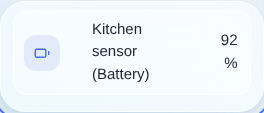

Si has configurado un broker MQTT en tu instalación de Gladys, tendrás acceso a la API MQTT de Gladys.

Estos son todos los topics MQTT disponibles, cada uno con un mensaje de ejemplo:

### Enviar un estado decimal de un dispositivo

Supongamos que tienes un sensor de temperatura que envía datos a Gladys. Tendrás que enviar sus valores de temperatura a este topic:

```
Topic: gladys/master/device/:device_external_id/feature/:device_feature_external_id/state
Body: 22.2
```

### Enviar un estado de texto de un dispositivo

Si quieres, puedes enviar texto a Gladys para mostrarlo en el panel de control.



Para ello, crea un dispositivo de tipo "Texto" en la integración MQTT y luego publica un mensaje en este topic:

```
Topic: gladys/master/device/:device_external_id/feature/:device_feature_external_id/text
Body: Hello Gladys!
```

### Enviar un estado a un dispositivo

Supongamos que tienes una luz MQTT y quieres controlarla desde Gladys.

La luz tendrá que suscribirse a este topic:

```
gladys/device/:device_external_id/feature/:device_feature_external_id/state
```

En él recibirá valores como:

```
1
```

Que significa "Hay que encender la luz".

O bien

```
0
```

Que significa "Hay que apagar la luz".

### Iniciar una escena por MQTT

También puedes iniciar una escena por MQTT publicando un mensaje en el topic:

```
gladys/master/scene/SCENE_SELECTOR/start
```

Sustituye `SCENE_SELECTOR` por el selector de la escena, que encontrarás en la URL de edición de la escena.

Por ejemplo, para la escena `http://192.168.1.10/dashboard/scene/cinema`, tendrás que enviar un mensaje al topic:

```
gladys/master/scene/cinema/start
```
