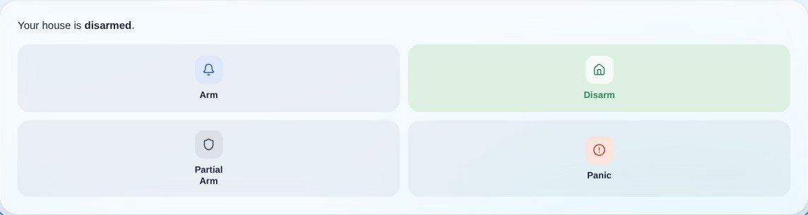
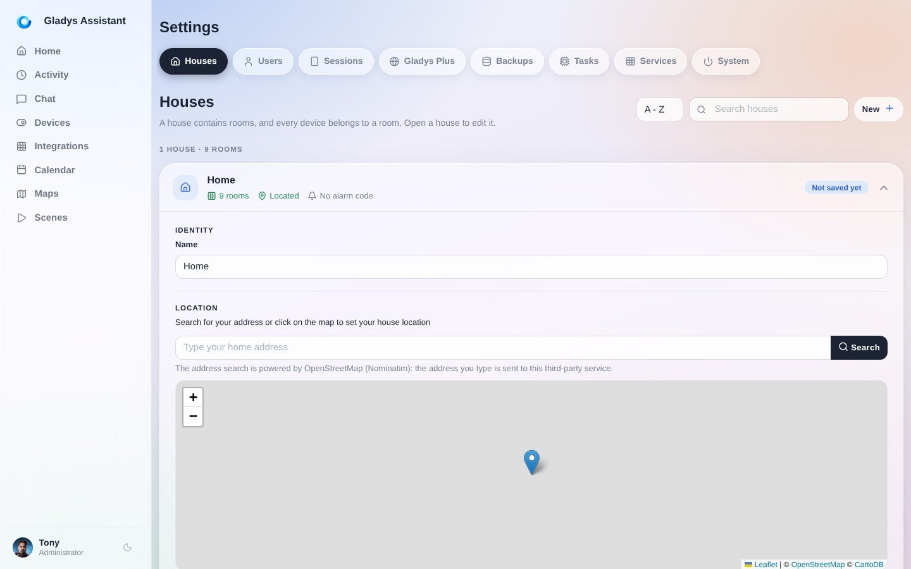
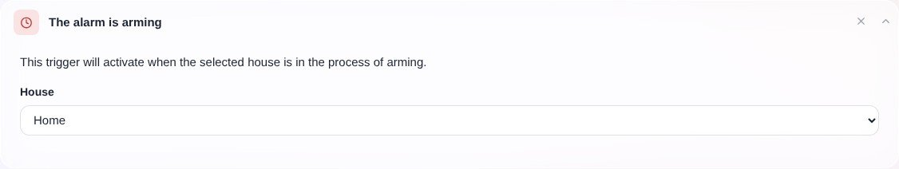
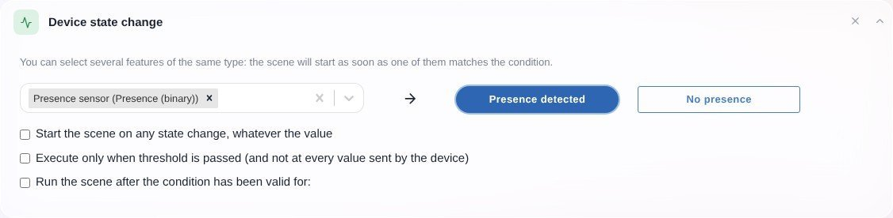
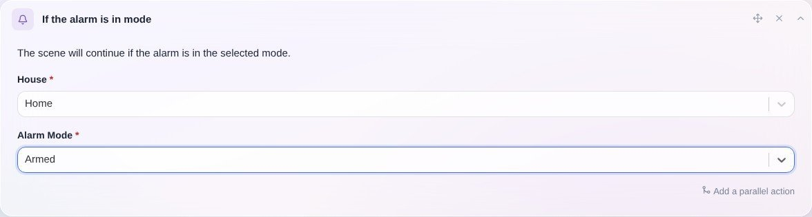
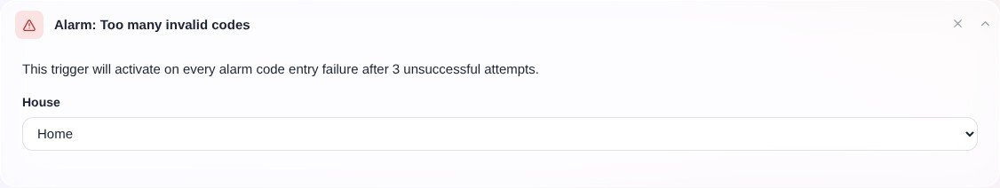
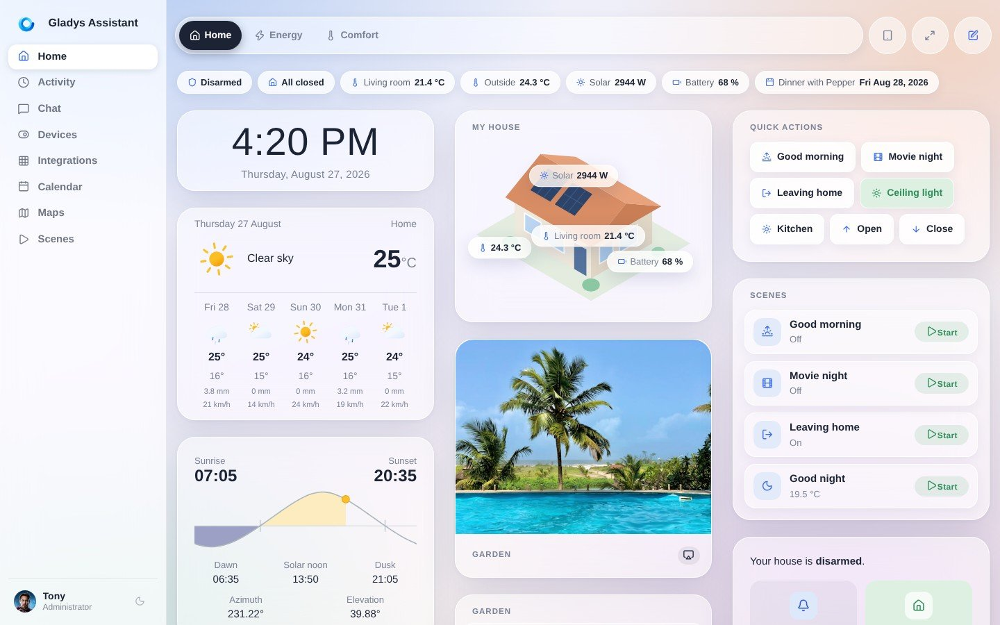
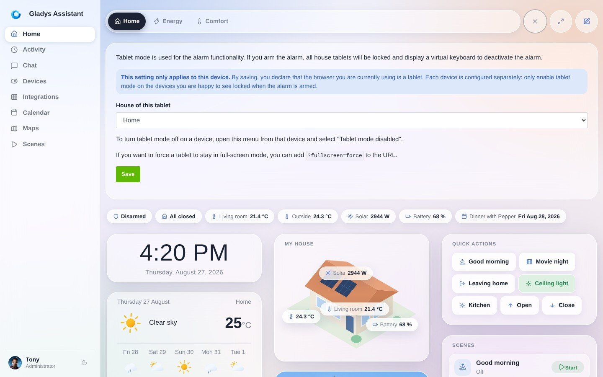
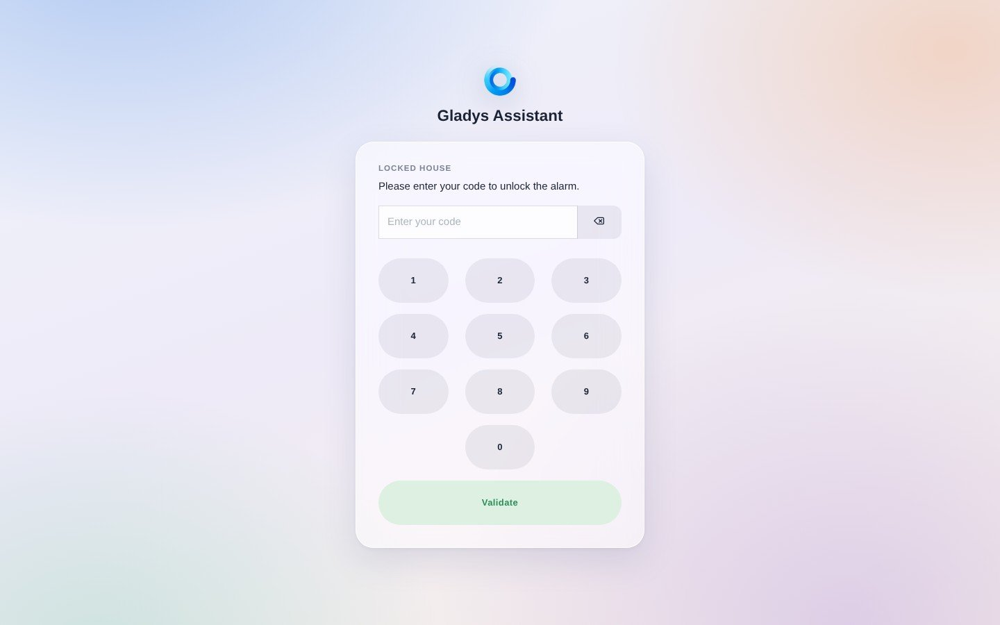

En Gladys puedes configurar un verdadero sistema de alarma.

## Configurar el panel

En el panel puedes añadir un widget "Alarma":

La alarma de Gladys tiene 4 modos:

- **Armada**: la casa está armada. Útil cuando no estás en casa.
- **Desarmada**: la casa está desarmada, la alarma no está activa.
- **Armado parcial**: este modo es útil como "modo noche" o "modo siesta". Estás en casa y quieres vigilar solo el exterior de la vivienda, pero no el interior, para poder seguir moviéndote con libertad.
- **Modo pánico**: hay un intruso en la casa y quieres disparar la alarma, ¿y quizá enviar automáticamente un mensaje a un ser querido?

Ahora que conoces los distintos modos, es hora de configurar escenas para poner en marcha tu estrategia de alarma.

## Definir el retardo de armado y el código de alarma

Hay 2 parámetros que configurar en los ajustes de la casa ("Ajustes" -> "Casas"):

- **Código de alarma**: si usas el "modo tableta", Gladys mostrará un teclado numérico en esas tabletas cuando la alarma esté armada. El código que definas aquí servirá para desactivar la alarma. Hablaremos de este modo tableta más adelante en este tutorial.
- **Retardo antes del armado**: si quieres dejar un margen antes de que la alarma se arme (entre 5 segundos y 1 minuto), puedes configurarlo aquí. Así tendrás tiempo de salir de casa antes de que la alarma se active.

## Configurar las escenas

Ahora tenemos que decirle a Gladys qué hará cada modo de alarma.

La primera escena que debes crear es la que se activará cuando la alarma se esté armando.

Por ejemplo, puedes enviarte un mensaje de Telegram cuando la alarma se esté armando, emitir una señal sonora en casa, hacer parpadear las luces... ¡todo es posible!

A continuación, el escenario más importante: ¿qué hacer en caso de intrusión?

Puedes crear una escena con varios desencadenantes:

- "Cuando se detecte movimiento en el salón"
- "Cuando se detecte movimiento en la cocina"
- "Cuando se abra la puerta de entrada"

Después añade la condición "Y que la alarma esté en modo armado":

Si se cumple esta condición, la escena continuará y podrás enviarte un mensaje de Telegram, enviarte una imagen de una cámara por Telegram, disparar una alarma sonora en casa, etc.

Si alguien entra a la fuerza en tu casa, puede intentar desbloquear Gladys desde tus tabletas de pared.

Podrá probar 3 códigos antes de que el teclado se bloquee durante 5 minutos, y tras 3 códigos incorrectos se activará este desencadenante de escena:

Puedes crear una escena con este desencadenante que te avise por mensaje.

## Modo tableta

Si tienes una tableta en la pared de casa, puedes declararla en Gladys mediante el botón "Modo tableta":

Al hacer clic en este botón, verás un formulario que te pide indicar la casa en la que se encuentra esta tableta.

Gladys necesita esta información para saber cuándo "bloquear" la tableta:

Si quieres que tu tableta se muestre a pantalla completa, puedes añadir un parámetro a la URL: `?fullscreen=force`.

Esta "pantalla completa forzada" no tiene nada que ver con el modo tableta; ambos son totalmente independientes.

Cuando la alarma se arme, Gladys buscará automáticamente todas las tabletas de la casa y las bloqueará.

Estas tabletas mostrarán un teclado numérico que te permitirá desactivar la alarma:

Este teclado es una alternativa a los teclados físicos, pero también puedes usar un teclado Zigbee físico real y crear una escena que desarme la alarma cuando se utilice ese teclado.

También puedes prescindir por completo de estos teclados y desarmar la alarma desde el widget "Alarma" de tu teléfono.
