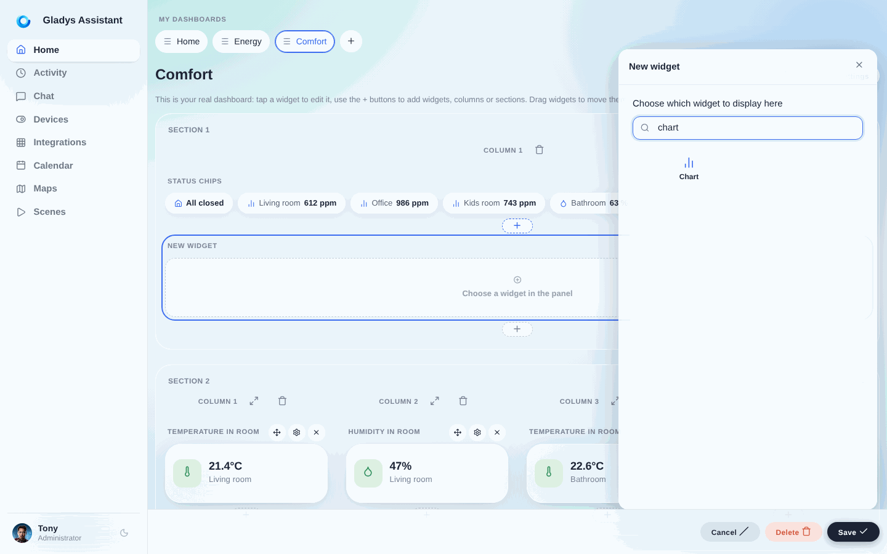
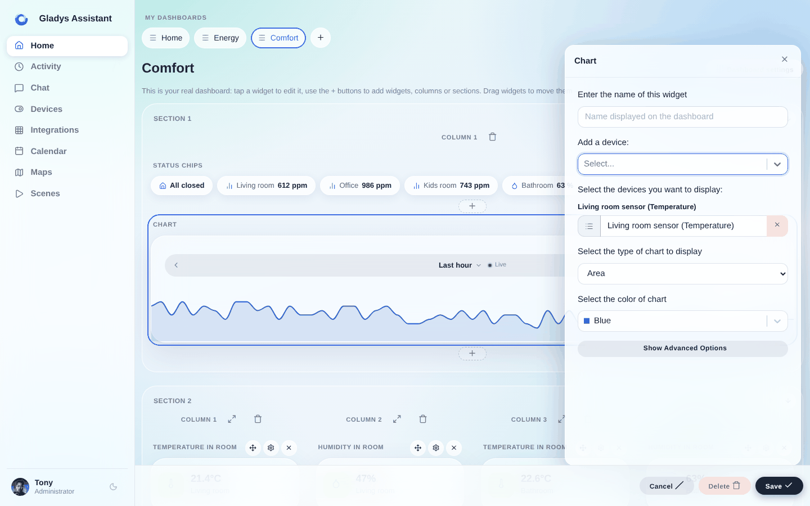
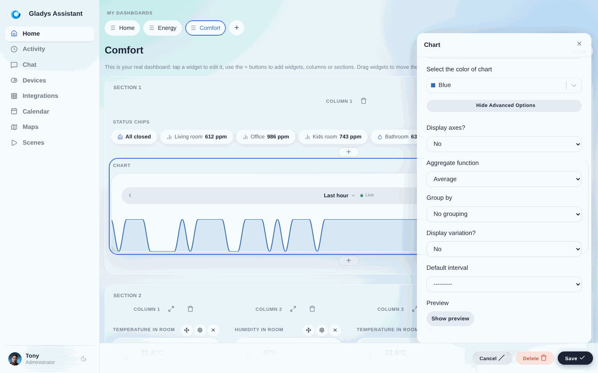
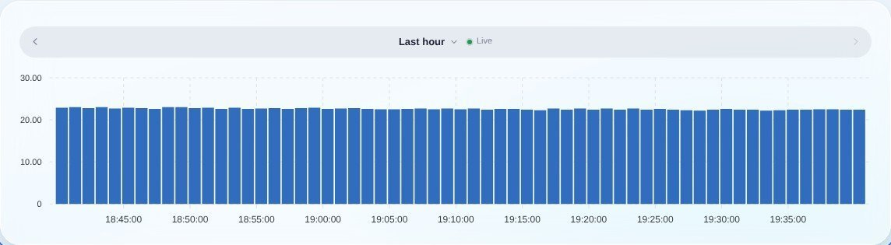
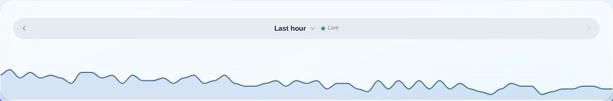
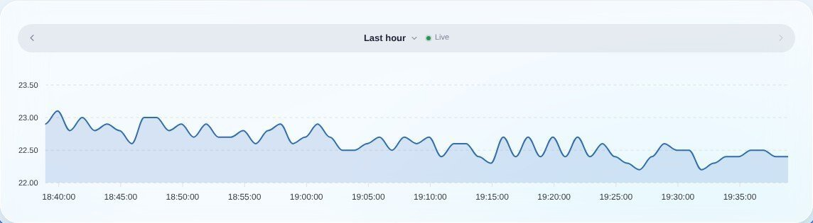

## Requisitos previos

Debes tener configurado al menos un sensor que envíe datos a Gladys.

## Configuración

Ve al panel de control de Gladys y haz clic en el botón "Editar".

Añade un widget "Gráfico":

Selecciona los dispositivos que quieres mostrar y luego configura el resto del widget:

- **Nombre**: se mostrará en la parte superior del widget en el panel de control
- **Tipo de gráfico**: en Gladys puedes mostrar varios tipos de gráficos (líneas, barras, área, línea recta, binario)
- **Mostrar ejes**: hay dos tipos de visualización, una más orientada al diseño sin ejes y otra con ejes
- **Mostrar variación**: si activas esta opción, el gráfico mostrará la variación relativa entre el primer y el último valor del intervalo seleccionado

Si quieres agrupar los datos por intervalo de tiempo, puedes modificar esta opción en los ajustes avanzados:

## Ejemplos de gráficos

Supongamos que quieres mostrar el consumo de energía de uno de tus dispositivos: el gráfico de barras es especialmente adecuado para ello:

También puedes mostrar estos datos como un gráfico de área, sin ejes, para una visualización más orientada al diseño:

O con ejes, para una mejor legibilidad:

¡Las posibilidades son infinitas!
