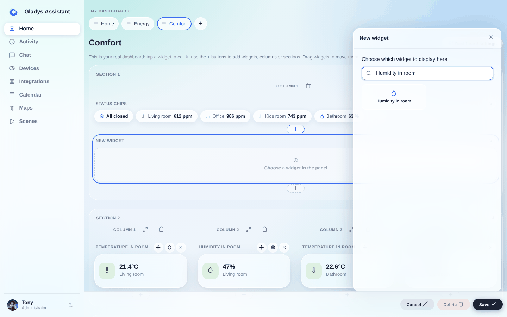
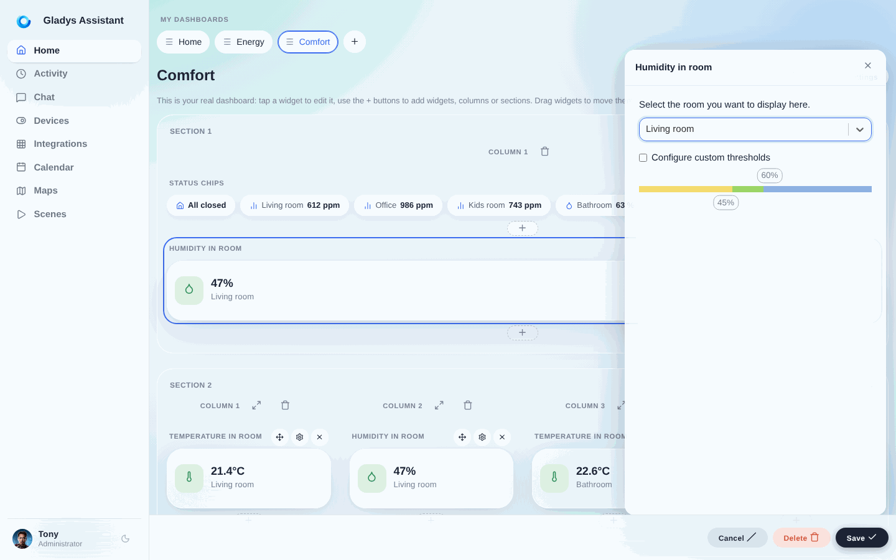
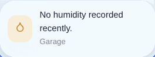

En Gladys Assistant, puedes mostrar la humedad media de una habitación en tu panel de control.

Este widget obtiene la humedad de todos los sensores de humedad presentes en la habitación y muestra la media en el panel de control.

## Requisitos previos

Primero debes haber configurado al menos un sensor de humedad.

Puede ser un sensor de cualquier protocolo (Zigbee, Matter, MQTT, da igual), y debes haber asignado este sensor a una habitación.

## Configuración

Ve al panel de control y haz clic en "Editar".

Selecciona el widget "Humedad de la habitación" y haz clic en el botón +.

A continuación, selecciona la habitación que quieres mostrar.

Puedes configurar umbrales personalizados a partir de los cuales el color del widget cambiará según la humedad.

Haz clic en "Guardar".

Si no tienes sensores en la habitación, o si estos sensores no han enviado ningún valor en la última hora, verás lo siguiente:

