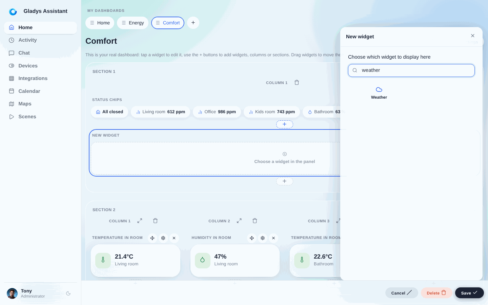
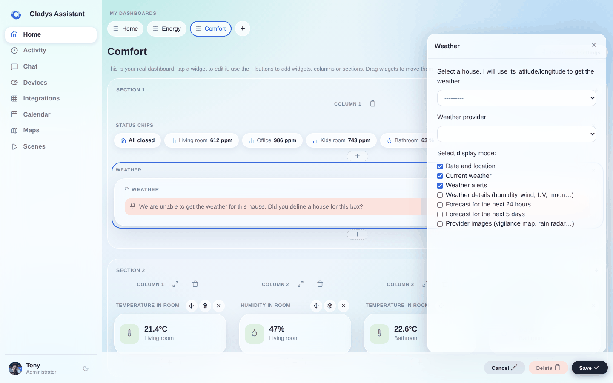
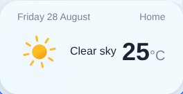

Puedes mostrar el tiempo de tu ubicación en el panel de control.

## Requisitos previos

- Debes haber configurado previamente el servicio [OpenWeather](/es/docs/integrations/openweather/) para que Gladys Assistant pueda mostrar el tiempo.
- Debes haber configurado tu casa en los ajustes y haberla situado en el mapa, para que OpenWeatherMap conozca la latitud y la longitud de tu casa.

## Configuración

Ve al panel de control y haz clic en "Editar".

Añade un widget "Tiempo":

A continuación, selecciona tu casa y las opciones de visualización:

Haz clic en "Guardar".

¡Ya deberías ver el tiempo!

