Si ya tienes una Raspberry Pi, puedes instalar Gladys Assistant en solo unos minutos con nuestra nueva **imagen oficial de 64 bits**, compatible con **Raspberry Pi 3, 4 y 5**.

Es la forma más sencilla de descubrir Gladys, sin tener que instalar tú mismo Raspberry Pi OS y Docker.

:::info
**Para una instalación a largo plazo**, te recomiendo un mini-PC (mejor relación calidad-precio, SSD NVMe integrado y más fiable con los dongles Zigbee/Z-Wave).

Pero si ya tienes una Raspberry Pi a mano, úsala para probar Gladys. ¡Precisamente por eso hemos hecho esta instalación tan sencilla!
:::

## Lo que necesitas

- Una **Raspberry Pi 3, 4 o 5** (modelo de 64 bits)
- Preferiblemente un **SSD USB** (adaptador USB 3.0 + SSD SATA o NVMe). Para hacer pruebas, también sirve una tarjeta microSD de 16 GB.
- Una **fuente de alimentación oficial** adecuada para tu modelo (5 V / 3 A para la Pi 4, 5 V / 5 A para la Pi 5)
- Un **cable Ethernet** o una conexión wifi
- Un ordenador (Windows, macOS o Linux) para grabar la imagen

## Paso 1: descargar Raspberry Pi Imager

Descarga e instala [Raspberry Pi Imager](https://www.raspberrypi.com/software/) en tu ordenador. Es la herramienta oficial para grabar imágenes en tarjetas SD o SSD.

## Paso 2: seleccionar tu Raspberry Pi

Abre Raspberry Pi Imager y haz clic en **Choose Device** (o en **NEXT** si estás en el nuevo asistente paso a paso).

Selecciona tu modelo de Raspberry Pi en la lista:

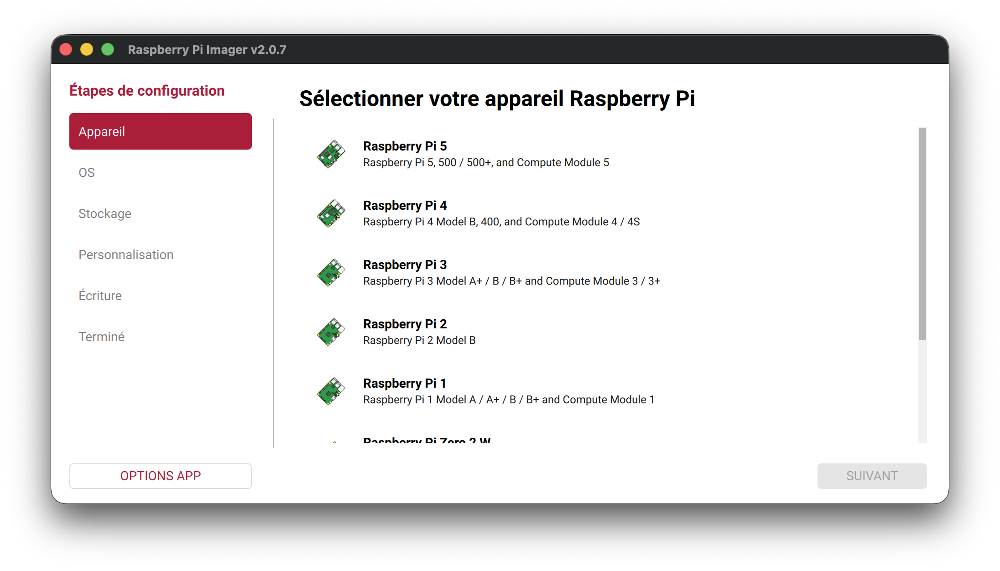

## Paso 3: elegir la imagen de Gladys Assistant

Haz clic en **Choose OS** y navega por las siguientes categorías:

1. **Other specific-purpose OS**
2. **Home automation**
3. **Gladys Assistant**

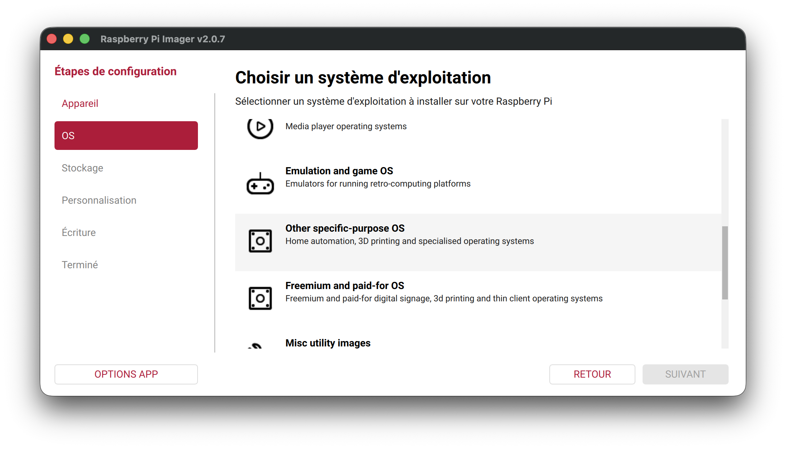

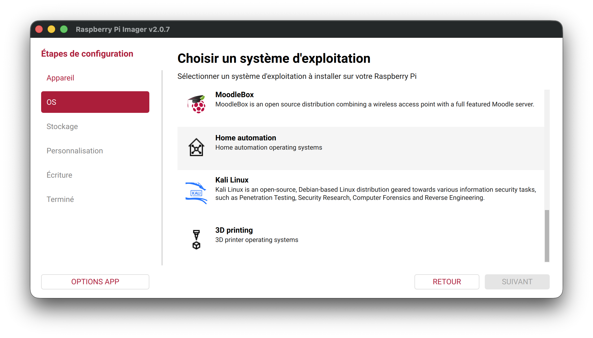

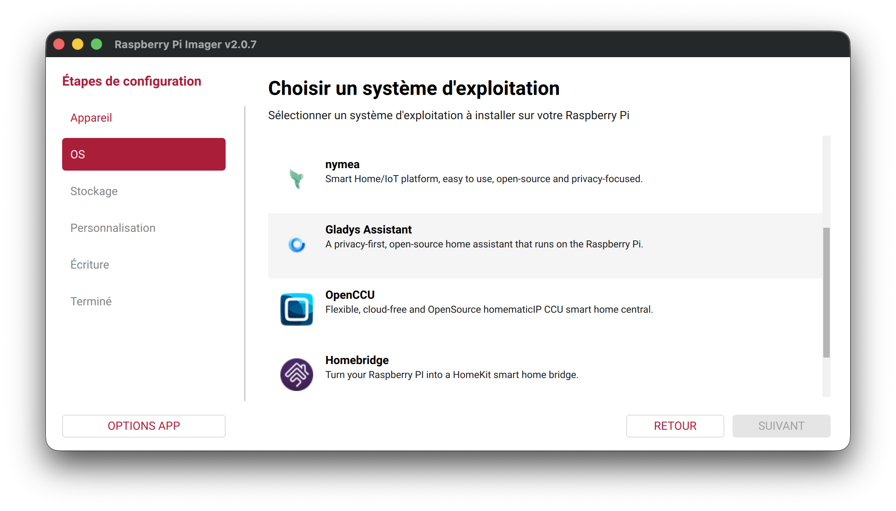

A continuación, selecciona la imagen **Gladys Assistant (64-bit, for Rpi 3, 4 & 5)**:

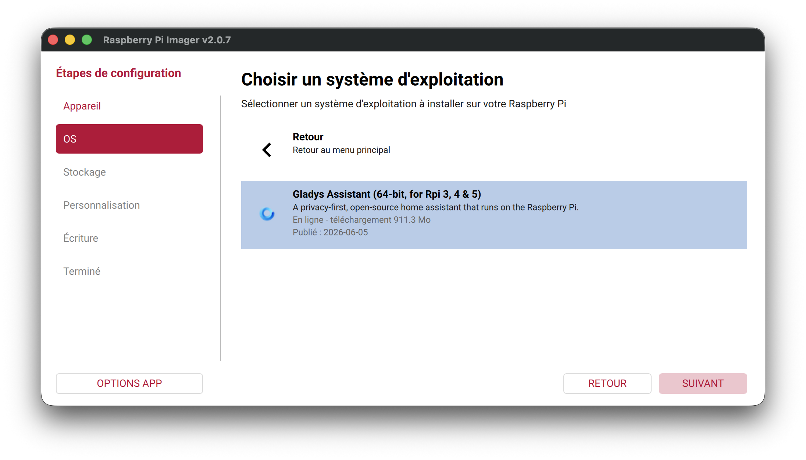

:::tip
La descarga de la imagen ocupa unos 900 MB. Raspberry Pi Imager se encarga de todo: descarga, verificación y escritura en tu dispositivo de almacenamiento.
:::

## Paso 4: elegir el almacenamiento

Inserta tu tarjeta microSD o conecta tu SSD USB, haz clic en **Choose Storage** y selecciona el dispositivo correspondiente:

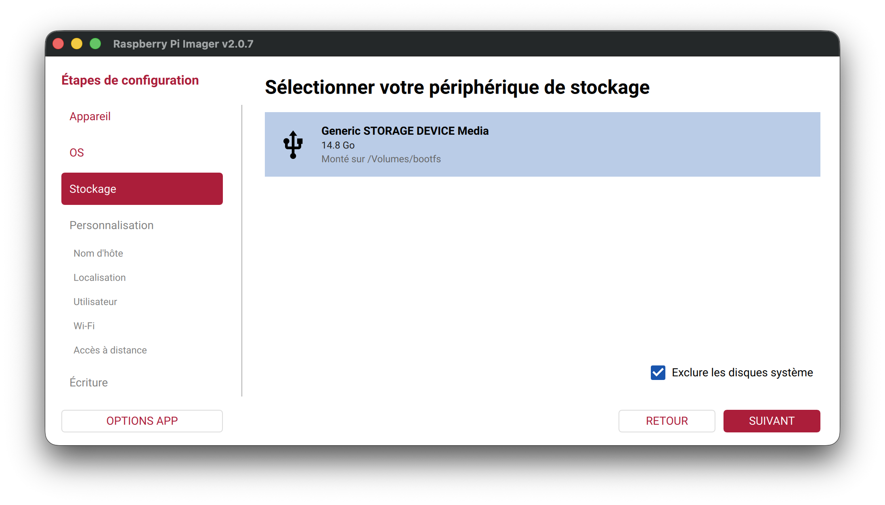

:::warning
Asegúrate de seleccionar el dispositivo correcto: **se borrarán todos los datos de esta unidad**.
:::

## Paso 5: personalizar la instalación (recomendado)

Antes de grabar la imagen, configura los ajustes de tu Raspberry Pi. Así no tendrás que conectar una pantalla y un teclado en el primer arranque.

### Nombre de host

Elige un nombre de red para tu Raspberry Pi. Por ejemplo, `gladys`: así podrás acceder a ella en `http://gladys.local`:

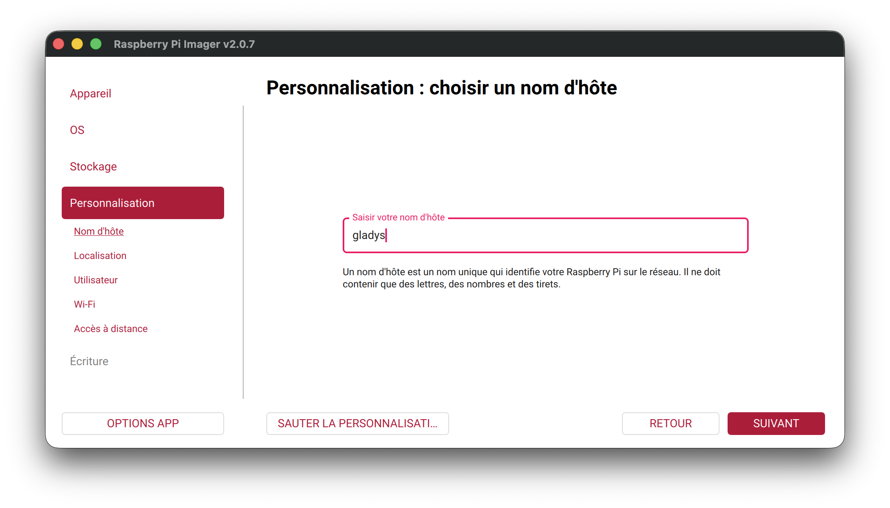

### Localización

Selecciona tu ciudad, tu zona horaria y la distribución de tu teclado:

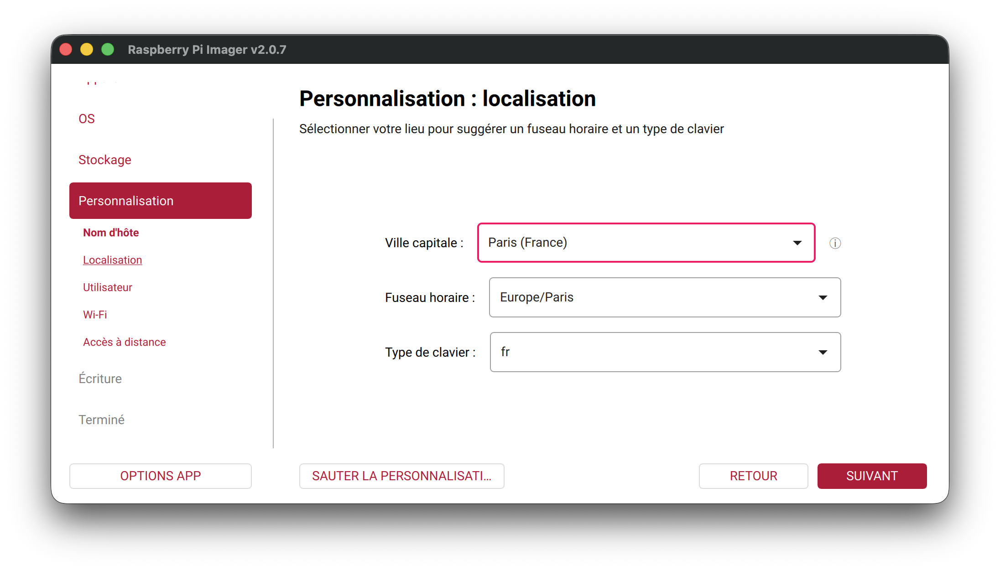

### Cuenta de usuario

Crea un nombre de usuario y una contraseña. Esta cuenta se usará para el acceso SSH y para iniciar sesión en el sistema:

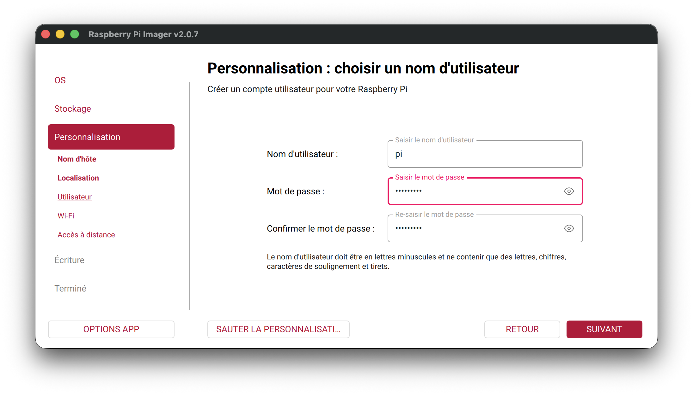

### Wifi (opcional)

Si no usas un cable Ethernet, introduce el nombre y la contraseña de tu red wifi:

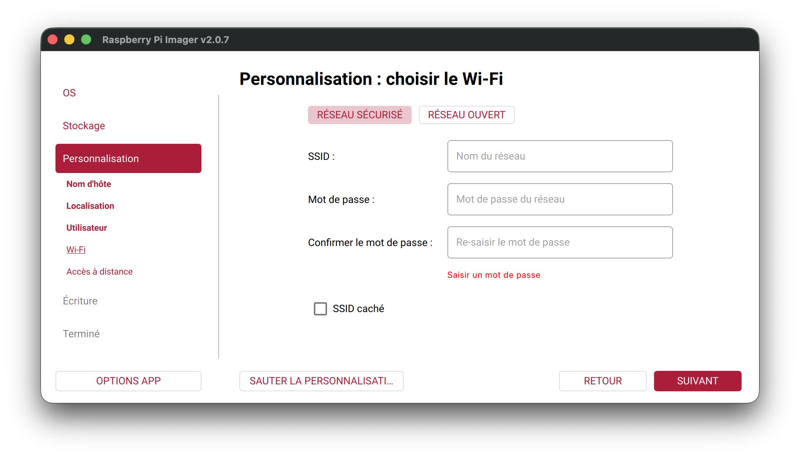

### Acceso SSH (recomendado)

Activa SSH para poder conectarte a tu Raspberry Pi a distancia. La autenticación por contraseña es la forma más sencilla de empezar:

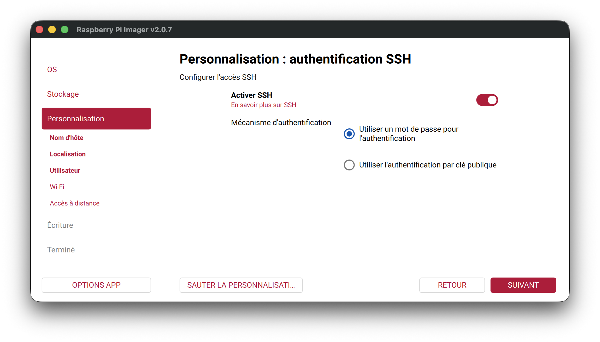

## Paso 6: grabar la imagen

Revisa el resumen de tu configuración y haz clic en **WRITE**:

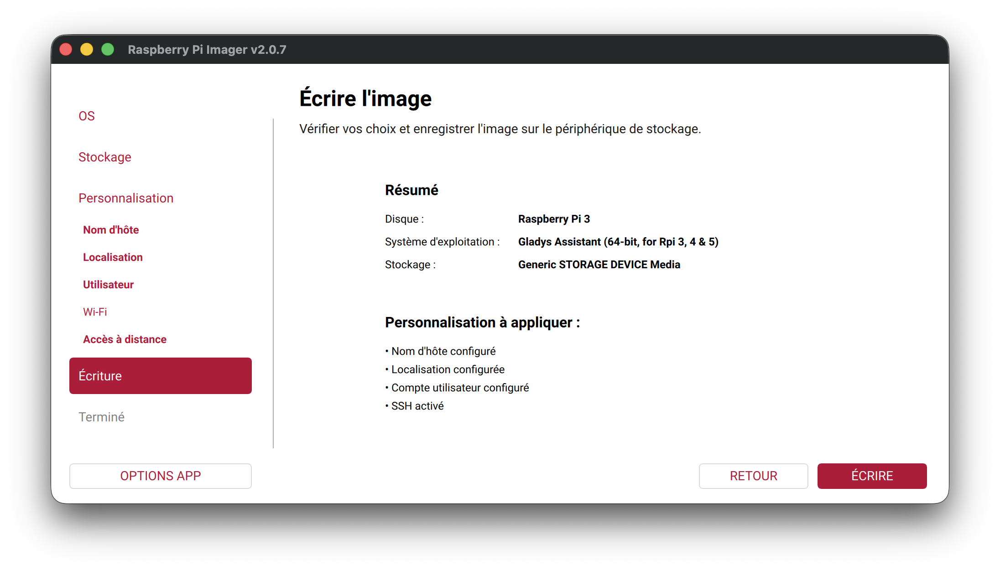

La grabación puede tardar varios minutos según la velocidad de tu almacenamiento. Cuando termine, Raspberry Pi Imager expulsará el dispositivo automáticamente:

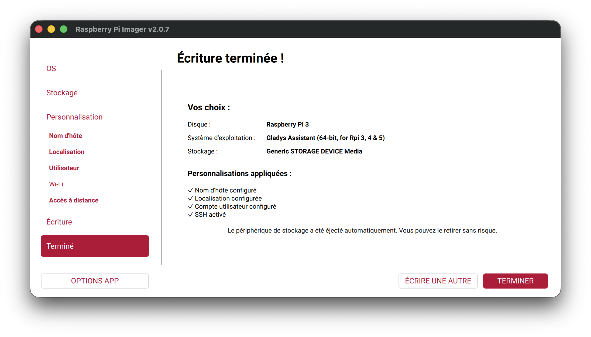

## Paso 7: primer arranque

1. Inserta la tarjeta microSD en tu Raspberry Pi (o conecta el SSD USB)
2. Conecta la fuente de alimentación
3. Espera unos 2 minutos a que la Raspberry Pi arranque

## Paso 8: acceder a Gladys Assistant

Abre tu navegador y ve a una de estas direcciones:

- `http://gladysassistant.local` (Gladys anuncia este nombre en tu red local mediante mDNS)
- `http://gladys.local` (si configuraste `gladys` como nombre de host)
- `http://TU_IP_LOCAL` (por ejemplo, `http://192.168.1.131`)

En el primer arranque, Gladys realiza su configuración inicial. Esto puede tardar **entre 5 minutos y 1 hora** según tu hardware y tu conexión a internet:

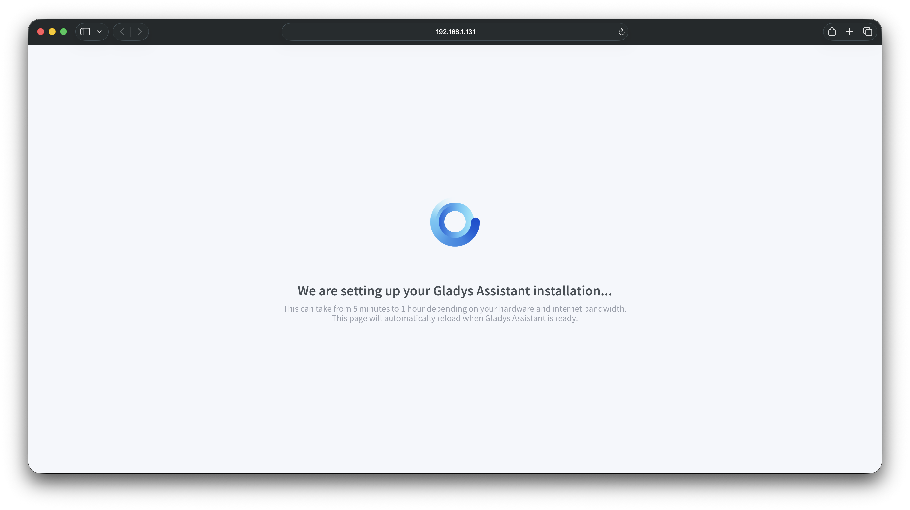

La página se recargará automáticamente cuando Gladys esté lista. ¡Después podrás crear tu cuenta y empezar a configurar tu hogar inteligente!

## ¿Y ahora qué?

- Consulta la guía de [hardware recomendado](/es/docs/installation/recommended-hardware/) para elegir tus dispositivos conectados
- Aprende a [instalar integraciones](/es/docs/integrations/) (Zigbee, Z-Wave, etc.)
- Si quieres pasar a una configuración más potente, consulta la [guía de instalación en un mini-PC](/es/docs/installation/mini-pc/)
