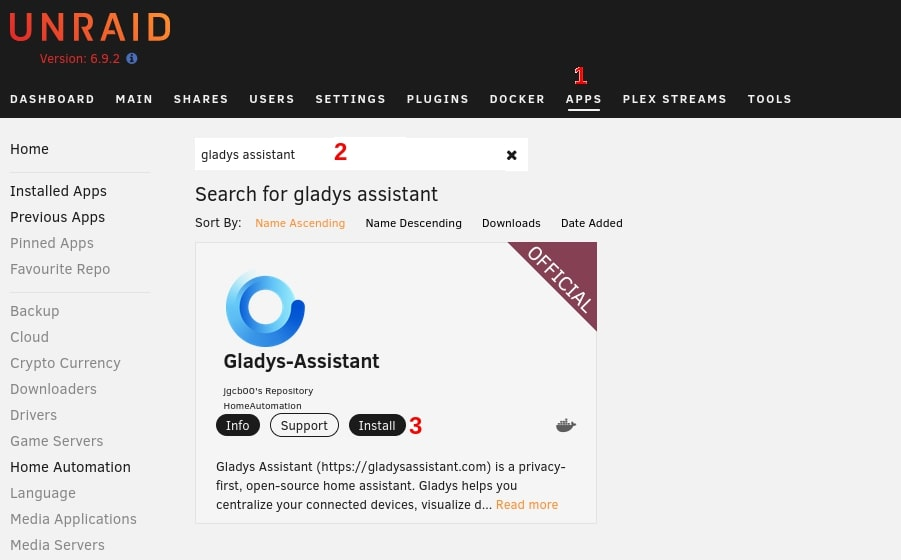
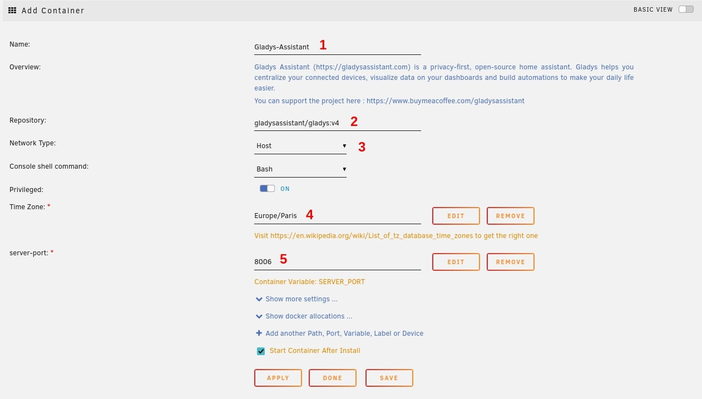
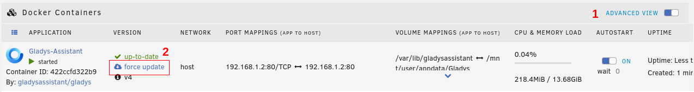

En este tutorial repasamos los pasos para instalar Gladys Assistant con Docker en un NAS Unraid.

## Buscar Gladys-Assistant

Instala la aplicación Docker desde el "Apps Manager":

- En el panel de administración de Unraid, haz clic en "Apps"
- Busca "Gladys-Assistant"
- Haz clic en "install"

## Configuración de Gladys

A continuación se te redirigirá a las páginas de configuración de Gladys.

Estos son los distintos parámetros:

1. El nombre de tu aplicación. Si no tienes otra instancia, puedes dejarlo como Gladys-Assistant
2. El repositorio de Docker Hub. No lo toques a menos que sepas lo que estás haciendo
3. El tipo de red DEBE quedarse en **HOST**. Es necesario para que Gladys pueda escanear tu red en busca de nuevos dispositivos inteligentes
4. Tu zona horaria. Asegúrate de respetar este [formato](https://en.wikipedia.org/wiki/List_of_tz_database_time_zones)
5. El puerto en el que se mostrará el panel de control de Gladys

Atención: si tienes o piensas tener dispositivos MQTT, el puerto 1883 debe estar libre. Lo mismo ocurre con los dispositivos Zigbee, que necesitan que los puertos 1884 y 8080 estén libres.

:::note
Si cambias el puerto predeterminado 8006, es posible que el botón WebUI te redirija a un puerto equivocado. Para cambiarlo, haz clic en la vista avanzada (Advanced View), busca el campo de la Web UI y cambia el número de puerto.
:::

Haz clic en "Apply" y espera a que termine la instalación.

## Acceder a Gladys

Gladys estará accesible en tu navegador en `http://IP_DE_TU_NAS:PUERTO`

Por ejemplo `http://192.168.1.2:8006`

También puedes acceder a la Web UI haciendo clic en "Docker", luego en el logotipo de Gladys y, por último, en "WebUI".

¡Bienvenido a Gladys Assistant!

## Actualizar Gladys

Actualmente, Watchtower no está disponible en Unraid (podría cambiar pronto).

Para actualizar Gladys:

0. Ve a la sección Docker
1. Haz clic en "Advanced View"
2. Haz clic en "force update"

Puedes ver tu versión actual en el panel de control de Gladys: haz clic en tu perfil arriba a la derecha, luego en "Ajustes" y, por último, en "Sistema".

## Parámetros avanzados

Al configurar Gladys, verás otros parámetros:

- Gladys lib folder: carpeta de tu NAS donde se guardan los archivos permanentes
- Gladys Dev Folder: carpeta donde los dispositivos se representan como archivos
- Gladys uDev Folder: udev es el gestor de dispositivos del kernel de Linux
- DB File path: ruta Docker a la base de datos SQLite
- Environment: production o development (muestra información de depuración)
- Gladys Docker Folder: archivo de comandos de Docker para crear y gestionar contenedores Docker desde Gladys
