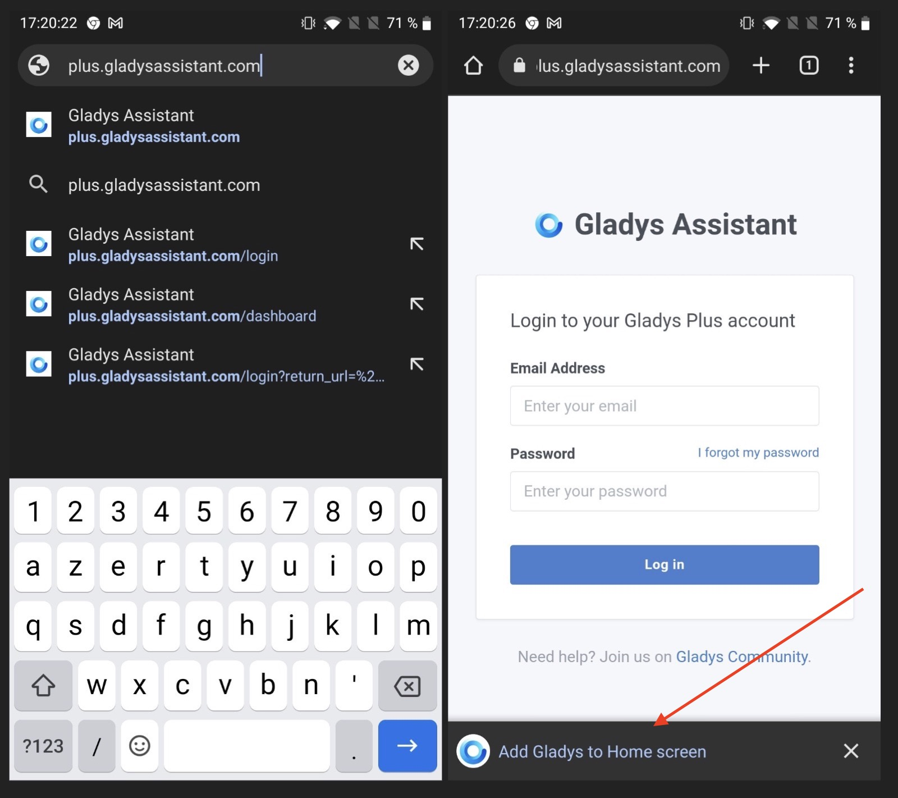
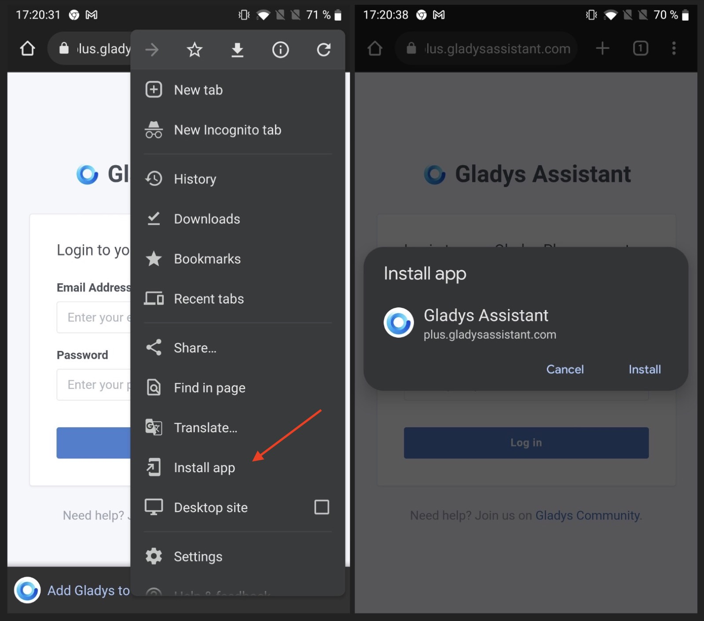
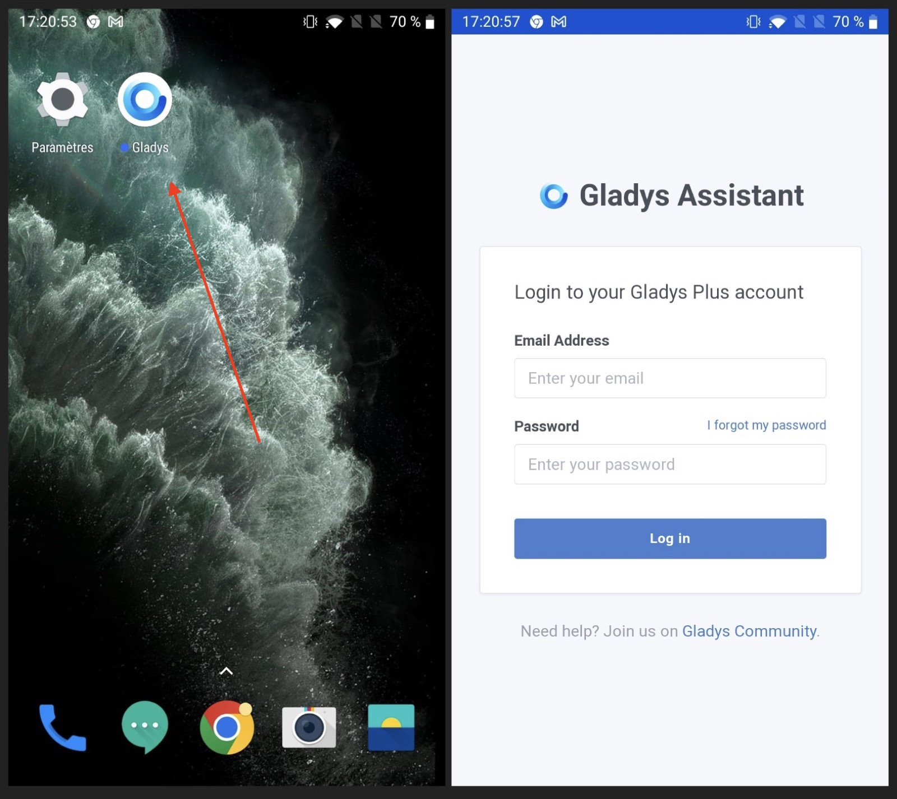
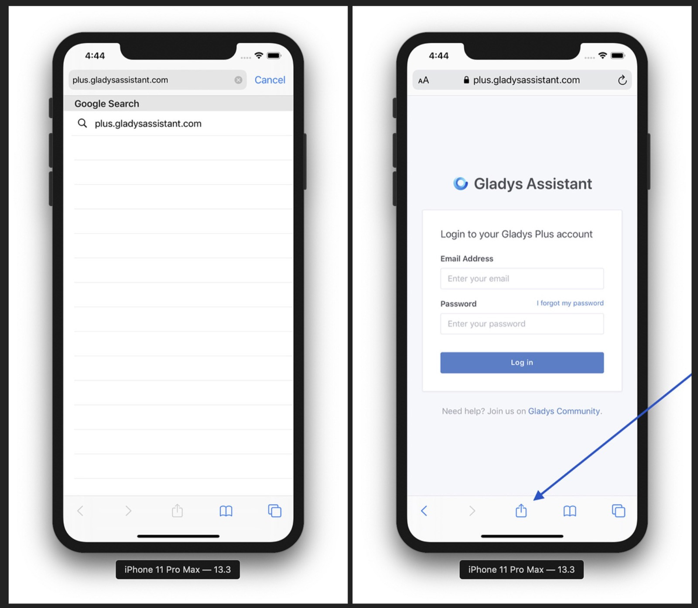
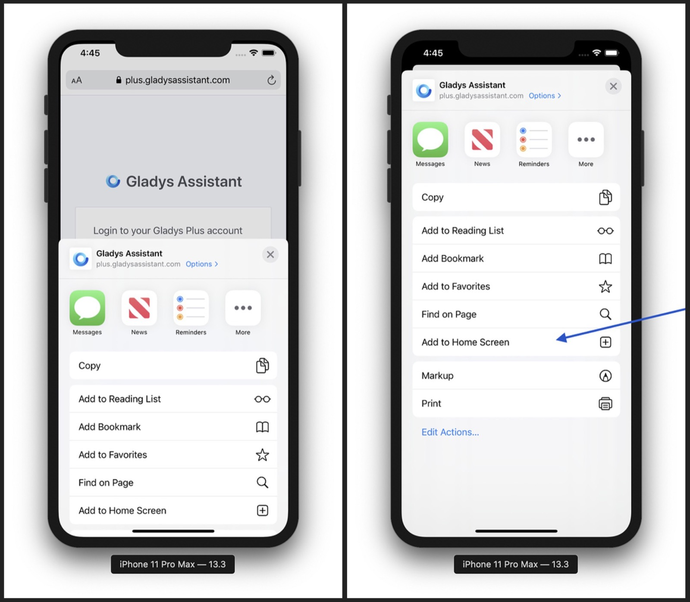
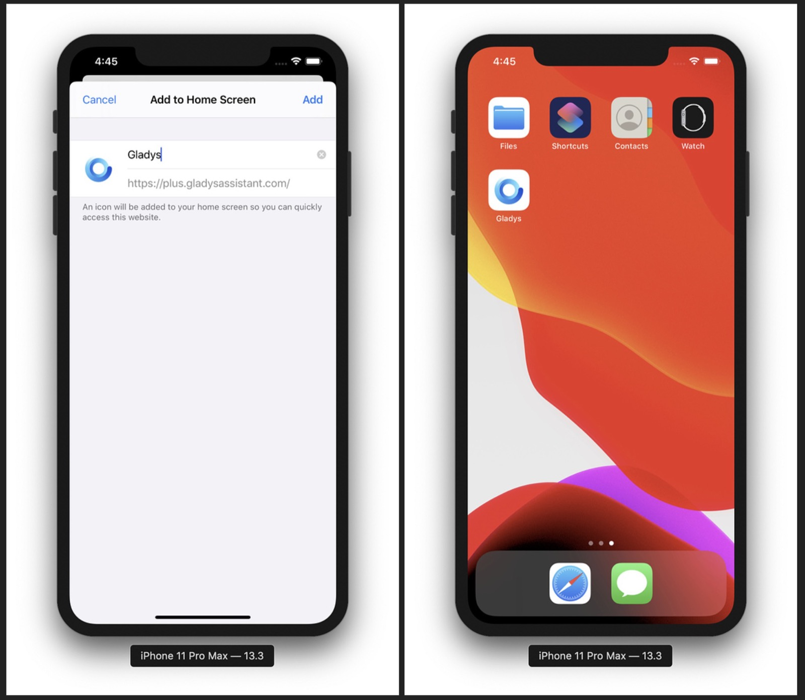
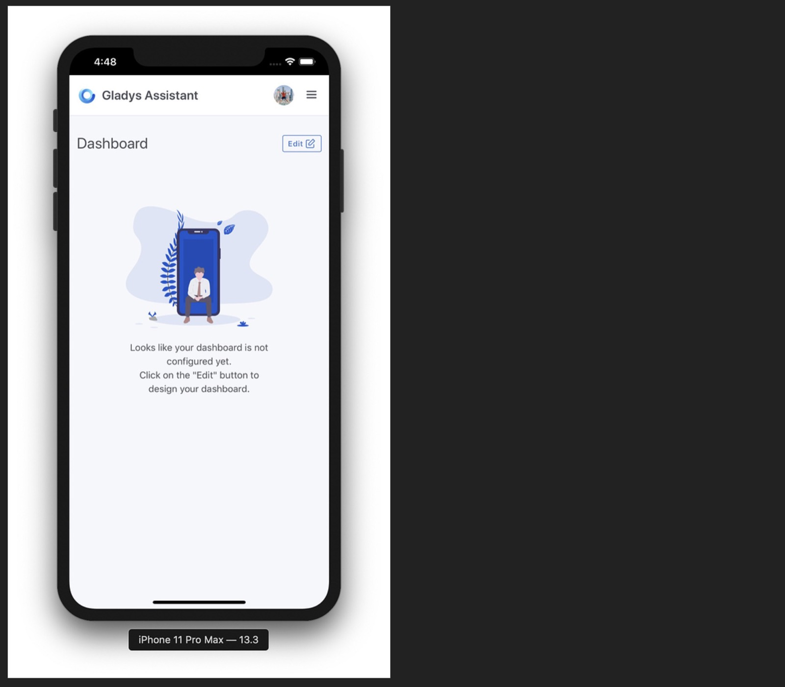

import JsonLd from '@site/src/components/seo/JsonLd';

Gladys Assistant es una PWA ([Progressive Web App](https://en.wikipedia.org/wiki/Progressive_web_application)), es decir, una aplicación web que se puede instalar en cualquier dispositivo: en iOS, Android, macOS, Windows y Linux.

Como Gladys se ejecuta en la red de tu casa, por defecto solo está disponible cuando estás conectado a tu red local.

Ofrecemos [Gladys Plus](/es/plus), un servicio que redirige el tráfico desde [plus.gladysassistant.com](https://plus.gladysassistant.com/) hacia tu red local, todo cifrado de extremo a extremo para máxima privacidad y sin ninguna configuración.

Si quieres usar Gladys solo en local, o con tu propio dominio, puedes seguir este tutorial con la dirección de tu instancia de Gladys.

## En Android

Instalar Gladys en un móvil o tablet Android es superfácil.

Abre [plus.gladysassistant.com](https://plus.gladysassistant.com/) en Chrome.

Deberías ver un botón "Añadir Gladys a la pantalla de inicio" en la parte inferior.

Si no aparece, también puedes tocar los tres puntos de la esquina superior derecha y seleccionar "Instalar aplicación":

¡Listo! Ya puedes disfrutar de Gladys/Gladys Plus como una app.

## En iOS

Instalar Gladys en un dispositivo iOS (iPhone/iPad) es superfácil.

Abre [plus.gladysassistant.com](https://plus.gladysassistant.com/) en Safari y toca el botón de compartir en la parte inferior de la página.

Toca "Añadir a pantalla de inicio":

Ponle un nombre a la app y toca "Añadir":

¡Listo! Ya tienes Gladys Plus en tu pantalla de inicio.

## Preguntas frecuentes

### ¿Existe una app móvil de Gladys para iPhone y Android?

Gladys es una Progressive Web App, así que la instalas directamente desde tu navegador en lugar de desde una tienda de aplicaciones. Una vez añadida a la pantalla de inicio de tu iPhone o Android, se ve y se comporta como una app nativa, con su propio icono y vista a pantalla completa.

### ¿Puedo acceder a Gladys desde mi móvil fuera de casa?

Sí, con Gladys Plus. Por defecto, Gladys solo responde en tu red local, pero Gladys Plus redirige la conexión de forma segura para que puedas controlar tu casa desde cualquier lugar, con cifrado de extremo a extremo, sin redirección de puertos ni configuración.

### ¿Gladys funciona tanto en iOS como en Android?

Sí. La misma aplicación web se instala en iPhone, iPad y en móviles y tablets Android, y también en macOS, Windows y Linux.

<JsonLd
  data={{
    "@context": "https://schema.org",
    "@type": "FAQPage",
    mainEntity: [
      {
        "@type": "Question",
        name: "¿Existe una app móvil de Gladys para iPhone y Android?",
        acceptedAnswer: {
          "@type": "Answer",
          text: "Gladys es una Progressive Web App, así que la instalas directamente desde tu navegador en lugar de desde una tienda de aplicaciones. Una vez añadida a la pantalla de inicio de tu iPhone o Android, se ve y se comporta como una app nativa, con su propio icono y vista a pantalla completa.",
        },
      },
      {
        "@type": "Question",
        name: "¿Puedo acceder a Gladys desde mi móvil fuera de casa?",
        acceptedAnswer: {
          "@type": "Answer",
          text: "Sí, con Gladys Plus. Por defecto, Gladys solo responde en tu red local, pero Gladys Plus redirige la conexión de forma segura para que puedas controlar tu casa desde cualquier lugar, con cifrado de extremo a extremo, sin redirección de puertos ni configuración.",
        },
      },
      {
        "@type": "Question",
        name: "¿Gladys funciona tanto en iOS como en Android?",
        acceptedAnswer: {
          "@type": "Answer",
          text: "Sí. La misma aplicación web se instala en iPhone, iPad y en móviles y tablets Android, y también en macOS, Windows y Linux.",
        },
      },
    ],
  }}
/>
