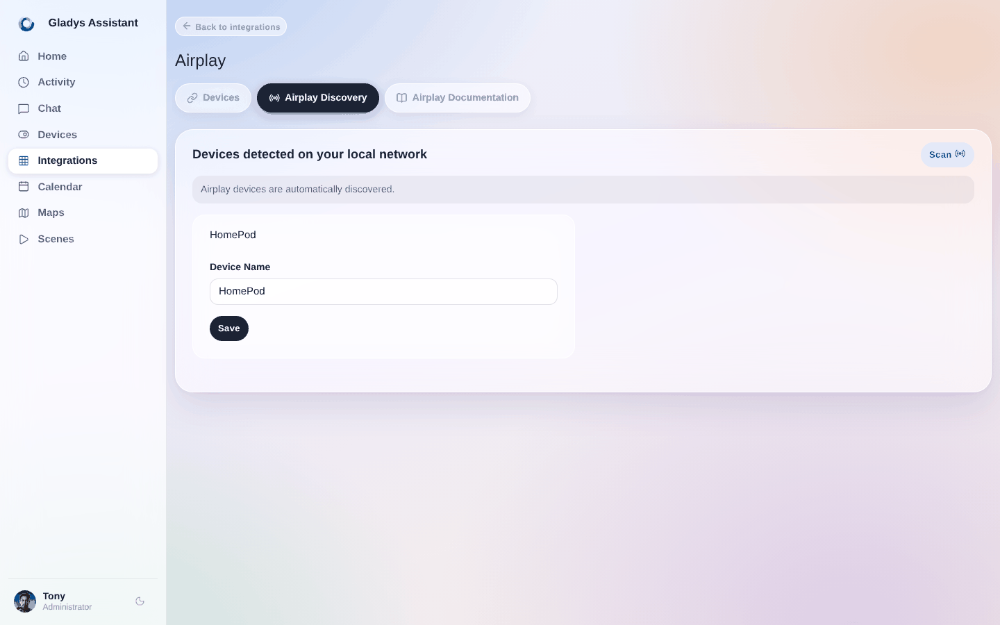
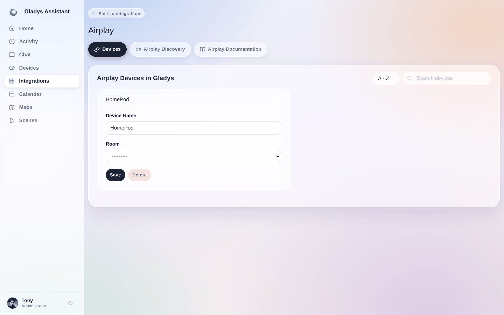
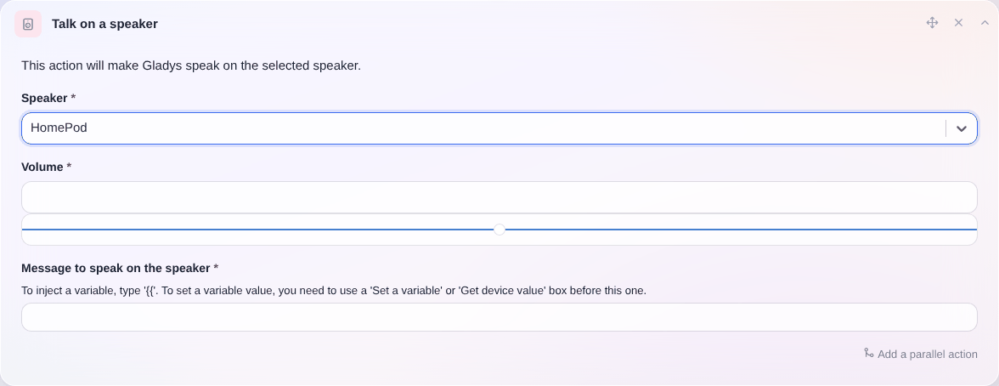

## Requisitos previos

Comprueba que tu altavoz sea accesible desde todos los dispositivos de la misma red.

Para reproducir en un HomePod, abre la aplicación Casa, ve a `Ajustes de la casa` y elige `Altavoces y televisores` -> después selecciona `Cualquier usuario de la misma red` y desactiva la contraseña.

Si quieres transmitir audio a un Mac de la red, abre los Ajustes de tu Mac, ve a `General`, haz clic en `AirDrop y Handoff`, activa el `Receptor AirPlay`, autoriza a `Todas las personas de la misma red` y desactiva también la contraseña. ATENCIÓN: por motivos de seguridad, debes validar manualmente la conexión AirPlay cada vez que reproduzcas en un Mac, aceptando la notificación que aparece en pantalla.

## Añadir un altavoz en Gladys

Después de añadir tus altavoces en la aplicación AirPlay, vuelve a Gladys:

1. Ve a la página `Integraciones -> Airplay` en Gladys
2. Selecciona el menú `Detección Airplay`

   

3. Haz clic en el botón `Escanear` arriba a la derecha (si el dispositivo aún no está en la lista)
4. Por último, haz clic en `Guardar` en los altavoces que quieras integrar en Gladys
5. ¡Y listo!

## Renombrar / asignar un altavoz a una habitación

Si es necesario, puedes ir al menú `Dispositivos` para modificar o completar la configuración de tus altavoces, asignándolos a una habitación o renombrándolos.

## Hacer hablar a Gladys

En tus escenas, ahora puedes hacer que Gladys hable a través de tu dispositivo AirPlay.

