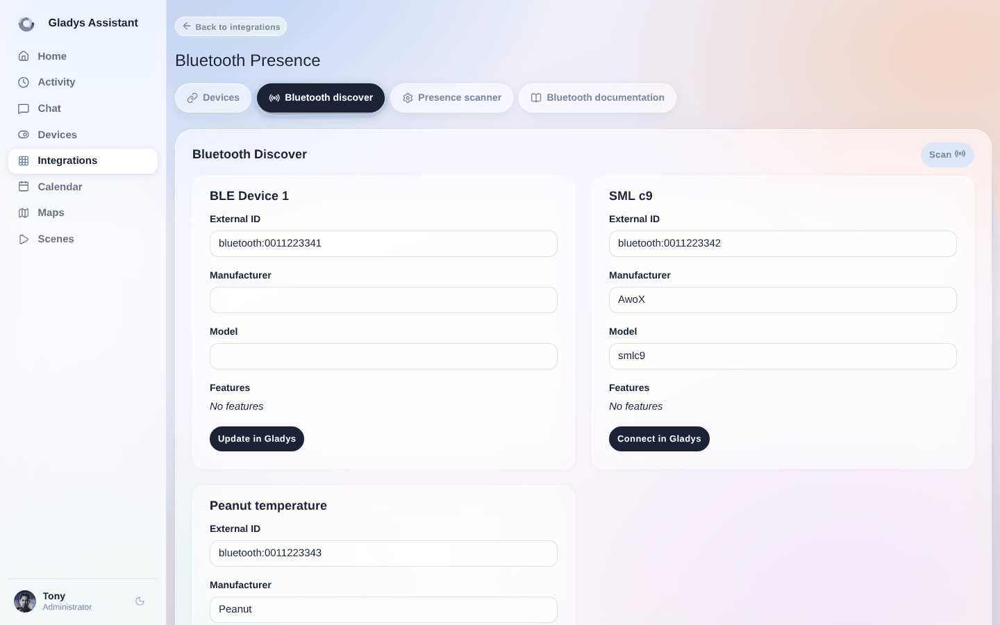
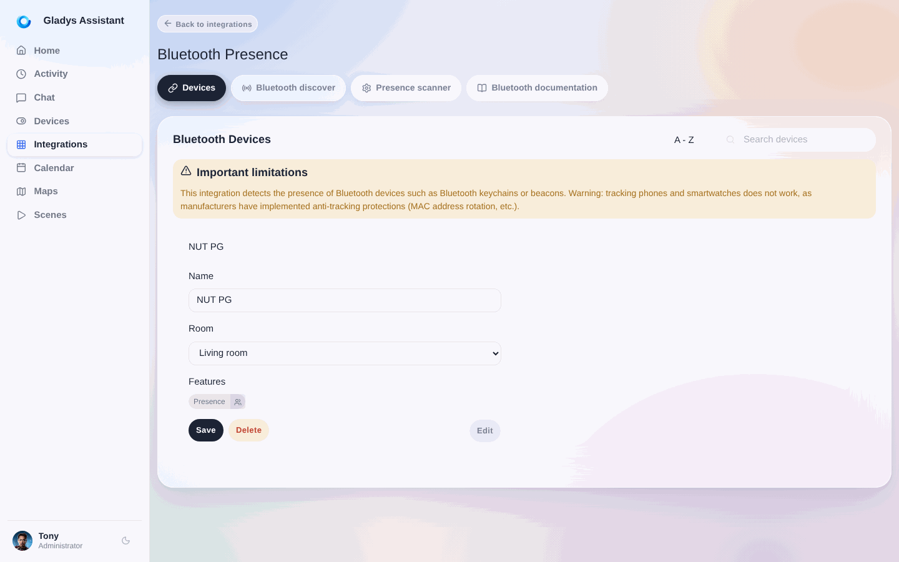
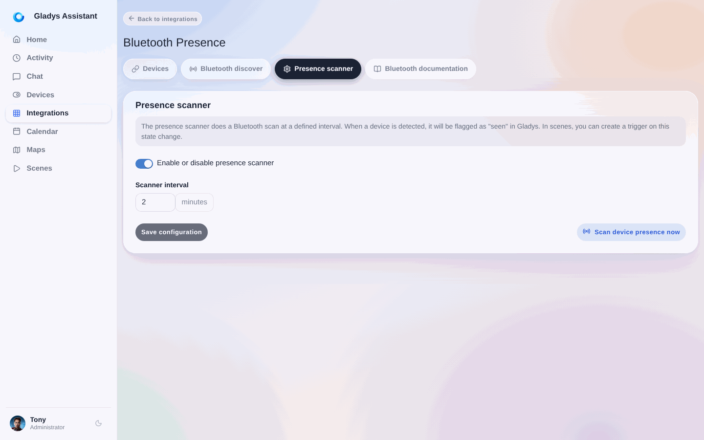
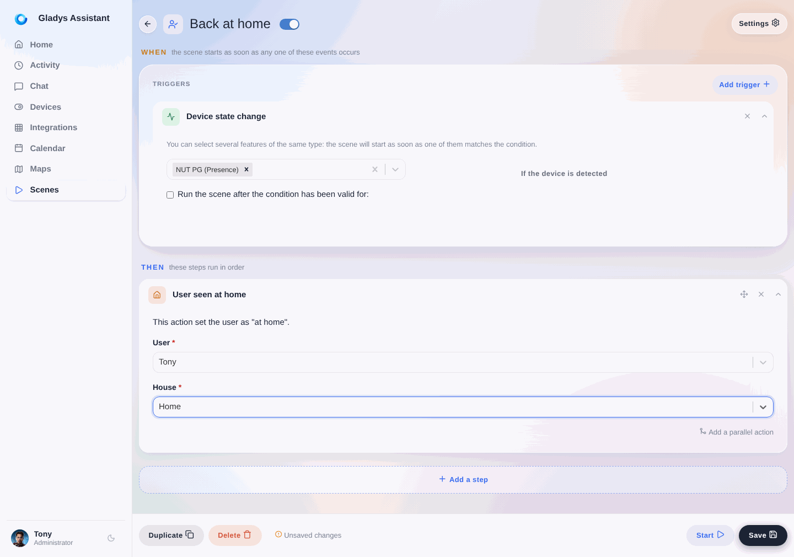
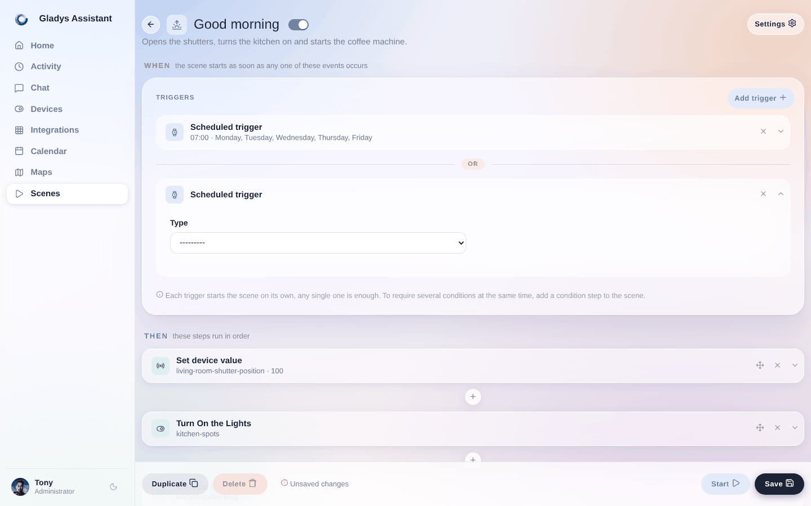
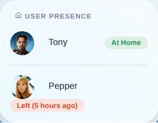

La integración Bluetooth es útil para la detección de presencia.

Existen llaveros Bluetooth como el [llavero NUT](https://www.amazon.com/gp/product/B08K3124JR/ref=as_li_qf_asin_il_tl?ie=UTF8&tag=gladproj-20&creative=9325&linkCode=as2&creativeASIN=B08K3124JR&linkId=5688d18164e92becabd17c6d49fdd778) que emiten su presencia de forma permanente por Bluetooth.

Con este tipo de llavero, Gladys puede detectar cuándo estás (o no estás) en casa, simplemente buscando los dispositivos Bluetooth cercanos.

:::note
Este truco no funciona con todos los dispositivos Bluetooth. Solo funciona con dispositivos Bluetooth que (1) emiten su señal de forma continua y (2) no ocultan su dirección Bluetooth. **La mayoría de los teléfonos no emiten su señal Bluetooth de forma continua**.

En general, cuanto más "tonto" sea el dispositivo, ¡mejor funciona! Por ejemplo, yo tenía una pulsera Fitbit Force 2 y funcionaba. En cambio, no funciona con un Apple Watch.
:::

## Configura tu dispositivo Bluetooth

Ve a la integración "Bluetooth", pestaña "Descubrimiento". Busca los dispositivos Bluetooth cercanos y encuentra el dispositivo que quieres añadir.

Haz clic en "Conectar a Gladys":

Después, activa la opción "Usar este dispositivo como sensor de presencia".

Dale a este dispositivo un nombre único y añádelo a Gladys.

Deberías llegar a esta pantalla:

Ahora, ve a la pantalla "Escáner de presencia" y comprueba que tu configuración se parece a esta:

¡Perfecto, todo está configurado en la parte Bluetooth!

## Gestionar la presencia en las escenas

### Una escena de "vuelta a casa"

Ahora vamos a crear una `escena` que marcará a un usuario como "presente en casa" cuando se detecte este llavero NUT (o cualquier otro dispositivo Bluetooth compatible).

Ve a la pestaña "Escenas" y crea una escena como esta:

La escena es muy sencilla.

CUANDO "se detecta el llavero" ENTONCES "marcar al usuario 'Tony' como presente en casa".

### Una escena de "salida de casa"

Para gestionar la salida del usuario de casa, te recomendamos crear una escena que se ejecute periódicamente y que compruebe si tu llavero NUT se ha detectado recientemente en casa.

Si Gladys detecta la presencia del dispositivo, no hará nada. Si no, Gladys marcará al usuario como ausente.

La escena debería verse así:

Puedes ajustar los parámetros para adaptarlos a tu casa. Si te parece que 10 minutos es demasiado poco para marcarte como ausente, puedes ampliarlo a 20 minutos para evitar "falsos positivos" 😀

## Mostrar la presencia en el panel de control

Puedes mostrar la presencia de los usuarios seleccionados en el panel de control. Para ello, puedes usar el widget "Usuarios presentes":

