import JsonLd from '@site/src/components/seo/JsonLd';

CalDAV es un estándar abierto que permite a las aplicaciones leer y sincronizar eventos de calendario desde un servidor de calendarios. La mayoría de los servicios de calendario lo admiten, como iCloud, Google Calendar, Synology Calendar y Nextcloud, por eso es una forma práctica e independiente del fabricante de llevar tu calendario actual a otra aplicación.

En Gladys, usas CalDAV para sincronizar tu calendario con estos servicios externos. Una vez que tus eventos están en Gladys, puedes usarlos para activar [escenas](/es/docs/scenes/intro/): encender la calefacción antes de una reunión, enviar un recordatorio cuando empieza un evento o cambiar el modo de tu casa cuando estás de vacaciones.

La mayoría de los servicios requieren una contraseña específica de aplicación en lugar de la contraseña principal de tu cuenta. Los pasos siguientes te muestran, para cada servicio, cómo generarla y dónde pegarla.

## Servicios disponibles (probados y otros)

1. [iCloud](#icloud)
2. [Google Calendar](#google-calendar)
3. [Synology Calendar](#synology-calendar)
4. [Nextcloud](#nextcloud)
5. [Otros](#others)

### iCloud {/* #icloud */}

Inicia sesión en tu cuenta de Apple: [https://appleid.apple.com](https://appleid.apple.com)

Haz clic en "Generar contraseña".

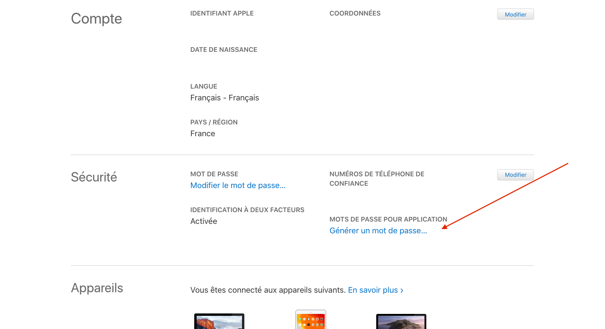

Escribe un nombre para tu contraseña, por ejemplo "Gladys".

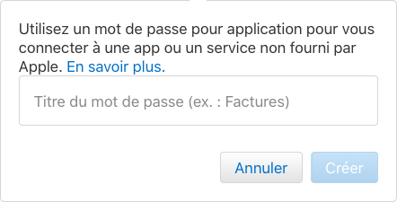

Anota la contraseña generada.

En el panel de control de Gladys, ve a la página de configuración de CalDAV.

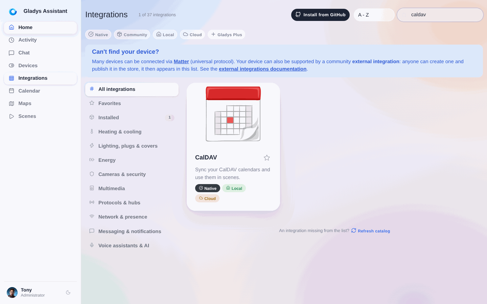

1. Elige "Calendario de iCloud"
2. Deja la URL predeterminada
3. Escribe tu Apple ID (debe ser la dirección de correo electrónico asociada a tu cuenta de Apple)
4. Pega aquí la contraseña generada anteriormente

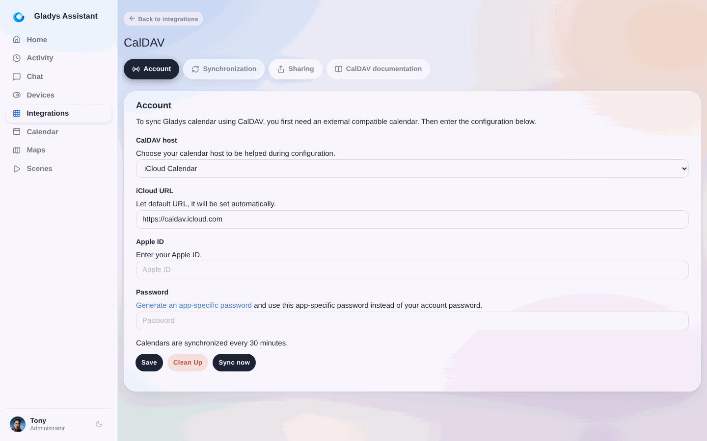

Haz clic en "Guardar".

Si aparece un mensaje de confirmación, Gladys sincronizará tu calendario. Si aparece un error, revisa los pasos anteriores e inténtalo de nuevo.

### Google Calendar {/* #google-calendar */}

Inicia sesión en tu cuenta de Google: [https://myaccount.google.com/](https://myaccount.google.com/)

Ve a la sección "Seguridad" y haz clic en "Contraseñas de aplicaciones".

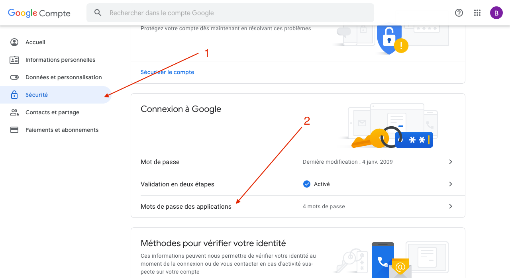

1. Selecciona "Calendario" como aplicación
2. Selecciona "Otro" como dispositivo
3. Una vez introducido el nombre de la aplicación (por ejemplo "Gladys"), haz clic en "Generar" y anota la contraseña generada.

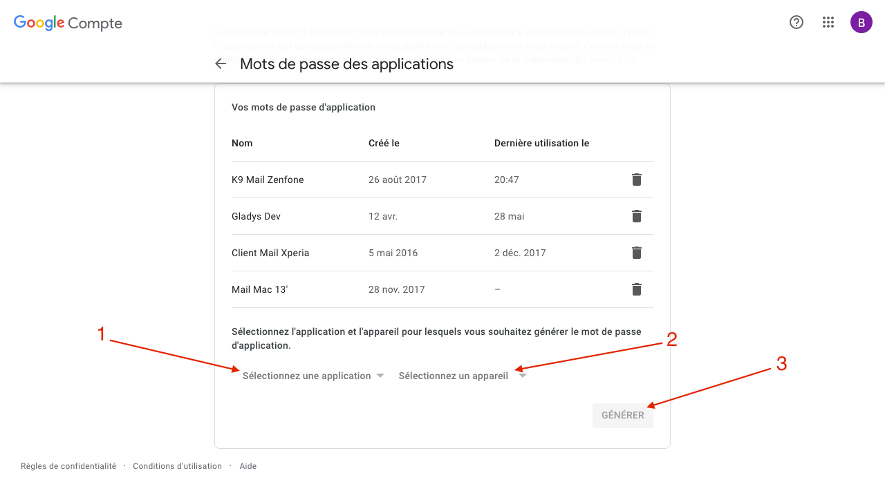

En el panel de control de Gladys, ve a la página de configuración de CalDAV (pestaña Integraciones > Calendario).

1. Elige "Google Calendar"
2. Deja la URL predeterminada
3. Escribe tu dirección de correo electrónico de Google
4. Pega aquí la contraseña generada anteriormente

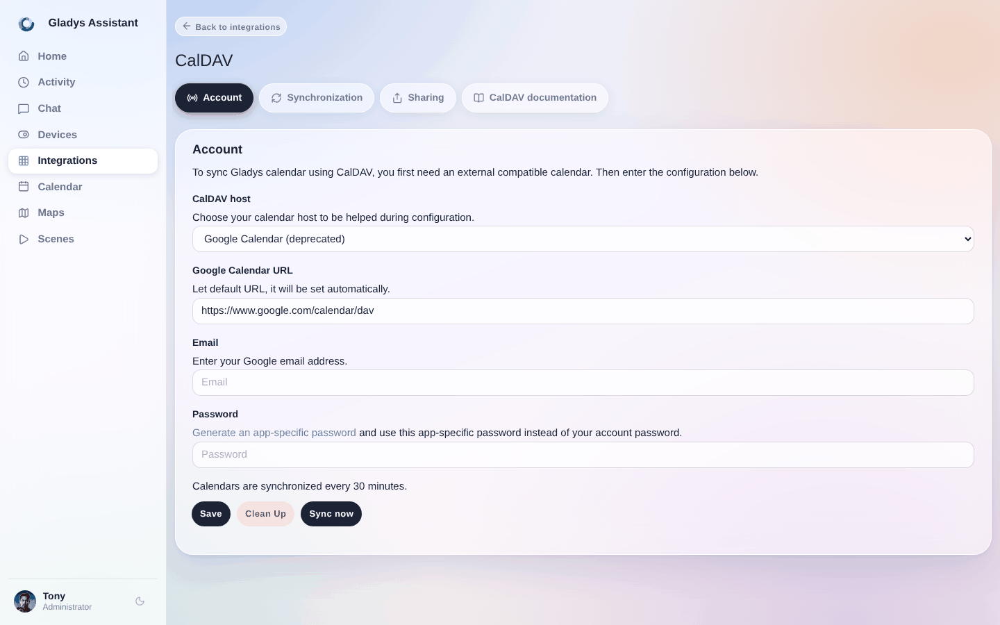

Haz clic en "Guardar". Si aparece un mensaje de confirmación, Gladys sincronizará tu calendario. Si aparece un error, revisa los pasos anteriores e inténtalo de nuevo.

### Synology Calendar {/* #synology-calendar */}

En tu Synology, abre la aplicación "Calendar".

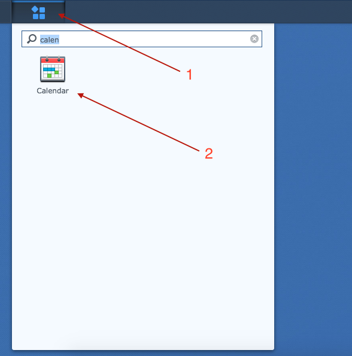

1. Junto a tu calendario, haz clic en el pequeño triángulo
2. Luego haz clic en "Cuenta CalDAV"

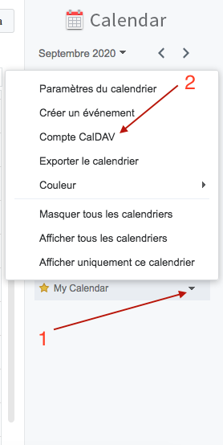

Copia la URL de "macOS / iOS".

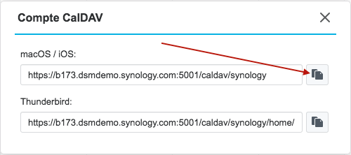

En el panel de control de Gladys, ve a la página de configuración de CalDAV (pestaña Integraciones > Calendario).

1. Elige "Synology Calendar"
2. Pega aquí la URL que copiaste anteriormente
3. Escribe tu nombre de usuario de Synology
4. Escribe aquí tu contraseña de Synology

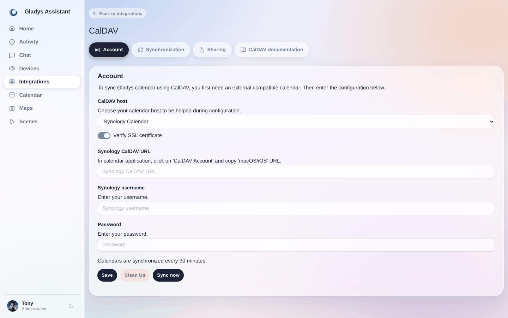

Haz clic en "Guardar".

Si aparece un mensaje de confirmación, Gladys sincronizará tu calendario. Si aparece un error, revisa los pasos anteriores e inténtalo de nuevo.

### Nextcloud {/* #nextcloud */}

1. En tu instancia de Nextcloud, ve a la página de configuración y haz clic en la pestaña "Seguridad"
2. En la parte inferior, escribe "Gladys" y haz clic en "Crear nueva contraseña de aplicación"

Anota la contraseña generada.

En la aplicación Calendario, haz clic en "Ajustes e importación".

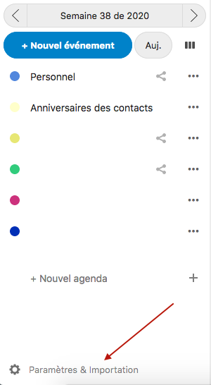

Luego en "Copiar la dirección CalDAV principal".

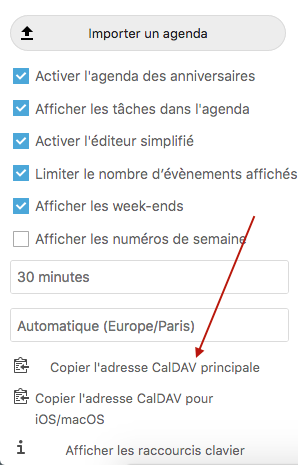

En el panel de control de Gladys, ve a la página de configuración de CalDAV (pestaña Integraciones > Calendario).

1. Elige "Otro"
2. Pega aquí la URL que copiaste anteriormente
3. Escribe tu nombre de usuario de Nextcloud
4. Pega aquí la contraseña generada anteriormente

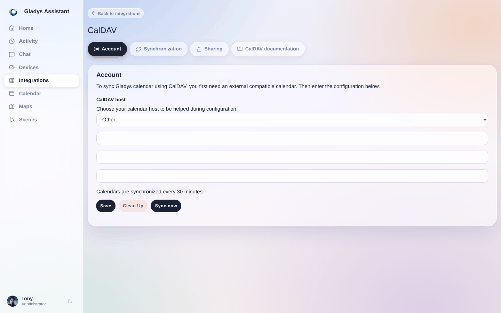

Haz clic en "Guardar".

Si aparece un mensaje de confirmación, Gladys sincronizará tu calendario. Si aparece un error, revisa los pasos anteriores e inténtalo de nuevo.

### Otros {/* #others */}

Para todos los demás servicios:

1. Introduce aquí la URL de CalDAV
2. Introduce aquí tu nombre de usuario o tu dirección de correo electrónico
3. Después introduce tu contraseña (si es necesario)

## Preguntas frecuentes

### ¿Qué es CalDAV?

CalDAV es un estándar abierto, basado en WebDAV, que permite a las aplicaciones acceder a los datos de calendario de un servidor de calendarios y sincronizarlos. Lo admiten la mayoría de los proveedores de calendarios, de modo que una aplicación como Gladys puede leer tus eventos de iCloud, Google Calendar, Synology o Nextcloud sin necesidad de una integración específica para cada servicio.

### ¿Necesito la contraseña de mi cuenta o una contraseña de aplicación?

En la mayoría de los servicios necesitas una contraseña específica de aplicación, no la contraseña principal de tu cuenta. iCloud, Google y Nextcloud te permiten generar una contraseña dedicada para Gladys desde sus ajustes de seguridad, que puedes revocar en cualquier momento sin cambiar tu contraseña principal. Los pasos de configuración anteriores te muestran dónde generarla para cada servicio.

### ¿Cómo conecto Google Calendar mediante CalDAV?

Inicia sesión en tu cuenta de Google, abre los ajustes de seguridad y crea una contraseña de aplicación para "Calendario". Después, en Gladys, ve a la página de configuración de CalDAV, elige "Google Calendar", deja la URL predeterminada, introduce tu correo electrónico de Google y pega la contraseña de aplicación generada. Gladys sincronizará tus eventos.

### ¿Cómo conecto mi calendario de iCloud?

Inicia sesión en appleid.apple.com y genera una contraseña específica de aplicación. En Gladys, abre la página de configuración de CalDAV, elige "Calendario de iCloud", deja la URL predeterminada, introduce el correo electrónico de tu Apple ID y pega la contraseña. Si la contraseña no funciona, asegúrate de haber generado una contraseña específica de aplicación y de no estar usando tu contraseña normal del Apple ID.

### ¿Puedo usar CalDAV con cualquier otro servicio de calendario?

Sí. Si tu servicio admite CalDAV, elige "Otro" en Gladys e introduce su URL de CalDAV, tu nombre de usuario o correo electrónico y tu contraseña. Esto incluye servidores autoalojados como Baïkal o Radicale, y la mayoría de los proveedores que ofrecen un endpoint CalDAV.

<JsonLd
  data={{
    "@context": "https://schema.org",
    "@type": "FAQPage",
    mainEntity: [
      {
        "@type": "Question",
        name: "¿Qué es CalDAV?",
        acceptedAnswer: {
          "@type": "Answer",
          text: "CalDAV es un estándar abierto, basado en WebDAV, que permite a las aplicaciones acceder a los datos de calendario de un servidor de calendarios y sincronizarlos. Lo admiten la mayoría de los proveedores de calendarios, de modo que una aplicación como Gladys puede leer tus eventos de iCloud, Google Calendar, Synology o Nextcloud sin necesidad de una integración específica para cada servicio.",
        },
      },
      {
        "@type": "Question",
        name: "¿Necesito la contraseña de mi cuenta o una contraseña de aplicación para CalDAV?",
        acceptedAnswer: {
          "@type": "Answer",
          text: "En la mayoría de los servicios necesitas una contraseña específica de aplicación, no la contraseña principal de tu cuenta. iCloud, Google y Nextcloud te permiten generar una contraseña dedicada para Gladys desde sus ajustes de seguridad, que puedes revocar en cualquier momento sin cambiar tu contraseña principal.",
        },
      },
      {
        "@type": "Question",
        name: "¿Cómo conecto Google Calendar mediante CalDAV?",
        acceptedAnswer: {
          "@type": "Answer",
          text: "Inicia sesión en tu cuenta de Google, abre los ajustes de seguridad y crea una contraseña de aplicación para Calendario. Después, en Gladys, ve a la página de configuración de CalDAV, elige Google Calendar, deja la URL predeterminada, introduce tu correo electrónico de Google y pega la contraseña de aplicación generada. Gladys sincronizará tus eventos.",
        },
      },
      {
        "@type": "Question",
        name: "¿Cómo conecto mi calendario de iCloud mediante CalDAV?",
        acceptedAnswer: {
          "@type": "Answer",
          text: "Inicia sesión en appleid.apple.com y genera una contraseña específica de aplicación. En Gladys, abre la página de configuración de CalDAV, elige Calendario de iCloud, deja la URL predeterminada, introduce el correo electrónico de tu Apple ID y pega la contraseña. Si no funciona, asegúrate de haber generado una contraseña específica de aplicación y de no estar usando tu contraseña normal del Apple ID.",
        },
      },
      {
        "@type": "Question",
        name: "¿Puedo usar CalDAV con cualquier otro servicio de calendario?",
        acceptedAnswer: {
          "@type": "Answer",
          text: "Sí. Si tu servicio admite CalDAV, elige Otro en Gladys e introduce su URL de CalDAV, tu nombre de usuario o correo electrónico y tu contraseña. Esto incluye servidores autoalojados como Baikal o Radicale, y la mayoría de los proveedores que ofrecen un endpoint CalDAV.",
        },
      },
    ],
  }}
/>
