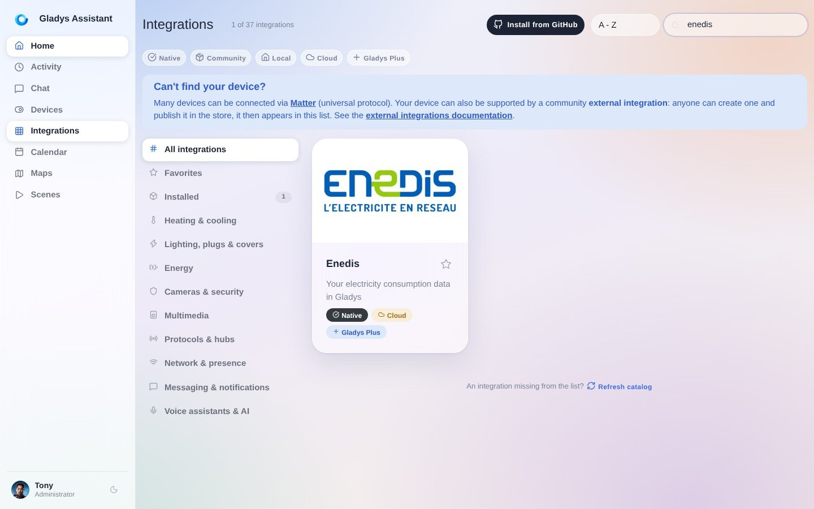
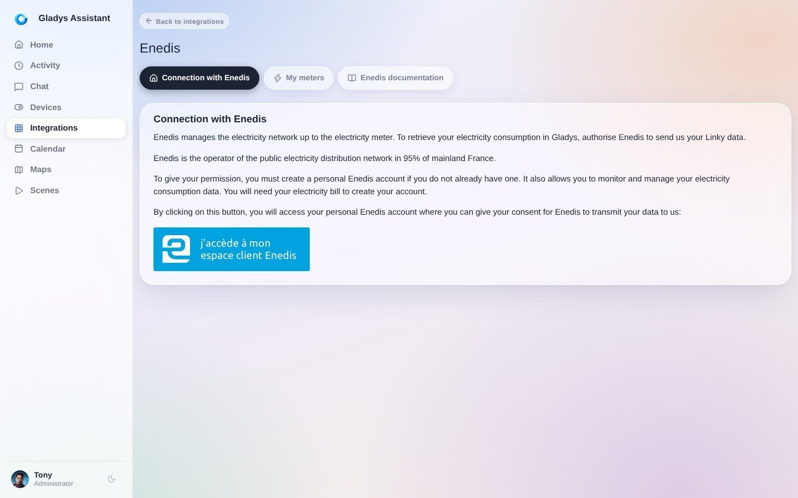
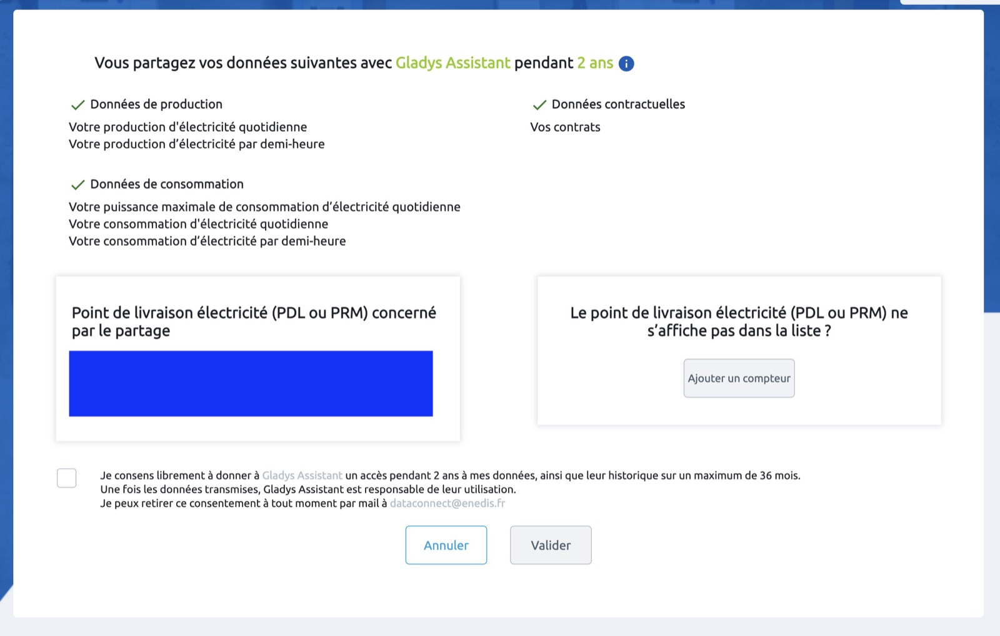
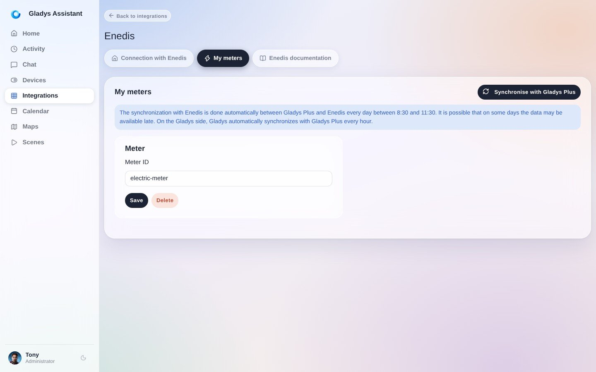
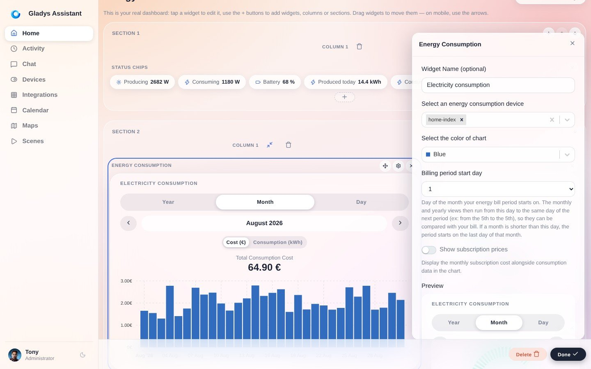
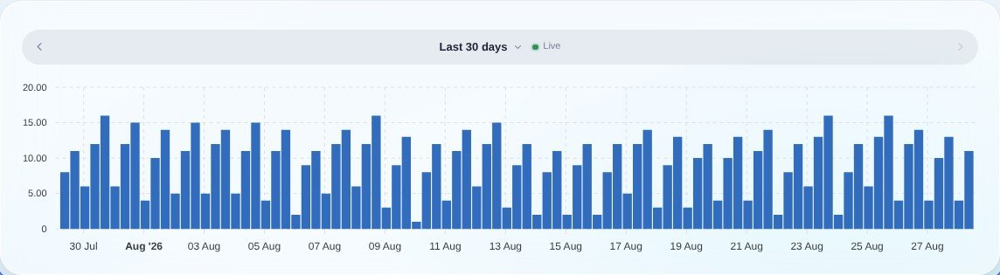

import JsonLd from '@site/src/components/seo/JsonLd';

Enedis es la empresa que gestiona la red de distribución eléctrica francesa y la que instala los contadores inteligentes Linky en los hogares. Enedis ofrece una API, llamada Data Connect, que permite recuperar los datos de consumo eléctrico medidos por tu contador Linky.

El problema: esta API solo está abierta a empresas, tras firmar un contrato y superar un proceso de certificación. Como particular, no puedes solicitar acceso directo a la API de Enedis.

Aquí es donde Gladys te ayuda. Tenemos una entidad jurídica, "Gladys Assistant SAS", que está certificada para acceder a la API Data Connect de Enedis y autorizada para ponerla a disposición de los particulares. Así que con Gladys puedes seguir tu consumo Linky a través de la API oficial de Enedis, sin tener que gestionar tú mismo una empresa.

Esta integración está disponible a través de [Gladys Plus](/es/plus). Una vez conectada, tu consumo diario se recupera automáticamente y se guarda en tu propia instancia de Gladys, de modo que conservas tu historial y puedes crear tus propios gráficos y [escenas](/es/docs/scenes/intro/) a partir de él.

:::note
Esta integración solo funciona en Francia, ya que se conecta a la API de Enedis, el operador de la red de distribución eléctrica francesa.
:::

## Conectarse a Enedis en Gladys

Ve a [plus.gladysassistant.com](https://plus.gladysassistant.com) y haz clic en la integración "Enedis":

Haz clic en el botón "Accedo a mi área de cliente de Enedis":

En la web de Enedis, acepta el consentimiento y haz clic en "Validar".

Deberías volver a Gladys, que se sincronizará con tu cuenta de Enedis.

La primera sincronización puede tardar un poco según la carga de la API de Enedis. Te aconsejo que salgas de Gladys y vuelvas más tarde 🙂

## Ver tu consumo eléctrico

En Gladys, encontrarás tu contador eléctrico en "Contadores":

En el panel de control, puedes crear un nuevo gráfico y seleccionar "Consumo diario":

Elige "Histograma" y deberías ver este gráfico en tu panel de control:

A partir de ahí, los datos se comportan como los de cualquier otro dispositivo de Gladys: puedes crear automatizaciones con ellos, recibir alertas cuando tu consumo sea inusualmente alto o cruzarlos con otros sensores. Combina muy bien con las funciones de [monitorización de la energía](/es/docs/integrations/energy-monitoring/).

## Preguntas frecuentes

### ¿Cómo accedo a la API de Enedis como particular?

La API Data Connect de Enedis no está abierta directamente a los particulares: Enedis solo firma contratos de API con empresas certificadas. La forma práctica de acceder a tus propios datos Linky a través de la API oficial, sin crear una empresa, es pasar por un proveedor certificado. Gladys Assistant SAS está certificada, así que con [Gladys Plus](/es/plus) conectas tu cuenta de Enedis una sola vez y Gladys recupera tu consumo por ti.

### ¿Es gratuita la API de Enedis?

Para los particulares, los datos en sí son gratuitos: simplemente autorizas el acceso a tus propios datos de consumo medidos por tu contador Linky. Lo que tiene un coste es el servicio que los recupera y los guarda. Con Gladys, la integración Enedis está incluida en [Gladys Plus](/es/plus).

### ¿Qué datos ofrece el contador Linky?

A través de Data Connect, puedes acceder a tu consumo diario y, según tu contrato, a tu curva de carga cada media hora, tu potencia máxima y los detalles de tu contrato. En Gladys, el consumo diario se recupera y se guarda para que puedas representarlo en gráficos por días, semanas y meses.

### ¿Puedo guardar mis datos Linky en local?

Sí. Una vez que Gladys recupera tu consumo de la API de Enedis, los datos se guardan en tu propia instancia de Gladys. Conservas todo tu historial aunque desconectes la integración más adelante, y puedes crear gráficos, escenas y alertas locales a partir de ellos.

### ¿No puedo dar el consentimiento a Enedis?

La plataforma de Enedis a veces está fuera de servicio por actualizaciones por parte de Enedis. A menudo, lo mejor es volver a intentarlo más tarde.

Si sigue sin funcionar, comprueba que tu cuenta de Enedis funciona: ¿puedes ver tus datos de consumo eléctrico en Enedis? Si no es así, probablemente el problema esté en Enedis.

### ¿Ya no tengo datos de los días anteriores?

En teoría, la API de Enedis se actualiza cada mañana.

Sin embargo, en la práctica los datos no siempre están disponibles a la misma hora, y algunos días (los festivos, por ejemplo) los datos no están disponibles.

Si aun así observas huecos en tu panel de control que persisten en el tiempo, publica un mensaje en [el foro](https://community.gladysassistant.com/).

### ¿La sincronización ya no se realiza?

Tu consentimiento es válido durante 2 años y debe renovarse si quieres que Gladys siga recuperando tus datos.

Si tu cuenta ya no se sincroniza, ante la duda te aconsejo que renueves tu consentimiento haciendo clic en el botón azul "Accedo a mi área de cliente de Enedis".

<JsonLd
  data={{
    "@context": "https://schema.org",
    "@type": "FAQPage",
    mainEntity: [
      {
        "@type": "Question",
        name: "¿Cómo accedo a la API de Enedis como particular?",
        acceptedAnswer: {
          "@type": "Answer",
          text: "La API Data Connect de Enedis no está abierta directamente a los particulares: Enedis solo firma contratos de API con empresas certificadas. Para acceder a tus propios datos Linky a través de la API oficial sin crear una empresa, pasas por un proveedor certificado. Gladys Assistant SAS está certificada, así que con Gladys Plus conectas tu cuenta de Enedis una sola vez y Gladys recupera tu consumo por ti.",
        },
      },
      {
        "@type": "Question",
        name: "¿Es gratuita la API de Enedis?",
        acceptedAnswer: {
          "@type": "Answer",
          text: "Para los particulares, los datos en sí son gratuitos: autorizas el acceso a tu propio consumo medido por tu contador Linky. Lo que tiene un coste es el servicio que los recupera y los guarda. Con Gladys, la integración Enedis está incluida en Gladys Plus.",
        },
      },
      {
        "@type": "Question",
        name: "¿Qué datos ofrece el contador Linky?",
        acceptedAnswer: {
          "@type": "Answer",
          text: "A través de Data Connect puedes acceder a tu consumo diario y, según tu contrato, a tu curva de carga cada media hora, tu potencia máxima y los detalles de tu contrato. En Gladys, el consumo diario se recupera y se guarda para que puedas representarlo en gráficos por días, semanas y meses.",
        },
      },
      {
        "@type": "Question",
        name: "¿Puedo guardar mis datos Linky en local?",
        acceptedAnswer: {
          "@type": "Answer",
          text: "Sí. Una vez que Gladys recupera tu consumo de la API de Enedis, los datos se guardan en tu propia instancia de Gladys. Conservas todo tu historial aunque desconectes la integración más adelante, y puedes crear gráficos, escenas y alertas locales a partir de ellos.",
        },
      },
    ],
  }}
/>
