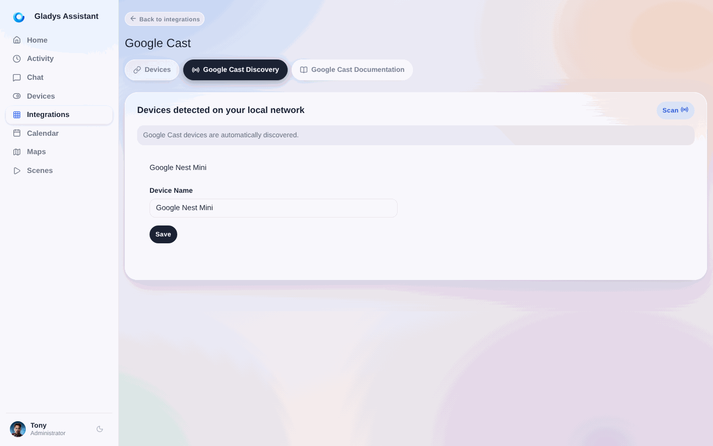
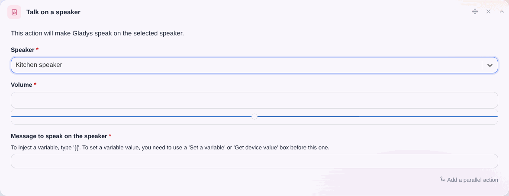

Gladys Assistant puede reproducir mensajes de voz en un altavoz de Google o en cualquier otro dispositivo compatible con Google Cast.

## Añadir un altavoz de Google a Gladys Assistant

1. Ve a la integración **Google Cast** en la interfaz de Gladys.
2. Abre la pestaña **Descubrimiento Google Cast**: los dispositivos compatibles de tu red deberían aparecer automáticamente.

3. Selecciona tu dispositivo y haz clic en **Guardar**.
4. Después, ve a la pestaña **Dispositivos** y asigna el altavoz a la habitación correspondiente.

## Hacer que Gladys Assistant hable en un altavoz

Una vez añadido el altavoz, puedes usarlo en una escena con la acción **Hablar en un altavoz**:

### Nota importante

:::note
Esta función requiere una suscripción a **Gladys Plus**, ya que se basa en una API de síntesis de voz (Text-to-Speech, TTS) basada en IA, que es un servicio de pago.

En el futuro nos gustaría ofrecer una solución totalmente local, pero actualmente no existen alternativas de calidad para la síntesis de voz en francés que funcionen sin conexión.
:::
