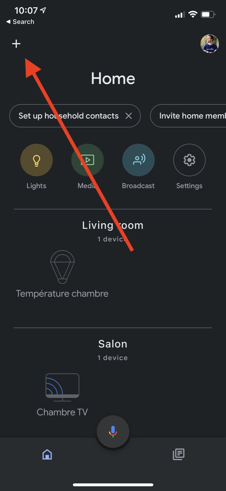
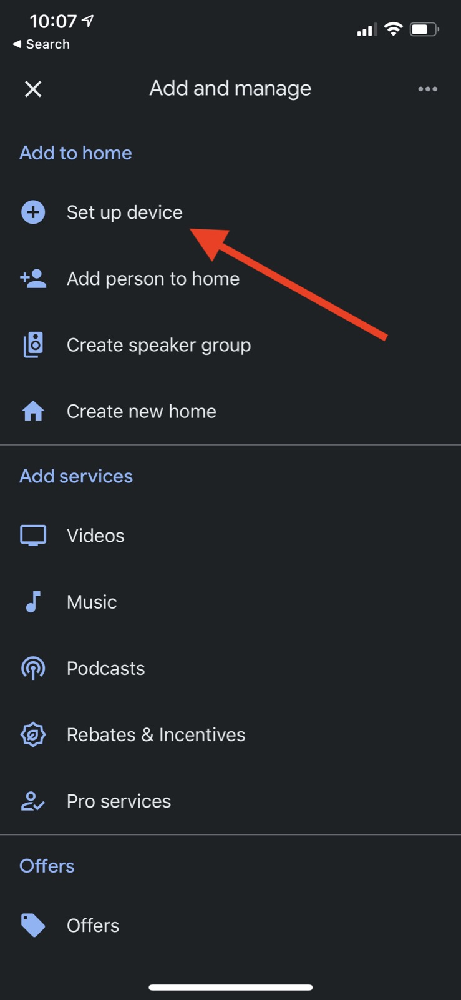
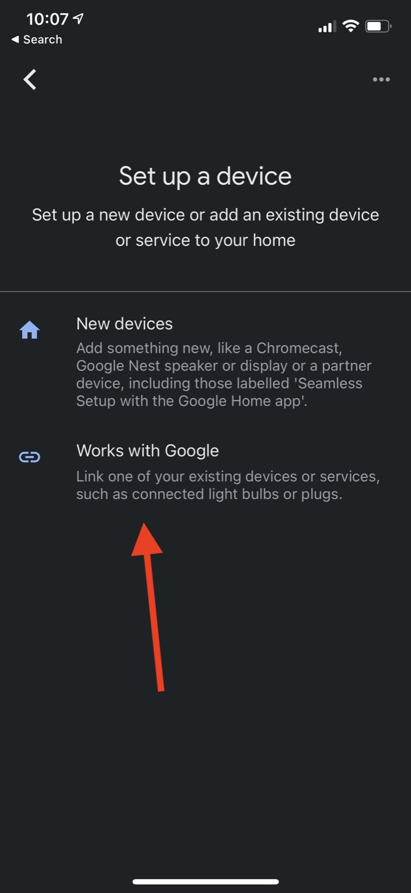
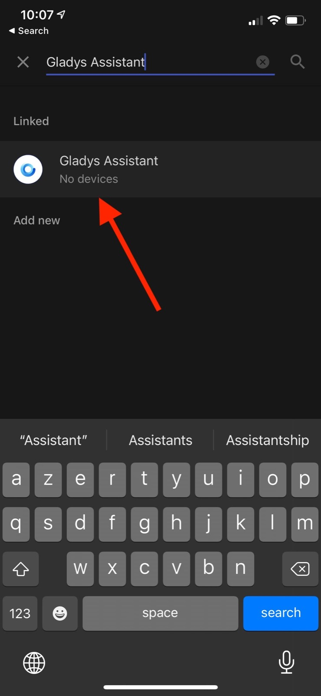
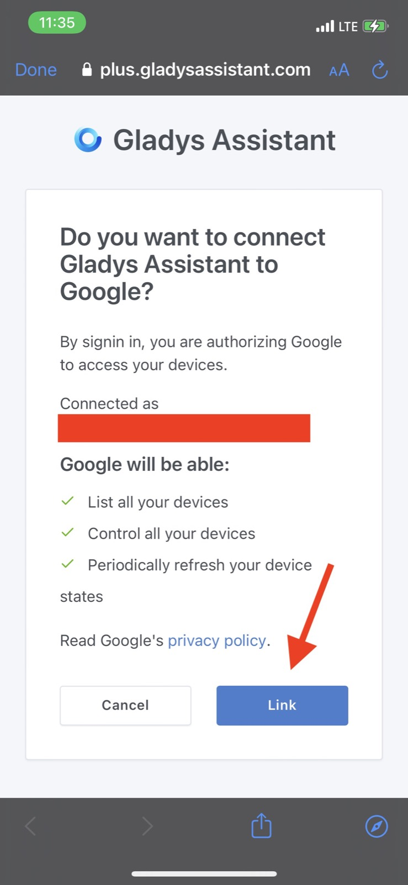

Puedes controlar los dispositivos de Gladys con Google Home gracias a [Gladys Plus](/es/plus), nuestro servicio de pasarela en línea.

Google Home es una integración particular, porque Google Home funciona exclusivamente en la nube. Esto significa que tenemos un control muy limitado sobre lo que podemos y no podemos hacer (por desgracia).

Para convertirnos en socios de Google Home, tuvimos que:

- Superar una serie de tests automatizados por parte de Google
- Superar una revisión manual del equipo de Google
- Completar un proceso de certificación de Google Home

No es un proceso sencillo, por lo que no es realista que todos nuestros usuarios lo hagan por su cuenta. Es un proceso pensado para profesionales y empresas, y por eso ofrecemos esta integración exclusivamente en Gladys Plus.

## Crear una cuenta de Gladys Plus

Para unirte a Gladys Plus, ve a la [página dedicada](/es/plus) e introduce tu correo electrónico.

Hay una prueba gratuita de 14 días, así que puedes probar nuestra integración con Google Home sin coste.

## Configurar Gladys Plus

Gladys Plus debe estar completamente configurado antes de poder usar la integración con Google Home.

Te recomendamos seguir los pasos que recibiste por correo electrónico para configurar Gladys Plus.

Al final, deberías poder conectarte a [plus.gladysassistant.com](https://plus.gladysassistant.com) sin ningún problema.

Una vez que hayas iniciado sesión correctamente en Gladys Plus, ¡ya puedes configurar Google Home!

## Configurar Google Home

Primero, abre la app Google Home en tu teléfono (disponible para iOS/Android).

En la pantalla de inicio, pulsa el "+" de la esquina superior izquierda:

Después pulsa el botón "Configurar dispositivo":

A continuación, pulsa "Funciona con Google":

Por último, busca "Gladys Assistant":

Al pulsarlo, se te pedirá que te conectes con tu cuenta de Gladys Plus.

Introduce tus credenciales de Gladys Plus y tu código 2FA; al final deberías ver esta pantalla:

Pulsa "Vincular". Ya está todo listo.

Ahora deberías ver tus dispositivos en Google Home.

## Dispositivos compatibles

Por ahora, solo:

- Luces (encendido/apagado / color / brillo)
- Interruptores (encendido/apagado)

Se irán añadiendo más compatibilidades según las peticiones. No dudes en enviarnos tus sugerencias de funcionalidades en [el foro](https://community.gladysassistant.com/).
