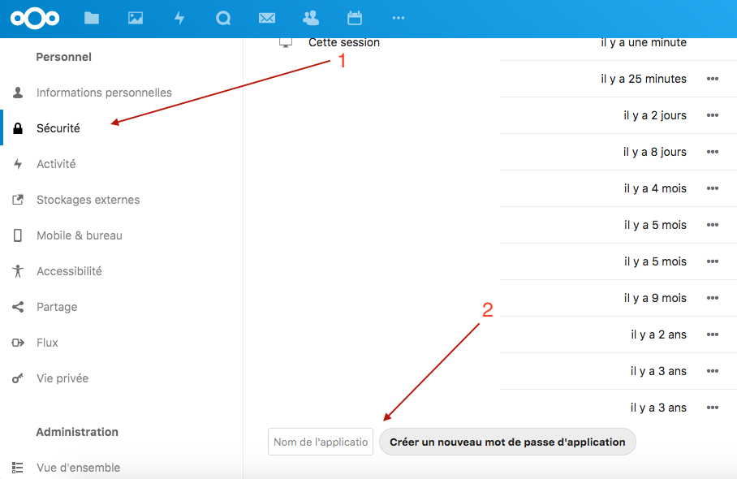
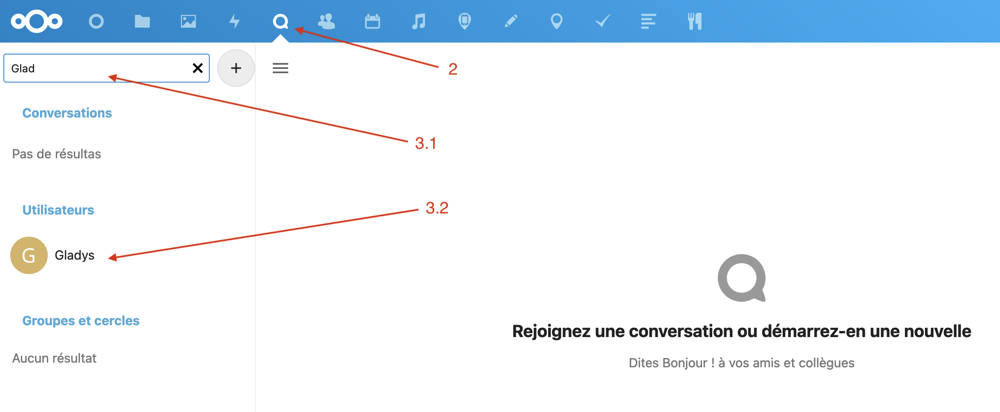
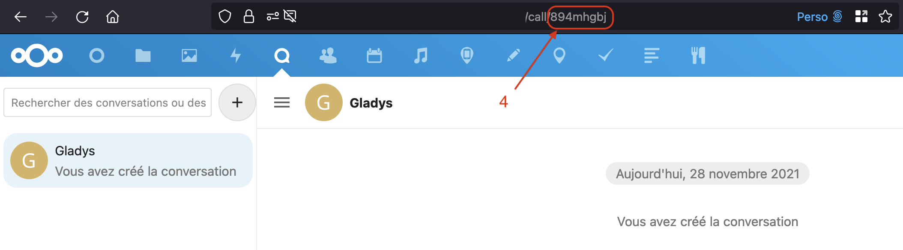
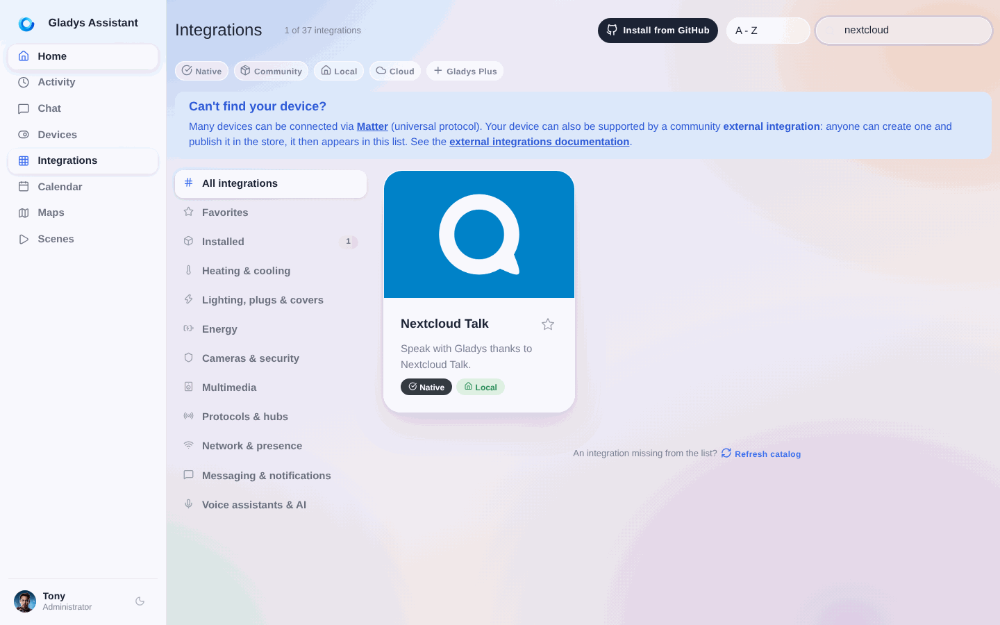
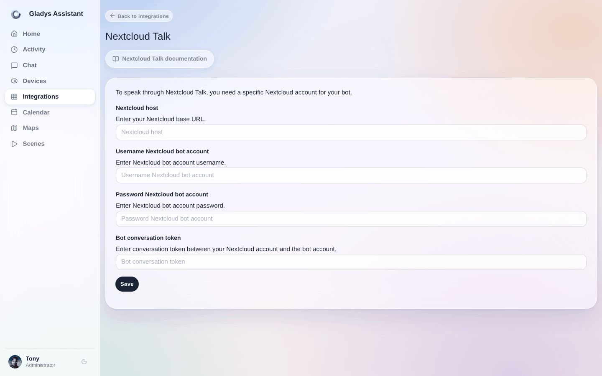

Esta integración te permite usar la aplicación [Talk](https://nextcloud.com/talk/) de Nextcloud para hablar con Gladys.

Disponible en Android, iOS y web, te permitirá comunicarte con Gladys Assistant dándole instrucciones, recibiendo información o respondiendo a sus preguntas...

## Cuenta de Nextcloud para tu bot

Los bots no existen de forma nativa en Nextcloud Talk. Es necesario crear una cuenta de Nextcloud para tu bot.

En Nextcloud, inicia sesión con la cuenta de tu bot:
1. Ve a la página de configuración y haz clic en la pestaña "Seguridad"
2. En la parte inferior, escribe "Gladys" y haz clic en "Crear nueva contraseña de aplicación"

Anota la contraseña generada

## Obtén el token de tu conversación

Para indicar qué conversación de Nextcloud Talk debe escuchar Gladys:
1. Desde un **navegador**, con tu **cuenta personal** de Nextcloud
2. Ve a la aplicación Talk
3. Inicia una conversación con la cuenta de tu bot

4. Anota el token, lo encontrarás en la URL de la conversación

## Introduce la configuración completa del bot de Nextcloud Talk en Gladys Assistant

Ve a "Integraciones" -> "Nextcloud Talk".

1. Introduce la URL base de tu instancia de Nextcloud
2. Introduce el nombre de usuario de la cuenta de Nextcloud de tu bot
3. Pega aquí la contraseña generada anteriormente
4. Pega el token de la conversación

Haz clic en "Guardar".

## Primera conversación entre Nextcloud Talk y Gladys Assistant

En la aplicación web o móvil de Nextcloud, escribe tu primer mensaje para Gladys Assistant, por ejemplo: "Enciende la luz de la cocina".

Espera un poco y ......... ¡¡¡magia!!!

¡Tu asistente te responde! Con [Gladys Plus](/es/plus/), la IA integrada entiende el lenguaje natural. Consulta la [documentación de la integración de IA](/es/docs/integrations/openai).
