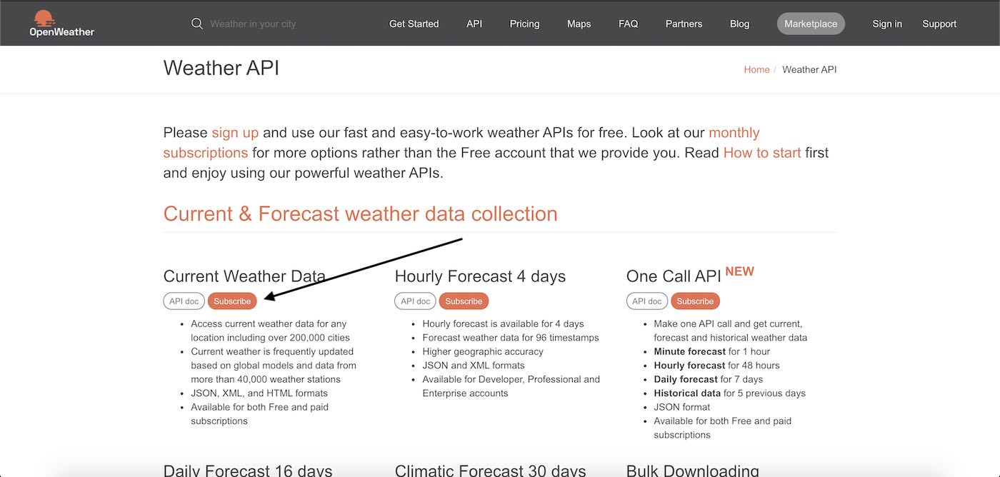
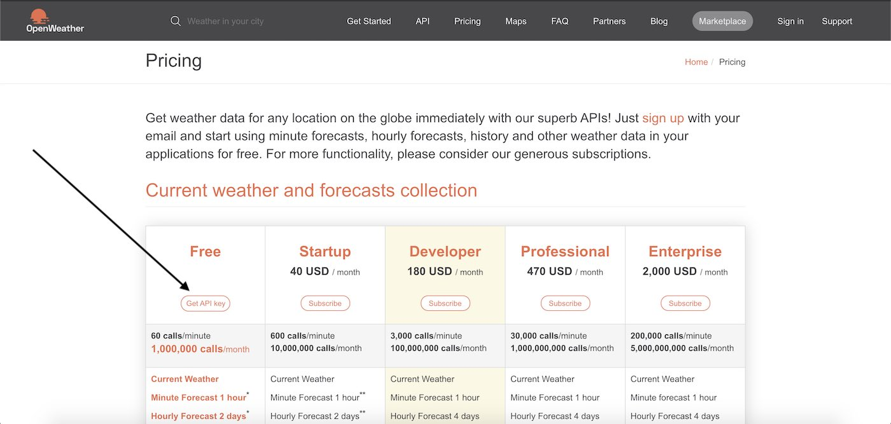
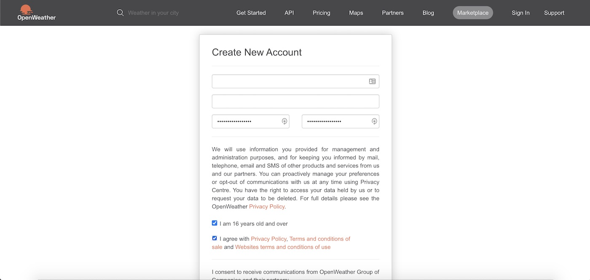
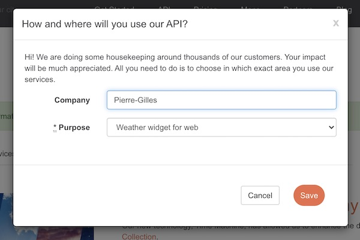
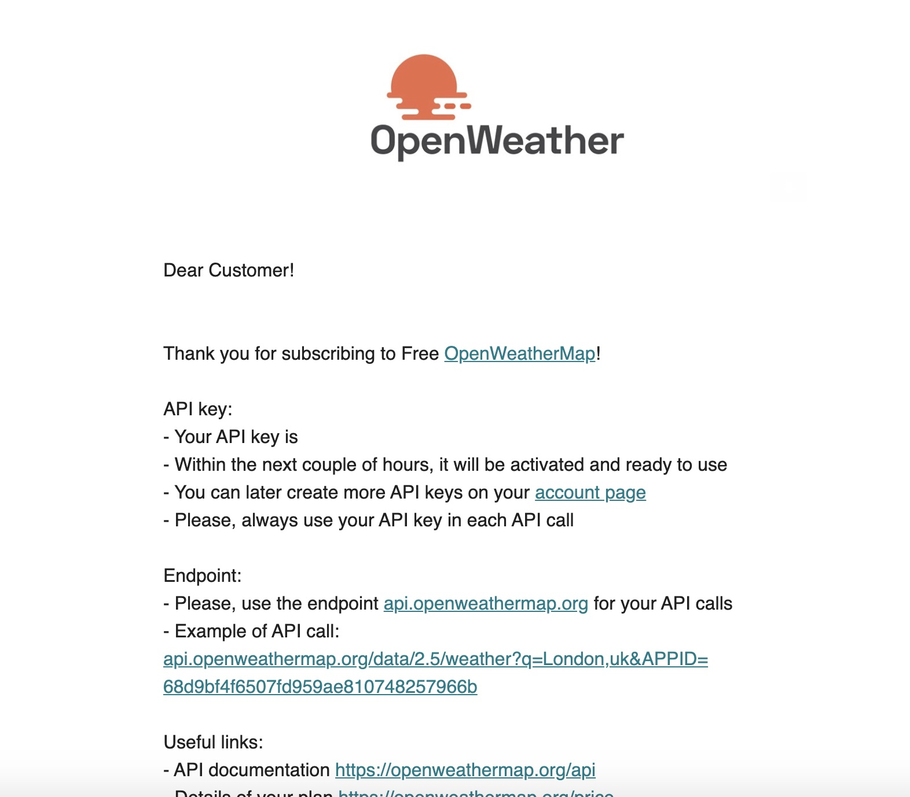
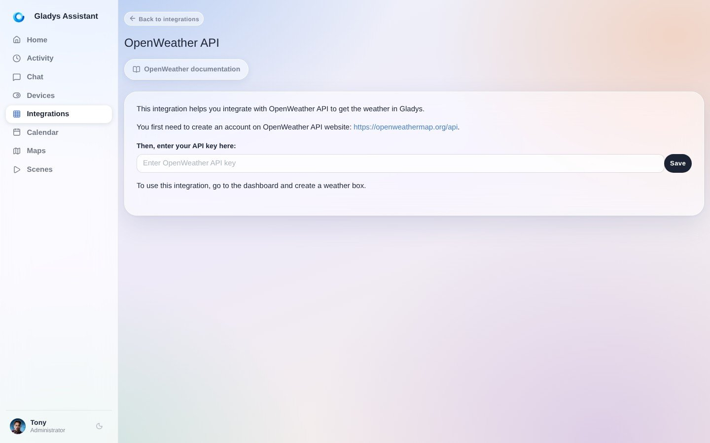
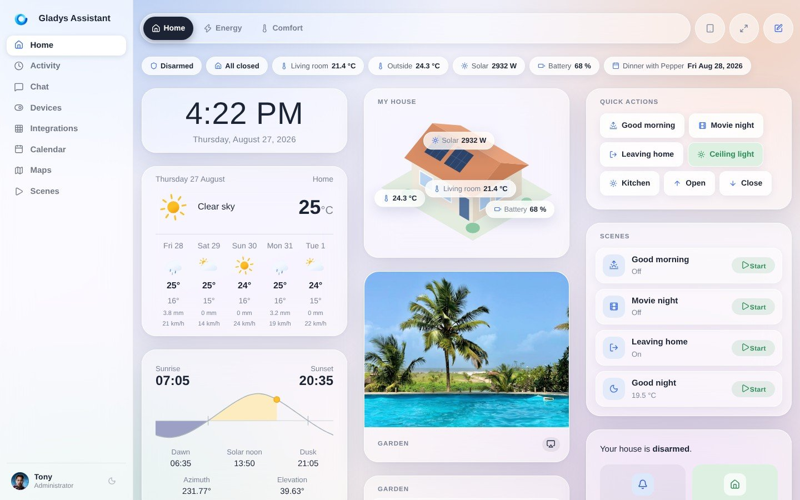
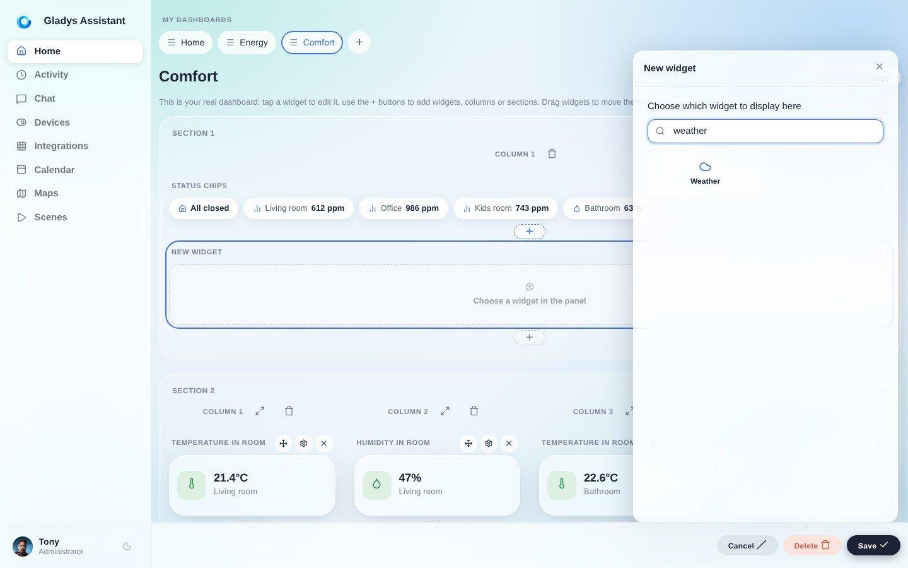
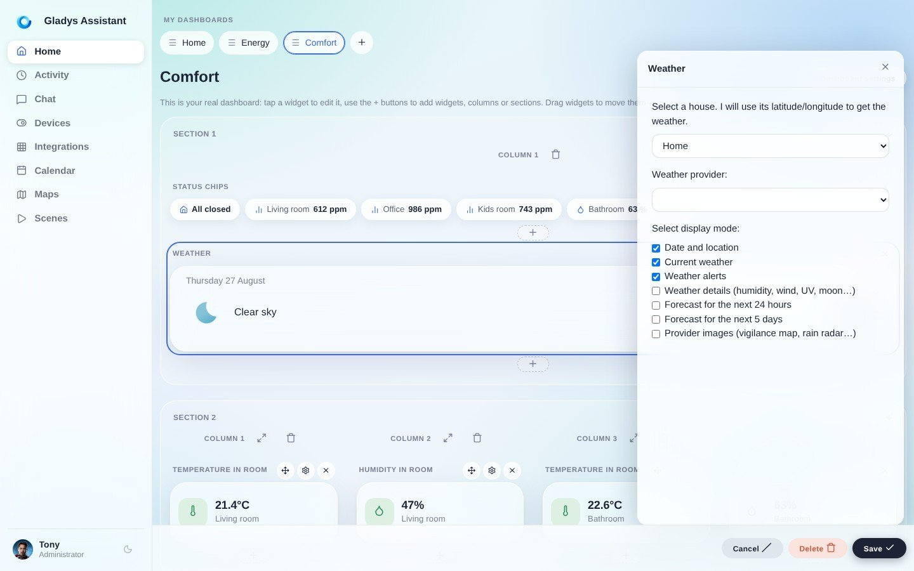
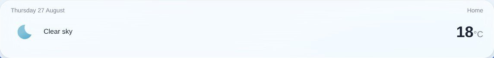

Esta integración te permite mostrar la previsión meteorológica en Gladys Assistant.

:::info[Desde Gladys 4.85, el tiempo también puede venir de una integración externa]

Los proveedores meteorológicos ahora pueden crearse como [integraciones externas](/es/docs/integrations/external/), que admiten cualquier proveedor (Météo France, Open-Meteo, AccuWeather…) y son compatibles con las alertas meteorológicas, las imágenes del proveedor y los desencadenadores de escena de alertas meteorológicas. Al instalar una, esta tiene prioridad automáticamente sobre este servicio OpenWeather integrado, por lo que ahora aparece marcado como obsoleto en el catálogo.

:::

## Crear una cuenta en OpenWeather

Para configurar OpenWeather, ve primero a [https://openweathermap.org/api](https://openweathermap.org/api).

Haz clic en "Subscribe" debajo de "Current Weather Data".

Después, haz clic en "Get API key"

Introduce tus datos para crear una cuenta.

Rellena esta ventana como quieras. Con tu nombre basta :)

Confirma tu correo electrónico y recibirás otro correo con tu clave API.

Esta clave API no es válida inmediatamente, **tendrás que esperar un poco**.

## Introducir la clave API en Gladys Assistant

Ve a "Integraciones" -> "OpenWeather". Introduce tu clave API y haz clic en "Guardar".

## Añadir un widget del tiempo al panel de control

Ve al panel de control y haz clic en "Editar".

Añade un widget del tiempo.

Selecciona tu casa. Se usarán la latitud y la longitud de tu casa para obtener el tiempo.

Haz clic en "Guardar".

¡Listo!

