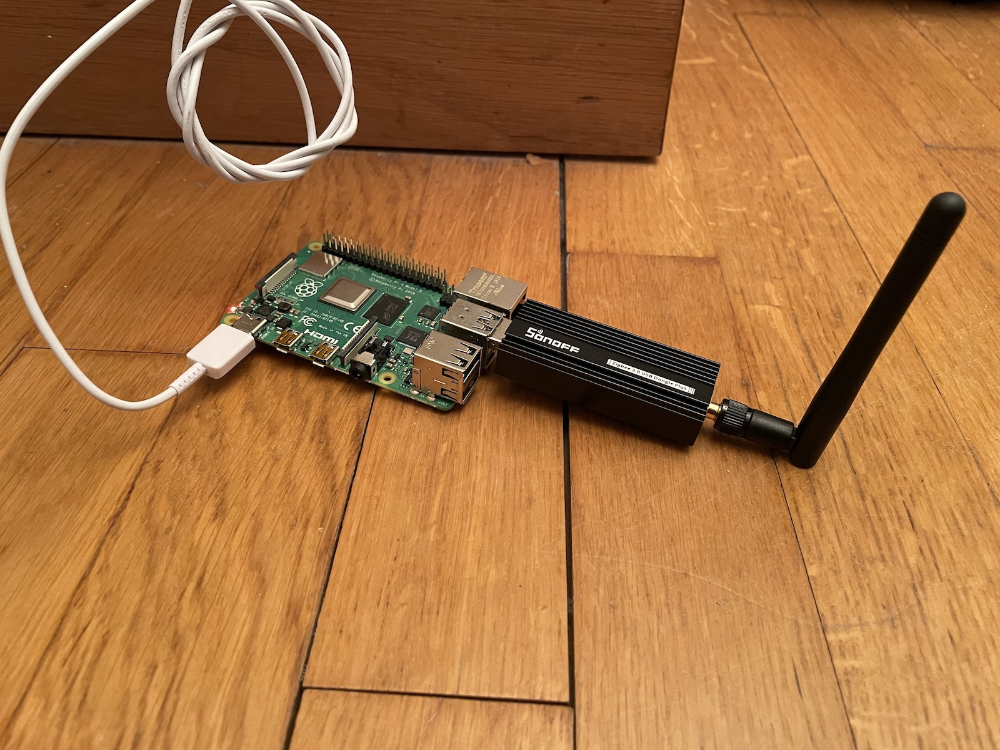
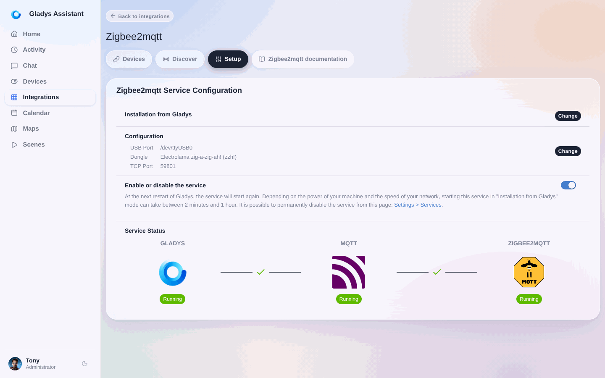
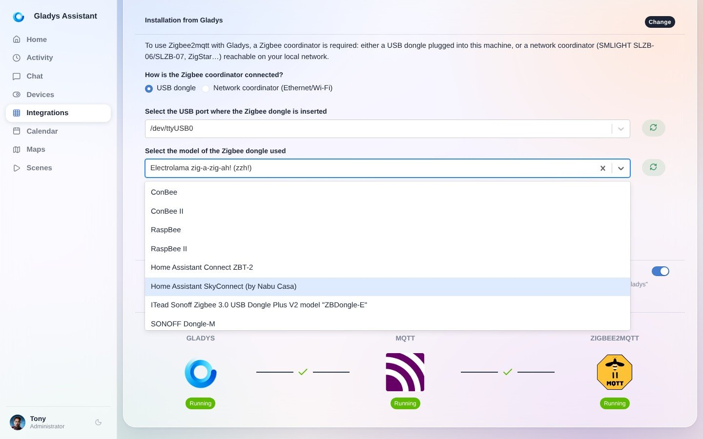
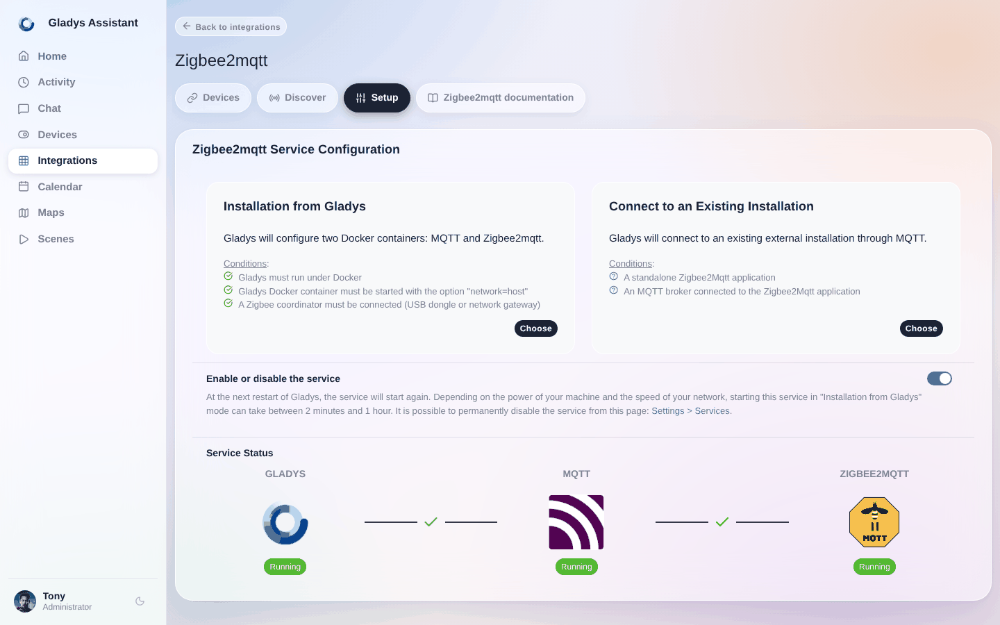
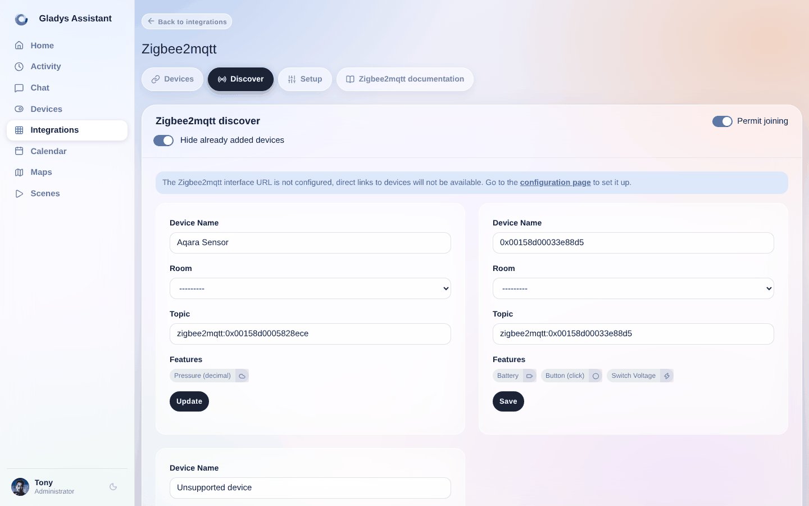
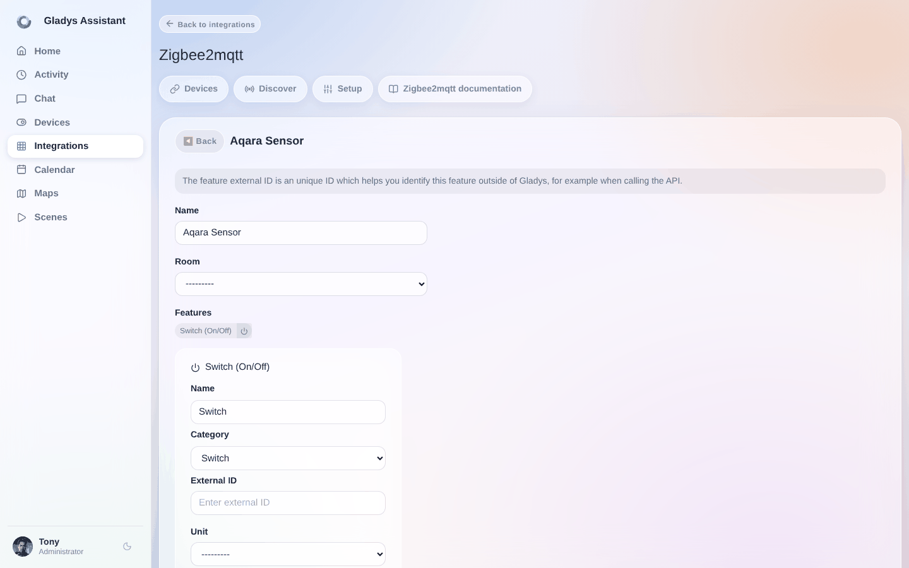

import JsonLd from '@site/src/components/seo/JsonLd';

Zigbee2MQTT te permite tener tu propio **hub Zigbee local** con Gladys: conectas un dongle USB Zigbee a la máquina en la que funciona Gladys y controlas todos tus dispositivos Zigbee directamente desde casa, sin cuenta en la nube y sin el puente del fabricante. Este tutorial te muestra cómo configurarlo, emparejar tu dongle y añadir dispositivos.

:::tip[¿Vienes de Home Assistant?]
Gladys instala y gestiona por ti Zigbee2MQTT y su broker MQTT: consulta [Zigbee2MQTT sin Home Assistant](/es/zigbee2mqtt-without-home-assistant/). ¿Todavía estás eligiendo un dongle? Lee nuestra [guía de compra de dongles Zigbee](/es/best-zigbee-dongle/).
:::

En resumen, vamos a conectar tus dispositivos Zigbee directamente a Gladys, sin necesidad de puentes de terceros (solo con un dongle USB Zigbee y el proyecto [Zigbee2Mqtt](https://www.zigbee2mqtt.io/)).

Puedes consultar la lista de dispositivos compatibles [aquí](https://www.zigbee2mqtt.io/supported-devices/).

Antes de empezar, asegúrate de tener un coordinador Zigbee: un dongle USB conectado a la máquina en la que funciona Gladys, o un coordinador de red (consulta [Usar un coordinador de red](#use-a-network-coordinator) más abajo).

Un dongle USB sencillo y económico que hemos probado con Gladys es el [dongle USB Sonoff Zigbee 3.0](https://amzn.to/3JZwzJy).

La lista completa de adaptadores compatibles está disponible en la [lista de adaptadores compatibles con Zigbee2mqtt](https://www.zigbee2mqtt.io/guide/adapters/).

## Configurar el puerto del dongle USB

Conecta tu dongle USB Zigbee a la máquina en la que funciona Gladys (tu Raspberry Pi, tu NAS).

En Gladys, ve a `Integraciones / Zigbee2Mqtt`.

Después, haz clic en `Ajustes` en el menú. Gladys escaneará automáticamente los distintos puertos USB para proponértelos en una lista desplegable.

Selecciona el puerto USB que debe usar Gladys para comunicarse con Zigbee.

**13 de mayo de 2023:** ahora puedes seleccionar el modelo de dongle Zigbee que utilizas:

Así Zigbee2mqtt sabe qué configuración debe usar.

:::warning
Si tienes un dongle basado en [EmberZNet](https://www.zigbee2mqtt.io/guide/adapters/emberznet.html) (como por ejemplo el Sonoff Zigbee 3.0 ZBDongle-E), te recomendamos [actualizar](https://www.zigbee2mqtt.io/guide/adapters/emberznet.html#firmware-flashing) el firmware del dongle. Si no, elige la opción `(legacy ezsp)` en la lista.
:::

:::warning
Si ejecutas Gladys en un disco externo conectado por USB, puedes tener problemas de alimentación, ya que tu Pi puede tener dificultades para suministrar suficiente energía tanto al disco como al dongle USB Zigbee.

Te recomendamos usar un hub USB con alimentación externa.

Puedes leer más al respecto en la web de Zigbee2MQTT: [Zigbee2MQTT fails to start](https://www.zigbee2mqtt.io/guide/installation/20_zigbee2mqtt-fails-to-start.html)
:::

## Usar un coordinador de red {/* #use-a-network-coordinator */}

Desde Gladys 5, el coordinador ya no tiene que estar conectado a la máquina en la que funciona Gladys. Un coordinador de red (SMLIGHT SLZB-06/SLZB-07, ZigStar…) se conecta por Ethernet o Wi-Fi, así que puedes colocarlo en el centro de tu casa, lejos de tu servidor y de las interferencias. Gladys sigue instalando y gestionando Zigbee2MQTT por ti.

En `Integraciones / Zigbee2Mqtt`, en la configuración:

1. En **¿Cómo está conectado el coordinador Zigbee?**, elige **Coordinador de red (Ethernet/Wi-Fi)**.
2. Introduce la dirección y el puerto TCP del coordinador, por ejemplo `tcp://192.168.1.20:6638` (el prefijo `tcp://` es opcional). Asigna al coordinador una dirección IP fija en tu router.
3. Selecciona el tipo de adaptador indicado en la documentación de tu coordinador: el SLZB-06 usa `zstack`, y el SLZB-06M y el SLZB-07 usan `ember`.

Después, continúa con el siguiente paso para activar Zigbee2MQTT.

## Activar Zigbee2Mqtt

Una vez configurado tu dongle, Gladys necesita instalar dos contenedores (MQTT y Zigbee2Mqtt) para usar el dongle y comunicarse con todos tus dispositivos. No te preocupes, todo esto está automatizado.

Ve a la sección `Configuración` y haz clic en el botón **Activar Zigbee2mqtt**. Tras unos instantes (el tiempo de espera depende del modelo de tu Raspberry Pi y de tu ancho de banda), deberías ver todos los elementos iniciados y las conexiones entre ellos en verde.

## Permitir el emparejamiento de dispositivos

Para que los dispositivos puedan emparejarse con tu red Zigbee, debes permitir la unión (`joining in`) en la configuración de Zigbee.

Haz clic en el menú `Descubrir` y después en el botón `Permitir la unión`.

:warning: Una vez emparejados tus dispositivos, tendrás que volver aquí para bloquear el emparejamiento, por seguridad.

## Añadir dispositivos

Para que tu dispositivo se una a la red, consulta su manual. En la mayoría de los casos, basta con mantener pulsado el botón físico.

Los dispositivos ya emparejados con tu red Zigbee aparecerán automáticamente en la lista con sus funcionalidades detectadas. Puedes cambiarles el nombre y asignarlos a una habitación con la lista desplegable.

## Modificar los dispositivos

Si es necesario, puedes ir al menú `Dispositivos` para modificar o completar la configuración de tus dispositivos.

Haz clic en el botón **Editar** de un dispositivo. Podrás cambiar su nombre, la habitación a la que pertenece y el nombre de cada funcionalidad.

## Uso

Ahora puedes usar estos dispositivos Zigbee desde el [panel de control](../dashboard/devices.md) o automáticamente desde las [escenas](../scenes/intro.md). Según la funcionalidad de cada dispositivo, tendrás acceso a mediciones, estados o acciones.

## Solucionar los errores habituales de Zigbee2MQTT

La mayoría de los problemas de Zigbee2MQTT tienen tres causas: el puerto USB equivocado, el tipo de adaptador equivocado o interferencias en la banda de 2,4 GHz. Estos son los errores que tienes más probabilidades de encontrarte y lo que significan realmente.

### Error while starting zigbee-herdsman

Zigbee2MQTT no ha podido comunicarse en absoluto con tu dongle. Comprueba, en este orden:

1. El **puerto USB** seleccionado en `Integraciones / Zigbee2Mqtt / Ajustes` es aquel en el que está conectado tu dongle. Si has cambiado el dongle de puerto, o has reiniciado con un disco conectado, el nombre del puerto puede haber cambiado.
2. El **modelo de dongle** seleccionado en los ajustes corresponde a tu hardware. Un dongle Silicon Labs configurado como uno de Texas Instruments (o al revés) falla justo aquí.
3. Nada más está usando el dongle. Solo una instancia de Zigbee2MQTT puede ocupar el adaptador.
4. El dongle recibe suficiente alimentación. Desconéctalo, vuelve a conectarlo a través de un **hub USB alimentado** o de un cable alargador USB corto, y reinicia la integración.

### Failed to connect to the adapter (SRSP - SYS - ping after 6000ms)

Este error es específico de los coordinadores Texas Instruments (CC2652 / ZBDongle-P): el adaptador está ahí, pero no responde. Casi siempre se debe a un puerto equivocado, a un tipo de adaptador incorrecto en los ajustes o a un dongle que hay que desconectar y volver a conectar físicamente. Si persiste, volver a flashear el firmware del coordinador resuelve los casos restantes.

### Adapter EZSP protocol version (8) is not supported by host

Tu dongle EmberZNet (Silicon Labs), normalmente un **Sonoff ZBDongle-E**, tiene un firmware más antiguo que el que espera la versión actual de Zigbee2MQTT. Tienes dos opciones:

- [actualizar el firmware del dongle](https://www.zigbee2mqtt.io/guide/adapters/emberznet.html#firmware-flashing), que es la opción recomendada, o
- seleccionar la opción `(legacy ezsp)` en la lista de modelos de dongle en Gladys, para que Zigbee2MQTT use el protocolo antiguo.

### MQTT failed to connect, exiting (connection refused: not authorized)

Zigbee2MQTT se ha iniciado, pero el broker MQTT ha rechazado sus credenciales. En Gladys, ambos contenedores se gestionan por ti, así que rara vez tendrás que tocar un archivo de configuración: vuelve a la sección `Configuración`, desactiva Zigbee2MQTT y vuelve a activarlo. Gladys recrea ambos contenedores con credenciales coincidentes. Si además usas la integración MQTT con tu propio broker, asegúrate de no haber apuntado Zigbee2MQTT hacia él con un nombre de usuario o una contraseña diferentes.

### MAC channel access failure

Es un problema de radio, no de software: el coordinador no consigue un hueco libre en el aire. Las causas y soluciones habituales:

- El dongle está conectado directamente a la máquina, junto a puertos USB 3.0, un SSD o la propia Raspberry Pi. Aléjalo con un **cable alargador USB de un metro aproximadamente**: es, con diferencia, la solución más eficaz.
- Tu Wi-Fi y tu red Zigbee se solapan en la banda de 2,4 GHz. Cambia el canal de tu Wi-Fi o el de tu red Zigbee para que no coincidan.
- El dispositivo está demasiado lejos del coordinador. Coloca entre ambos un dispositivo Zigbee conectado a la red eléctrica (un enchufe o una bombilla): estos actúan como routers y amplían la malla.

Si tu problema no aparece aquí, la [documentación de Zigbee2MQTT](https://www.zigbee2mqtt.io/guide/installation/20_zigbee2mqtt-fails-to-start.html) trata en detalle los fallos de arranque, y el [foro de Gladys](https://community.gladysassistant.com/) es un buen lugar para buscar tu mensaje de error exacto.

## Preguntas frecuentes

### ¿Cómo añado un dispositivo a Zigbee2MQTT en Gladys?

Una vez activado Zigbee2MQTT, abre el menú `Descubrir`, haz clic en `Permitir la unión` y pon tu dispositivo en modo de emparejamiento (normalmente manteniendo pulsado su botón). El dispositivo aparece automáticamente en la lista con sus funcionalidades detectadas, donde puedes cambiarle el nombre y asignarlo a una habitación. Recuerda desactivar la unión después, por seguridad.

### ¿Qué dongle USB Zigbee debo usar con una Raspberry Pi o un NAS?

Funciona cualquier adaptador de la [lista de adaptadores compatibles con Zigbee2MQTT](https://www.zigbee2mqtt.io/guide/adapters/). Un dongle económico que hemos probado con Gladys es el dongle USB Sonoff Zigbee 3.0. Conéctalo a la máquina en la que funciona Gladys (tu Raspberry Pi o tu NAS); si arrancas desde un disco USB, usa un hub USB alimentado para que el dongle reciba suficiente energía. Nuestra [guía de compra de dongles Zigbee](/es/best-zigbee-dongle/) compara los modelos más habituales.

### ¿Zigbee2MQTT con Gladys funciona sin la nube?

Sí. Zigbee2MQTT se ejecuta en local en tu propio hardware y se comunica con tus dispositivos a través del dongle USB, así que tu red Zigbee sigue funcionando sin conexión a internet y sin cuenta en la nube del fabricante.

### ¿Qué puerto y qué ajustes debo seleccionar para mi dongle Zigbee?

En Gladys, ve a `Integraciones / Zigbee2Mqtt` y después a `Ajustes`. Gladys escanea tus puertos USB y te los propone en una lista desplegable: simplemente eliges el que corresponde a tu dongle y seleccionas el modelo de dongle para que Zigbee2MQTT cargue la configuración adecuada.

### ¿Por qué no arranca Zigbee2MQTT?

Casi siempre porque Zigbee2MQTT no consigue llegar al coordinador: el puerto USB seleccionado no es el correcto, el modelo de dongle de los ajustes no corresponde a tu hardware, el dongle no recibe suficiente alimentación o su firmware es demasiado antiguo (el error `EZSP protocol version is not supported` en los dongles Sonoff ZBDongle-E). Comprueba primero el puerto y el modelo en los ajustes de la integración y, después, desconecta y vuelve a conectar el dongle a través de un hub alimentado o de un cable alargador USB.

### ¿Por qué mis dispositivos Zigbee se desconectan continuamente?

La causa principal son las interferencias en la banda de 2,4 GHz, que aparecen como `MAC channel access failure` en los logs. Aleja el dongle de la máquina con un cable alargador USB de un metro, mantenlo lejos de los puertos USB 3.0 y de los SSD, asegúrate de que los canales de tu Wi-Fi y de Zigbee no se solapan y añade dispositivos Zigbee conectados a la red eléctrica, que actúan como routers y amplían la malla.

<JsonLd
  data={{
    "@context": "https://schema.org",
    "@type": "FAQPage",
    mainEntity: [
      {
        "@type": "Question",
        name: "¿Cómo añado un dispositivo a Zigbee2MQTT en Gladys?",
        acceptedAnswer: {
          "@type": "Answer",
          text: "Una vez activado Zigbee2MQTT, abre el menú Descubrir, haz clic en Permitir la unión y pon tu dispositivo en modo de emparejamiento (normalmente manteniendo pulsado su botón). El dispositivo aparece automáticamente en la lista con sus funcionalidades detectadas, donde puedes cambiarle el nombre y asignarlo a una habitación. Desactiva la unión después, por seguridad.",
        },
      },
      {
        "@type": "Question",
        name: "¿Qué dongle USB Zigbee debo usar con una Raspberry Pi o un NAS?",
        acceptedAnswer: {
          "@type": "Answer",
          text: "Funciona cualquier adaptador de la lista de adaptadores compatibles con Zigbee2MQTT. Un dongle económico probado con Gladys es el dongle USB Sonoff Zigbee 3.0. Conéctalo a la máquina en la que funciona Gladys, por ejemplo tu Raspberry Pi o tu NAS. Si arrancas desde un disco USB, usa un hub USB alimentado para que el dongle reciba suficiente energía.",
        },
      },
      {
        "@type": "Question",
        name: "¿Zigbee2MQTT con Gladys funciona sin la nube?",
        acceptedAnswer: {
          "@type": "Answer",
          text: "Sí. Zigbee2MQTT se ejecuta en local en tu propio hardware y se comunica con tus dispositivos a través del dongle USB, así que tu red Zigbee sigue funcionando sin conexión a internet y sin cuenta en la nube del fabricante.",
        },
      },
      {
        "@type": "Question",
        name: "¿Qué puerto y qué ajustes debo seleccionar para mi dongle Zigbee?",
        acceptedAnswer: {
          "@type": "Answer",
          text: "En Gladys, ve a Integraciones, después a Zigbee2Mqtt y luego a Ajustes. Gladys escanea tus puertos USB y te los propone en una lista desplegable: eliges el que corresponde a tu dongle y seleccionas el modelo de dongle para que Zigbee2MQTT cargue la configuración adecuada.",
        },
      },
      {
        "@type": "Question",
        name: "¿Por qué no arranca Zigbee2MQTT?",
        acceptedAnswer: {
          "@type": "Answer",
          text: "Casi siempre porque Zigbee2MQTT no consigue llegar al coordinador: el puerto USB seleccionado no es el correcto, el modelo de dongle de los ajustes no corresponde a tu hardware, el dongle no recibe suficiente alimentación o su firmware es demasiado antiguo (el error EZSP protocol version is not supported en los dongles Sonoff ZBDongle-E). Comprueba primero el puerto y el modelo en los ajustes de la integración y, después, desconecta y vuelve a conectar el dongle a través de un hub alimentado o de un cable alargador USB.",
        },
      },
      {
        "@type": "Question",
        name: "¿Por qué mis dispositivos Zigbee se desconectan continuamente?",
        acceptedAnswer: {
          "@type": "Answer",
          text: "La causa principal son las interferencias en la banda de 2,4 GHz, que aparecen como MAC channel access failure en los logs. Aleja el dongle de la máquina con un cable alargador USB de un metro, mantenlo lejos de los puertos USB 3.0 y de los SSD, asegúrate de que los canales de tu Wi-Fi y de Zigbee no se solapan y añade dispositivos Zigbee conectados a la red eléctrica, que actúan como routers y amplían la malla.",
        },
      },
    ],
  }}
/>
