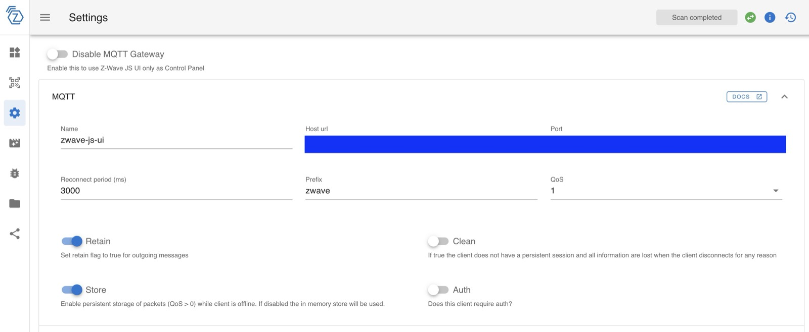
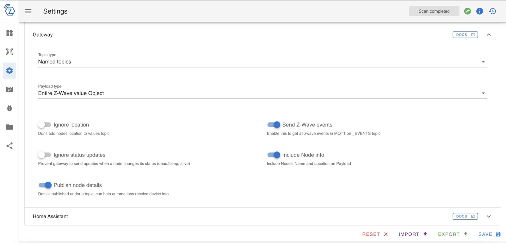

import JsonLd from '@site/src/components/seo/JsonLd';

Gladys Assistant ofrece una integración con [Z-Wave JS UI](https://zwave-js.github.io/zwave-js-ui/#/), un software para controlar dispositivos Z-Wave. Funciona **en local** en tu propio hardware, así que tu red Z-Wave sigue funcionando sin ninguna cuenta en la nube.

:::tip[Z-Wave sin Home Assistant]
Por qué Z-Wave JS UI con Gladys es una configuración sencilla y local, y cómo se compara con otras opciones: [Z-Wave JS UI sin Home Assistant](/es/z-wave-js-ui-without-home-assistant/).
:::

Gladys se conecta al mismo broker MQTT que Z-Wave JS UI y recibe mensajes MQTT cada vez que cambia el estado de un dispositivo.

:::note[Elegir un stick USB Z-Wave para tu región]
Z-Wave usa una frecuencia de radio diferente según dónde vivas, así que tu stick debe corresponder a tu país: **908,42 MHz en EE. UU. y Canadá**, 868,42 MHz en Europa. En Norteamérica, algunos sticks populares son el Zooz ZST10 700 / ZST39 y el Aeotec Z-Stick 7 (versión de EE. UU.). Asegúrate de comprar el modelo para EE. UU./Canadá y no el de la UE.
:::

## Instalar Z-Wave JS UI

Consulta la web de [Z-Wave JS UI](https://zwave-js.github.io/zwave-js-ui/#/) para ver las instrucciones de instalación de Z-Wave JS UI.

## Configurar Z-Wave JS UI

Para que la integración con Gladys funcione correctamente, se necesitan 2 ajustes.

Primero, tienes que definir los parámetros MQTT en los ajustes, en particular el campo "Name", que define el topic MQTT al que se enviarán los mensajes.

A continuación, configura la sección "Gateway" de la siguiente manera:

## Conectar Gladys a Z-Wave JS UI

Para que Gladys pueda comunicarse con Z-Wave JS UI, tienes que indicarle a Gladys la URL y los datos de conexión del broker MQTT en el que publica Z-Wave JS UI.

Ve a la pestaña "Configuración" para añadir esta información.

## Descubrir los dispositivos de Z-Wave JS UI

Ve a la pestaña "Descubiertos" para ver los dispositivos que expone tu instancia de Z-Wave JS UI.

¡Después puedes añadirlos a Gladys con un solo clic!

## Funciones compatibles

- **Sensores de puerta/ventana**: detectan el estado abierto/cerrado, como el [Fibaro Door Opening Sensor](https://www.amazon.com/Fibaro-FGDW-002-1-Window-Temperature-Sensor/dp/B074FCG1PF?crid=AMCFKK427FRN&keywords=Fibaro+door+sensor+2&qid=1704977401&sprefix=fibaro+door+sensor+2%2Caps%2C164&sr=8-1&linkCode=ll1&tag=gladproj-20&linkId=3e61bb12444e6d8265e7440bd0174456&language=en_US&ref_=as_li_ss_tl).
- **Interruptores binarios**: controlan luces o enchufes (encendido/apagado). Entre los dispositivos compatibles:
  - [Fibaro Wall Plug](https://www.fibaro.com/en/products/wall-plug/)
  - [Fibaro Switches](https://www.fibaro.com/en/products/switches/)
- **Sensores de temperatura ambiente**: monitorizan la temperatura de la habitación.
- **Medición de energía**: registra el consumo de energía para su análisis.
- **Control de cortinas/persianas**: abrir, cerrar y consultar la posición. Entre los dispositivos compatibles:
  - [Fibaro Walli Roller Shutter](https://manuals.fibaro.com/fr/walli-roller-shutter/)
  - [Qubino Flush Shutter](https://qubino.com/products/flush-shutter/)
- **Reguladores (dimmers)**: ajustan el brillo o controlan dispositivos por tensión. Entre los dispositivos compatibles:
  - [Fibaro Walli Dimmer](https://manuals.fibaro.com/fr/walli-dimmer/)
  - [Fibaro Dimmer 2](https://manuals.fibaro.com/fr/dimmer-2/)
- **Sensores de luminosidad**: miden el nivel de luz ambiental.
- **Sensores de alarma**: detectan amenazas de seguridad.
- **Sensores binarios**: admiten distintos escenarios de detección de encendido/apagado.

Si tu dispositivo todavía no es compatible, ¡avísanos en el foro!

## Preguntas frecuentes

### ¿Cómo añado un dispositivo Z-Wave a Gladys?

Primero empareja el dispositivo con Z-Wave JS UI (mediante su propio proceso de inclusión). Una vez que esté en tu red Z-Wave, abre la pestaña "Descubiertos" de la integración Z-Wave JS UI de Gladys para ver los dispositivos que expone tu instancia y añade a Gladys los que quieras con un solo clic.

### ¿Qué stick USB Z-Wave debo usar en EE. UU. o Canadá?

Elige un stick diseñado para la frecuencia norteamericana de 908,42 MHz, como el Zooz ZST10 700 / ZST39 o el Aeotec Z-Stick 7 (versión de EE. UU.). Un stick europeo de 868,42 MHz no se comunicará con dispositivos Z-Wave de EE. UU. o Canadá, así que comprueba siempre la región antes de comprar.

### ¿Gladys se conecta a Z-Wave directamente o a través de Z-Wave JS UI?

Gladys se conecta a través de Z-Wave JS UI por MQTT. Z-Wave JS UI controla el stick USB y publica los estados de los dispositivos en un broker MQTT, y Gladys se suscribe a ese broker para leer los estados y enviar comandos en tiempo real.

### ¿Z-Wave con Gladys funciona en local, sin la nube?

Sí. Z-Wave JS UI, el broker MQTT y Gladys se ejecutan en tu propio hardware, así que tus automatizaciones Z-Wave siguen funcionando sin conexión a internet y sin la nube del fabricante.

<JsonLd
  data={{
    "@context": "https://schema.org",
    "@type": "FAQPage",
    mainEntity: [
      {
        "@type": "Question",
        name: "¿Cómo añado un dispositivo Z-Wave a Gladys?",
        acceptedAnswer: {
          "@type": "Answer",
          text: "Primero empareja el dispositivo con Z-Wave JS UI mediante su propio proceso de inclusión. Una vez que esté en tu red Z-Wave, abre la pestaña Descubiertos de la integración Z-Wave JS UI de Gladys para ver los dispositivos que expone tu instancia y añade a Gladys los que quieras con un solo clic.",
        },
      },
      {
        "@type": "Question",
        name: "¿Qué stick USB Z-Wave debo usar en EE. UU. o Canadá?",
        acceptedAnswer: {
          "@type": "Answer",
          text: "Elige un stick diseñado para la frecuencia norteamericana de 908,42 MHz, como el Zooz ZST10 700 o ZST39, o la versión de EE. UU. del Aeotec Z-Stick 7. Un stick europeo de 868,42 MHz no se comunicará con dispositivos Z-Wave de EE. UU. o Canadá, así que comprueba siempre la región antes de comprar.",
        },
      },
      {
        "@type": "Question",
        name: "¿Gladys se conecta a Z-Wave directamente o a través de Z-Wave JS UI?",
        acceptedAnswer: {
          "@type": "Answer",
          text: "Gladys se conecta a través de Z-Wave JS UI por MQTT. Z-Wave JS UI controla el stick USB y publica los estados de los dispositivos en un broker MQTT, y Gladys se suscribe a ese broker para leer los estados y enviar comandos en tiempo real.",
        },
      },
      {
        "@type": "Question",
        name: "¿Z-Wave con Gladys funciona en local, sin la nube?",
        acceptedAnswer: {
          "@type": "Answer",
          text: "Sí. Z-Wave JS UI, el broker MQTT y Gladys se ejecutan en tu propio hardware, así que tus automatizaciones Z-Wave siguen funcionando sin conexión a internet y sin la nube del fabricante.",
        },
      },
    ],
  }}
/>
