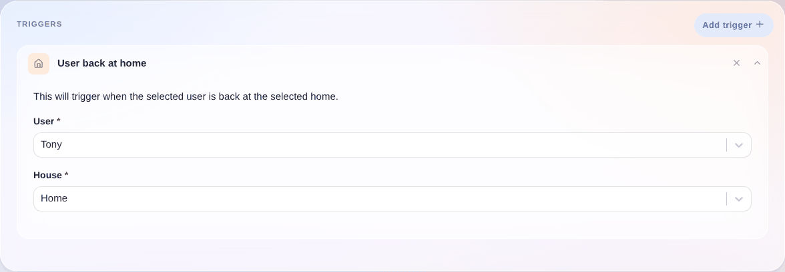

Este desencadenador se activa cuando el usuario seleccionado vuelve a casa, independientemente de la presencia de otros usuarios.

## Ejemplo sencillo

Para establecer la presencia de un usuario en casa, puedes leer nuestro tutorial sobre la [presencia por Bluetooth](/es/docs/integrations/bluetooth) o establecer la presencia [en una escena](/es/docs/scenes/user-presence).
