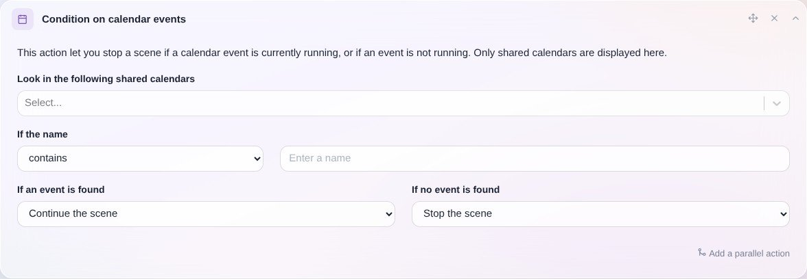
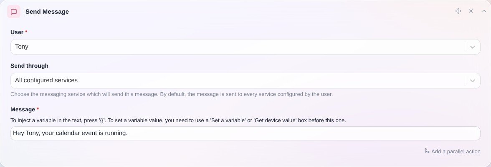

Imagina que quieres crear una escena que solo se ejecute si estás de vacaciones, en el gimnasio o en una llamada.

Puedes usar la integración de calendario (por ejemplo, [CalDAV](/es/docs/integrations/caldav)) para añadir a una escena una condición basada en la presencia de un evento en tu calendario.

Así es como se ve:

Después puedes usar el evento encontrado en otras acciones, como la acción "Enviar un mensaje":

