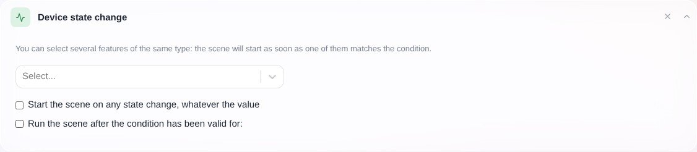
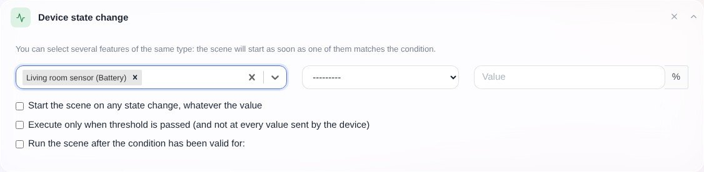
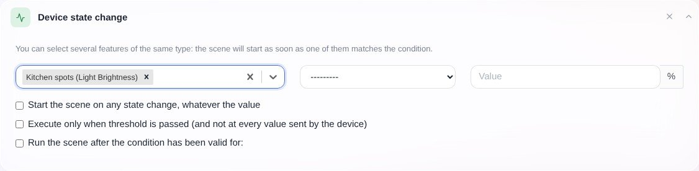

Imagina que quieres crear una escena que realice una acción concreta cuando la temperatura de una habitación determinada baje de 20 °C.

Para ello necesitas un desencadenante "Cambio de estado de un dispositivo".

Haz clic en "Nuevo desencadenante" y selecciona "Cambio de estado de un dispositivo":

Selecciona la funcionalidad del dispositivo que quieres "vigilar".

Por ejemplo, en nuestro caso, seleccionaremos un sensor de temperatura de la cocina:

Indica en qué condición este desencadenante debe ejecutar la escena.

En nuestro caso, queremos que la escena se ejecute si "la temperatura es inferior a 20 °C":

Según el tipo de dispositivo que selecciones en este desencadenante, la interfaz se adapta. Por ejemplo, si quieres ejecutar una escena "cuando se encienda la luz de la cocina", la interfaz tendrá este aspecto:

