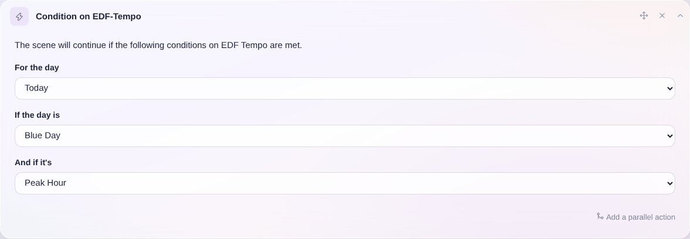

En Francia, EDF ofrece la tarifa [EDF Tempo](https://particulier.edf.fr/fr/accueil/gestion-contrat/options/tempo.html), con la que la electricidad suele ser más barata durante todo el año, salvo ciertos días "blancos" y "rojos" en los que el precio de la electricidad es mucho más alto.
Cada año Tempo, que va del 1 de septiembre al 31 de agosto, cuenta con 300 días azules, 43 días blancos y 22 días rojos.
Este tipo de contrato es práctico para quienes pueden desplazar fácilmente su consumo.

### Escenarios automáticos con Gladys

En Gladys puedes obtener en una escena el estado actual del día Tempo y saber si estás en horas punta o en horas valle.
Para ello, crea la acción de escena "Condición sobre EDF-Tempo":

Esta condición puede detener la ejecución de la escena si no se cumple.

Con esta condición puedes crear todo tipo de escenas inteligentes:

- Poner en marcha la lavadora SOLO si es un día azul
- Por la mañana a las 8:00, si es un día rojo, enviarme un mensaje por Telegram
- Por la tarde a las 19:00, si el día siguiente es un día rojo, enviarme un mensaje para recordarme que ponga el lavavajillas esa misma noche.
  En resumen, ¡las posibilidades son infinitas!
