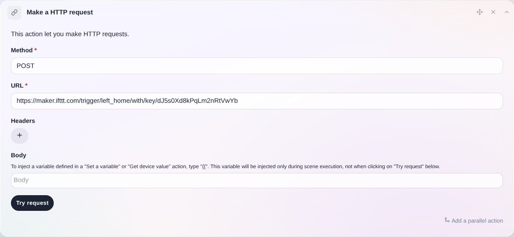
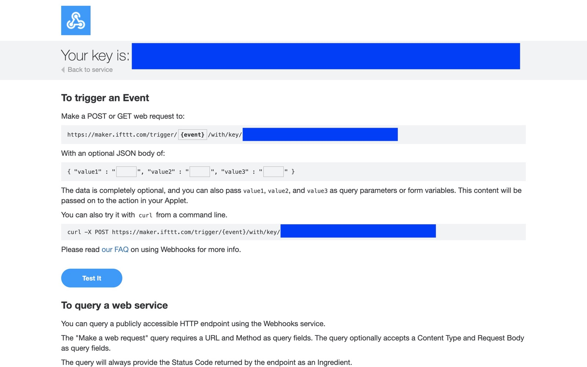
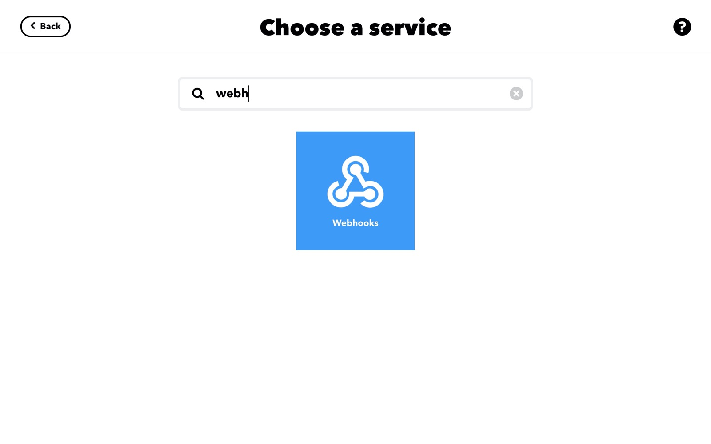
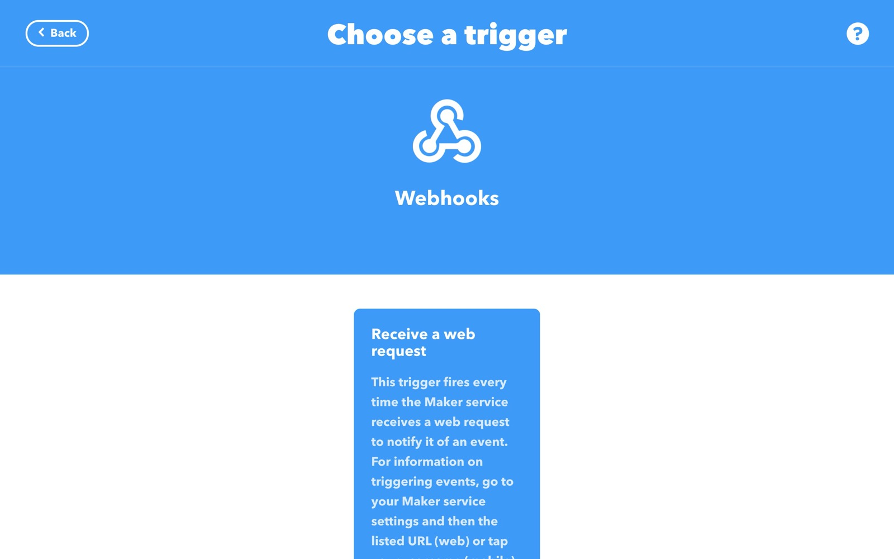
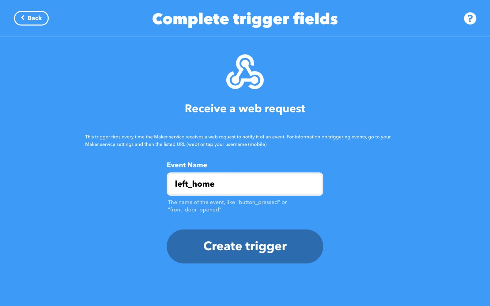
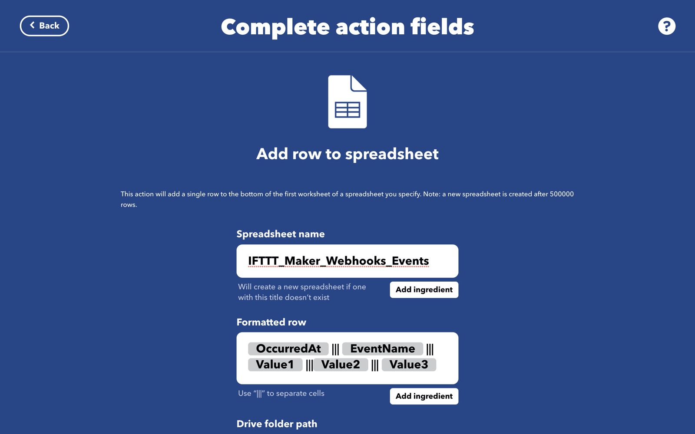
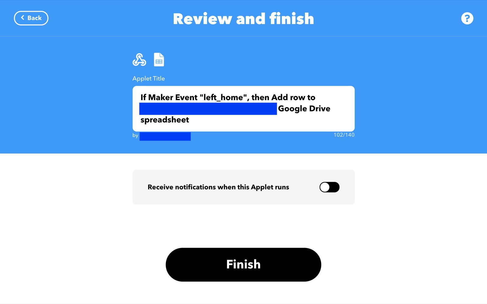
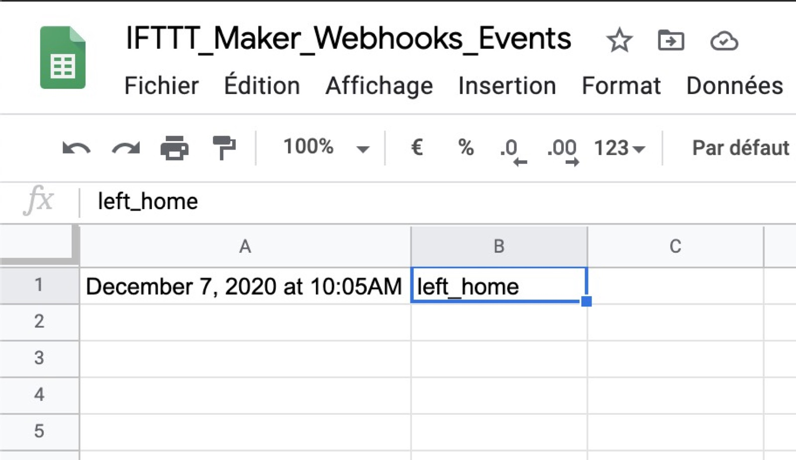
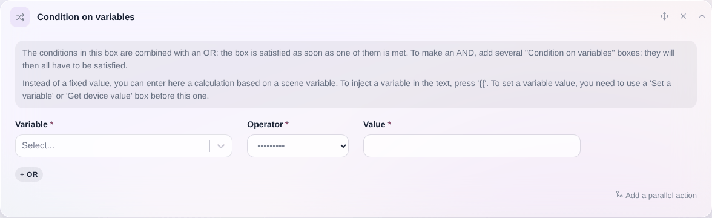

En las escenas, a veces resulta útil llamar a una API externa para controlar dispositivos que no gestiona Gladys Assistant. También puede que simplemente quieras llamar a un servicio externo sin tener que desarrollar una integración específica para ello.

## Requisitos previos

Necesitas Gladys Assistant v4.0.3 (o superior) para disponer de esta función.

## Enviar una petición HTTP en una escena

En las escenas, puedes crear una acción "Enviar una petición HTTP", que te permite enviar una petición HTTP de tipo GET, POST, PATCH, PUT o DELETE.

Si lo necesitas, puedes añadir cabeceras (headers), por ejemplo para la autenticación.

## Ejemplo concreto: activar una acción de IFTTT desde una escena de Gladys Assistant

Seguramente conoces [IFTTT](https://ifttt.com/), un servicio que permite conectar distintos servicios entre sí. Su plan gratuito está limitado a unos pocos applets por cuenta, pero es más que suficiente si solo quieres usarlo para suplir una función que le falta a Gladys.

En este ejemplo, usaremos IFTTT para guardar un valor en una hoja de Google Sheets cada vez que se ejecute una escena.

El objetivo es enviar a IFTTT un evento "salida de casa" y pedirle que lo registre en una hoja de Google Sheets. Así podremos llevar un registro de cuándo salimos de casa.

Por supuesto, esto es solo un ejemplo que puedes adaptar a tus necesidades 😁

### Configurar Maker Webhooks en IFTTT

En IFTTT, ve a [https://ifttt.com/maker_webhooks](https://ifttt.com/maker_webhooks) para configurar los Maker Webhooks.

Sigue el tutorial de IFTTT para configurar los Maker Webhooks.

Después de configurar los webhooks, deberías llegar a una página como esta:

Sustituye `{event}` por el nombre de tu evento, en mi ejemplo "left_home", y copia la URL.

Guarda la URL para más adelante.

### Configurar el servicio Google Sheets en IFTTT

En la página "Explore" de IFTTT, busca el servicio "Google Sheets" y conecta tu cuenta de Google. La necesitarás para el resto del tutorial.

### Crear un applet

Busca el servicio "Webhooks" que acabas de configurar.

Selecciona "Receive a web request":

Introduce el nombre del evento que definiste en el paso anterior, aquí "left_home":

Selecciona dónde quieres que IFTTT guarde los datos (en qué hoja de cálculo de tu Google Drive):

Haz clic en "Save".

Después, haz clic en "Finish".

### En Gladys, crea una escena

Crea una nueva escena en Gladys y añádele la acción "Enviar una petición HTTP".

Selecciona "Método: POST" y, como URL, introduce la URL del webhook de IFTTT que configuraste antes.

Guarda la escena y ejecútala.

Si ahora vas a tu Google Drive, deberías ver en la raíz una carpeta "IFTTT" que contiene una carpeta "MakerWebhook" y, en este caso, una carpeta "let_home".

Dentro encontrarás una hoja de cálculo con una fila que registra cuándo saliste de casa:

## Conclusión

Esto era solo un ejemplo. Con esta acción puedes hacer infinidad de cosas en las escenas:

- Llamar a la API de otra central domótica
- Llamar a IFTTT para controlar cualquier API: ¿música con Sonos? ¿Hacer sonar tu teléfono? ¿Enviar un correo electrónico? ¿Publicar un tuit?
- Llamar a la API de [Zapier](https://zapier.com/) para usar cualquier API (Gmail, Calendar, Trello y cientos más)

En resumen, las posibilidades son ilimitadas.

## Usar la respuesta de una llamada HTTP en una escena

También puedes usar la respuesta de una petición HTTP en las escenas.

Aquí tienes un ejemplo que consulta la API de Coinbase para obtener el precio del Bitcoin y enviárselo al usuario por Telegram:

<video  width="100%" controls autoplay loop muted>
<source src="/img/docs/en/scenes/http-request/bitcoin-price.mp4" type="video/mp4" />
  Tu navegador no admite la etiqueta de vídeo.
</video>

Puedes comparar el valor con una acción "Continuar solo si":

