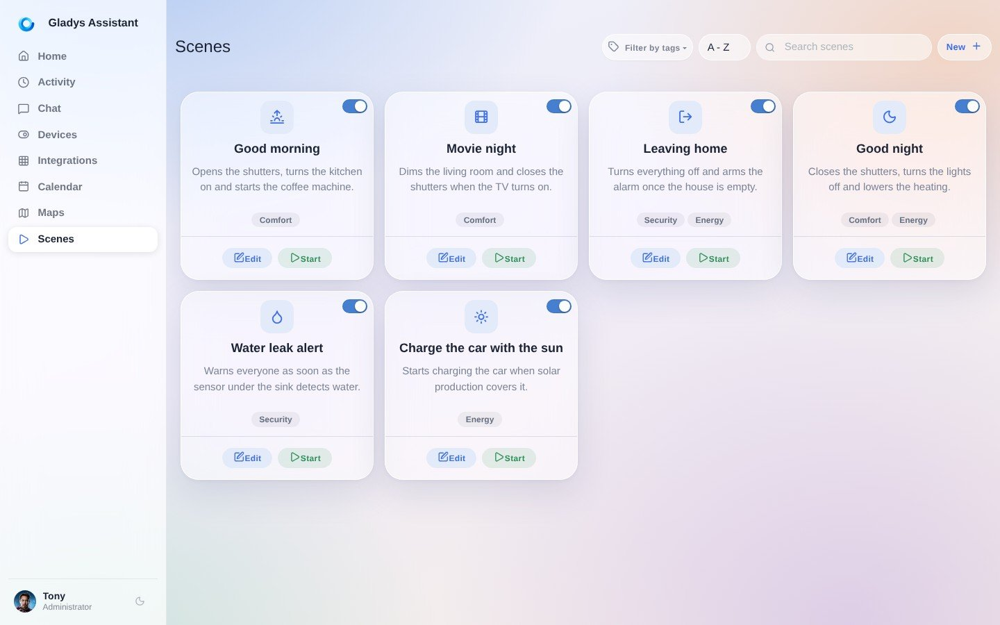
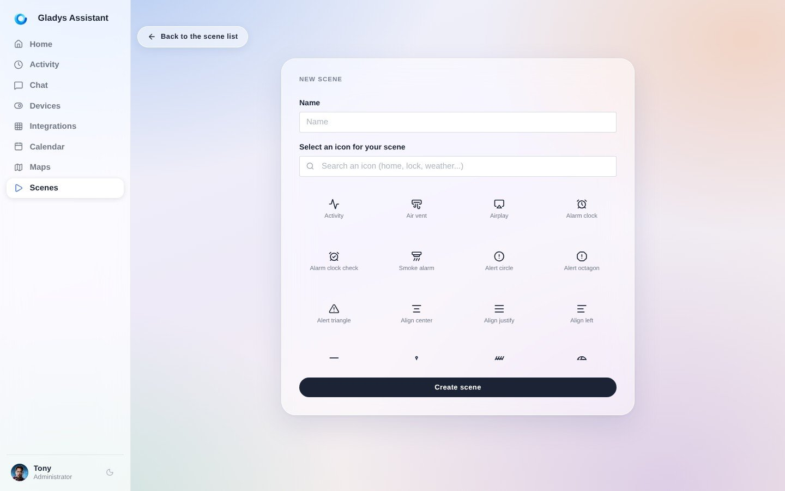
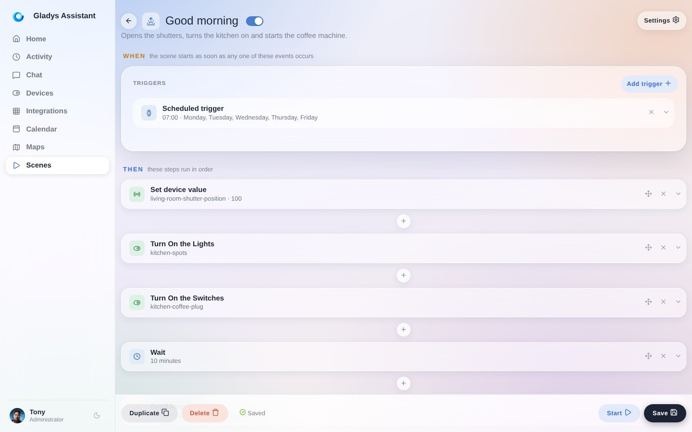

En Gladys Assistant puedes crear **escenas**. Una escena es un conjunto de **acciones** que se ejecutan una tras otra o en paralelo.

Las escenas son totalmente personalizables: tú mismo creas tus propias secuencias de acciones en el `editor de escenas` de Gladys.

Las escenas pueden ejecutarse manualmente, automáticamente (mediante un **desencadenante**) o desde otra escena.

Algunos ejemplos:

- Una escena "Apagar toda la casa", que apaga todas las luces de la casa. Esta escena también puede ejecutarse manualmente, para apagar todas las luces de casa a distancia.
- Una escena "Alerta de intrusión", que envía un mensaje de Telegram al usuario. Esta escena se configuraría para ejecutarse tras un desencadenante "Si se detecta movimiento".

## Crear una escena

Para crear una escena, ve a la pestaña "Escenas" de tu interfaz de Gladys y haz clic en el botón "Nueva +".

Elige un nombre y un icono para tu escena. Este icono solo se usa en la interfaz de Gladys.

Ya estás en el editor de escenas. Repasemos juntos cada parte del editor:

1. Desencadenantes: si añades desencadenantes a tu escena (es opcional), aparecerán aquí. Una misma escena puede activarse mediante varios desencadenantes diferentes. Todos estos desencadenantes son independientes entre sí. 
:::note
Añadir varios desencadenantes significa simplemente: "Cuando ocurra este evento O cuando ocurra este evento O ..."
:::
2. Un paso: una escena es una secuencia de pasos que se ejecutan uno tras otro. Gladys espera a que termine un paso antes de pasar al siguiente. Dentro de un paso, "Añadir una acción en paralelo" añade una acción que se ejecuta al mismo tiempo que las demás acciones de ese paso. Así puedes ejecutar acciones tanto en paralelo como en secuencia. Bastante potente, ¿verdad?
3. Iniciar: este botón te permite probar la ejecución de la escena. No tiene en cuenta los desencadenantes, solo ejecuta los pasos.
4. Guardar: este botón guarda la escena.
5. Eliminar: este botón elimina la escena.
6. Añadir desencadenante: este botón te permite añadir un desencadenante a la escena. Puedes añadir tantos desencadenantes como quieras.
7. El botón "+" entre dos pasos: inserta un nuevo paso en ese lugar de la escena.
8. Haz clic en el título de la escena para editarlo.
