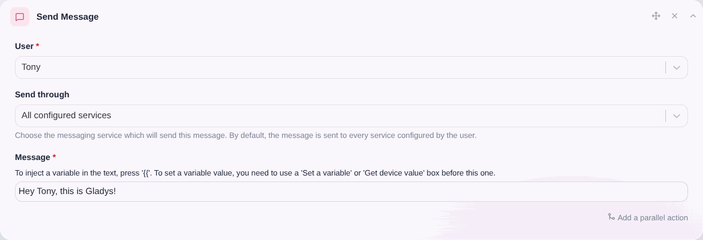
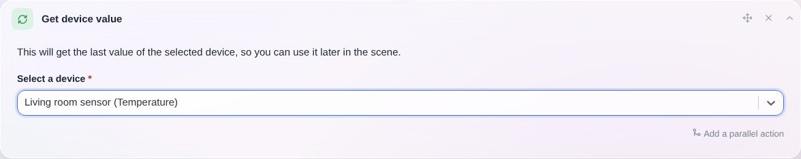
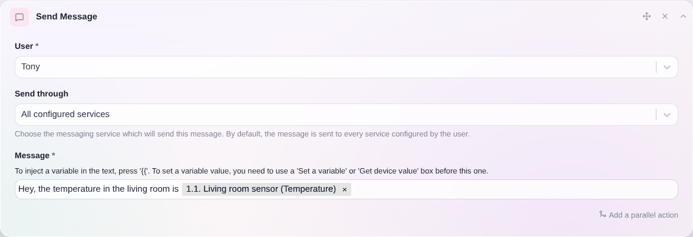

Esta acción te permite enviar un mensaje a un usuario de Gladys desde una escena.

Gladys usará entonces Telegram o el chat web de Gladys para contactar con el usuario.

## Ejemplo sencillo

Enviar un mensaje es muy sencillo: crea una acción "Enviar un mensaje" en una escena y selecciona el usuario que debe recibir el mensaje.

## Insertar una variable en un mensaje

Supongamos que quieres enviarte una alerta cuando la temperatura de tu casa sea demasiado baja.

Quieres insertar el valor actual de la temperatura en el mensaje para saber qué temperatura hace en ese momento.

Para ello, añade a tu escena una acción "Obtener el último estado" y selecciona el sensor que quieres consultar.

Después, más adelante en la escena, puedes añadir una acción "Enviar un mensaje" y, en el mensaje, escribir `{{` y seleccionar la variable definida previamente.

Cuando se ejecute la escena, deberías recibir el valor en tu mensaje 🥳
