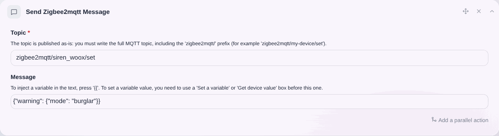
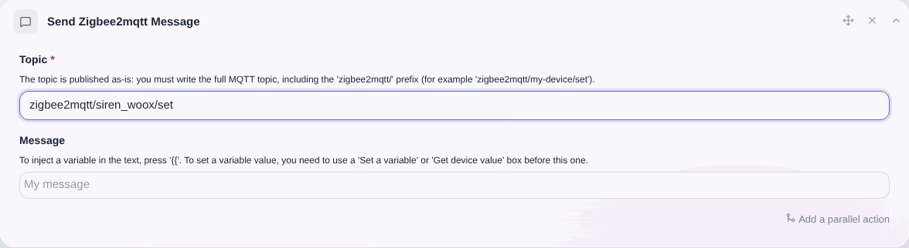
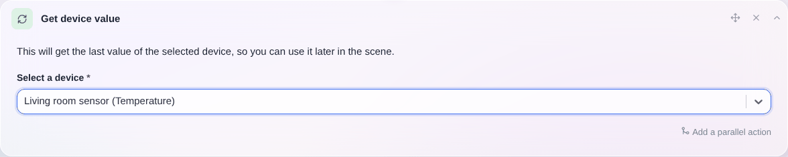
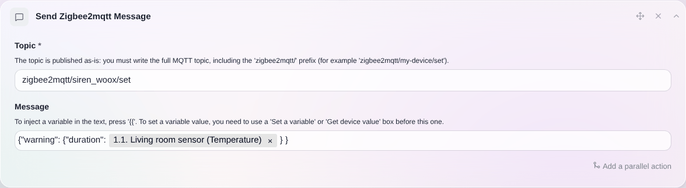

En las escenas, a veces es útil enviar una orden para controlar dispositivos zigbee2mqtt que no están gestionados por Gladys Assistant.

## Enviar un mensaje Zigbee2Mqtt en una escena

Enviar un mensaje Zigbee2Mqtt es muy sencillo: crea en una escena la acción "Enviar un mensaje Zigbee2Mqtt".

## Ejemplo concreto: activar una sirena [Woox R7051](https://www.zigbee2mqtt.io/devices/R7051.html) desde una escena de Gladys Assistant

### En Gladys, crea una escena

Crea una nueva escena en Gladys y añádele la acción "Enviar un mensaje Zigbee2Mqtt".

Indica el topic de tu dispositivo.

Indica el comando para controlar tu dispositivo. Puedes encontrar la información de tu dispositivo en el sitio web de [Zigbee2mqtt](https://www.zigbee2mqtt.io/devices/R7051.html#warning-composite).

Guarda la escena y ejecútala.

## Inyectar una variable en un mensaje

Supongamos que quieres inyectar el valor de la duración en el mensaje, para conocer el valor actual de la duración.

Para ello, debes añadir a tu escena la acción "Obtener el último estado" y seleccionar el dispositivo que quieres consultar.

Después, más adelante en la escena, puedes añadir la acción "Enviar un mensaje Zigbee2Mqtt" y, en el mensaje, escribir `{{` y seleccionar la variable definida anteriormente.

Cuando se ejecute la escena, ¡deberías obtener el valor en tu mensaje! 🥳
