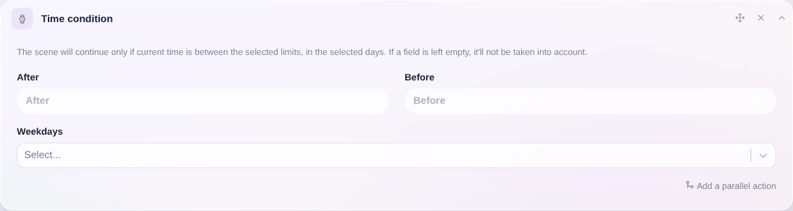

Esta condición solo dejará continuar la escena si la hora actual está dentro del rango seleccionado, en los días seleccionados.

## Ejemplo sencillo

"Cuando la hora esté entre las 8:00 y las 12:00, los fines de semana"
