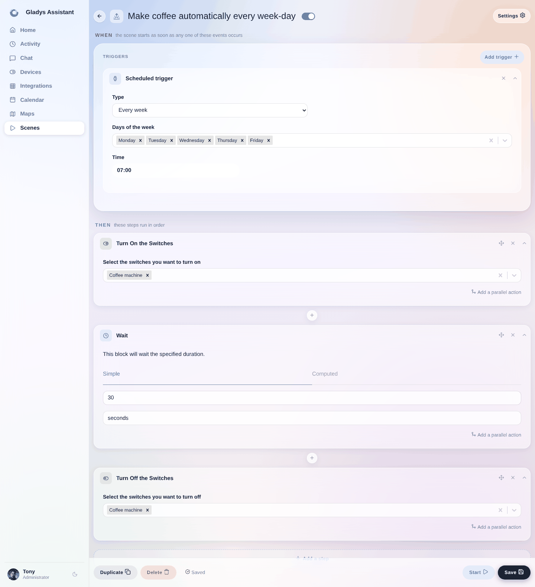

Ya sea para controlar una simple lámpara de mesita de noche, una tira LED o incluso una cafetera, los enchufes inteligentes se usan mucho en domótica.

En Gladys puedes controlar tus enchufes inteligentes, tanto desde el panel de control como en las escenas.

A continuación encontrarás un ejemplo concreto.

Toma una cafetera de filtro muy básica, de las que se encuentran en el mercado por unos diez euros. Estas cafeteras tienen la ventaja de contar con un interruptor físico de encendido/apagado que puede quedarse permanentemente en la posición "encendido".

Con un enchufe inteligente delante, es posible controlar el aparato y, por tanto, ¡preparar café cuando quieras!

## Preparar café automáticamente cada mañana entre semana con Gladys

Podemos imaginar la siguiente escena:

```
Disparador: "De lunes a viernes a las 7:00"

Acciones:
  - Encender el enchufe "cafetera"
  - Esperar 30 segundos (para que se prepare el café)
  - Apagar el enchufe "cafetera"
```

En Gladys, la escena tendrá este aspecto:



Como ves, primero hay un disparador que se activa todos los días de la semana excepto el fin de semana (de lunes a viernes).

Después, la escena enciende el enchufe, espera 30 segundos y luego apaga el enchufe.

Superfácil, ¿verdad?
