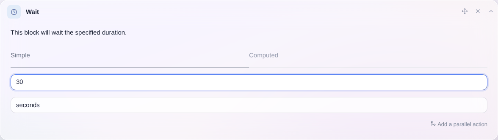
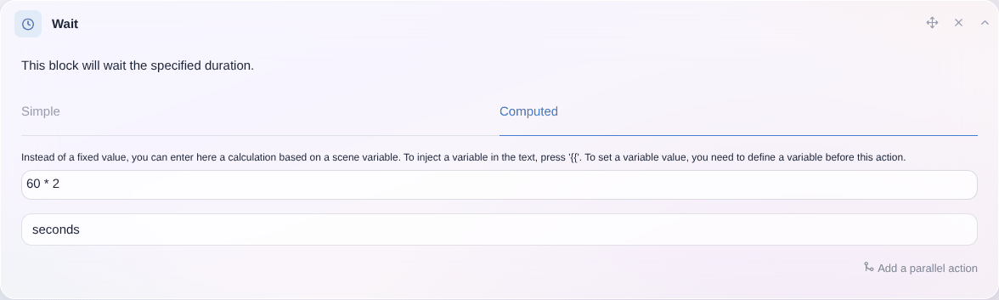

Esta acción te permite esperar durante un tiempo fijo o calculado.

## Tiempo de espera fijo simple

Puedes indicar un tiempo de espera fijo que no varíe:

## Tiempo de espera calculado

También puedes definir un tiempo de espera dinámico que varíe en función de variables o de cálculos matemáticos.

Por ejemplo, si has obtenido el valor de un sensor anteriormente en tu escena (con la acción "Obtener el último estado"), puedes usar esta variable como base para calcular tu tiempo de espera:

### Funciones matemáticas disponibles

Consulta las [funciones matemáticas](/es/docs/scenes/math-functions).
