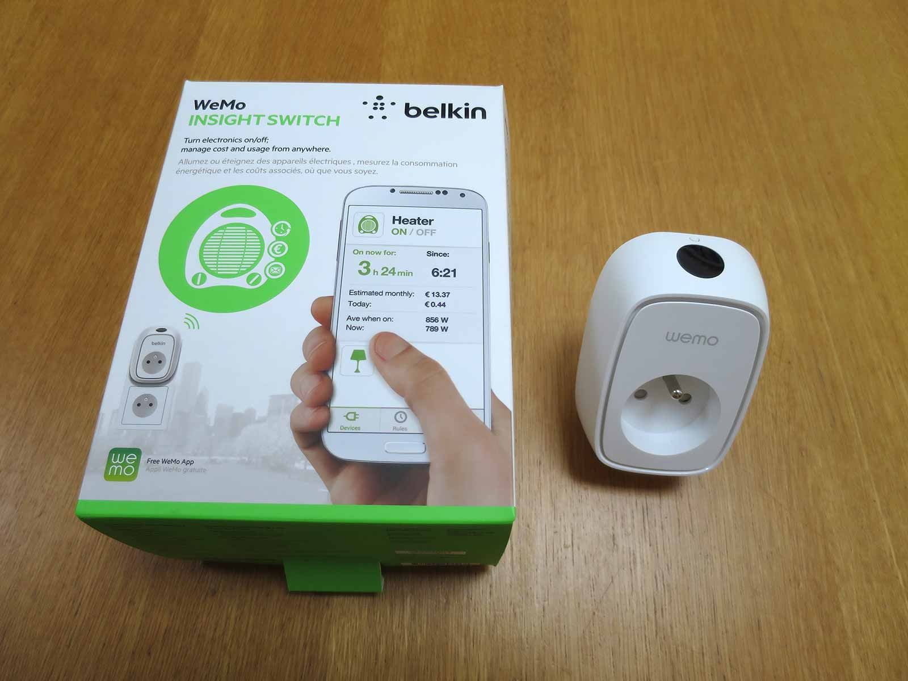
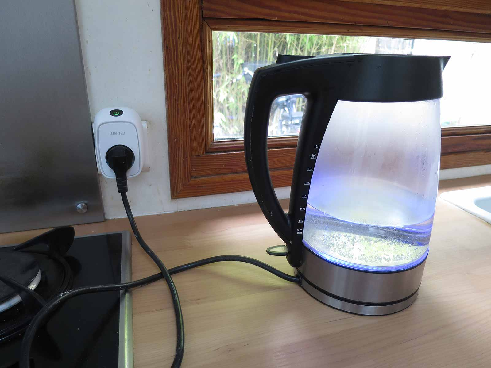

<div class="alert alert--danger" role="alert">
  Update: 21/07/2020: Ce tutoriel a été écrit il y a plusieurs années, il ne concerne pas Gladys v4 ! 
</div>

Aujourd'hui je vais vous présenter la prise [**WeMo Insight Switch**](http://amzn.to/1CG0WQr), et vous expliquer comment la contrôler avec Node.js ! Pourquoi j'ai choisi cette prise ? Elle répond à beaucoup de mes besoins, et fait beaucoup plus que les prises RF que j'utilise actuellement. Notamment :

- Mesure de la **consommation d'énergie**
- Mesure du temps allumé
- **Retour d'état**, la prise a en fait toute une API, et on peut l'interroger pour lui demander si elle allumée ou pas par exemple.
- Définition de règles ( si allumée plus de x heures, éteindre la prise )
- Connexion au Wi-Fi de la box directement, le contrôle est beaucoup plus fiable qu'une prise radio-fréquence. Ce qui permet notamment de piloter la prise à distance, même en 4G.

Elles sont certes un peu plus cher, mais de mon point de vue cette prise vaut largement son prix.

<!--truncate-->

## Le matériel

C'est tout simple, il vous faut juste une prise [WeMo Insight Switch](http://amzn.to/1CG0WQr) !



## Installation

L'installation est très simple, et s'est passée sans problème pour moi.

- Téléchargez l'application Wemo, sur le [Google Play Store](https://play.google.com/store/apps/details?id=com.belkin.wemoandroid), ou sur l'[App Store](https://itunes.apple.com/fr/app/wemo/id511376996?mt=8).
- Branchez votre prise Wemo
- Déconnectez votre smartphone du Wi-Fi de votre box, et connectez vous au réseau Wi-Fi de la prise ( le réseau Wi-Fi s'appelle "Wemo-Insight\*\*\*\*" ).
- Lancez l'application Wemo !
- L'application va vous guider dans l'installation, vous avez juste à indiquer à la prise le réseau Wi-Fi de votre box et à lui donner le mot de passe du Wi-Fi afin qu'elle puisse s'y connecter.
- Laissez l'application faire le reste.
- Normalement c'est bon, vous pouvez vous déconnecter du réseau de la prise, vous rebranchez au Wi-Fi de votre box et relancer l'application, vous devriez voir la prise et être capable de la contrôler.
- Dans le futur, si vous débranchez votre prise, inutile de la reconfigurer elle se reconnectera toute seule au Wi-Fi.

Je vous laisse jouer avec l'application, on peut s'amuser à créer des règles, c'est plutôt bien fait de ce côté là.

Un exemple sympa d'utilisation tout simple, on branche la bouilloire à la prise, et on programme l'allumage pour le lendemain matin, et l'eau est chaude au levée !



### Let's hack the plug !

Maintenant que l'on s'est servi de la prise de façon "conventionnelle", essayons d'outrepasser l'application pour contrôler en quelques lignes de code la prise. ( et ainsi automatiser tout ça, et se faire un petit module Gladys :) )

Premier réflexe, allons voir sur NPM si quelqu'un n'a pas déjà fais un module de contrôle Wemo en Node.js... Et magie, un dévelopeur a déjà programmé un petit module !

Le module NPM s'appelle tout simplement "wemo", installez le ( sur votre PC/Mac/Linux/Raspberry, peut importe du moment que Node.js est dessus ) en tapant la commande :

```
npm install wemo
```

Puis, créez un fichier `index.js` avec comme contenu :

```
var WeMo = require('wemo');

// on cherche des prises sur le Wi-Fi
var client = WeMo.Search();

// Dès qu'on en trouve une
client.on('found', function(device) {

	// On se connecte avec l'IP et le port de la prise
    var wemoSwitch = new WeMo(device.ip, device.port);

    // On allume la prise !
	wemoSwitch.setBinaryState(1, function(err, result) {
	    if (err) console.error(err);

	    console.log(result); // 1
	    wemoSwitch.getBinaryState(function(err, result) {
	        if (err) console.error(err);

	        console.log(result); // 1
	    });
	});
});
```

J'ai commenté le code, la librairie est vraiment bien faite et le code parle de lui même. Le code va tout simplement chercher la prise sur le réseau, lui demander de s'allumer, puis lui demander si elle s'est bien allumée. Si vous voulez éteindre la prise au lieu de l'allumer, il faut juste remplacer le "1" par "0" dans la fonction `wemoSwitch.setBinaryState`.

Vous n'avez plus qu'à lancer le code avec la commande :

```
node index.js
```

### Contrôle avec Gladys

Pour ceux qui ont Gladys, il vous suffit d'installer le module `wemo` directement depuis Gladys!

J'espère que ce tutoriel vous a plu, n'hésitez pas si vous avez des questions, en commentaires ou sur le forum.
