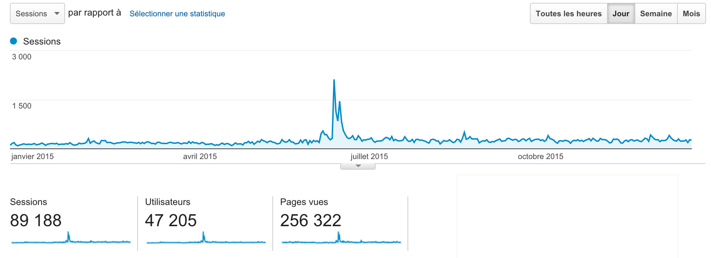
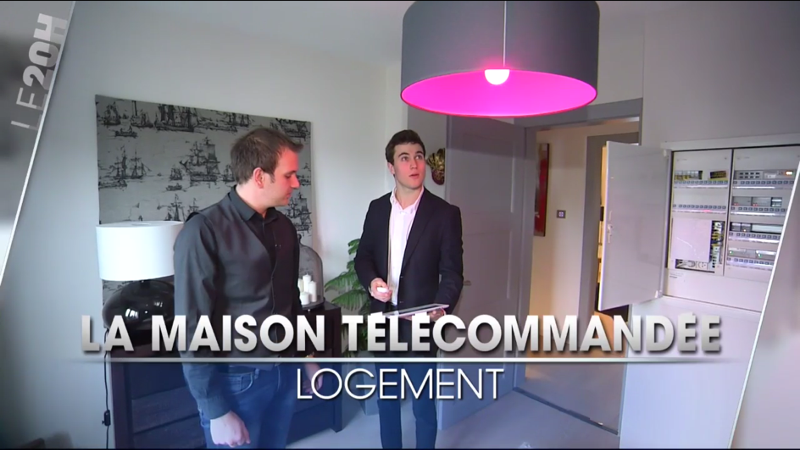

Salut à tous!

L'année 2015 a été une grande année pour le projet, et j'aimerais faire un petit bilan avec vous, et de vous parler de la suite du projet.

<!--truncate-->

### Quelques statistiques du site

Et cette année vous avez été plus de 47 000 visiteurs uniques à venir sur le site Gladys ! Pour comparer à l'année 2014, c'est plus du double. Je vous ai mis un petit screenshot de mon Google Analytics pour commenter ça :

Et le beau pic que l'on voit en plein milieu correspond au concours Raspberry Pi de Korben que Gladys avait gagnée ( [http://korben.info/les-gagnants-du-concours-de-projets-raspberry-pi.html](http://korben.info/les-gagnants-du-concours-de-projets-raspberry-pi.html) ). J'aimerais d'ailleurs remercier encore une fois Korben (si tu passe par ici!) pour l'énorme souffle qu'il a pu apporter au projet. C'est tout con, mais un petit lien comme ça nous a amené plus de 3 000 visiteurs uniques en à peine 48 heures. Et plus on est sur le projet, plus il y a de retours, de remarques, de personnes qui s'impliquent, de contributions sur le GitHub, de discussions sur le forum, etc... Et plus le projet avance!

J'ai eu la chance en début d'année d'être convié par une agence d'architectes Strasbourgeoise, Notes de Styles, pour faire une démonstration de Gladys devant les caméras de TF1 pour le JT. C'était une formidable expérience de parler du projet devant les caméras dans un cadre superbe (une maison tout équipée en domotique, entièrement connectée, des hauts parleurs dans chaque pièce, ça change de mon petit appart!). Malheureusement nous ne sommes passés que quelques secondes au JT (coupé au dernier moment au montage, faute de temps dans le JT), mais l'expérience reste la même, c'était une super journée !

Dernière statistique intéressante, depuis le début du projet, toute version de Gladys confondue, Gladys a été téléchargée plus de **8 800 fois** ! Et je parle juste de téléchargements via sourceforge, hors clonage github.

### La communauté

Le projet ne serait rien sans toute la communauté derrière qui me donne des retours sur chaque version plus ou moins réussie (malheureusement parfois ça casse tout ! Mea culpa c'est moi!).

#### Le forum

Vous êtes désormais 377 sur [le forum](https://community.gladysassistant.com) à avoir posté plus de 4 500 messages. Et honnêtement, la communauté est vraiment dynamique et me surprend chaque jour, les questions de chacuns font avancer le projet, et pour l'instant on a pas eu tant que ça de troll (espérons que ça dure).

J'aimerais remercier tout particulièrement VonOx et Doctor qui m'aident énormémement sur le forum, sans eux je n'aurais pas le temps de travailler sur le projet et de répondre aux questions sur le forum. Et merci pour leurs modules/pull request sur le GitHub, ça fait plaisir de voir des utilisateurs qui s'impliquent autant dans le projet !

#### La newsletter

J'ai lancé cette année une newsletter du projet, vous êtes maintenant plus de 450 à la recevoir. Dans cette newsletter j'envoie l'avancement du projet, les divers tutoriels/articles que je poste, et je vous tiens au courant des nouvelles versions. Pour ceux qui ne la suivent pas encore, n'hésitez pas à vous inscrire ( [Pour s'inscrire c'est ici](http://eepurl.com/bdrXCv) ), je n'envoie pas beaucoup de mails et vous pouvez toujours vous désinscrire :)

#### Le Twitter

Et cette année nous avons passé le cap des 1 000 followers sur Twitter ! J'aime toujours autant ce réseau social, pour moi le plus adapté à ce genre de projet. C'est toujours aussi sympa de parler avec des passionnés de DIY que j'aurais pas forcément rencontrés sans Twitter. J'essaie de poster tout ce que je fais, et pour les photos je poste ça via [le compte Instagram du projet](https://www.instagram.com/gladysassistant/).

<blockquote class="twitter-tweet" lang="fr">
Wow ! :D <a href="https://t.co/hVpO6bChwb">pic.twitter.com/hVpO6bChwb</a>
&mdash; Gladys Assistant (@gladysassistant) <a href="https://twitter.com/gladysassistant/status/667769662277595136">20 Novembre 2015</a></blockquote>

### La suite du projet

Le projet a bien avancé cette année, l'année 2015 a marqué la sortie de la deuxième version majeur de Gladys, et nous sommes désormais en 2.1.7.

Actuellement, au niveau de Gladys en elle même j'ai plusieurs priorités :

- Fixer l'image Rasbpian pour Raspberry Pi B/B+. L'objectif serait d'avoir une image super stable qui fonctionne sans faille pour tout le monde, et qui soit très facile à mettre à jour. Le but est de devenir vraiment accessible à tous, installable en quelques minutes et "plug and play" ensuite sans trop de connaissances.
- Etoffer la documentation. La documentation Gladys est désormais Open Source et éditable par tous (elle est disponible sur GitHub, et vous pouvez la forker puis proposer une pull request, les changements seront immédiatemment synchronisés sur le site développeur )

#### La compatibilité Z-wave

Au niveau des modules que j'ai en tête et que j'ai bien commencé, il y a évidemment le module Z-wave. La compatibilité Z-wave étant très demandé, c'est quelques chose qui est prévu :) Après comme je disais sur le forum, étant donné que je travaille dessus sur mon temps libre assez restreint, et que c'est un module assez conséquent, j'ai pris un peu de retard dans son développement. Mais il sortira ! Je pense qu'une fois qu'il commencera à devenir fonctionnel je le mettrais sur GitHub en pré-pré-alpha pour ceux qui sont impatient de le tester.

#### Du machine learning

J'ai réalisé pas mal de tests (que j'aimerais publier dans un article dès que j'ai le temps !) d'analyses de données récoltées par Gladys. Et honnêtement les résultats sont vraiment bluffant.

L'objectif est de se rapprocher enfin de l'assistant dont nous rêvons tous, un assistant qui apprends de nos habitudes pour mieux nous répondre et anticiper nos besoins. L'exemple que je dis tout le temps, c'est :

Imaginons que tous les jours, quand vous rentrez et que la luminosité est inférieure à un certain seuil, la première chose que vous faites c'est allumer la lumière, car il fait sombre. Gladys peut analyser cette corrélation et établir une règle "SI ( Retour à la maison ET luminosité < SEUIL ) ALORS Allumage lumière" sans que vous aillez à le définir. Car c'est ça l'avenir de la domotique ! Si on doit définir nous même chaque règle, pour chaque personne, pour chaque pièce et pour chaque capteur, on n'est pas sorti de l'auberge. Le futur pour moi ce sont des règles définies par l'assistant, des règles modulaires qui s'adaptent à l'utilisateur et à l'environnement (car quand c'est l'été, l'hiver, les règles ne sont pas les mêmes !).

J'espère pouvoir apporter cette notion d'intelligence artificielle à Gladys.

#### Une troisième version de Gladys

Maintenant que cette deuxième version commence à être assez mûre, les changements de la prochaine version majeure commencent à se dessiner :

- Côté front-end, actuellement nous utilisons AngularJS, mais pour certaines dépendances du thème bootstrap de Gladys, nous sommes obligés d'inclure JQuery. Ce qui fait un peu lourd d'avoir deux grosses libs JS clientes. Mon objectif serait de retirer JQuery et de passer en full Angular. L'objectif pourrait être aussi de passer à Angular 2 quand cette version sera sortie (si elle est assez mûre).
- Gladys est désormais compatible avec Node.js >= 4.0, qui apporte notamment le support de nombreuses features JS ES6. ( ES6 ou ES2015 est une nouvelle version de JavaScript qui apporte de nombreuses fonctionnalités, pour ceux que ça intéresse => [Top 10 ES6 Features Every Busy JavaScript Developer Must Know](http://webapplog.com/es6/) ). Mon objectif serait d'adapter Gladys à cette version et de profiter de ces features pour simplifier l'API Node Gladys.
- Vu que l'API serait fortement modifiée, j'aimerais en profiter pour repenser certains noms de fonctions pas forcément explicite, et normaliser les paramètres à passer afin de pouvoir passer des paramètres standard lors des scénarios. Par exemple lorsqu'on déclenche une action dans un scénario, il faudrait que le gestionnaire de scénarios puisse passer à la fonction appelée des paramètres par défaut (l'ID de l'user qui a créé le script, les valeurs qui ont déclenchées le scénarios, etc...). Cela permettrait de faire des scénarios du type : "Si température > 25, m'envoyez une notification "Monsieur, il fait %Temperature degrées" !" Je pense que vous voyez l'idée!

**Ces changements ont l'air simple comme ça, dès lors pourquoi en faire une v3 ? et pas une v2.2 ?**

Etant donné que ces changements vont tout changer au niveau de l'API, cela veut dire que ce sont des changements majeures qui cassent la compatibilité ascendante. Il devient donc nécessaire de passer à une nouvelle version majeure, question de numérotation ( Breaking.Feature.Fix ).

### Conclusion

J'aimerais vous remercier, vous tous qui suivez le projet, depuis peu ou depuis les débuts il y a environ 3 ans ! Merci à tous pour cette année 2015 qui est une vrai réussite pour le projet. Sans vous nous ne serions jamais arrivé là.

Merci à tous pour vos messages, j'en reçois beaucoup et j'essaie de répondre dans des délais convenable, mais c'est toujours avec plaisir que je vous lis! En 3 ans je n'ai pas reçu un seul mail négatif, seulement des questions et des remerciements, ce qui sur internet doit être un exploit, vous êtes une communauté en or ! :D

J'espère que 2016 sera une aussi bonne année que 2015, je compte sur vous pour être aussi actif, aussi motivé et à me soutenir autant sur le projet.

Bonne fête de fin d'année à tous !
