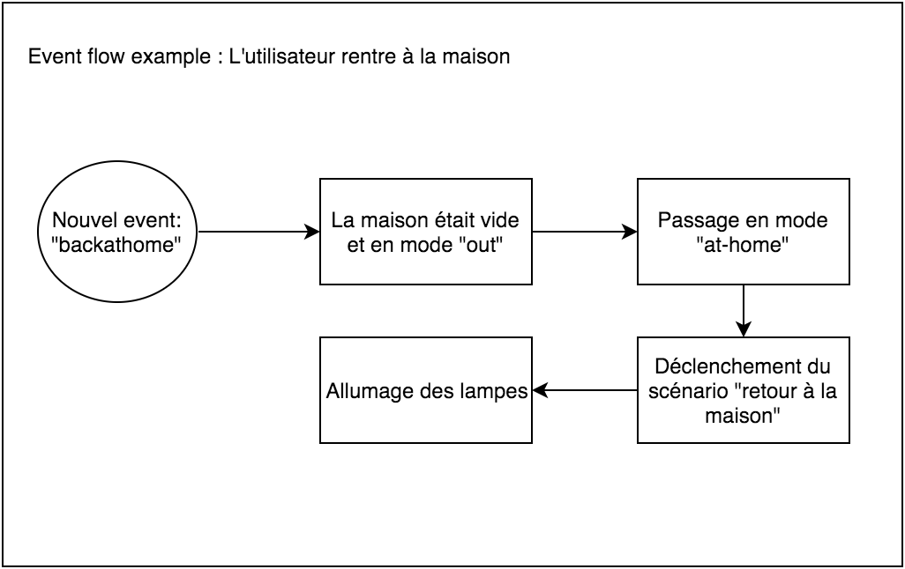

Salut à tous!

J'en parle beaucoup sur le forum, mais je n'ai rien encore écris "d'officiel" sur le blog à propos de cette prochaine version de Gladys, Gladys 3.0.

Voici donc un récapitulatif des features et des concepts qui vont apparaître dans cette nouvelle version :) N'hésitez pas à faire des remarques en commentaires !

<!--truncate-->

## L'unification des périphériques

J'en parlais dans mon [bilan de l'année 2015](/fr/blog/bilan-2015-et-projets-pour-2016), avec Gladys 2.0, de nombreux utilisateurs se sont inscrits en tant que développeur Gladys sur le site développeur, et ont commencés à développer des modules pour étendre les possibilités de Gladys.

Cela m'a permis de voir les usages et les demandes des développeurs, et surtout de remarquer une chose: La plupart des modules que les développeurs créent sont des modules pour ajouter des compatibilités avec du matériel, et souvent dans Gladys 2.0 ils se voyaient obligés de tout réinventer, ils devaient gérer absolument tout: créer leur service, créer leurs routes d'API, gérer l'affichage sur le dashboard, etc...

Alors qu'il est pourtant inutile d'avoir un dashboard par type de périphérique, une API par type de périphérique, etc... Il serait bien plus simple d'avoir une interface où on verrait tous les périphériques de la maison regroupés ( que ce soit des périphériques Wi-Fi, 433Mhz, Zwave, etc... )

Le premier objectif de cette 3.0 est donc **l'unification de la partie périphérique** afin qu'un développeur n'ait plus à s'embêter à développer une interface spécifique, mais n'ait qu'à se préoccuper de la partie "communication gladys - device".

## Des scénarios plus poussés

Dans Gladys 2.0, la notion de scénario est apparue. Les usages que les gens ont eu des scénarios m'ont permis de voir ce qui manquait, et de repenser ces scénarios pour Gladys 3.0.

### Une refonte des évènements

Dans Gladys 2.0, il y avait une notion de "LifeEvent", c'était des évènements relatifs à un utilisateur afin d'avoir des logs sur sa vie. Le problème des LifeEvents étaient qu'ils n'étaient pas vraiment reliés aux scénarios et à Gladys.

Cette notion de LifeEvent disparait dans Gladys 3.0 au profit d'une notion d'Event plus générique **et à la base des scénarios**.

C'est à dire que désormais, le flow de déclenchement d'un scénario est le suivant :

Pour donner un exemple concret, cela donne ça :

(Lire la partie suivante pour l'explication sur les modes)

## Différents modes/ambiances pour la maison

On le voyait dans le précédent schéma, il y a une nouvelle notion dans Gladys, la notion de "Mode" de la maison.

En terme de relation, une maison à un instant t à **un et un seul mode**. Vous êtes en vacances, votre maison est en mode 'holidays'. Vous êtes au travail, en soirée à l'extérieur, votre maison est en mode "out". Le mode de la maison n'est lié à aucuns utilisateurs en particuliers, c'est à vous de définir ce qui fait passer la maison d'un mode à un autre. Si vous êtes plusieurs, pas de panique, c'est le premier utilisateur de retour à la maison qui va faire passer la maison de "out" à "at-home" par exemple.

| Mode             | Description                                                                                                                                                                                      |
| ---------------- | ------------------------------------------------------------------------------------------------------------------------------------------------------------------------------------------------ |
| at-home          | Vous êtes à la maison, tout est normal.                                                                                                                                                          |
| coming-back-home | Vous êtes en train de rentrer chez vous. Gladys doit allumer le chauffage, ouvrir les volets.                                                                                                    |
| out              | Vous n'êtes pas chez vous pour quelques heures/la journée. Mode sécurisé.                                                                                                                        |
| holidays         | Lorsque que vous partez en vacances, que la maison est vide. Mode sécurisé, volets fermés.                                                                                                       |
| nap              | Vous faites une sieste, extinction des lumières. Fermeture partielle des volets                                                                                                                  |
| sleep            | C'est la nuit, vous dormez. Volets fermés, lumières éteintes. ( je n'ai pas mis comme nom d'évènement "night" pour nos amis les travailleurs de nuit qui eux aussi dorment mais pas la nuit :D ) |
| party            | C'est la fête ! Mode soirée activé, lumières colorées et playlist soirée.                                                                                                                        |
| romantic         | Soirée romantique, lumières tamisées rouge et petit jazz en arrière plan ( ce mode est quasiment le plus demandé dans le sondage que j'ai fais l'autre jour ! )                                  |
| cinema           | Vous regardez un film, lumières éteintes dans le salon, télévision allumée, lumière tamisée lors de mouvements dans la cuisine ou vers les toilettes.                                            |

**Note:** Tous les exemples donner ci-dessus sont à titre indicatif pour donner un exemple concret d'usage, mais c'est à vous de définir ce que vous voulez lancer. Comme c'est à vous de définir les différents modes de votre maison.

**Note 2:** Un mode sympa que je n'ai pas mis mais que j'ai testé il y a un bout de temps, c'est le mode "horror", qui diffusait des bruits de portes qui claque, grincements, éclairs, orages, dans toutes les enceintes de la maison tout en coupant l'éclairage de façon random. Frissons garanties !

## Parler à Gladys, bientôt possible ?

Beaucoup d'entre vous rêve de pouvoir parler à leur assistant. Ce n'était pas possible jusque là car les technos étaient hyper limités, mais aujourd'hui, cela de vient de plus en plus possible. ( Je dis bien "deviens" ).

Afin de pouvoir être prêt le jour où l'on pourra réellement parler à Gladys dans la pièce, je compte mettre brique par brique en place cette nouvelle façon de communiquer. Car la reconnaissance vocale c'est finalement la chose la plus simple à mettre en place, si on présuppose que cette reconnaissance fonctionne correctement, la reconnaissance ne fait que traduire un son en texte. Ensuite encore faut-il savoir faire quelques chose de ce texte !

## Du machine learning dans Gladys

Afin de pouvoir traduire un texte en une action à réaliser, ou une question à répondre, je vais "apprendre" à Gladys à reconnaître des commandes, plutôt que de naïvement faire de la détection de mots clés qui à mon avis ne mène à rien ( on ne va pas programmer en dur dans le code chaque commande possible inimaginable ).

Je vais faire ce qu'on appelle de la "classification" ( la même technique utilisé par Gmail pour trier vos mails entre SPAM et non-SPAM )

**Le machine learning dans Gmail**

L'idée dans Gmail, c'est d'entraîner le système avec des millions d'emails déjà classés pour lui apprendre à reconnaître un SPAM.

Par exemple :

- "Objet: Réunion demain au bureau" => "non-spam"
- "Objet: Cours de piscine" => "non-spam"
- "Objet: "Mega PROMO -80% SOLDE" => "spam"

Une fois le système entrainé, il suffit dès qu'un nouveau mail est reçu de lui demander de le classifier, et il attribuera un pourcentage de chance que selon lui le mail est un SPAM ou non.

**L'application dans Gladys**

Dans gladys, on va faire exactement pareil mais en classifiant suivant plein de label.

On entrainera le système en lui disant :

- "Je rentre à la maison" => "set mode to coming-back-home"
- "Allume la lumière dans le salon" => "turn on the lights"
- "Prépare moi un café" => "prepare coffee"

C'est pour cela que je vous ai demandé de remplir un sondage des phrases que vous voudriez demander à Gladys, afin d'avoir un gros lot de données pour entrainer le système.

**C'est encore expérimental**

J'insiste la dessus, je ne suis pas un expert en machine learning et je me familiarise avec ces techniques. Ces features seront présentes dans Gladys 3.0 mais de façon totalement expérimentales et à vos risques et périls :D Si il y a parmi vous des experts en machine learning, n'hésitez pas à me dire si vous voyez des pistes d'améliorations :)

## Une installation ultra-rapide de Gladys

Une grande reproche que l'on peut faire à Gladys, c'est sa lenteur à l'installation/mise à jour. La commande `sudo npm install -g gladys` sur Raspberry Pi est particulièrement lente, surtout sur Raspberry Pi B/B+.

### Pourquoi ?

Lorsque l'on fait `npm install`, npm va télécharger Gladys et toute ses dépendances, puis lancer la compilation de toutes les dépendances "natives" écrites en C++ ( bcrypt, lame par exemple ). Or le Raspberry Pi est particulièrement lent à ça. C'est un peu comme si pour installer MySQL ou Node.js sur votre Raspberry Pi, vous deviez compiler le soft en entier, ce qui prendrait des heures ^^ En général on vous fournit un binaire déjà compilé pour votre architecture, qui est compressé et simplement décompressé à l'installation.

### La solution

L'objectif est qu'à chaque mise à jour de Gladys, je lance sur mes Raspberry Pi une installation de Gladys ( installation + compilation complète =~ 7 minutes sur Raspberry Pi 3 ), puis le dossier sera compressé dans une archive afin d'avoir un petit fichier `gladys.tar.gz` qui sera ensuite uploadé sur un serveur Amazon S3.

Sur le Raspberry Pi chez vous, Gladys fera une requête ( une fois par jour par exemple ) pour vérifier qu'il n'y a pas de mise à jour. Si oui, Gladys proposera dans l'interface de faire la mise à jour, et si l'utilisateur accepte, Gladys téléchargera le fichier `gladys.tar.gz`, le décompressera, déplacera les modules installés dans le nouveau dossier gladys, relancera Gladys, et supprimera l'ancien dossier.

( sachant que la décompression est très rapide comparé à une compilation )

## L'installation sur un serveur avec Docker

Une techno que j'adore et que j'utilise dans beaucoup de mes projets, c'est [Docker](https://www.docker.com/). Pour ceux qui ne connaissent pas, c'est un système de container linux qui vous permet de lancer des containers très léger en empaquetant dedans une application et ses dépendances.

L'avantage de Docker c'est qu'ils ont un repo d'images toute prête alimenté par la communauté.

Du coup j'ai publié une image Docker Gladys sur le docker hub ! Cette image est buildée **automatiquement** par le Docker hub à chaque push sur le git. Actuellement ce repo ne build que la branche v3, du coup ce n'est pas encore utilisable en prod, mais dès que je mergerais la branche v3 du git dans master, il sera possible de lancer sur un serveur gladys en une seule ligne avec un `docker run`.

Vous trouverez Gladys sur [le docker hub](https://hub.docker.com/r/gladysassistant/gladys/), après c'est la version 3.0 en plein dev qui est dessus ( sous le tag v3 ), du coup **ce n'est pas à utiliser en production.**

La raison pour laquelle je n'ai pas fais de build Docker de la version actuelle de Gladys ( 2.1.8 ) est qu'actuellement Gladys intègre certaines dépendances qui ne peuvent pas être installées sur un serveur ( je pense à lame pour le son, car un serveur n'a pas de carte son ). Dans Gladys 3.0, j'ai essayé de rendre le core de Gladys très très léger et sans dépendances liés au matériel. **La partie "voix" et "musique" est désormais déportée dans un module externe à Gladys** pour permettre l'installation sur un serveur !

## Conclusion

Bravo à tous les courageux qui m'auront lu jusque là ! Je n'ai pas tout détaillé, il y a bien évidemment des petites suprises, de très nombreux changements dans l'interface que je n'ai pas montré ici et que j'aurais la joie de vous dévoiler lors du lancement de la première alpha de Gladys 3.0 :)

N'hésitez surtout pas si vous avez des idées, envies, remarques sur ce que je viens d'expliquer. Donnez votre avis en commentaire, c'est fait pour ça !
