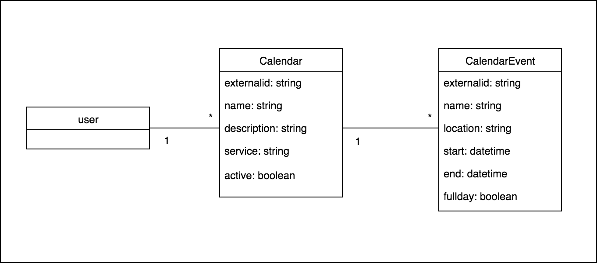
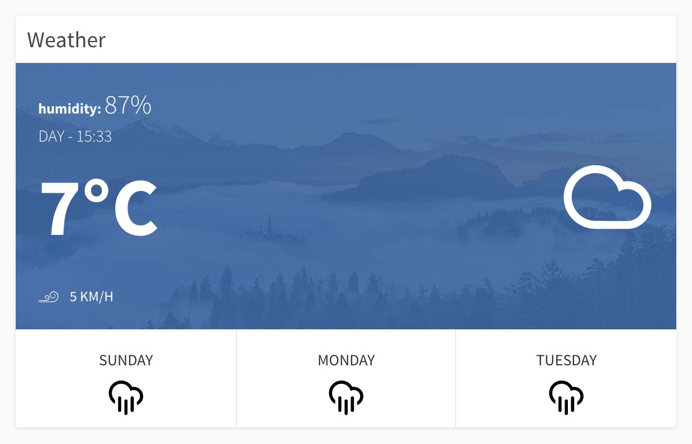
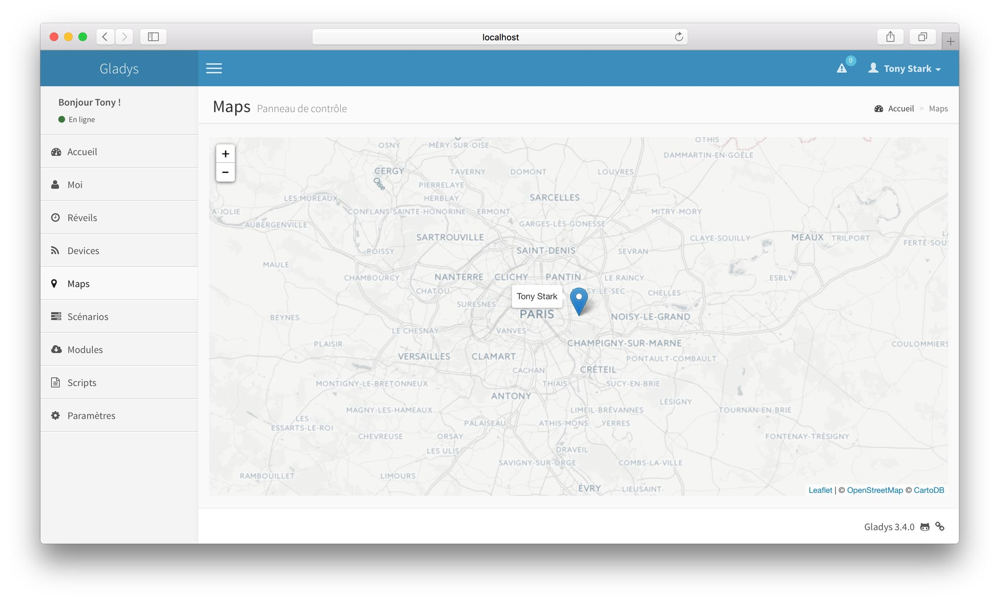
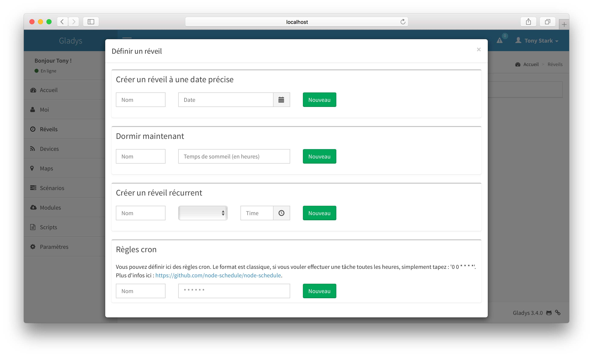

Salut à tous !

Après pas mal de travail, la version 3.4 de Gladys est enfin disponible! Il y a pas mal de nouveautés intéressantes, je vais essayer de les expliquer dans ce blog post.

<!--truncate-->

## La gestion des calendriers

La première grosse feature de cette version 3.4, c'est la gestion des calendriers dans Gladys. J'ai eu la même démarche que pour les devices. Nous avons dans Gladys une notion abstraite de calendrier et d'évènements, puis nous avons des "modules de compatibilités" qui vont se connecter à des services de calendrier existants pour synchroniser Gladys avec ceux-ci. J'ai modélisé les calendrier de la façon suivante :



La première intégration que j'ai faite est celle de Google calendar, et le module est d'ores et déjà disponible sur le store.

Je vous laisse suivre le tutoriel pour l'installation du module. Dans Gladys, une fois ce module installé, vous pouvez mettre une box sur le dashboard qui vous affichera les events du jour de votre calendrier. Vous pouvez aussi depuis les scripts récupérer les évènements à venir avec la commande :

```javascript
gladys.calendar
  .getEvents({ user: { slug: 3 } })
  .then((events) => {
    // array of upcoming events

    console.log(events);
  })
  .catch(console.log);
```

## La gestion de la météo

De la même manière que j'ai implémenté [la musique dans Gladys](/fr/blog/gerer-musique-gladys-sonos), j'ai créé une notion abstraite de météo. Il s'agit d'un service sous `gladys.weather` qui derrière est capable d'appeler des modules de compatibilités.

Afin de pouvoir visualiser la météo, j'ai ensuite créé une box météo pour l'interface, qui ressemble à ça :



Mais le plus intéressant est évidemment de récupérer la météo dans Gladys ! Pour demander la météo dans un script on fera tout simplement :

```javascript
var options = {
  latitude: 45,
  longitude: 45,
};

gladys.weather
  .get(options)
  .then((result) => {
    console.log(result);
    console.log(result.temperature);
    console.log(result.weather);
    console.log(result.humidity);
  })
  .catch(console.log);
```

Ma première implémentation de cette gestion de la météo est le module gladys-forecast. L'API est limité à 1000 call par jour et par compte, ce qui me parait amplement suffisant, en sachant que dans le module je garde en cache les requêtes 10 minutes afin de ne pas surcharger l'API, et pour améliorer les performances d'affichages quand on se balade sur le dashboard.

## Une carte temps-réel de la famille

Il y a désormais un nouvel onglet dans l'interface, l'onglet "Maps", qui vous permet de visualiser en temps réel la position des différents membres de la famille enregistré dans Gladys, le tout sur une carte OpenStreetMap !



## Plein de nouvelles features

Il y a pas mal de petits ajouts dans Gladys 3.4 qui feront l'utilisation de Gladys plus simple au quotidien pour vous je l'espère.

### Des règles cron natives

Dans la v2 il y avait l'excellent modules gladys-cron, et désormais c'est intégré nativement à Gladys :) Vous pouvez maintenant créer des règles cron directement dans l'onglet "Alarmes".



L'utilisation est vraiment simple, si vous voulez par exemple lancer une tâche toutes les 15 minutes, créez tout simplement une alarme cron avec la règle suivante : `*/15 * * * *`.

Pour mettre en places des règles cron plus complexe et les tester, je vous conseille ce site vraiment pratique : [https://crontab.guru/](https://crontab.guru/).

### Ajout de l'attribut category dans deviceType

J'ai fais une légère modification du data-model, j'ai rajouté un attribut `category` dans la table deviceType. En fait j'avais l'impression qu'il manquait une façon de catégoriser les devices entre eux.

Je m'explique : Imaginons que vous vouliez pouvoir dire à Gladys "Allume le four de la cuisine", "Allume toutes les lumières du salon", etc.. Comment faire savoir à Gladys que ce deviceType est une lampe ? Que ce deviceType est un four ? On avait éventuellement l'attribut "type", mais pour moi il correspondait plus à une indication sur le type de données que le deviceType acceptait ( exemple, une lampe à un type "binary" => "on/off" ). Ce n'était donc pas suffisant. Il y avait éventuellement l'attribut "tag", mais pour moi c'était vraiment un attribut pour identifier vocalement un périphérique de façon unique, ou un groupe de périphérique avec un nom donné, mais pas une façon propre de catégoriser les périphériques.

L'attribut "category" d'une lampe sera donc "light" par exemple. Si je dis donc "allume les lumières du salon" à Gladys, Gladys n'aura qu'à sélectionner tous les deviceType ayant pour type "binary" et comme category "light" puis elle enverra comme valeur "1" à ces deviceTypes.

### Meilleur gestion du soleil

Grâce à une PR de [@Jean-PhilippeD](https://github.com/Jean-PhilippeD), nous avons désormais trois fonctions supplémentaires: `gladys.sun.isItDay()`, `gladys.sun.isItNight()` et `gladys.sun.getState()` !

Les events sunrise/sunset fonctionnent aussi désormais sans bug, grâce Retlaw qui nous a testé tout ça en profondeur !

### Purger la table deviceState

Lorsque vous avez beaucoup de capteurs qui remontent des informations, parfois vous voulez pouvoir purger votre table deviceState qui se met à contenir des millions de lignes. Il y a désormais une fonction pour ça ajoutée par @Jean-PhilippeD encore ! Pour purger la table pour le deviceType ID 1 des valeurs vieilles de plus de 100 jours, faites simplement :

```javascript
gladys.deviceState.purge({ devicetype: 1, days: 100 });
```

### Et pleins d'autres features/bugfix/modifications !

Pour voir la liste complète des modifications, direction le [Changelog sur GitHub](https://github.com/gladysassistant/Gladys/blob/master/CHANGELOG.md).

## Mettre à jour Gladys en 3.4

La façon la plus simple de mettre à jour Gladys sur votre Raspberry Pi, c'est de lancer le script d'update :

```
/home/pi/gladys/node_modules/gladys/rpi-update.sh
```

## Conclusion

N'hésitez pas à tester cette version, j'attends vos retours avec impatience.

Si vous avez des souhaits pour les prochaines versions de Gladys, n'hésitez pas à les proposer en commentaires, sur le forum ou sur Github :)
