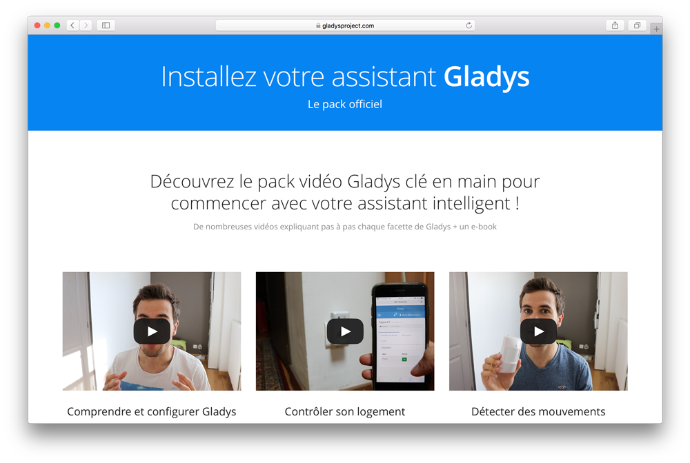

Salut à tous!

Comme vous avez pu le voir, le projet avance **beaucoup beaucoup** en ce moment! Et ça fait plaisir 🤗
L'objectif de cet article est de faire un petit bilan de l'avancement, et de vous montrer un peu ce qu'il y a dans les cartons. C'est vrai qu'en avançant dans le projet, je me rends compte d'une chose: Tout ce que je fais sur le projet sans en parler, sans communiquer dessus, ne sert pas à grand chose car n'est pas visible de l'extérieur. Comme dit le proverbe informatique, "If It Isn't Documented, It Doesn't Exist" ! Mon objectif sur la suite du projet est d'essayer de communiquer au maximum sur ce que je fais, que ce soit des sujets passionnants comme le coeur de Gladys, comme des choses moins centrales comme la refonte du site, l'amélioration des performances, etc...

Allez, c'est parti !

<!--truncate-->

## Gladys Starter Pack

La première news de cet article, c'est le lancement du tant attendu Gladys Starter Pack en pré-commande ! 🚀

C'est vrai que jusque là, malgré les explications, le forum, les scripts d'installation, les exemples sur les pages modules, il y avait un manque pour beaucoup d'un chemin "clair" à suivre pour mettre en place Gladys chez soit. Surtout quand on n'a pas forcément le temps d'aller fouiner, le temps d'aller mettre les briques les unes sur les autres. Une documentation écrite ne suffisait pas, il fallait pour ce besoin quelque chose de beaucoup plus guidé : des tutoriels vidéos.

Alors j'ai fait un sondage en début d'année pour savoir ce que vous en pensiez. Le résultat à la question "Es-tu intéressé par des tutoriels vidéos?" est sans appel :

Une question que certains m'ont posée a été : Pourquoi rendre ce pack payant ?

La réponse est assez simple. Dans tout projet, open-source ou pas, il y a des dépenses. Ici pour Gladys, voilà les différentes dépenses :

- Hébergement (Site, forum, plateforme développeur, noms de domaines, service d'emails, backups cloud, etc...)
- Matériel domotique
- Evénements physiques type Maker Faire Paris, talk (déplacement, matériel, affiches, flyer)
- Matériel vidéo (trépied, appareil, micro)
- etc..

Et c'est sans compter le temps de développement, de maintien de chaque plateforme, du site, des tutoriels, du core Gladys, des modules, etc ! 😄

Rassurez vous, **Gladys est une vraie passion pour moi**, et depuis 4 ans j'ai assumé tous ces coûts et ce temps personnellement, car c'est ce que j'aime !

Mais sur le long terme, plus il y a d'utilisateurs, et plus ces coûts augmentent. Et c'est souvent là que dans tout projet, ça passe ou ça casse. Ici, je vous rassure, ça va passer ! 💪 Mais ça passera grâce à vous !

Il y avait la solution du don, mais je n'aime pas vraiment cette solution. Je n'aime pas demander de l'argent "comme ça", je préfère qu'une vraie plus value soit apportée à l'utilisateur. J'ai donc conçu un pack solide et travaillé qui explique pas à pas la configuration de Gladys en vidéo + ebook. Honnêtement, vu le temps passé dessus et le contenu, je pense qu'il vaut son prix.

Et depuis dimanche dernier, ce pack est maintenant en ligne, et disponible en pré-commandes! 🚀

J'aimerais en tout cas dire un grand MERCI à ceux qui ont déjà pré-commandé le pack 🙌 Vraiment, ça me touche beaucoup :) Je ferai sûrement un petit mail pour ceux qui l'ont pré-commandé pour vous remercier personnellement, je suis vraiment heureux d'avoir une commmauté comme ça !

Pour ceux qui aimeraient découvrir ce pack, et contribuer au projet, les pré-commandes sont toujours ouvertes, et le pack est disponible au prix de 39€.

Après les pré-commandes, le pack passera à son prix final de 49€ !

Pour vous donner un état d'avancement du pack, **toutes les vidéos sont prêtes** (filmées + montées), il me reste juste du fignolage sur l'ebook. C'est donc en très bonne voie, et tout arrivera en fin d'été, début Septembre au maximum.

## Migration du site de PHP à Jekyll et disponible en open-source

La deuxième nouvelle de cet article, c'est la refonte **totale** du site Gladys ! Comme vous avez pu le voir, le nouveau site Gladys est tout beau tout neuf 👌 J'avais deux objectifs en le refaisant:

- Le rendre open-source, et donc **éditable par tous**
- Le rendre statique pour des performances maximales
- Avoir une vraie page d'installation plus documentée

Petit tour du propriétaire niveau techno !

### Un site 100% statique avec Jekyll

Le constat assez simple que j'ai fait au niveau du site Gladys, c'est qu'en vérité quasiment tout était statique sur le site. Les articles et les commentaires étaient stockés dans une base MySQL, les pages composées avec PHP et le micro-framework Silex, et tout ça hébergé sur un mutualisé en Irelande. Mais depuis un an, afin d'améliorer les performances, j'avais mis un CDN (CloudFlare) devant, qui mettait en cache le site complet pendant 24h. En gros, le mutualisé ne recevait qu'une requête par 24h et par ressource (soit quasiment rien). On était donc déjà sur du quasi statique.

Mais je voyais quand même des problèmes :

- J'étais le seul à pouvoir éditer le site, les articles, la documentation
- Le site n'était pas vraiment versionné (le site était sur Git, mais les articles dans la base de donnée et pas vraiment versionné)

Je suis donc passé à [Jekyll](https://jekyllrb.com/), un générateur de site statique.

Le principe est simple: j'écris des articles en Markdown, et au moment de publier le site, Jekyll build les articles et chaque page pour créer l'ensemble des pages HTML du site, qui ensuite peuvent être hébergées sur n'importe quelle plateforme d'hébergement statique (GitHub Pages, Amazon S3, etc...).

Il y a cependant 2 choses qui étaient dynamiques sur l'ancien site : Les commentaires, et le formulaire de contact. Rassurez-vous, je n'ai rien perdu!

#### Les commentaires avec Disqus

Pour les commentaires, je suis passé à Disqus, une plateforme assez répandue de commentaires qui s'installe en ajoutant un petit script JS à chaque page. Tout se passe donc côté client dans un script JS qui appel l'API Disqus.

Il y avait néanmoins un petit quelque chose avec Disqus qui me chagrinait: le SEO. Avec Disqus, les commentaires ne sont chargés qu'après le chargement de la page, et d'après mes tests, Google ne les indexe pas ou mal.

Mais j'ai trouvé une solution que Disqus propose: Générer au moment du build Jekyll tous les commentaires en HTML, de manière à ce que les moteurs de recherches puissent indexer les commentaires. (Les commentaires font donc partie de la page HTML). Mais pour l'utilisateur, quand il visite le site Gladys, le script JS clean le HTML des commentaires "statique", et va chercher la dernière version des commentaires via l'API Jekyll. On a donc le meilleur des deux mondes: du statique pour les moteurs de recherches, et du dynamique tout beau tout frais pour l'utilisateur final.

Mission accomplie ! ✅

#### Le formulaire de contact avec Amazon Lambda

Le formulaire de contact était tout bête: Lorsqu'un utilisateur le validait, une requête partait au serveur, qui m'envoyait un mail.

Mais là, sans serveur, ça devenait compliqué :D Et installer un back-end uniquement pour un pauvre formulaire de contact, je trouvais ça un peu lourd (et on perdait l'avantage du statique).

Je suis donc passé par Amazon Lambda. Concrètement, Amazon permet d'enregistrer des fonctions JS/Python/Java, qui peuvent être appelées via une API REST toute simple. Et le gros avantage, c'est le prix:

> L'offre gratuite Lambda comprend un million de requêtes offertes ainsi que 400 000 Go-secondes de temps de calcul par mois.

Parfait pour mon petit formulaire de contact! J'ai donc fait une petite fonction JS en 10 lignes qui m'envoie un mail dès que le formulaire est validé. Sachant que je reçois moins d'un million de messages par mois, je ne paierai probablement jamais pour l'appel de cette petite fonction.

Mission accomplie ! ✅

### Un site open-source, éditable par tous sur Github

Comme je disais, le gros enjeux de ce nouveau site était de le rendre éditable par tous, et donc open-source !

Le site est donc disponible sur Github => [https://github.com/gladysassistant/gladysassistant.com.jekyll](https://github.com/gladysassistant/gladysassistant.com.jekyll)

N'hésitez pas à créer des issues en cas d'erreurs, à proposer des pull-requests si vous avez des idées, si vous voulez enrichir la documentation: C'est open bar, et c'est fait pour !

Petite remarque: Bien que GitHub supporte Jekyll (et est donc capable de builder le site automatiquement), je ne passe pas par GitHub pour le build. La raison est simple, GitHub ne supporte qu'une liste restreinte de plugins Jekyll (pour des raisons de sécurité évidentes, ils ne vont pas exécuter n'importe quel code de leur côté). Hors, pour un site comme celui de Gladys (multi-langues, avec deux blogs en deux langues, avec des commentaires Disqus statique), je n'ai pas trouvé mon bonheur niveau plugin dans leur catalogue.

Je vais donc passer par un autre outil pour builder le site: soit CircleCI, soit TravisCI. Concrètement, ce sont des outils d'intégration continue qui se plug sur Github, et qui à chaque `git push` vont lancer un build sur leur plateforme. Tout simplement :)

## Les next-step pour le projet

De mon côté, j'ai plusieurs objectifs:

- Finir le Gladys Starter Pack
- Finir la nouvelle plateforme développeur Gladys (j'en parlais dans [mon dernier article bilan](/fr/blog/bilan-mois-mai-pour-le-projet-gladys))
- Faire différents fixs sur le coeur de Gladys

C'est déjà bien pour l'été, sachant que je serais 2 semaines en vacances cet été du 15 au 29 août! (L'instant repos de l'année 😴)

Et à la rentrée, je reviens les batteries chargées à bloc pour plein de nouveaux projets sur Gladys!

J'ai notamment de belles idées pour améliorer la partie scénario dans Gladys (#teasing), et pour enrichir toute la partie discussion avec Gladys. Et bien sûr, de nombreuses intégrations sont prévues! (Qui a dit Lifx? Fitbit ? RFXCom ? Milight new gen?)

## Conclusion

Encore une fois, MERCI à tous ceux qui ont soutenu le projet via le pack !

C'est grâce à vous que le projet existe depuis 4 ans, et vu votre engouement le projet va continuer à prendre de l'ampleur, pour devenir je l'espère une référence en matière de domotique et d'intelligence.

Merci à tous 👏👏
