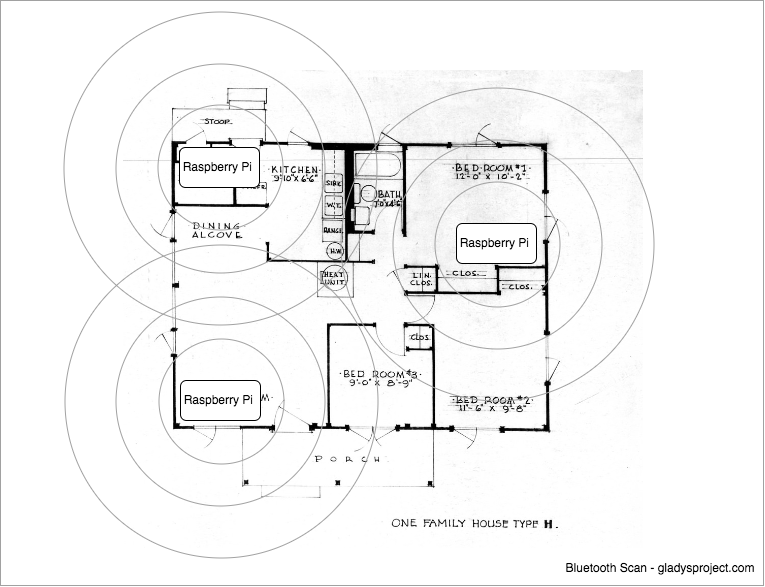
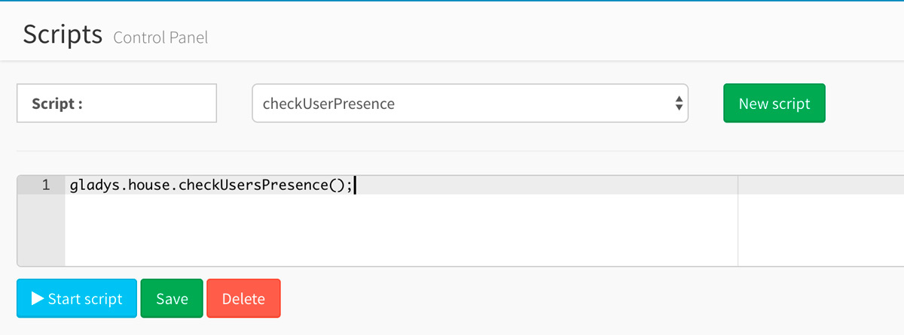
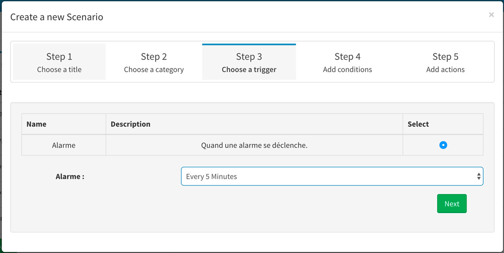
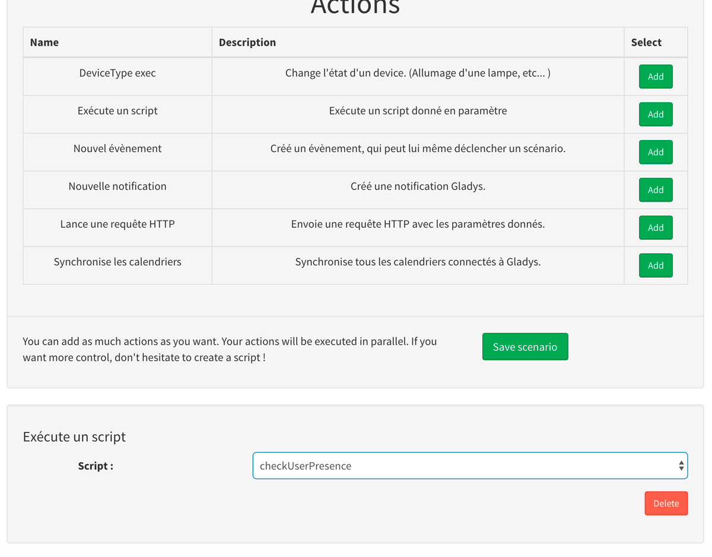

<div class="alert alert--danger" role="alert">
  Update: 21/07/2020: Ce tutoriel est destiné à Gladys v3, il ne fonctionne pas avec Gladys v4 ! 
</div>

Salut à tous !

Savoir qui exactement est à la maison a toujours été un véritable défi dans Gladys, surtout quand il y a plusieurs personnes dans le logement.

Il n'est en effet pas possible de se baser sur des détecteurs de mouvements, car ceux-ci n'apportent pas d'informations sur l'idendité de celui qui rentre dans une pièce : personne A ? personne B ? Intru ?

Pour palier à ça, beaucoup d'entre vous ont mis en place des solutions comme des badgeuses NFC dans l'entrée par exemple ou d'autres solutions basée sur du déclaratif. Mais le problème, c'est qu'en cas d'oubli lors d'un retour/départ pressé, Gladys ne sait pas si vous êtes rentré/parti, et notre domotique ne sert plus à grand chose.

Il y avait une solution alternative que j'avais proposé récemment, il s'agit du scan du réseau Wi-Fi afin de détecter votre smartphone. Cette solution fonctionnait bien, mais tout le monde ne se connecte pas forcément systématiquement au Wi-Fi et en cas de panne batterie sur le smartphone, nos scénarios domotiques tombent encore à l'eau.

Mais rassurez-vous, j'ai une nouvelle solution, et qui en plus est **très économique** !

<!--truncate-->

## Scanner le Bluetooth avec le Raspberry Pi

Le principe est simple, nous allons utiliser un ou plusieurs Raspberry Pi afin de scanner en Bluetooth notre logement à un interval régulier. Lors du scan, le Raspberry Pi va voir les périphériques présents autour de lui : Votre bracelet connecté ? Votre porte clé Bluetooth ? Et ainsi déduire que vous êtes présent dans le logement. Car on part rarement sans ses clés de la maison, ou sans son bracelet connecté !

Je parle de porte clé Bluetooth, il s'agit d'un porte clé créé à la base pour éviter de perdre ses clés, qui normalement se connecte au smartphone et vous préviens quand vos clés s'éloignent.

Voilà à quoi il ressemble (on ne se moque pas du rose, au moment de ma commande c'était le moins cher -- maintenant vous avez de la chance c'est le blanc le moins cher)

import InstagramEmbed from 'react-instagram-embed';

<InstagramEmbed
url='https://www.instagram.com/p/BZEIPSFAmxH/'
maxWidth={320}
hideCaption={false}
containerTagName='div'
protocol=''
injectScript
/>

Avec un peu d'astuce, il est même possible de localiser l'utilisateur dans la maison en triangulant sa position si l'on a plusieurs Raspberry Pi. En effet, lorsqu'on scan le réseau Bluetooth, on reçoit des informations sur chaque device comme son RSSI (Received Signal Strength Indication) qui permet ensuite de calculer approximativement la distance entre le Raspberry Pi et le device Bluetooth. Avec plusieurs distances, on peut trianguler l'utilisateur et avoir sa position plus ou moins précise dans le logement.

Je vous ai fais un petit schéma pour que vous visualisiez mieux ce que ça va donner :



Vous remarquerez que j'ai mis ici 3 Raspberry Pi pour l'exemple, mais en pratique j'arrive largement à couvrir mon logement avec un seul Raspberry Pi 3 en le plaçant de façon central dans le salon. A voir en fonction de votre logement :)

## Le matériel

En pratique, vous avez besoin de deux choses :

- Un <a href="https://www.amazon.fr/gp/product/B01CD5VC92/ref=as_li_qf_sp_asin_il_tl?ie=UTF8&tag=gladproj-21&camp=1642&creative=6746&linkCode=as2&creativeASIN=B01CD5VC92&linkId=c0e3b1ab4887e4f5d140f4584efed3d7" rel="nofollow">Raspberry Pi 3</a> ou un <a href="https://www.amazon.fr/gp/product/B06XCYGP27/ref=as_li_qf_sp_asin_il_tl?ie=UTF8&tag=gladproj-21&camp=1642&creative=6746&linkCode=as2&creativeASIN=B06XCYGP27&linkId=613a1dc69251e92d26cc3c83062cb50b" rel="nofollow">Raspberry Pi Zero</a>
- Un <a href="https://www.amazon.fr/gp/product/B01AUNMQMG/ref=as_li_qf_sp_asin_il_tl?ie=UTF8&tag=gladproj-21&camp=1642&creative=6746&linkCode=as2&creativeASIN=B01AUNMQMG&linkId=c8c3d0576a70e89bbd67591379eb3dfc" rel="nofollow">porte clé Bluetooth Nut à 8€</a>

Petit point sur le porte clé Bluetooth Nut. On me l'a conseillé à la Maker Faire Paris, et j'ai décidé de partir sur ce modèle ! Après 2 semaines d'utilisations, il est très fiable et je ne suis pas déçu de mon achat. Je n'ai pas encore de recul sur l'autonomie, mais le constructeur parle d'une autonomie d'un an. En sachant que derrière ce n'est qu'une petite pile bouton CR2016 que l'on peut racheter en lot pour vraiment pas cher (J'ai vu des lots de 5 piles à 2€ sur Amazon)

## Le software

J'ai donc écris un petit programme, dites bonjour à gladys-bluetooth, disponible sur [GitHub](https://github.com/gladysassistant/gladys-bluetooth) ! Ce programme a la particularité de ne pas avoir besoin de Gladys pour tourner.

Son principe est simple, il scan le Bluetooth, et dès qu'il voit un périphérique il envoie la nouvelle à Gladys via une simple requête HTTP. On peut donc avoir de multiple instances de gladys-bluetooth sur un ensemble de Raspberry Pi Zero distribué, qui remontent l'information à un Raspberry Pi 3 central qui fait tourner Gladys.

### Pré-requis

Pour utiliser Gladys bluetooth, il faut avoir Gladys en version v3.6.3 au minimum. Pensez à mettre à jour Gladys avant d'installer Gladys bluetooth !

### Installation

Pour installer Gladys bluetooth, connectez-vous en ligne de commande sur votre Raspberry Pi, et exécutez les commandes suivantes :

Clonez le repository

```
git clone https://github.com/gladysassistant/gladys-bluetooth
```

Déplacez-vous dans le dossier :

```
cd gladys-bluetooth
```

Installez les dépendances grâce à yarn ou npm.

Si vous avez yarn d'installé (c'est le cas sur l'image Raspbian Gladys)

```
yarn install
```

Sinon, faites :

```
npm install
```

Ensuite, éditez la configuration afin de spécifier l'IP de votre instance Gladys principale :

```
nano config.js
```

Remplacez chaque ligne avec vos valeurs.

Ensuite, il faut autoriser Node.js à accéder au Bluetooth sans être root en exécutant :

```
sudo setcap cap_net_raw+eip $(eval readlink -f `which node`)
```

Ensuite, il faut lancer la phase "découverte" du module afin que vous puissiez inclure votre objet Bluetooth dans Gladys. La phase découverte n'est pas active tout le temps, cela évite que des périphériques inconnus apparaissent dans votre Gladys :)

Pour lancer la phase découverte, lancez la commande sur le Raspberry Pi :

```
node /home/pi/gladys-bluetooth/setup.js
```

Placez vos objets Bluetooth à proximité. Ils devraient être ajouté dans Gladys. Une fois que tous les objets sont dans Gladys, vous pouvez stopper cette commande en faisant "Ctrl + C".

Enfin, je vous propose de lancer Gladys Bluetooth avec pm2 :

```
pm2 start /home/pi/gladys-bluetooth/app.js --name gladys-bluetooth
```

Si jamais à l'avenir vous avez besoin d'ajouter de nouveaux périphériques, vous pouvez bien entendu relancer la découverte :)

**Remarque 1** : Si vous avez cloné le repository autre part que dans `/home/pi/gladys-bluetooth`, remplacez le chemin dans la commande ci-dessus.

**Remarque 2** : Si vous n'avez pas pm2 et que vous voulez juste tester, lancez le programme avec la commande `node app.js`.

**Remarque 3** : Si vous voulez tester ce programme sur un autre système que Linux, vous pouvez suivre les instructions du module que j'utilise pour le Bluetooth, [Noble](https://github.com/sandeepmistry/noble). Sa FAQ vous aidera probablement :)

## Configurer Gladys

Ensuite, dans Gladys vous devriez retrouver les périphériques vus par Gladys-bluetooth dans la vue "Devices". Vous devez maintenant affecter chaque périphérique Bluetooth qui vous "appartient". Attention, quand vous déclarer à Gladys que ce périphérique Bluetooth vous appartient, dès que le périphérique sera vu à la maison vous serez marqué comme "vu" à la maison. Ne vous assignez pas des périphériques qui ne bougent pas de la maison, mais que des périphériques qui vous suivent toute la journée (porte clé, bracelet) !

Voilà un exemple chez moi, je suis détectable via mon bracelet Fitbit Charge 2 ou mon porte clé Nut. J'ai donc assigné ces deux périphériques à mon compte Gladys =>


Ensuite, dans les "Paramètres" => "Paramètres" sur le dashboard Gladys, définissez la variable `USER_TIME_BEFORE_CONSIDERING_LEFT_HOME` qui correspond au temps en minutes avant que Gladys vous considère comme absent si vous n'êtes pas vu à la maison. J'ai mis 10 minutes pour ma part, mais on peut mettre plus court.


Puis créez un script avec comme code :

```
gladys.house.checkUsersPresence();
```



Lorsque ce script s'exécutera, Gladys vérifiera la dernière fois que vous avez été vu à la maison. Si c'est supérieur à la variable `USER_TIME_BEFORE_CONSIDERING_LEFT_HOME`, alors Gladys déclenchera l'event "left-home" => vous serez marqué comme absent de la maison, et si vous avez défini un scénario type "couper tout chez moi quand je pars", le scénario sera exécuté.

Maintenant il faut que l'on dise à Gladys d'exécuter ce fameux script toutes les X minutes.

Créez une alarme de type `Cron` dans les alarmes, et mettez comme contenu `*/5 * * * *`, ce qui veut dire "toutes les 5 minutes". Enregistrez l'alarme.


Puis dans les scénarios, nous allons dire à Gladys "Dès que l'alarme toutes les 5 minutes se déclenche => Lancer le script".

Allez dans Scénarios, donnez un titre à votre scénario, puis sélectionnez comme Trigger "Alarmes" => "Quand une alarme se déclenche". Sélectionnez votre alarme "Toutes les 5 minutes".



Sauter l'étape conditions, et dans "Actions" sélectionnez "Exécute un script" puis sélectionnez le script que vous avez créé précédemment.



Et c'est tout ! Gladys est désormais prête à vous détecter à la maison.

Vous devriez retrouver ce genre d'événéments dans la vue "Moi" de votre Gladys :


## Conclusion

J'espère que ce tutoriel vous aura plu et que comme moi vous voyez tout le potentiel de ces petits périphériques Bluetooth.

Ce module n'est que le début du Bluetooth dans Gladys, l'ambition à terme est de gérer de plus en plus de périphériques domotiques Bluetooth (Ampoules Bluetooth, des périphériques comme le Parrot Flower Power par exemple).
