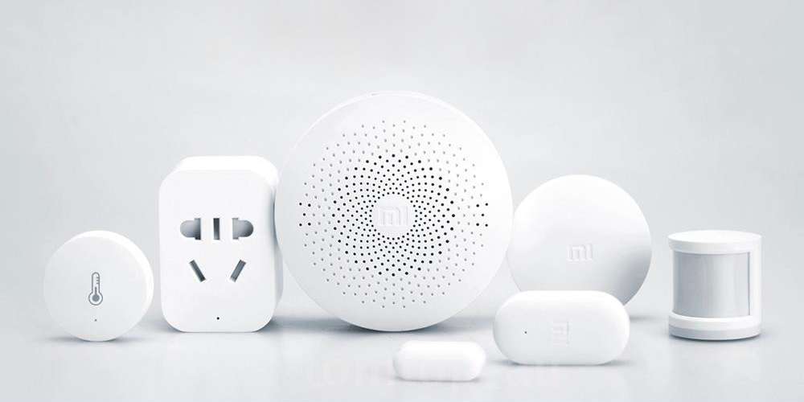
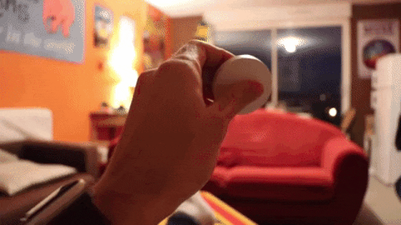
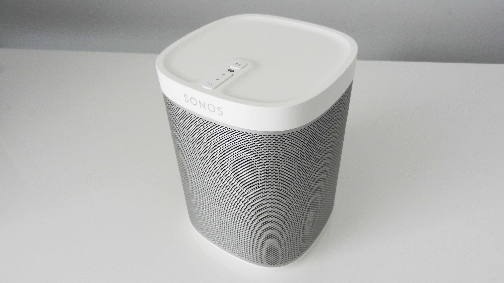

Salut à tous !

Noël arrive, est-ce que ça serait pas l'occasion de commencer sur Gladys en commandant du matos au Père Noël ?

Mais encore faut-il savoir par quoi commencer !

L'objectif de ce post est de faire un petit point des essentiels pour commencer sur Gladys, des différentes setups possible en fonction de vos besoins.

<!--truncate-->

## Le Raspberry Pi : La base de la base

Pour faire tourner Gladys, il vous faut forcément une machine qui va l'exécuter. Cette machine, c'est souvent un Raspberry Pi : un nano-ordinateur petit, consommant peu, silencieux et surtout à bas prix!

import InstagramEmbed from 'react-instagram-embed';

<InstagramEmbed
url='https://www.instagram.com/p/7cyO2Xhq9P/'
maxWidth={320}
hideCaption={false}
containerTagName='div'
protocol=''
injectScript
/>

Cette carte existe depuis maintenant 2012, et a fait depuis tout un bout de chemin. A la base peu puissant, le Raspberry Pi 3 c'est désormais une machine ARM Quad Core 1.2Ghz avec 1Go de RAM, bref un vrai petit PC prêt à contrôler toute notre maison !

Le Raspberry Pi coûte en lui même 35€. En kit avec alimentation, boitier, et carte micro-SD on le trouve aux alentours de 50€ sur Amazon.

- <a href="https://www.amazon.fr/gp/product/B01CD5VC92/ref=as_li_qf_sp_asin_il_tl?ie=UTF8&tag=gladproj-21&camp=1642&creative=6746&linkCode=as2&creativeASIN=B01CD5VC92&linkId=618f72a79279d88366a9344ebff83e40" rel="nofollow" >Le Raspberry Pi 3 nu à 35€ sur Amazon</a>
- <a href="https://www.amazon.fr/gp/product/B01CI5879A/ref=as_li_qf_sp_asin_il_tl?ie=UTF8&tag=gladproj-21&camp=1642&creative=6746&linkCode=as2&creativeASIN=B01CI5879A&linkId=3eb4e79d1cabd4cf1ebeafb61d8d29cd" rel="nofollow">Le kit Raspberry Pi à 52€ sur Amazon</a>

## Des capteurs à bas prix Xiaomi

Mon gros coup de coeur de cette année, c'est le kit Xiaomi Home, et ce pour deux raisons. Déjà, il n'est pas cher (déjà un très bonne argument), mais en plus de ça leurs périphériques sont de très bonne factures. Au niveau de la techno, Xiaomi a choisi le Zigbee, et c'est selon moi un très bon choix. C'est une techno robuste (aussi utilisée sur les Philips Hue par exemple), qui permet aux devices de consommer très peu et d'avoir une bonne portée. Pour relier ces périphériques Zigbee à internet, vous devez acheter un gateway Xiaomi qui fait le pont entre votre box en Wi-Fi et ces devices Zigbee.

En bref, ça marche super bien! Le seul truc que je trouve "marrant" avec ce gateway, c'est qu'à chaque fois que vous le mettez à jour/que vous le configurez, il se met à parler en chinois dès que la mise à jour est terminée. Mes colocs se demandent encore pourquoi derrière notre meuble télé un boitier parle parfois en chinois 😁

- <a href="https://fr.gearbest.com/living-appliances/pp_344667.html?wid=55" rel="nofollow" >Le Gateway Xiaomi à 24€ sur Gearbest</a>
- <a href="https://fr.gearbest.com/access-control/pp_626702.html?wid=55" rel="nofollow" >Le Xiaomi Aqara Capteur d'humidité + Température à 7€ sur Gearbest</a>
- <a href="https://fr.gearbest.com/smart-light-bulb/pp_257679.html?wid=55" rel="nofollow" >Le Xiaomi Switch, bouton connecté à 6€ sur Gearbest</a>
- <a href="https://fr.gearbest.com/xiaomi-aqara-_gear/" rel="nofollow" >Le Xiaomi Aqara détecteur ouverture porte et fenêtre à 6€ sur Gearbest</a>

Mon article [Gladys devient compatible Xiaomi Home](https://gladysassistant.com/fr/blog/gladys-devient-compatible-xiaomi-home).

## Détecter votre présence grâce à un porte clé Bluetooth

Savoir exactement quand vous rentrez/partez de la maison à toujours été un défi en domotique. Aujourd'hui, avec un petit porte clé Bluetooth accroché à votre trousseau de clé et le Raspberry Pi 3 (qui est Bluetooth) il est très facile de savoir qui exactement est à la maison.

Gladys va écouter en Bluetooth, et dès qu'un périphérique apparait dans la portée de votre Raspberry Pi, c'est que vous êtes là! Si votre porte clé disparait, c'est que vous êtes absent. Tout simple 😊

Cette détection, je l'utilise depuis quasi 3 mois, et ça marche juste parfaitement. Je n'ai pour l'instant pas eu un seul raté, quand je rentre je suis détecté instantanément. Super pratique pour faire des petits scénarios "Quand je rentre à la maison, mettre ma playlist personnelle + allumer la lumière" ou "Quand je pars de la maison Alors couper tout (musique + lumière)"

- <a href="https://www.amazon.fr/gp/product/B01AUNMQMG/ref=as_li_qf_sp_asin_il_tl?ie=UTF8&tag=gladproj-21&camp=1642&creative=6746&linkCode=as2&creativeASIN=B01AUNMQMG&linkId=c8c3d0576a70e89bbd67591379eb3dfc" rel="nofollow" >Le porte-clé Bluetooth à 10€ sur Amazon</a>

Le tutoriel => [Détecter la présence de l'utilisateur grâce à un porte clé Bluetooth !](/fr/blog/detecter-presence-porte-cle-bluetooth)

## Gérer ses lumières

Une des interactions que je trouve la plus whaou dans Gladys, ça reste la lumière. Etre capable d'envoyer un petit message à Gladys disant "Allume ma lumière du salon", et instantanément voir la lumière du salon s'allumer, ça en jette quand même pas mal 😎

Surtout en combinant ces lampes avec le porte clé Bluetooth de l'exemple précédent, vous pouvez faire des scénarios plutôt sympa.

Pour les lumières, deux options, la première c'est les Philips Hue: des lampes assez haut de gamme dont la lumière peut varier en intensité et en couleur. C'est ce que j'ai chez moi et je n'en suis pas déçu !

L'autre option, c'est les ampoules Milight, des ampoules chinoises plus abordables niveau prix.

- <a href="https://www.amazon.fr/gp/product/B01LZ8QYPI/ref=as_li_qf_sp_asin_il_tl?ie=UTF8&tag=gladproj-21&camp=1642&creative=6746&linkCode=as2&creativeASIN=B01LZ8QYPI&linkId=677b7acf047b61389e9a76548be071a2" rel="nofollow" >Le kit de démarrage Philips Hue à 199€ sur Amazon</a>
- <a href="https://www.amazon.fr/gp/search/ref=as_li_qf_sp_sr_il_tl?ie=UTF8&camp=1642&creative=6746&index=aps&keywords=milight%20lamp&linkCode=as2&tag=gladproj-21" rel="nofollow" >Les ampoules Milights</a>

## La musique dans Gladys

Pour gérer la musique, deux options, soit vous optez pour le module Gladys MP3 Player qui vous permet de jouer la musique directement sur le Raspberry Pi (que vous branchez ensuite en jack/HDMI à vos enceintes).

L'autre option, c'est les enceintes Sonos qui fournissent un son puissant (très puissant même, demandez à mes voisins 😁), et surtout de qualité. L'avantage des Sonos c'est quelles se connectent en Wi-Fi ou Ethernet à votre box, et ensuite elles sont contrôlable par n'importe qui dans la maison, dont Gladys. Leur prix a pas mal baissé depuis 2 ans en plus :)

- <a href="https://www.amazon.fr/gp/product/B00FSCNLME/ref=as_li_qf_sp_asin_il_tl?ie=UTF8&camp=1642&creative=6746&creativeASIN=B00FSCNLME&linkCode=as2&tag=gladproj-21" rel="nofollow" >L'enceinte Sonos Play:1 à 179€ sur Amazon</a>

## Le Gladys Starter Pack en promotion pour Noël

Si vous souhaitez commencer avec Gladys facilement, je vous propose un starter pack composé d'un ensemble de vidéos + un ebook de 60 pages qui explique comment mettre en place chaque partie de Gladys.

A l'occasion de Noël, le Gladys Starter Pack est en promotion à <b>37,90€ au lieu de 49€</b> !

L'occasion de soutenir le projet à bas prix !

Merci à tous ceux qui l'ont déjà acheté et soutiennent ainsi le projet :)

## Conclusion

Année après année, le matériel devient de plus en plus abordable pour faire de la domotique chez soit. C'est top car ça va permettre à beaucoup de gens de nous rejoindre sur Gladys ! Pour toute question, n'hésite pas à les poser en commentaires, ou à venir sur le forum.

PS: J'organise un meetup Gladys sur Paris le Mercredi 13 Décembre, pour s'inscrire [c'est ici](https://www.eventbrite.fr/e/billets-meetup-gladys-project-un-assistant-domotique-intelligent-open-source-39826425912) ! N'hésitez pas à me contacter si vous souhaitez un talk Gladys dans votre entreprise/établissement/conférence.
