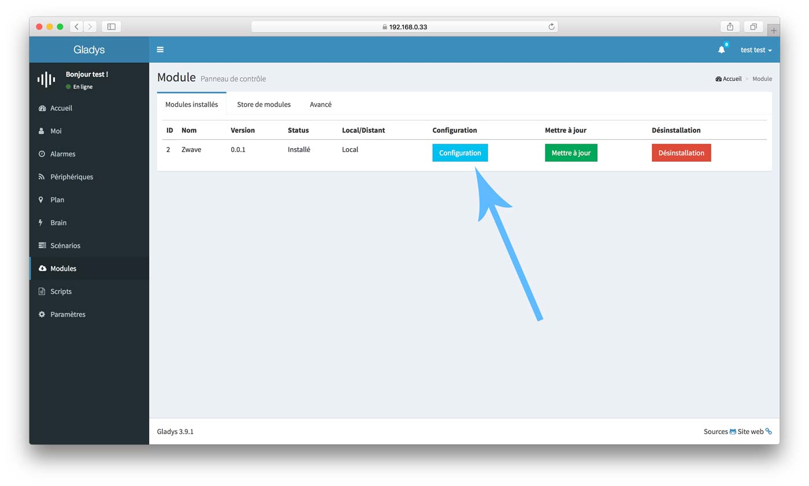
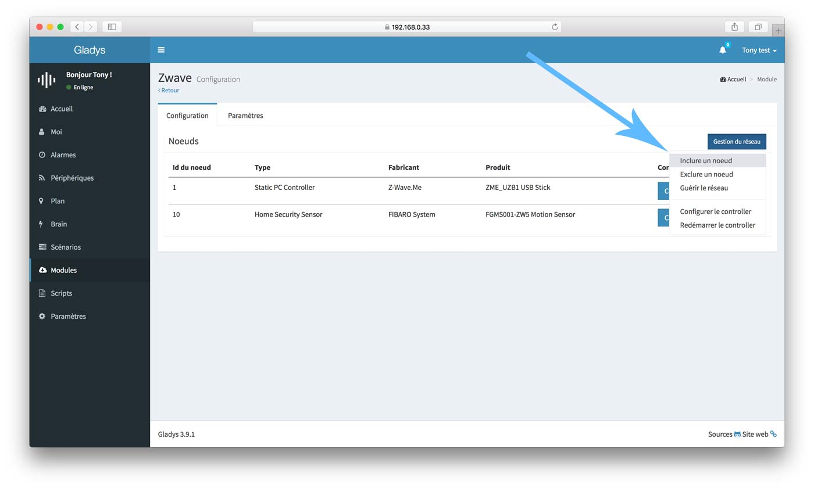
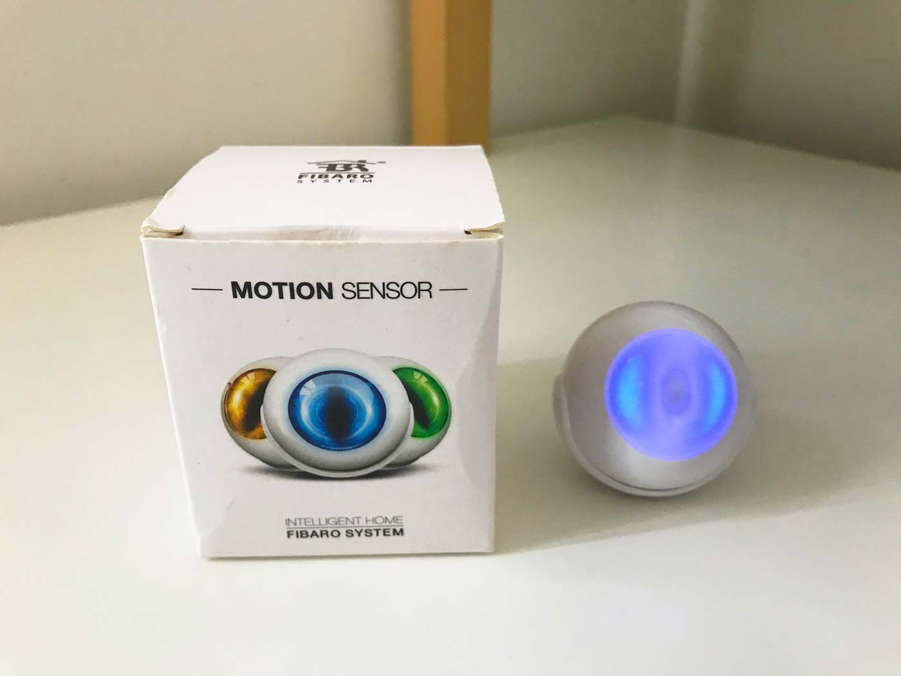
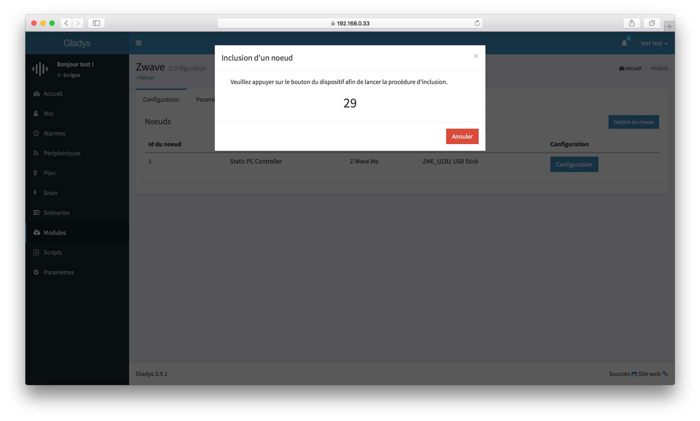
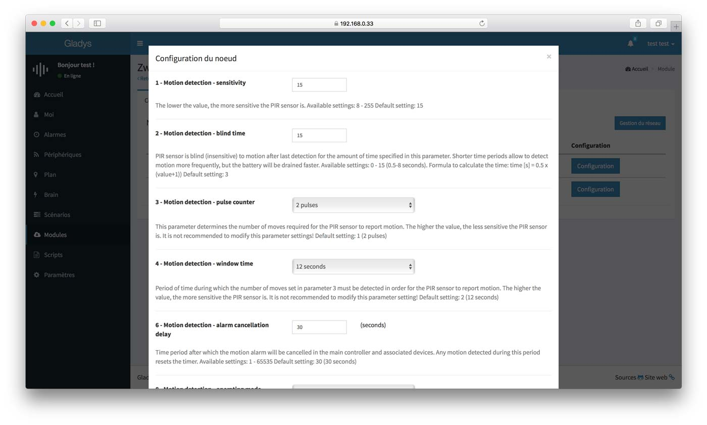
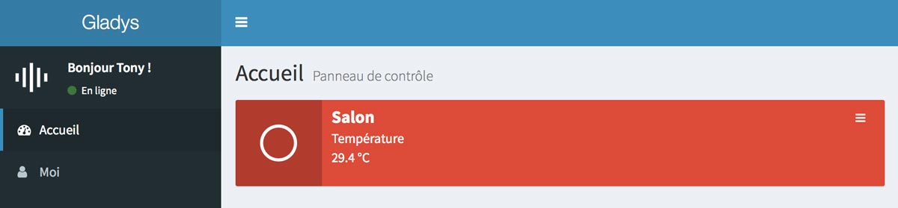
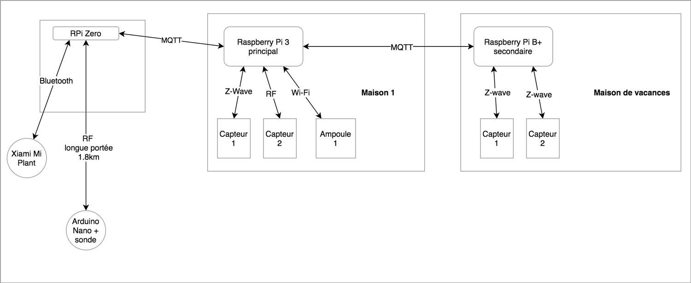
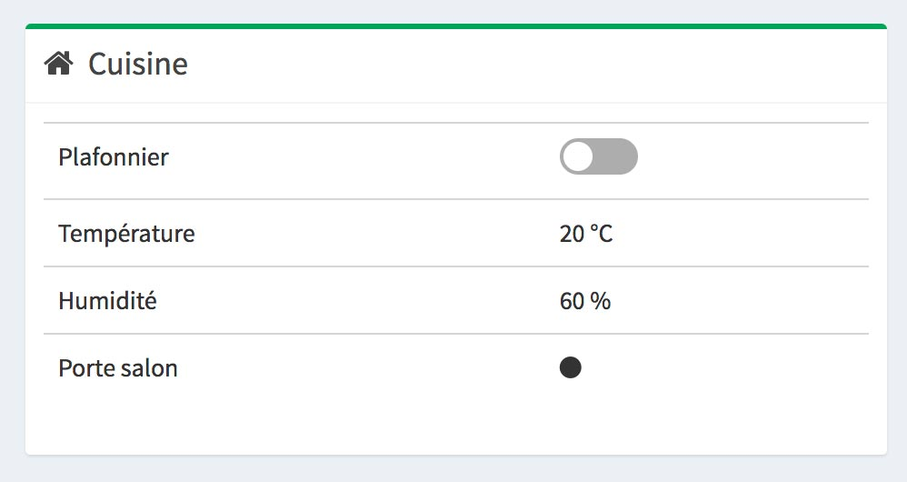
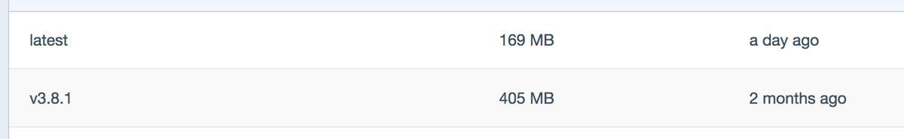

Salut à tous,

Cela fait un bout de temps que l'on travaille dessus, et elle est là : Gladys v3.9 est disponible !

Je dis "on", car cette mise à jour n'est pas uniquement le fruit de mon travail, c'est un regroupement d'un ensemble de contributions proposées par la communauté, aussi bien via des retours que j'ai eu sur le forum, sur GitHub, que des pull-requests proposées par des utilisateur Gladys.

Je listerais dans cet article tous les changements notables sur cette version. Bien entendu, il y a un ensemble de petites corrections de bugs dont je ne parlerais pas mais qui sont toujours appréciables 😉

<!--truncate-->

## Une vue configuration pour les modules

Jusque là, les modules ne pouvaient pas avoir une vue de configuration à eux, ils ne se contentaient que d'un bouton "configuration" qui déclenchait selon le module une action particulière. Par exemple l'ancien module Z-Wave se servait de ce bouton pour passer et sortir du mode "inclusion". Mais pour l'utilisateur, c'était complexe car il n'y avait aucun retour visuel, ce n'était pas super pratique.

Désormais, les modules peuvent avoir leur propre vue de configuration, qui est accessible dans la page module en cliquant sur le bouton "Configuration".



Le module Z-Wave est le premier module à mettre en place une vue de configuration!

## Le module Z-Wave

C'est un énorme travail qui a été effectué par [@MathieuAndrade](https://twitter.com/MathieuAndrade), le module Z-Wave prend désormais complètement partie de la vue configuration des modules, et propose toutes les fonctionnalités de gestion d'un réseau Z-Wave.

Lorsqu'on accède à la vue de configuration du module, on tombe sur ça :



Vous pouvez passer en mode inclusion, passer en mode exclusion, gérez vos noeuds, guérir le réseau. Ce module est désormais un vrai module Z-Wave complet !

Par exemple, si je configure le fameux <a href="https://www.amazon.fr/gp/product/B00JHHNUPY/ref=as_li_qf_sp_asin_il_tl?ie=UTF8&camp=1642&creative=6746&creativeASIN=B00JHHNUPY&linkCode=as2&tag=gladproj-21" rel="nofollow" >détecteur de mouvement Fibaro</a> :



Je passe en mode inclusion dans Gladys :



J'appuie trois fois sur le bouton au dos du capteur, et celui-ci se retrouve directement dans l'interface.

Si je clique sur le bouton "Configuration" dans l'interface puis que je ré-appuie 3 fois sur le bouton au dos du capteur, je peux voir toutes les options que ce capteur propose et les régler.



Enfin, toutes les données que remontent ce capteur Z-Wave sont remontées dans un périphérique natif Gladys, et on peut afficher ces valeurs dans l'interface, comme par exemple sur une box du dashboard :



Vous l'avez compris, ce nouveau module est **extrêment puissant**. Là ou dans le passé il fallait forcément passer par une box externe pour gérer son réseau Z-Wave, il est désormais possible de ne passer plus que par Gladys !

Pour mettre à jour le module, il faut passer en Gladys v3.9, puis désinstaller et réinstaller le module.

Si vous avez des retours à l'utilisation de ce module, n'hésitez pas à les publier en commentaire de ce post ou encore mieux sur le forum :)

Si vous voulez commencer avec le Z-Wave, je vous conseille l'excellent stick USB Z-Wave.me à <a href="https://www.amazon.fr/gp/product/B00QJEY6OC/ref=as_li_qf_sp_asin_il_tl?ie=UTF8&camp=1642&creative=6746&creativeASIN=B00QJEY6OC&linkCode=as2&tag=gladproj-21" rel="nofollow">30€ sur Amazon</a>.

## Un nouveau type de modules Gladys "à distance"

C'est un projet dont j'ai beaucoup parlé depuis plusieurs mois sur le forum, c'est la possibilité d'avoir des modules s'installant à distance de Gladys (et plus directement dans le core donc), et communiquant avec Gladys via MQTT.

Pour ceux qui ne connaissent pas MQTT, c'est un protocole de messagerie publish-subscribe.

Dans le cas de Gladys, Gladys peut désormais communiquer avec ces modules via un broker MQTT comme Mosquitto, et ainsi avoir de la communication bi-directionnelle avec eux.

Pour donner un exemple concret, imaginons que je veux que Gladys puisse parler dans toutes les pièces de ma maison. Avec cette architecture, il suffit d'installer un module distant "speak" sur un ensemble de Raspberry Pi Zero W dans toute ma maison, chaque module se connectant à un broker MQTT hébergé sur un Raspberry Pi central hébergeant une instance Gladys principale.

Lorsque Gladys veut parler dans une pièce, elle n'a qu'à publier un événement dans le broker MQTT contenant la phrase à dire, événement qui sera intercepté par le Raspberry Pi Zero W dans la bonne pièce.

Voilà un schéma qui récapitule les possibilités apportés par ce genre d'architecture, architecture où il n'y a plus un seul Gladys faisant tourner tous les modules mais un ensemble de modules "esclaves" pilotés à distance par Gladys :



J'espère que vous voyez comme moi toutes les possibilités offertes par ce nouveau type de modules 😄

Je ferais un tutoriel pour expliquer comment développer un module compatible MQTT.

## Une nouvelle box

C'est une petite nouveauté qui en est une grande !

Il y a désormais une nouvelle box sur l'écran d'accueil vous permettant d'afficher tous les périphériques d'une pièce.

Cette box ressemble à ça :



Pour la mettre en place, rendez-vous comme toujours dans les paramètre de Gladys > "Box".

## Un peu de sécurité

C'est un aspect très important en domotique, et que je prend très à coeur dans Gladys : la sécurité.

La sécurité doit être irréprochable sur Gladys.

Dans cette release j'ai travaillé sur quelques points qui manquaient à Gladys.

### Limitation des tentatives de login

Il était déjà possible de sécuriser cette partie via des outils de ban d'IP, mais j'ai voulu l'ajouter nativement à Gladys afin d'être sûr que chaque instance soit bien protégée.

Concrètement j'ai ajouté un rate-limiter sur toutes les routes sensibles de Gladys (principalement le login et la route de mot de passe oublié), afin de limiter les tentatives de connexions à ces routes.

C'est à dire que si quelqu'un/ou un bot essaie de se connecter un trop grand nombre de fois à Gladys, il sera banni pendant une période donnée, et cela automatiquement. Cela empêche les attaques par brute-force.

La prochaine étape sur cette partie sécurisation du login, c'est le développement de l'authentification à deux facteurs via des OTP (One Time Password). Cela fait partie de ma roadmap sur Gladys au niveau sécurité 🙂

### Gestion des mots de passe

Deux petites fonctionnalités qui n'étaient pas présentes jusque-là mais très utile au quotidien: Le mot de passe oublié et le changement de mot de passe.

Jusque-là, en cas de mot de passe oublié, il fallait aller manuellement dans la DB mettre un nouveau hash, ce qui je l'avoue n'est pas très pratique... Ce n'est plus le cas, il y a désormais un lien "j'ai oublié mon mot de passe" sur la page de login 😄

Ce que fait cette fonctionnalité, c'est qu'elle va afficher dans les logs un lien de reset de mot de passe. Car oui, quand on développe sur ce genre de projet ce n'est pas aussi simple qu'un site classique, je ne pouvais pas envoyer un email à l'utilisateur avec un lien car Gladys fonctionne offline pour certains ! Il fallait donc penser l'usage pour ces cas là aussi.

Une fois le lien récupéré, il faut le copier-coller dans un navigateur, et ensuite l'utilisateur pourra changer son mot de passe.

Ainsi je m'assure que l'utilisateur est bien le propriétaire de l'instance Gladys, et pas un intru.

## Le support de Node.js 10

Certains avaient testé Gladys avec Node 10, et ça ne fonctionnait pas. C'était normal, car cette nouvelle version amène des changements majeurs qui affectent certaines dépendances natives que nous utilisons comme le module bcrypt.

J'ai mise à jour ces dépendances et désormais Gladys fonctionne sous Node 10.

Néanmoins, pour tous les utilisateurs de Gladys, **je vous conseille de rester en Node 8**.

En effet, le cycle de version de Node.js est particulier, il y a toujours une version LTS (Long Term Support): c'est une version stable dont la durée de vie est garantie et le support aussi, et une version "latest" qui correspond aux derniers changements.

Node 10 est la version "latest". Il n'est pas rare qu'en version latest des fonctionnalités cassent à cause de changements dans Node.js qu'une dépendance, ou Gladys, gère mal.

Ce qui nous intéresse dans Gladys, c'est la stabilité. Nous resterons en Node 8 tant que Node 8 sera la LTS.

## L'image Gladys Docker passe en Node Alpine

Petit changement sympa apporté par [@VonOx](https://twitter.com/VonOx) cette semaine, l'image Gladys Docker passe désormais en Node.js alpine.

Pour ceux qui ne connaissent pas, Alpine est une distribution Linux très très légère ne contenant que le minimum. Ainsi, en changeant l'image de base node à l'image Docker node-alpine, l'image Docker Gladys passe de 405 MB a 169 MB, soit 236 MB d'économisé!

Et ça, c'est perf ⚡️



## Comment passer en Gladys 3.9 ?

### Si vous utilisez l'image Gladys Raspbian

Là, c'est très simple! Connectez vous en SSH à votre Raspberry Pi, puis faites la commande :

```
./rpi-update.sh
```

Gladys sera mise à jour automatiquement !

En cas d'erreurs, n'hésitez pas à venir sur le forum pour en parler.

### Si vous avez installé Gladys manuellement

- Faites un `git pull origin master` pour récupérer les derniers changements
- Lancez un `yarn` pour installer les dépendances
- Faites un `grunt buildProd` pour rebuilder le front-end client
- Enfin relancez Gladys !

## Conclusion

Cette mise à jour, c'est le fruit du travail de toute une communauté, et c'est plusieurs week-ends full time de mon côté pour recoller les bouts et faire de tout ça une mise à jour propre et installable facilement.

Merci à tous ceux qui ont contribués !

Pour ceux qui ont loupés la nouvelle, j'ai annoncé début juillet que [j'allais passer à temps partiel sur Gladys](/fr/blog/grande-nouvelle-gladys) 🚀😀

**Edit 2020: Le Patreon n'existe plus en faveur de notre nouveau plan Gladys Plus !**

A l'occasion, j'ai lancé un Patreon afin de demander un soutien financier à la part de communauté pour pouvoir mener à bien ce projet !

A ce jour, la communauté contribue à hauteur de 438$/mois au projet, et le prochain objectif à 500$ n'est pas loin !

Merci à tous ceux qui ont contribués, et à tous ceux qui contribueront à l'avenir.

**C'est grâce à eux que des projets open-source et libre peuvent exister !**

A bientôt sur Gladys 😎
