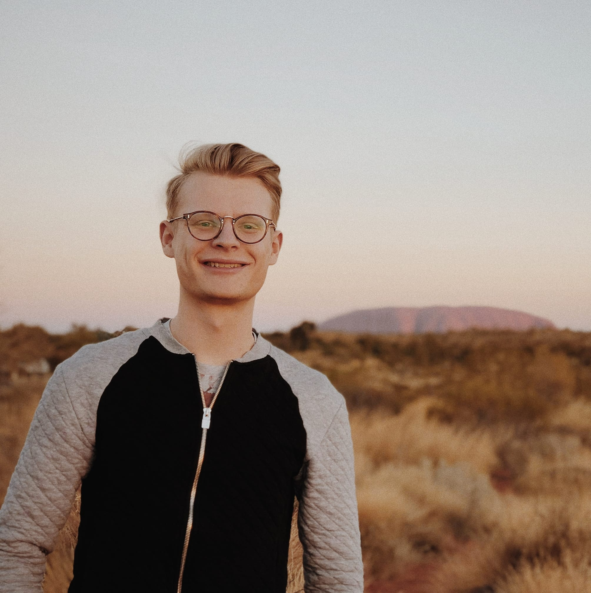
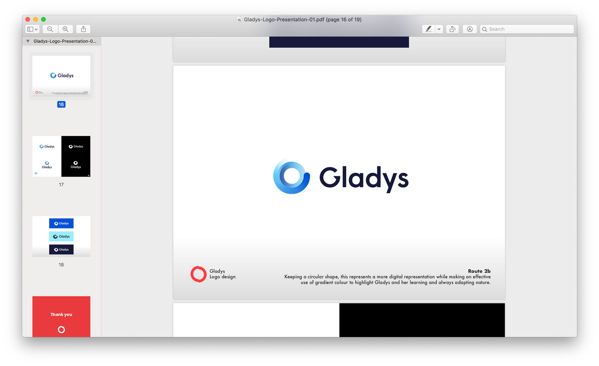
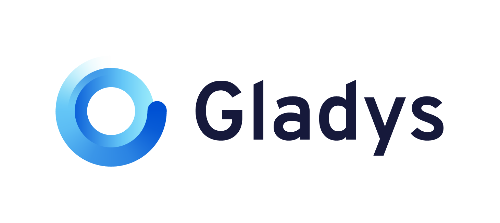
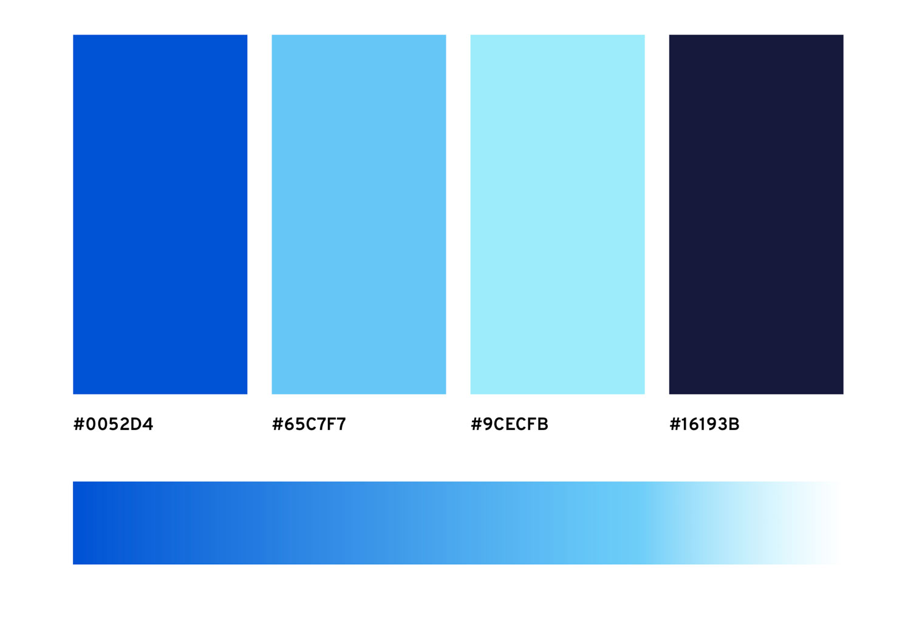
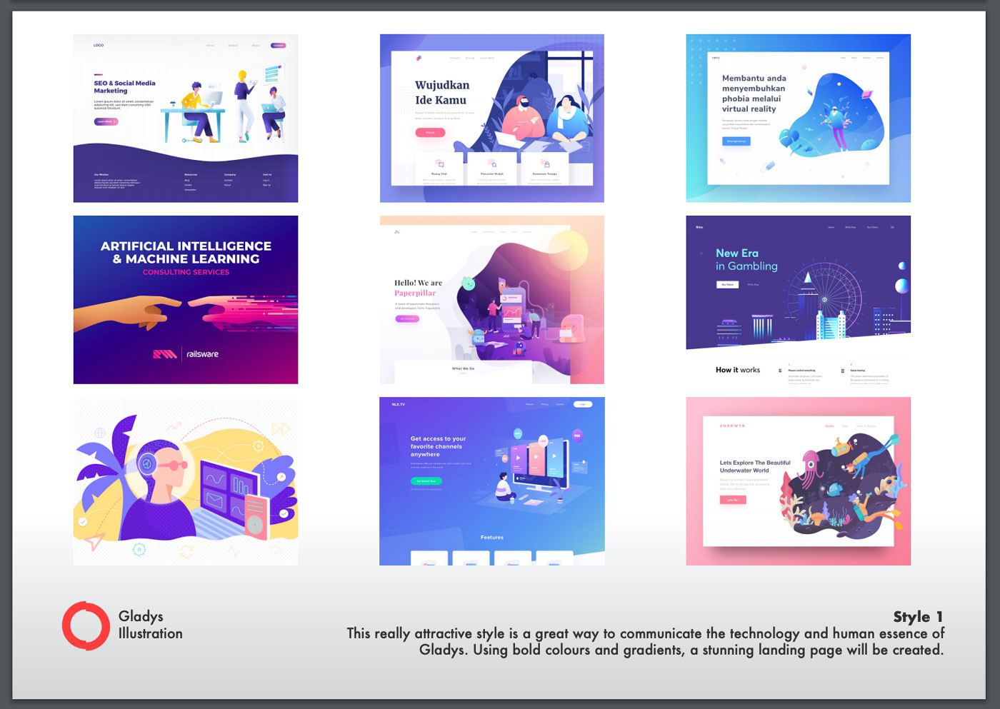
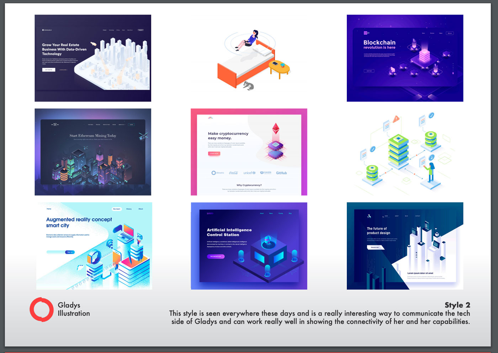
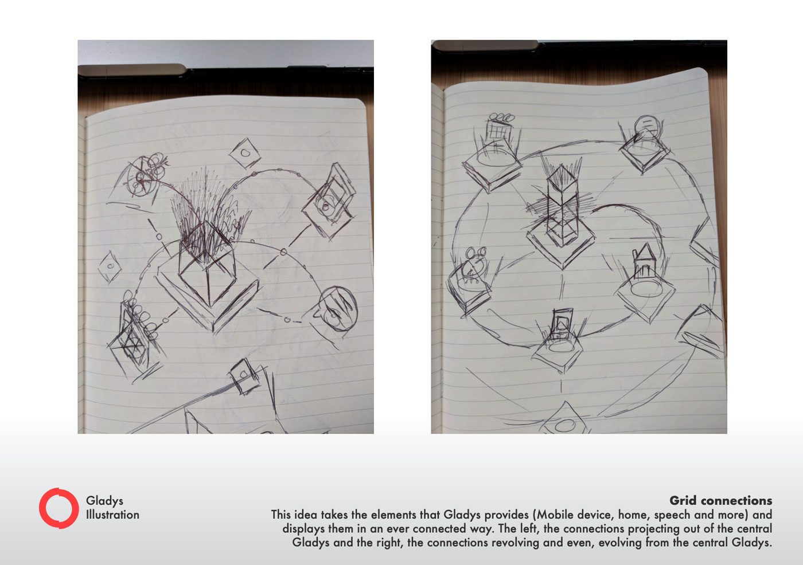
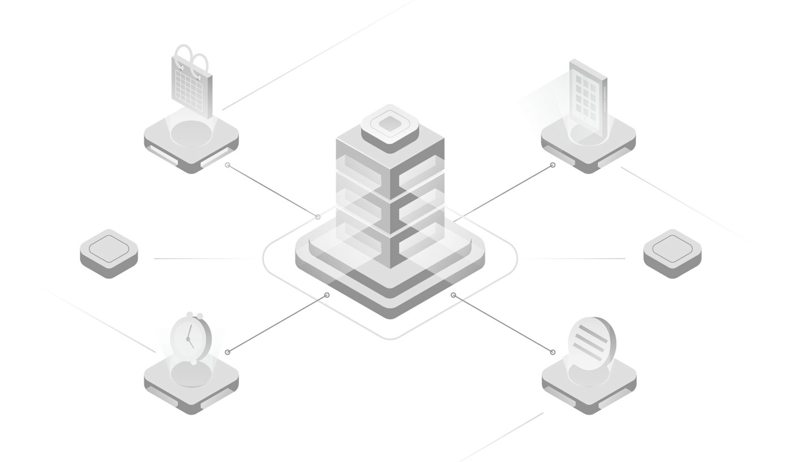
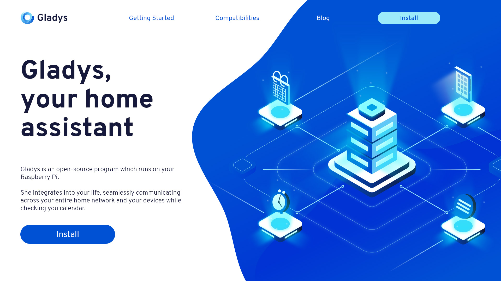

Salut à tous,

Lorsque je suis arrivé à Bali il y a maintenant 2 mois, je suis venu avec un objectif: Passer du temps sur le projet pour emmener Gladys à un autre niveau.

Je n'avais jamais eu le temps ni les moyens jusque-là de passer par un professionnel afin de poser les bases d'une identité graphique propre pour le projet, mais je voulais changer ça au plus vite en arrivant ici à Bali...

Et coup de chance, après seulement 2 jours sur place, je rencontre un designer au barbecue de l'espace de coworking où je travaille: Oliver Swinburne.

<!--truncate-->

Oliver est un designer venant de Londres, qui comme moi sillonne la planète tout en travaillant à distance pour divers clients. Vous pouvez retrouver ses travaux sur <a href="http://oliverswinburne.dribbble.com/">Dribbble</a> ou sur son site <a href="https://www.oliverswinburne.com/">oliverswinburne.com </a>.

 

Tout de suite je lui parle de mes besoins pour Gladys, et très vite on programme un repas pour mettre tout ça en place.

## La conception du logo

Autour d'un bon repas français (et oui, il y a une boulangerie française à Canggu où j'habite 😛 #MrSpoonCanggu) je lui explique le but du projet, ce que fait Gladys, et ma vision pour les prochaines années.

Deux semaines plus tard, Oliver revient vers moi avec un PDF de 19 pages.

19 pages d'explorations graphiques, et 3 propositions de design.

Chaque exploration est étoffée d'une description de l'effet recherché.

Par exemple, pour l'option que j'ai choisi:

> Route 2a: Looking at the idea that Gladys is always learning and is evolving, this route variation uses round natural shapes representing a central system or eye of Gladys with her adaptive learning exposed underneath.

> Route 2b: Logo design Keeping a circular shape, this represents a more digital representation while making an effective use of gradient colour to highlight Gladys and her learning and always adapting nature.

Finalement, après plusieurs aller-retour, le logo est choisi:

Ainsi que la palette de couleur du projet:

Et la nouvelle police de caractère, Overpass.

Je ne sais pas ce que vous en pensez, mais moi, j'adore 😍

## Une nouvelle homepage

Un logo, c'était déjà un bon début, mais pour aller plus loin il fallait revoir la homepage du projet en designant une illustration, illustration que l'on pourrait réutiliser ensuite en bannières sur tous les réseaux sociaux (Facebook/Twitter)

Oliver m'a fait deux propositions de "style" après ses recherches :

1. Flat style with bold colours and gradients

2. Isometric style with bold colours and gradients

Je suis parti sur la proposition 2, qui à mon sens allait mieux refléter les possibilités techniques de Gladys.

Oliver a donc commencé les dessins tout d'abord au papier:

Puis il m'a proposé un premier jet en noir et blanc de l'illustration seule:

Et enfin, il m'a fait une proposition de homepage:

Ma réaction: WOOOOOOOOOOW 😱

## It's live 🚀

Et après toutes ces itérations (que je n'ai pas publié sur les réseaux sociaux afin de garder la surprise), je suis heureux de vous annoncer que tout est live: Twitter, Facebook, landing page: c'est live 🚀

N'hésitez pas à liker, retweeter, partager, afin que ce lancement soit un succès 🎉

A bientôt sur Gladys,

Pierre-Gilles
