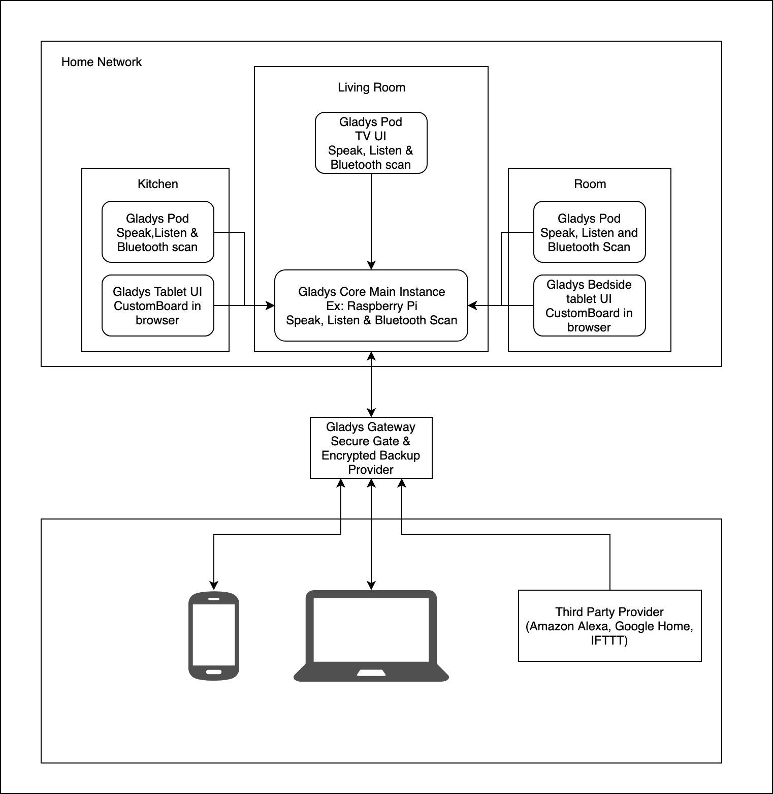
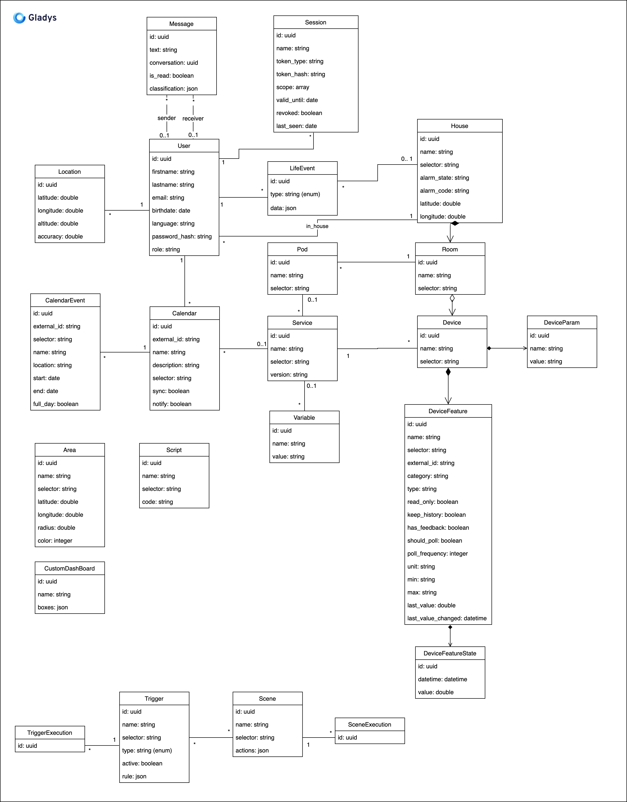
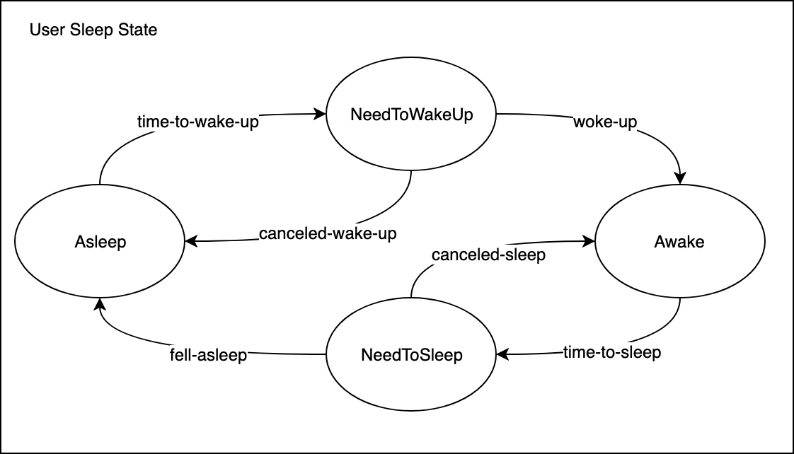
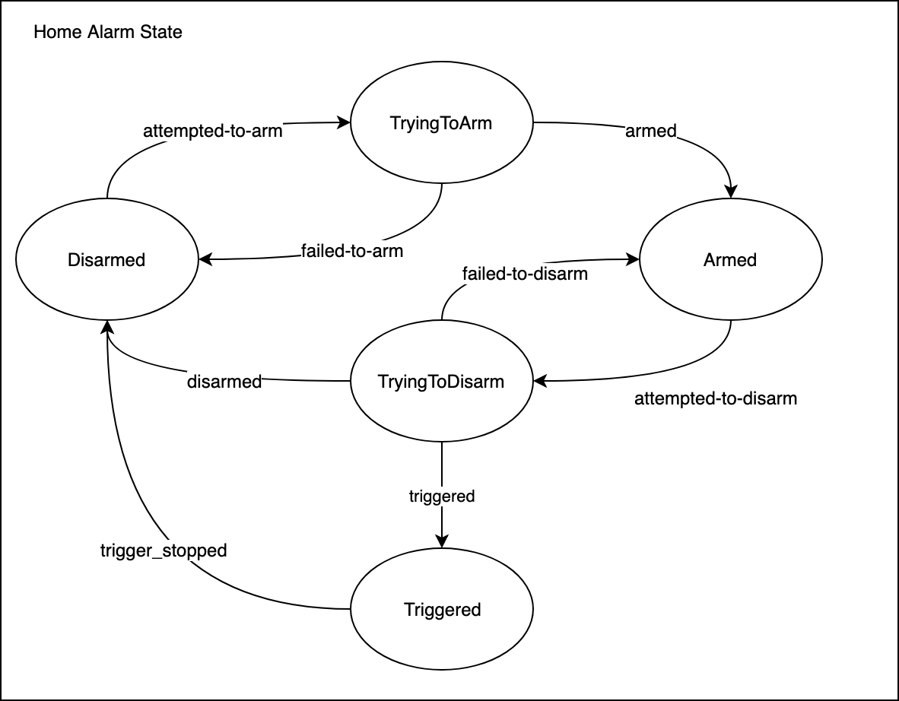
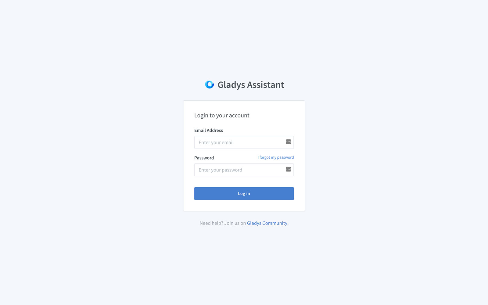

Salut à tous,

Cela fait déjà plusieurs mois que je vous parle de Gladys 4, la prochaine version majeure de Gladys.

Je voulais faire un petit état d'avancement des développements, vous montrer où la réflexion en est, et où le produit en est.

Peut-être que certains auront des remarques, des retours. N'hésitez pas: c'est l'objectif de ce post !

<!--truncate-->

## L'appel communauté de mars

Chaque mois, c'est la tradition, je fais un appel avec tous ceux qui soutiennent le projet via Gladys Plus afin de parler de tous les développements en cours et de discuter de la suite du projet.

Voilà le replay de cet appel:

<iframe width="560" height="315" src="https://www.youtube.com/embed/twXkModV9gY" frameborder="0" allow="accelerometer; autoplay; encrypted-media; gyroscope; picture-in-picture" allowfullscreen></iframe>

## Les technologies

Pour rappel, j'avais écrit un [manifeste technique](https://docs.google.com/document/d/1zqH0vvIRICOiXsgJVHRanInBgJ8aoTWtnrNpyASW9b0/edit?usp=sharing) en décembre dernier, où je détaillais tous les choix technologiques que j'ai en tête pour cette nouvelle version.

Pour résumer ce manifeste, Gladys 4 sera basé sur :

- Node.js, avec Express comme serveur web.
- SQLite pour le stockage de données, avec possibilité d'utiliser MariaDB si besoin.
- [Preact](https://github.com/developit/preact/) comme librairie de vue.
- [Sequelize](https://github.com/sequelize/sequelize) comme ORM.

Mon objectif pour cette version est de faire en sorte que le programme Gladys soit **le plus léger possible**.

Les librairies sont choisies avec soin pour que Gladys soit peu gourmande en ressources, et tourne bien même sur un Raspberry Pi Zero avec peu de RAM.

Grâce à SQlite, il sera plus facile de déployer Gladys car l'utilisateur n'aura pas à gérer l'installation ni la maintenance de MariaDB.

Concernant les sauvegardes/restaurations, une base de donnée SQlite n'est composée que d'un fichier, il est donc très simple de le sauvegarder/restaurer. Il sera encore plus facile d'automatiser cette sauvegarde directement au niveau de Gladys, pour l'envoyer par exemple en chiffré sur le Gateway.

Je le rappelle, l'objectif de Gladys 4 est de faire un produit simple à l'installation, à l'utilisation et à la maintenance.

L'utilisateur **ne doit pas à avoir à se connecter en ligne de commande**, c'est une des valeurs les plus importantes de cette 4ème version.

## L'architecture

Gladys 4 est composé de 2 composants principaux:

- Gladys Core: le programme principal de Gladys. C'est lui qui reçoit, process, stocke et redistribue l'information.
- Gladys Pod: un programme satellite de Gladys conçu pour gérer l'installation et la maintenance de services distants. Si par exemple vous voulez avoir plusieurs Raspberry Pi dans différentes pièces pour pouvoir faire de la reconnaissance/synthèse vocale à différents endroits de la maison, c'est lui qui gérera tout ça!

Je vous remets le schéma que j'avais publié dans le manifeste technique:

## La modélisation

C'est probablement ce qui nous a pris le plus de temps lorsque nous avons réfléchi à cette 4ème version (et ce n'est probablement pas la version finale), la modélisation est pour moi un des sujets les plus importants lors de la définition de tout projet informatique, et encore plus dans le cas d'un projet open source.

Partir sur une mauvaise modélisation, c'est se garantir des heures de prises de tête dans les années à venir.

Voilà la modélisation de la base de données de Gladys 4 pour l'instant:

Et pour ceux qui préfèrent voir ça en vrai, voilà une base de donnée SQLite de Gladys 4: [gladys-4-development.db](/fr/files/gladys-4-development.db).

Vous pouvez utiliser l'excellent client SQL [TablePlus](https://tableplus.io/) pour ouvrir ce fichier et voir comment ça fonctionne sous le capot :)

## Où en est le développement ?

Bon, maintenant la question que tout le monde se pose: elle sort quand cette version ??

### Côté serveur

✅ La base de donnée est implémentée. Les migrations Sequelize sont écrites et compatibles SQLite / MariaDB.

✅ Tout le projet backend est configuré, les tests unitaires et d'intégrations aussi grâce à Mocha et Istanbul.

✅ L'intégration continue avec TravisCI et la couverture de code avec Codecov sont mises en place.

✅ La création de comptes, le login et la gestion des access_token/refresh_token sont implementés côté serveur. Je l'ai implémentée de telle façon à ce qu'il n'y ait rien à configurer pour l'utilisateur: pas de clé à générer, et une persistence des sessions même entre chaque redémarrage de Gladys.

✅ J'ai écrit une première version du moteur de scénario et de scènes. Ce moteur est **très puissant** comparé à l'ancien.

Dans les actions, il est possible d'exécuter des actions en parallèle ou en séquentiel, ce qui permet d'ajouter des délais entre les actions par exemple.

)  2.3M actions executed/second 🚀 <a href="https://t.co/UQtDuFmAU4">pic.twitter.com/UQtDuFmAU4</a>
&mdash; Pierre-Gilles Leymarie ✈️ (@pierregillesl) <a href="https://twitter.com/pierregillesl/status/1100604360323559424?ref_src=twsrc%5Etfw">February 27, 2019</a></blockquote> 

✅ La raison à tout cela, c'est que j'ai implémenté un gestionnaire d'états dans Gladys 4. Je considère qu'en domotique, toutes les entités avec lesquels on travaille sont des [automates finis](https://fr.wikipedia.org/wiki/Automate_fini). Prenons l'exemple du sommeil, le sommeil d'un utilisateur peut-être modélisé de la façon suivante :

Un autre exemple, l'alarme d'une maison :

Dans Gladys 4, chaque entité a donc un ensemble d'états, et de transitions entre chaque état: des évènements. Chaque évènement peut-être déclencheur d'un scénario.

### Côté interface

✅ Le projet preact est créé, et configuré. J'ai pu partir de l'expérience que je me suis fais sur le Gladys Gateway qui tourne aussi sous preact.

✅ J'ai pu travailler sur différents écrans de l'interface, je vais vous mettre quelques exemples.

✅ La vue de configuration des intégrations par exemple :

<blockquote class="twitter-tweet">
Filtering ✅ <a href="https://t.co/ksk4vI8CEh">pic.twitter.com/ksk4vI8CEh</a>
&mdash; Pierre-Gilles Leymarie ✈️ (@pierregillesl) <a href="https://twitter.com/pierregillesl/status/1098166550345830406?ref_src=twsrc%5Etfw">February 20, 2019</a></blockquote> 

✅ La vue de login de Gladys (c'est la même que la [page de login du Gladys Gateway](https://plus.gladysassistant.com/login) )

### Ce qu'il reste à faire

On pourrait découper les chantiers restants en 3 phases :

**Phase 1:** Finir le backend au niveau de la gestion des périphériques, coder un premier service assez complet pour couvrir assez de cas, et écrire un tutoriel "Comment développer une intégration dans Gladys". Développer les vues de bases (création de comptes, réinitialisation de mot de passe, paramètres) ainsi que des vues plus complexes comme la vue "scénario" qui est encore en débat !

**Phase 2:** Avec l'aide de la communauté, migrer les modules de Gladys 3 dans le repository Gladys 4, et travailler sur de belles interfaces pour chaque intégration :)

**Phase 3:** Faire une série de tests au niveau du build Docker + de nos process de déploiements. Mettre en place les bons process pour qu'il soit super simple d'installer et mettre à jour Gladys 4.

Bien entendu, tout le code de Gladys 4 est disponible en open-source [sur GitHub](https://github.com/GladysAssistant/Gladys)! N'hésitez pas à tester, ou donner un coup de main, ce sera avec plaisir !

## Conclusion

Comme vous pouvez le voir, Gladys 4 est en très bonne voie et s'annonce prometteur! 🙂

J'aimerais encore remercier tous ceux qui soutiennent ce projet open-source via leur contribution mensuelle sur Gladys Plus 🙏

C'est seulement grâce à ces contributions que je peux dédier un temps partiel sur Gladys, et non pas juste mes soirs et week-ends.

Remerciez-les, c'est grâce à eux que le développement va aussi vite 😄

Si vous avez des remarques, retours, n'hésitez pas !
