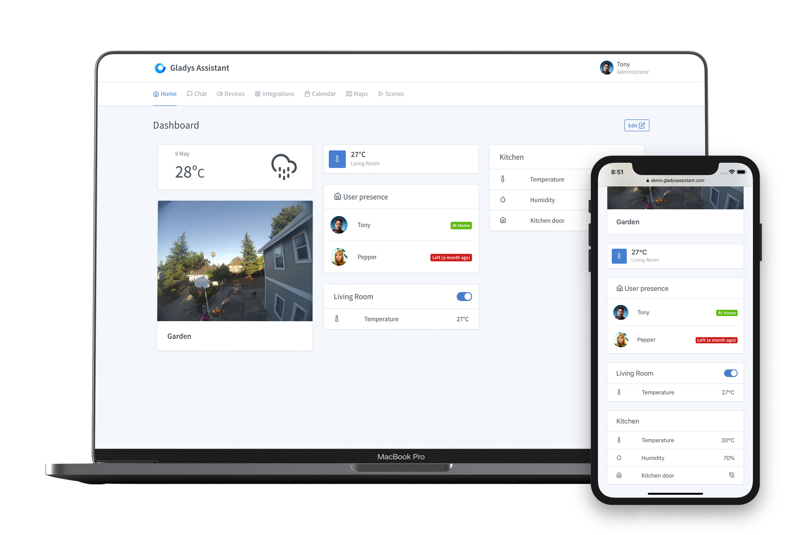
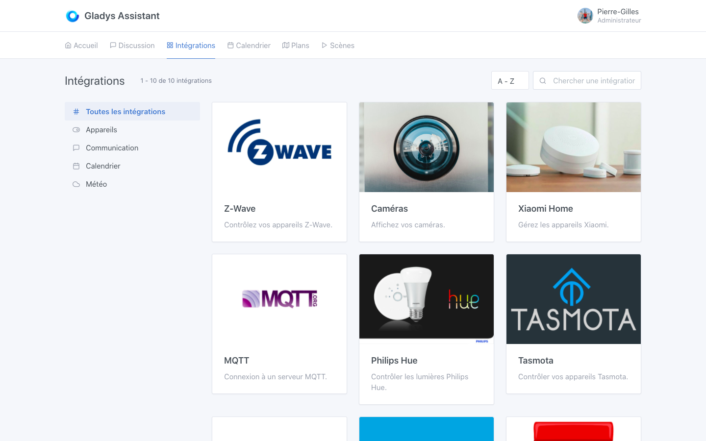
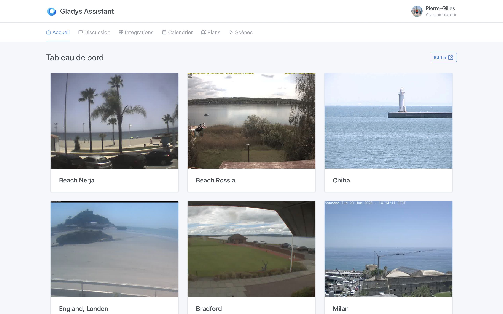
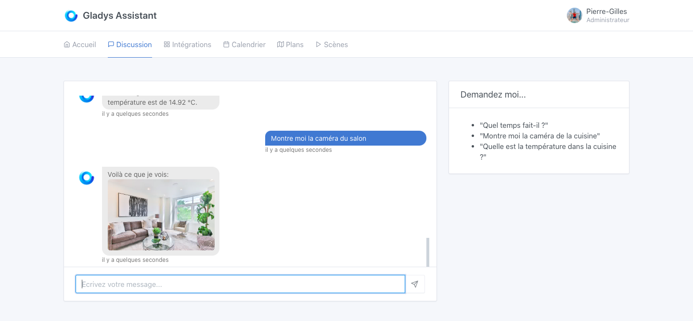
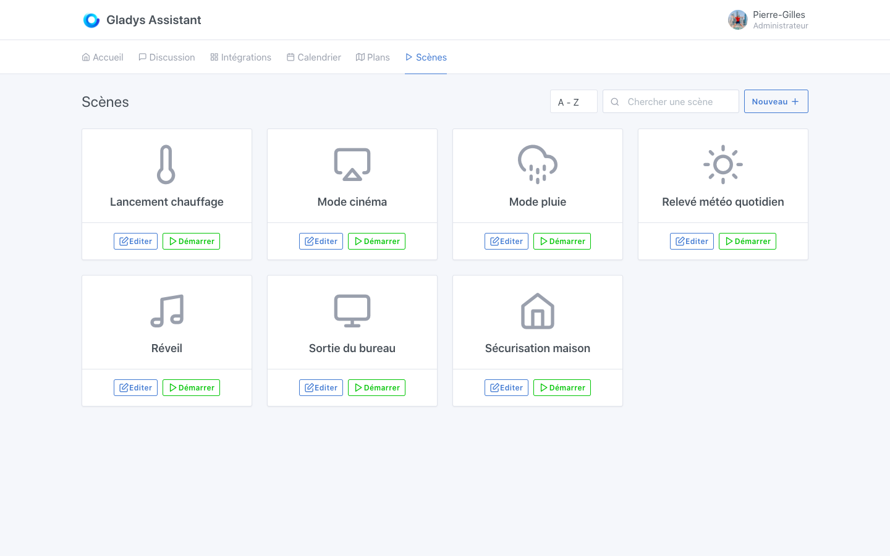

Salut à tous,

C'est un grand jour, après presque 2 ans de travail de la part de toute la communauté, Gladys Assistant 4 est disponible, en téléchargement gratuit comme d'habitude !

Vous pouvez vous lancer dans l'aventure en suivant les tutoriels :

- [Tutoriel pour Raspberry Pi](/fr/docs/)
- [Installation manuelle via Docker](/fr/docs/installation/docker/)
- [Tutoriel pour Freebox Delta](/fr/docs/installation/freebox-delta/)
- [Tester Gladys Assistant sur le site de démo](https://demo.gladysassistant.com)

Maintenant revenons sur les décisions qui ont menées à cette quatrième version de Gladys Assistant 🙂

<!--truncate-->

## Historique

En décembre 2018, j’ai rencontré deux membres de la communauté pour discuter de l’avenir du projet, et on a défini ensemble ce que nous voulions pour la prochaine version majeure de Gladys, Gladys Assistant 4. Après ce rendez-vous, j’ai écrit un manifeste technique qui récapitulait nos discussions.

La v3 de Gladys Assistant était vieillissante, autant en terme de processus de développement que de technologies utilisées. C’était un produit formidable, mais les développements étaient de plus en plus lent et de moins en moins stable à cause de choix techniques remontant au début du projet.

Maintenir ce mammouth était de plus en plus dur, et l’attractivité du projet en souffrait. Les bugs “mystiques” étaient nombreux, et tout le monde en était fou. C’était frustrant de voir tout le monde s’arracher à faire une simple mise à jour dans Gladys v3, de bloquer sur des points de configurations qui devraient être automatiques.

**Le bilan était clair :** pour le long terme, il valait mieux repartir de zéro et apprendre de toutes ces années d’expérience, plutôt que de mettre du scotch sur un produit qui n’était pas conçu à l’origine pour être utilisé par autant de personnes pendant autant d’années.

Pendant 2 ans, nous avons travaillé ensemble avec la communauté afin de sortir cette version 4, conçu avec des technologies selon nous plus adapté au monde de l’embarqué.

Ces deux ans ont été très dur.

Très dur car pendant 2 ans, le projet en apparence n’avançait plus : il n’y avait plus de développement sur la v3, mais la v4 n’était pas prête pour autant.

Très dur car pendant au moins 1 an, j’ai eu l’impression de travailler dans le vide, de bosser sur un produit que personne n’utilisait.

C’était la traversée du désert.

Mais aujourd’hui, c’est l’accomplissement. Le travail à payé, et grâce au travail de toute la communauté, Gladys Assistant 4 est disponible ! 🎉

## Remerciements

Avant de présenter cette v4, j’aimerais remercier tous les membres de la communauté qui ont fourni un travail considérable sur cette version.

- [Alexandre Trovato](https://community.gladysassistant.com/u/AlexTrovato/summary), “la machine”, qui est capable de sortir des PRs avant que j’ai fini ma réponse à son message 😁
- [Vincent Kulak](https://community.gladysassistant.com/u/vonox/summary), “le dieu de Docker”, qui a mis en place tout le processus de build de Gladys Assistant 4.
- [Thibaut Courvoisier](https://community.gladysassistant.com/u/link39/summary), “le pro du Z-Wave”, qui fait profiter tout le monde de son installation Z-Wave si riche, et de sa connaissance poussée du protocole.
- [Thomas Lemaistre](https://community.gladysassistant.com/u/terdious/summary), “le plus gros utilisateur de Gladys de tous les temps”, qui repousse en permanence les limites du produit avec son utilisation Pro qui lui permet de gérer son camping.
- [Bertrand d'Aure](https://community.gladysassistant.com/u/bertrandda/summary), “monsieur Caldav”, qui développe et maintient l’intégration CalDav et qui se plie en quatre pour que ça marche chez tout le monde.

Mais aussi tous les autres contributeurs sur Github : https://github.com/GladysAssistant/Gladys#contributors-

## Une refonte de l’interface : épurée, design et incroyablement rapide

Gladys Assistant revient avec une nouvelle interface, entièrement repensée. L’interface est plus simple, et éditable à la souris très facilement.

L’interface doit sa réactivité au framework frontend [Preact](https://preactjs.com/) utilisé dans Gladys Assistant 4. Un framework moderne et très léger, assurant une grande fluidité à Gladys.

Cette interface est conçue comme une PWA ([Progressive Web App](https://fr.wikipedia.org/wiki/Progressive_web_app)) et peut donc s’installer sur le téléphone comme une app classique (iOS / Android / Mac / Windows / Linux ).

Vous pouvez tester l’interface de Gladys Assistant 4 sur [le site de démo](https://demo.gladysassistant.com).

## Des centaines de périphériques domotiques déjà compatibles

Depuis plusieurs mois, la communauté Gladys Assistant travaille dur afin de porter les intégrations de la v3 à la v4.

Aujourd'hui, des centaines de périphériques domotiques sont déjà disponibles dans Gladys Assistant 4.

A ce jour, Gladys Assistant supporte les périphériques :

- Z-Wave
- Xiaomi ([doc](/fr/docs/integrations/xiaomi/))
- Philips Hue ([doc](/fr/docs/integrations/philips-hue/))
- Sonoff (Tasmota) ([doc](/fr/docs/integrations/tasmota/))
- Les Caméras RTSP, HTTP et USB ([doc](/fr/docs/integrations/camera/))
- Le protocole MQTT ([doc](/fr/docs/integrations/mqtt/))

De nombreuses intégrations sont en cours de développements et rejoindrons cette liste afin de contrôler un maximum de périphériques. Et comme Gladys Assistant est open-source, vous pouvez contribuer à cette liste en proposant une PR sur GitHub :)

## Une gestion des caméras native

La gestion des caméras a été intégrée nativement dans Gladys Assistant 4, via les protocoles RTSP, HTTP et USB.

Gladys récupère les flux de toutes les caméras de la maison, et les affiche dans une seule interface. L’instance Gladys fait office de proxy, et permet à l’utilisateur d’afficher ses caméras hors de son réseau, sans avoir à exposer ses caméras à Internet. Les caméras peuvent rester en local, en sécurité.

Les flux vidéo sont compressés afin d’avoir des performances maximales d’affichage de l’interface, même avec un grand nombre de caméras.

## De l’apprentissage automatique au service du moteur de discussion

Gladys Assistant, c’est aussi un assistant avec qui l’utilisateur peut discuter.

Gladys Assistant utilise les dernières avancées en terme de traitement automatique du langage afin de comprendre les demandes de l’utilisateur (Nous utilisons [NLP.js](https://github.com/axa-group/nlp.js)).

Vous voulez demander à Gladys Assistant :

- “Allume la lumière du salon”
- “Quel température fait il dans la cuisine ?”
- “Quel temps fait il ?”
- “Montre moi la caméra de la cuisine”
- Et plein d'autres questions au fur et à mesure de l'alimentation du jeu de données par la communauté !

Le jeu de données utilisé pour l'entraînement du modèle est entièrement open-source, et alimenté par la communauté.

## Une API MQTT ouverte pour intégrer des périphériques DIY

Gladys fournit une API MQTT ouverte afin de permettre à chacun d’intégrer à Gladys des périphériques DIY.

Il est ainsi possible d’envoyer des données à Gladys depuis un Arduino, un ESP8266, un Raspberry Pi déporté, ou depuis n’importe quel machine compatible avec le protocole MQTT.

Dans l’autre sens, il est possible pour Gladys de contrôler des périphériques MQTT.

En savoir plus sur [la documentation MQTT](/fr/docs/integrations/mqtt/)

## Un moteur de scène plus puissant que jamais

Gladys Assistant 4 permet à l’utilisateur d’écrire des scènes complexes. Il est possible d’écrire des suites d’actions autant en série qu’en parallèle, avec des conditions.

Une scène “Cinéma” pour configurer votre éclairage salon ?

Une scène “Réveil” actionnant la machine à café, différentes lumières de la chambre à la cuisine ?

Tout est possible avec le moteur de scènes de Gladys Assistant 😄

Le moteur de scènes a été testé avec des fortes charges et va continuellement évoluer dans les prochaines versions du logiciel.

En savoir plus sur [les scènes dans Gladys Assistant 4](/fr/docs/scenes/intro/).

## La vie privée au centre du produit

Gladys Assistant stocke toutes les données de l’utilisateur sur une base de données SQLite en local. Aucun compte distant n’est requis pour utiliser Gladys Assistant.

L’utilisateur reste maître et propriétaire de son installation.

Gladys Assistant s’installe facilement sur n’importe quel Raspberry Pi via une image Raspbian pré-buildée avec Gladys Assistant (A télécharger [sur la documentation pour Raspberry Pi](/fr/docs/)).

Il est possible d’installer Gladys Assistant sur n’importe quelle machine Linux : un NAS Synology, une Freebox Delta, un VPS, un vieux serveur : tout est possible.

## Mise à jour automatique et atomique : une stabilité à toute épreuve.

Un des objectifs principaux de la v4, c’est d’être un produit stable et résilient, sur le long terme. Le produit évoluant fréquemment, il était nécessaire d’avoir un système de mises à jour automatiques et qui ne puisse pas compromettre l’installation d’un utilisateur.

Gladys Assistant tourne donc dans Docker, un système de container Linux qui permet à l’application d’être distribuée sous la forme d’une image contenant l’application et ses dépendances. Nous utilisons l’excellent [Watchtower](https://github.com/containrrr/watchtower) pour mettre à jour le container, automatiquement.

Ainsi, la distribution des mises à jour de Gladys est automatisée, et fonctionne de manière atomique.

Une mise à jour **ne peut pas** être dans un état bancal : soit elle réussit, soit elle échoue.

## Mes ambitions suite à ce lancement

Mon ambition personnelle sur cette version, c’est d’avoir **1 000 utilisateurs actifs** de cette v4 dans les 6 prochains mois.

Ce n’est pas un objectif irréaliste, c’est même un chiffre qui parait petit, mais je veux me concentrer sur la qualité plutôt que la quantité.

Juste en comparaison, depuis son lancement, le Raspberry Pi s’est vendu à 30 millions d’unités.

1 000 instances Gladys représentent 0,0033% du marché des Raspberry Pi vendu, et c’est sans compter tous ceux qui font tourner Gladys sur un NAS, une freebox ou tout autre ordinateur.

C’est donc **un objectif très modeste**, mais c’est voulu.

Je préfère avoir 1 000 utilisateurs passionnés, qui adorent Gladys, qui s’en servent tous les jours, qui participent dans la communauté en ligne, plutôt que 10 000 utilisateurs qui apprécient juste le produit sans plus.

Je pense qu’avant de passer à une échelle supérieure, je préfère me concentrer sur la création de ce noyau dur d’utilisateurs passionnés qui font la force de ce projet. Une fois qu’on aura 1 000 utilisateurs pleinement satisfaits, on pourra s’attaquer à un prochain objectif.

Je posterai la progression de cet objectif sur les réseaux sociaux et ferai sûrement un article bilan dans quelques mois 🙂

Encore une fois, merci à tous pour votre aide et vos retours !

Si tu veux nous rejoindre pour faire partie du noyau dur des 1 000 utilisateurs de Gladys Assistant 4, c’est maintenant et ça se passe sur [le tutoriel d’installation de Gladys Assistant](/fr/docs/).

A très vite !

Pierre-Gilles Leymarie
