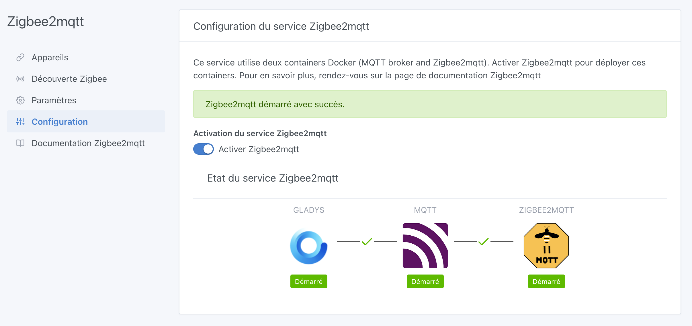
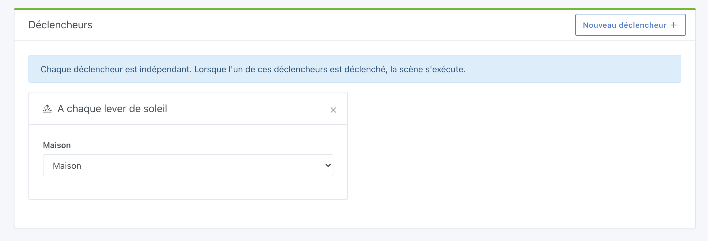
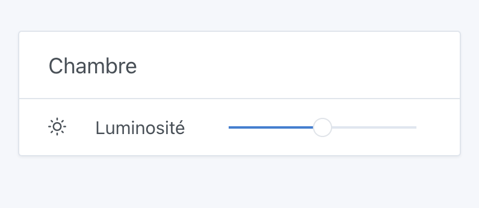
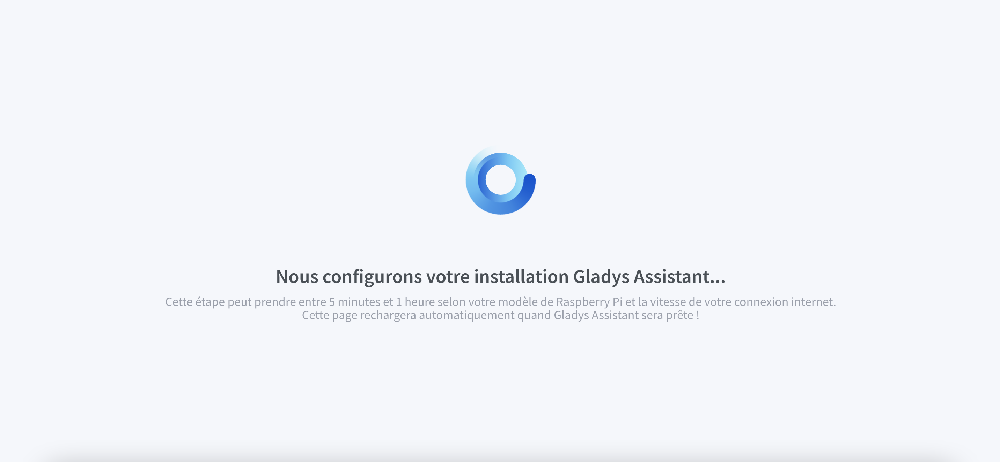

Salut à tous,

Aujourd’hui c’est la sortie de Gladys v4.2.0 ! Déjà !

Depuis le lancement de Gladys Assistant 4 en Novembre dernier, de plus en plus de contributeurs ont apportés leur pierre à l'édifice en proposant de nouvelles fonctionnalités sur Gladys Assistant.

Depuis novembre, nous avons sorti **11 nouvelles versions de Gladys**. C'est presque 3 nouvelles versions par mois. ça bosse dur !

Je n'ai pas fais de post sur le blog pour chaque version, mais vous pouvez retrouver toutes mes notes de versions dans la catégorie [Actualités](https://community.gladysassistant.com/c/francais/news/30) du forum.

<!-- truncate -->

## Les nouveautés de cette version 4.2

### Zigbee2mqtt

C’est officiel, l’intégration [Zigbee2mqtt](https://www.zigbee2mqtt.io/) est désormais intégrée à Gladys 4 🚀

Il est donc désormais possible de contrôler une large gamme de périphériques Zigbee via une clé USB Zigbee trouvable facilement sur internet. Voici la [liste des périphériques supportés](https://www.zigbee2mqtt.io/information/supported_devices.html).

C’est le résultat de mois de travail de la part de plusieurs membres de la communauté. Merci à [Reno](https://community.gladysassistant.com/u/reno/summary) pour le premier développement initial, merci à [cicoub13](https://community.gladysassistant.com/u/cicoub13/summary) d'avoir repris le développement, et merci à [lmilcent](https://community.gladysassistant.com/u/lmilcent/summary) pour les tests !

Pour l’instant, tous les périphériques ne sont pas forcément parfaitement gérés, ce qui est normal on ne possède pas tous les périphériques inimaginable sur terre, il y a peut-être quelques ajustements à faire que l'on découvrira au fil de l’utilisation de cette intégration.

Voir [la documentation de cette intégration](/fr/docs/integrations/zigbee2mqtt).

N’hésitez pas à faire des retours sur le forum si vous rencontrez un périphérique mal géré 🙂

### Lever/coucher du soleil

Il est désormais possible de faire des scènes qui se déclenchent au coucher ou au lever du soleil.

Merci à [Lokkye](https://community.gladysassistant.com/u/lokkye/summary) pour le travail effectué sur cette PR !

### Philips Hue

La dépendance de l’intégration Philips Hue que nous utilisons a été mis à jour à sa dernière version.

Certains utilisateurs avaient des problèmes avec la découverte de pont Philips Hue sur le réseau car nous utilisions jusque-là le N-UpnP scan de Philips Hue qui se base sur leur API en ligne.

Nous avons changé cette fonction pour passer par le scan UpnP réseau, qui se passe lui entièrement en local sans appels aux serveurs Philips Hue. Cela devrait résoudre les problèmes que certains d'entre vous avaient !

### Contrôle de la luminosité sur le tableau de bord

Grâce au travail de [VonOx](https://community.gladysassistant.com/u/vonox/summary), il est désormais possible de contrôler la luminosité de vos ampoules sur le tableau de bord.

### Gladys Plus

J’ai continué mon travail d’optimisations et de performances afin d'améliorer la vitesse d'accès à Gladys Plus !

En cherchant, j'ai remarqué des pistes d'optimisations pour diminuer la charge sur les serveurs Gladys Plus ainsi que sur les instances locales.

Un des changements améliore drastiquement les performances, et j'ai vraiment hâte de voir en production ce que ça va donner sur les plus grosses instances (comme chez Terdious) ou sur les instances avec des petites connexions (comme chez Mastho).

### Mise à jour majeures de plusieurs dépendances internes

Nous en avons profité pour faire des mises à jour majeures de certaines dépendances que nous utilisons:

- De Node 12 -> à Node.js 14 LTS
- De Sequelize 4 -> Sequelize 6
- Nous sommes passés à la dernière version de [node-nlp](https://github.com/axa-group/nlp.js), la librairie que nous utilisons pour la reconnaissance du language dans Gladys. D'après les tests réalisés, le moteur de language reconnait bien mieux les demandes ! Au passage, des nouvelles phrases ont été rajoutés au module météo pour des discussions plus riches avec Gladys 😄

Tout n'était pas forcément évident, mais on est content de l'avoir fait !

## Comment mettre à jour ?

Si vous avez installé Gladys avec l’image Raspberry Pi OS officielle, vos instances se mettront à jour **automatiquement** dans les heures à venir. Cela peut prendre jusqu’à 24h, pas de panique.

Si vous avez installé Gladys avec Docker, vérifiez que vous utilisez bien Watchtower. Voir la [documentation](/fr/docs/installation/docker#mise-à-jour-automatique-avec-watchtower).

Avec Watchtower, Gladys se mettra automatiquement à jour.

## Une nouvelle image Raspberry Pi OS

J'en profite pour annoncer que nous avons une nouvelle image Raspberry Pi OS, que nous construisons automatiquement en se basant le même process de build que la fondation Raspberry Pi utilise !

Cette image a plusieurs avantages:

- Elle est toujours à jour. Quand vous installez Gladys sur un Raspberry Pi, cette image ira chercher automatiquement la dernière version de Gladys lors de l'installation. Lors du premier démarrage, vous verrez une page d'attente pendant l'installation automatique de Gladys 🙂

- Elle est plus évolutive pour nous, car désormais nous pouvons construire une nouvelle image automatiquement dès que la fondation sort un nouveau modèle de Pi.

Un grand merci à [VonOx](https://community.gladysassistant.com/u/vonox/summary) pour le travail impressionnant effectué. J'aurais pas fais mieux !!

## Remerciements

Cette nouvelle version, c'est la démonstration parfaite de la force de l'open-source: arriver à faire ensemble ce qu'on arriverait pas à faire tout seul.

Encore une fois, la communauté Gladys à montré qu'elle était au rendez-vous pour développer ensemble, tester ensemble, et faire avancer ce projet vers l'avant.

Merci à tous ceux qui ont contribués à cette release 👏👏

Pierre-Gilles Leymarie
