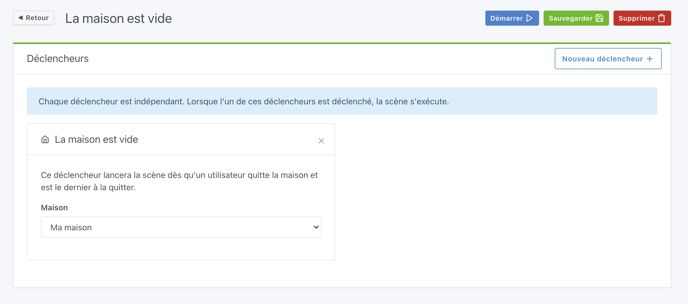
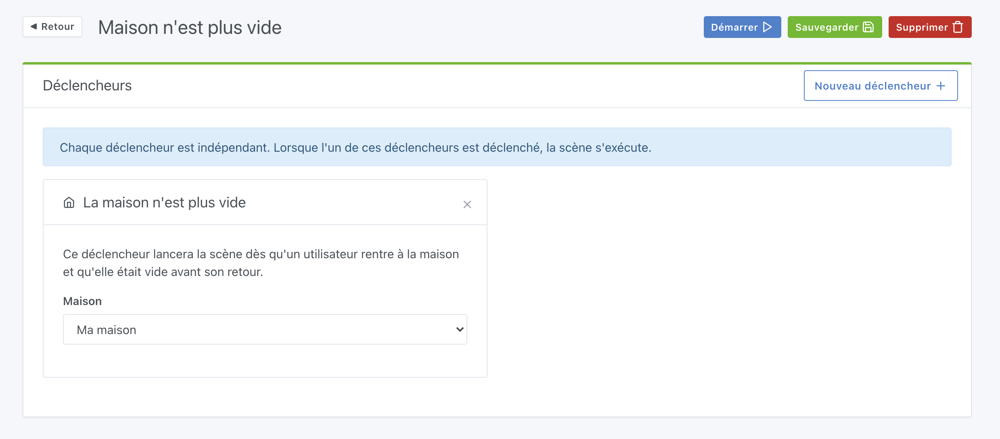
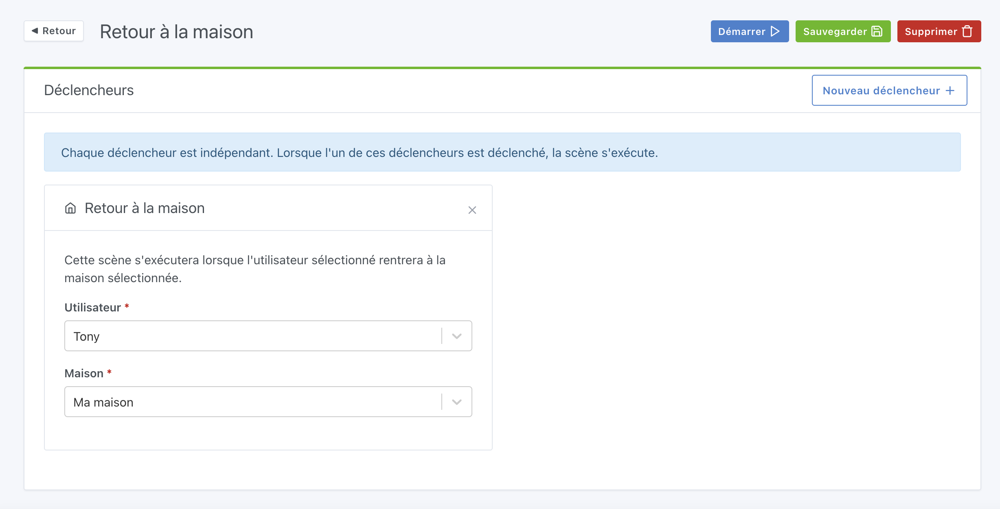
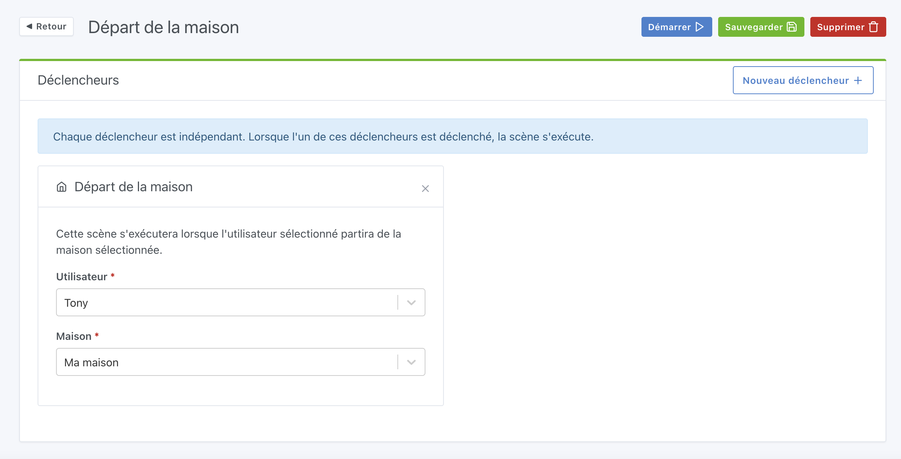
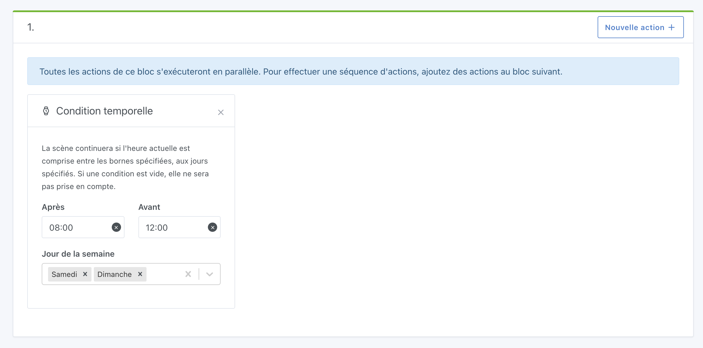
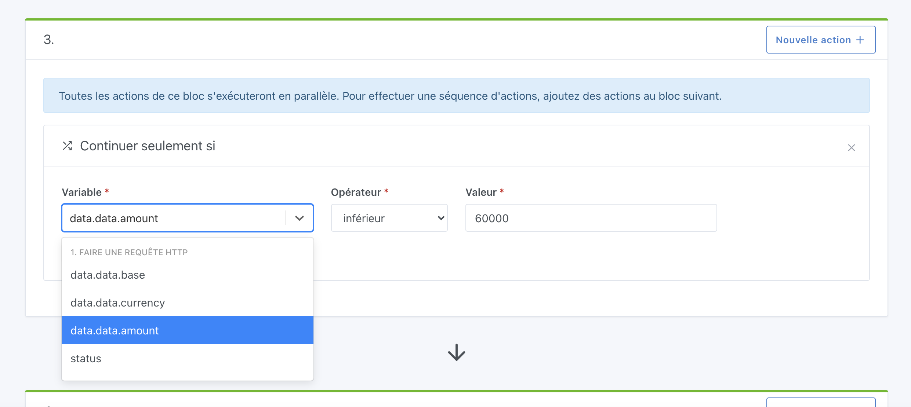

Salut à tous,

Aujourd'hui c'est la sortie de Gladys Assistant v4.3, une nouvelle mise à jour qui met les scènes à l'honneur !

Les scènes, c'est le pilier de la domotique.

Avoir une maison connectée, ce n'est pas juste pour la contrôler à distance: c'est aussi pour automatiser ce qui est fait régulièrement, pour apporter une part de magie dans notre maison et rendre notre quotidien plus simple.

## Les nouveautés de cette version 4.3

### Un nouveau déclencheur "Quand la maison est vide"

Vous voulez être sûr que tout est bien éteint lorsque la dernière personne part de la maison ?

Il est désormais possible de faire une scène qui se déclenchera lorsque le dernier partira de la maison.

Au niveau de la gestion de la présence, celle-ci est présente depuis Gladys Assistant [v4.1](https://community.gladysassistant.com/t/gladys-v4-1-0-est-disponible/6123), et peut fonctionner de différentes manières:

- Via le bluetooth: Il existe des portes clés Bluetooth comme le [Nut](https://www.amazon.fr/Nut-Bluetooth-T%C3%A9l%C3%A9commande-Localisation-Smartphone/dp/B01M4L7GHY?tag=gladproj-21) qui sont détectable très facilement par Gladys. Le principe est simple: quand vous partez de chez vous, Gladys ne "verra" plus le porte clé bluetooth et vous marquera comme absent, et quand vous reviendrez, Gladys détectera le porte clé et vous marquera comme présent.
- De manière personnalisées dans les scènes: il est possible de faire une scène qui se déclenche après un changement d'état d'un capteur par exemple, qui vous marquera comme présent/absent de la maison. Ainsi vous pouvez faire plus ou moins ce que vous voulez pour vous marquer comme présent/absent à la maison.

### Son opposé, "Quand la maison n'est plus vide"

Au contraire, vous voulez faire une autre scène qui relancera tout quand quelqu'un revient à la maison et que la maison était vide avant lui.

C'est possible avec le déclencheur "quand la maison n'est plus vide":

### Plus précis, le déclencheur "retour à la maison"

Vous voulez déclencher une scène uniquement quand un utilisateur spécifique rentre à la maison ?

Il y a désormais un déclencheur "retour à la maison" qui se déclenchera uniquement quand l'utilisateur sélectionné retourne à la maison.

Pratique pour faire une scène spécifique pour chaque personne de la maison.

### Et son opposé, "départ de la maison"

Même concept mais pour le départ de la maison.

### Condition temporelle

Alors qu'il est possible de faire une scène qui se déclenche avec une certaine récurrence (avec les [scènes programmées](/fr/docs/scenes/scheduled-trigger)), il n'était pas possible jusque-là d'ajouter une condition temporelle dans les scènes.

Par exemple, imaginons que vous voulez faire une scène:

- "Quand la température du salon est < 20°C"
- ET "il est entre 9h et 22h"
- ALORS m'envoyer un message "La température est trop basse"

C'est possible avec la condition temporelle !

Exemple d'une scène qui ne s'exécutera qu'entre 8h et 12h, le week-end:

### Récupérer le résultat d'une requête HTTP

Depuis Gladys [v4.0.3](https://community.gladysassistant.com/t/gladys-v4-0-3-est-disponible/5877), il est possible de faire des requêtes HTTP dans les scènes. Pratique pour appeler une API externe dans les scènes.

Désormais, il est possible de récupérer la réponse de l'appel HTTP, et d'utiliser le résultat de la requête dans les scènes.

Par exemple, imaginons que vous vouliez faire une scène qui va appeler l'API de Coinbase tous les matins pour récupérer le prix du Bitcoin, et vous envoyez un message avec le prix.

C'est désormais possible, et voilà un exemple en vidéo de cette scène :

<video  width="100%" controls autoplay loop muted>
<source src="/static/img/articles/fr/gladys-4-3/requete-http-prix-bitcoin.mp4" type="video/mp4" />
  Your browser does not support the video tag.
</video>

Bien entendu c'est juste un exemple parmi tant d'autres.

Vous pourriez requêter une API de météo, de traffic, un capteur chez vous, IFTTT, et plein d'autres...

Et ce n'est pas tout! Les variables récupérées dans l'appel HTTP peuvent être utilisée dans la condition "continuer seulement si", ce qui permet de vérifier qu'une condition est vérifiée.

Exemple:

- Recevoir un message uniquement si la température dehors est < 0°C.
- Recevoir une alerte si une action d'entreprise que vous suivez chute de plus de 20%

### Correction de bugs et de fautes dans l'interface

Vous êtes nombreux à avoir remontés des petites fautes d'orthographes dans l'interface, où des bugs de responsive.

Sans rentrer dans le détail, voilà la liste des différents commits correctifs sur cette mise à jour:

- Amélioration du responsive de la page de création de compte [`#1147`](https://github.com/GladysAssistant/Gladys/issues/1147)
- Correction fautes d'orthographe UI [`#1161`](https://github.com/GladysAssistant/Gladys/issues/1161)
- Correction du format de dates sur la page déclencheur programmé [`#1162`](https://github.com/GladysAssistant/Gladys/issues/1162)
- Correction des URLs sur la page de création de compte [`8ee5793`](https://github.com/GladysAssistant/Gladys/commit/8ee5793bfa1b3153c8c26bc1e4e2c9b8f2144a8a)
- Gestion du type "dimmer" sur le tableau de bord [`b740657`](https://github.com/GladysAssistant/Gladys/commit/b7406570a9e96d4590f78c05bca97a84b8978001)

## Comment mettre à jour ?

Si vous avez installé Gladys avec l’image Raspberry Pi OS officielle, vos instances se mettront à jour **automatiquement** dans les heures à venir. Cela peut prendre jusqu’à 24h, pas de panique.

Si vous avez installé Gladys avec Docker, vérifiez que vous utilisez bien Watchtower. Voir la [documentation](/fr/docs/installation/docker#mise-à-jour-automatique-avec-watchtower).

Avec Watchtower, Gladys se mettra automatiquement à jour.

## Remerciements aux contributeurs

Encore une fois, merci à tous ceux qui ont contribués à cette release: que ce soit en codant, en proposant des nouvelles idées sur le forum, ou en testant les nouvelles fonctionnalités, chaque aide est précieuse et rend le produit complet !
