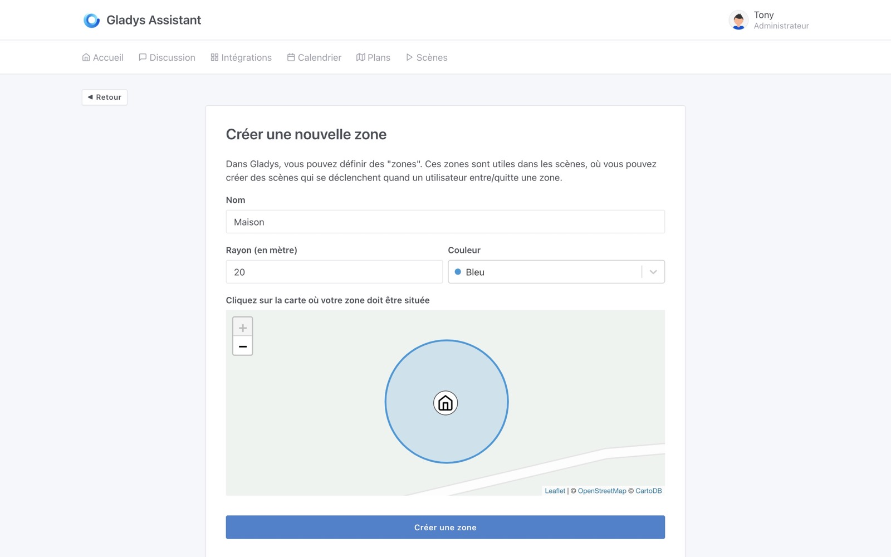

Salut à tous,

Aujourd'hui, nous lançons Gladys Assistant 4.4, avec une fonctionnalité qui était très attendue et demandée: la gestion native des zones dans Gladys !

## Les nouveautés de Gladys Assistant 4.4

### Créer une zone dans la vue plan

Depuis la vue "Plans", il est désormais possible de créer une zone, pour par exemple:

- Votre maison
- Le lieu de travail des différents membres de votre famille
- L'école des enfants ?
- Les grands parents ?
- Tout est possible, je suis sûr que vous trouverez des usages intéressants !

Ensuite, vous pouvez voir les zones que vous avez créé sur la carte:

Les zones sont éditables bien-sûr

### Démarrer une scène quand un utilisateur entre/quitte une zone

Maintenant que vous avez des zones, il devient possible de faire une scène qui se lance quand vous entrez dans une zone:

Ou quand vous sortez d'une zone:

## Un exemple: Utilisation des zones pour définir la présence utilisateur à la maison

Imaginons que vous vouliez mettre votre utilisateur comme "présent à la maison" quand vous entrez dans la zone "maison" et "absent de la maison" quand vous quittez la zone.

Vous pouvez faire cela en créeant 2 scènes.

A la maison:

Départ de la maison:

### Condition maison vide/maison pas n'est pas vide

Il était déjà possible de faire des scènes qui se déclenchent quand la maison est vide/n'est plus vide, mais il n'était pas possible de faire une condition dans une scène.

C'est maintenant possible !

### Correction de bugs

Cette nouvelle version corrige quelques bugs:

- Lors de l'appel d'une scène dans une autre scène, le "scope" est désormais cloné afin d'éviter que plusieurs scènes écrivent dans le même objet [`#1205`](https://github.com/GladysAssistant/Gladys/pull/1205)
- Amélioration des logs dans les scènes [`#1201`](https://github.com/GladysAssistant/Gladys/pull/1201)

## Comment mettre à jour ?

Si vous avez installé Gladys avec l’image Raspberry Pi OS officielle, vos instances se mettront à jour **automatiquement** dans les heures à venir. Cela peut prendre jusqu’à 24h, pas de panique.

Si vous avez installé Gladys avec Docker, vérifiez que vous utilisez bien Watchtower. Voir la [documentation](/fr/docs/installation/docker#mise-à-jour-automatique-avec-watchtower).

Avec Watchtower, Gladys se mettra automatiquement à jour.

## Remerciements aux contributeurs

Encore une fois, merci à tous ceux qui ont contribués à cette release! On se retrouve sur [le forum](https://community.gladysassistant.com/) si vous voulez parler de cette release :)
