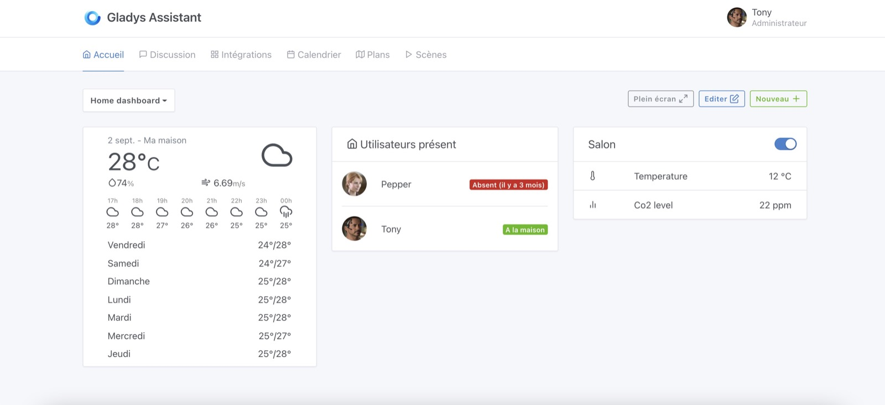
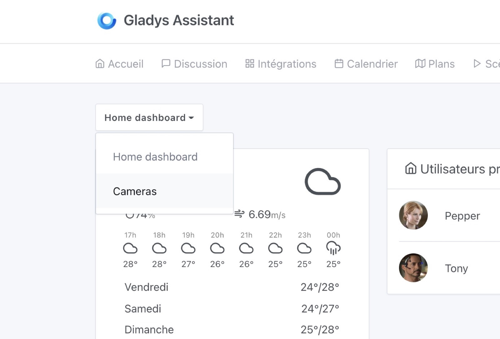
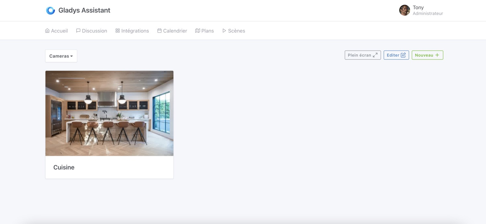
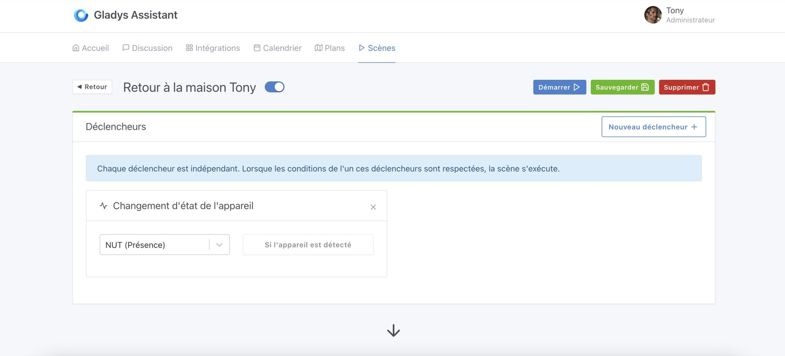
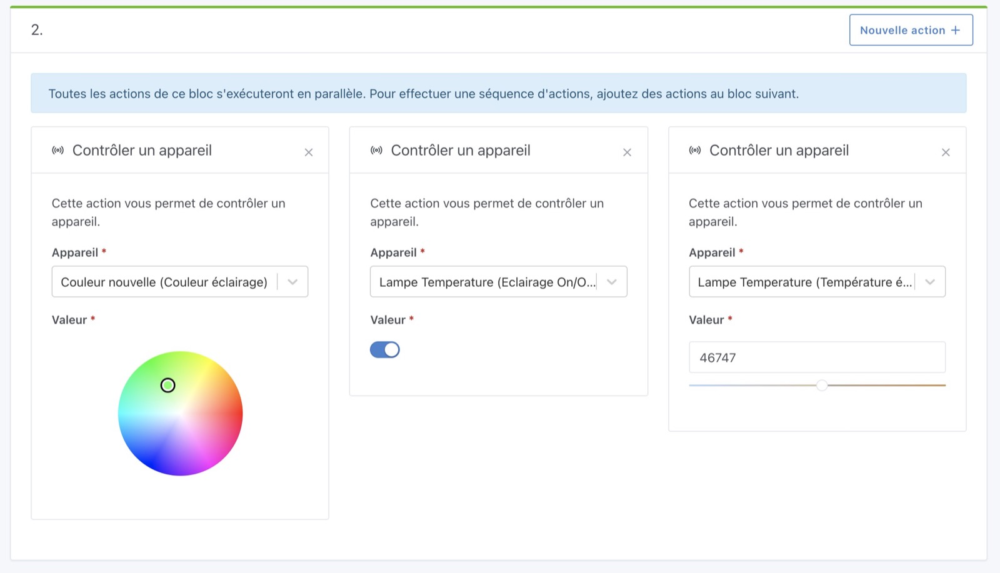
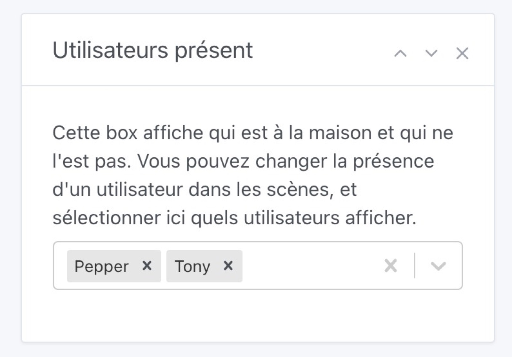

Salut à tous !

J'espère que vous avez passé un bon été 🙂

C'est presque le concentré de tout un été de travail, Gladys Assistant v4.5 est disponible !

## Les nouveautés de Gladys Assistant 4.5

### Multi-dashboard

Vous pouvez désormais créer autant de tableaux de bords que vous voulez dans Gladys.

L'objectif est de pouvoir faire des tableaux de bords différents selon certains cas d'usages, par exemple:

- Un tableau de bord "d'accueil" avec les informations les plus importantes pour le quotidien
- Un tableau de bord avec toutes vos caméras
- Un tableau de bord pour afficher sur une tablette dans l'entrée
- Etc...

Chaque tableau de bord a une URL unique, ce qui vous permet d'avoir ces tableaux de bords en favoris, et surtout de mettre un tableau de bord sur une tablette en écran d'accueil si vous souhaitez avoir un écran de contrôle quelque part dans votre maison !

Concrètement, vous avez maintenant un sélecteur sur l'écran d'accueil qui vous permet de sélectionner le tableau de bord que vous voulez afficher:

Ce qui change le tableau de bord affiché, super simple :)

### Désactiver une scène

C'était une fonctionnalité très demandée, il est maintenant possible de désactiver une scène dans Gladys ! Enfin !

Pratique si vous partez en vacances, si vous prototypez une scène, ou si juste vous voulez désactiver une scène embêtante sans forcément la supprimer...

### Contrôler n'importe quel appareil dans les scènes

Il est maintenant possible de contrôler n'importe quel type d'appareil dans les scènes:

- La couleur d'une lampe
- La température d'une lampe
- Un appareil binaire (On/Off)
- Ou n'importe quel type d'appareil!

C'est très puissant. Si vous avez des retours sur cette action, n'hésitez pas à en parler sur le forum.

### Une première alpha pour l'intégration Google Home sur Gladys Plus

Je travaille depuis un bout de temps sur l'intégration [Gladys Plus](/fr/plus) avec Google Home, l'objectif est de pouvoir contrôler vos appareils Gladys (peu importe quel appareil):

- Depuis l'application Google Home
- Vocalement avec un Google Home
- Avec Google Assistant depuis votre téléphone

[Petite démonstration de l'intégration sur mon compte Twitter](https://twitter.com/pierregillesl/status/1405786308329365504).

Si vous êtes intéressé par tester cette intégration (qui est en alpha fermée pour l'instant), vous pouvez me contacter sur [le forum](https://community.gladysassistant.com/)!

J'en profite pour dire qu'il est désormais possible de **tester Gladys Plus gratuitement** (sans même rentrer de moyen de paiement). J'ai ajouté une période d'essai de 14 jours sur Gladys Plus.

Pour tester gratuitement Gladys Plus, [c'est ici](/fr/plus/) !

### Amélioration de la box "Utilisateurs présents à la maison"

C'est un petit changement qui fait la différence, il est possible de sélectionner les utilisateurs à afficher sur la box "utilisateurs présents à la maison" du tableau de bord.

### Des améliorations de performances

Le forum étant assez calme cet été, j'en ai profité pour travailler sur des sujets un peu plus long terme que j'ai moins le temps d'aborder dans le rush de l'année.

J'ai migré preact-cli (l'outil qu'on utilise pour builder le frontend) en version 3.x. C'était pas facile, mais c'est un grand pas en avant qui a permit de réduire la taille du bundle Javascript.

J'ai aussi travaillé sur la suppression de quelques librairies frontend qui prenaient de la place, pour avoir une application web Gladys toujours plus légère et rapide :)

J'espère que vous apprécierez le gain en performance !

### Des nouveaux périphériques Zigbee2mqtt

Quelques périphériques Zigbee2mqtt ont été ajoutés dans Gladys:

- TuYa TS0601 Air Quality Sensor and CO2 feature [`#1247`](https://github.com/GladysAssistant/Gladys/pull/1247)
- Philips Hue 929002241201 [`#1259`](https://github.com/GladysAssistant/Gladys/pull/1259)
- Light color feature [`#1203`](https://github.com/GladysAssistant/Gladys/pull/1203)

### Correction d'un bug Bluetooth

Il y avait un bug récurrent dans Gladys 4 qui touchait l'intégration Bluetooth: dans certain cas, en redémarrant, Gladys n'arrivait pas à se connecter au driver Bluetooth qui n'était pas "prêt".

Ce bug est maintenant résolu !

Pour en savoir plus vous pouvez jeter un coup d'oeil à la PR GitHub : [`#1194`](https://github.com/GladysAssistant/Gladys/pull/1194)

### La suite ?

J'ai deux gros chantiers en cours actuellement:

- Une fonctionnalité très demandée, la possibilité d'afficher des courbes de capteurs sur le tableau de bord Gladys. J'en ai pas mal parlé [sur Twitter](https://twitter.com/pierregillesl/status/1419521241044553731) si ça vous intéresse.
- Finir l'intégration Google Home dans Gladys Plus. La certification Google prend du temps, et je prend le temps de faire ça bien avec eux avant que ça parte en production. Si vous voulez suivre l'avancement de l'intégration, vous pouvez suivre [ce sujet sur le forum](https://community.gladysassistant.com/t/integrer-gladys-dans-googlehome/5553/37?u=pierre-gilles).

## Comment mettre à jour ?

Si vous avez installé Gladys avec l’image Raspberry Pi OS officielle, vos instances se mettront à jour **automatiquement** dans les heures à venir. Cela peut prendre jusqu’à 24h, pas de panique.

Si vous avez installé Gladys avec Docker, vérifiez que vous utilisez bien Watchtower. Voir la [documentation](/fr/docs/installation/docker#mise-à-jour-automatique-avec-watchtower).

Avec Watchtower, Gladys se mettra automatiquement à jour.

## Remerciements aux contributeurs

Encore une fois, merci à tous ceux qui ont contribués à cette release ! On se retrouve sur [le forum](https://community.gladysassistant.com/) si vous voulez parler de cette release :)
