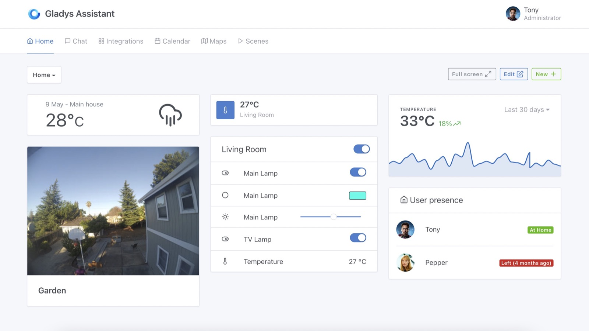

Salut à tous,

Aujourd'hui je suis heureux de sortir Gladys Assistant v4.7, une nouvelle version qui apporte pas mal de nouvelles fonctionnalités majeures 🚀

## Les nouveautés de Gladys Assistant 4.7

### Affichage graphique sur le tableau de bord

Il est maintenant possible d'afficher des graphiques de valeurs de capteurs sur le tableau de bord, afin de pouvoir suivre l'évolution d'un capteur dans le temps.

Cette fonctionnalité fonctionne sans aucune configuration, et sans avoir à connecter une base de donnée externe type InfluxDB. Nous avons fait le choix de faire le développement en interne, afin que ce soit simple à utiliser, super performant, et évolutif.

Pour afficher cette vue graphique rapidement quel que soit l'intervalle demandé, Gladys calcule en arrière-plan des données "aggrégées" toutes les heures, avec 3 niveaux de granularités :

- **Aggrégation horaire :** Gladys garde 100 valeurs par capteur et par heure.
- **Aggrégation journalière :** Gladys garde 100 valeurs par capteur et par jour.
- **Aggrégation mensuelle :** Gladys garde 100 valeurs par capteur et par mois.

Lorsque vous affichez un graphique sur le tableau de bord, Gladys va ainsi choisir le niveau d'aggrégation le plus adaptée, afin que l'affichage soit hyper rapide.

Notre objectif est de maintenir le temps de réponse en dessous de 100ms, quel que soit l'intervalle sélectionné.

Pour en savoir plus, rendez-vous dans [la documentation](/fr/docs/dashboard/chart).

### Compatibilité Zigbee2mqtt complète

Lorque nous avons sorti la compatibilité Zigbee2mqtt en début d'année, nous avons pris une approche prudente : chaque appareil Zigbee2mqtt devait être manuellement intégré par un développeur Gladys avant de pouvoir être utilisé.

Cette approche nous a permis pendant les premiers mois de bien comprendre l'usage et d'intégrer proprement chaque nouveau type d'appareil.

Avec le temps et le recul, tous les appareils à intégrer ont fini par se ressembler, et cette approche nous ralentissait plus qu'autre chose.

Alexandre Trovato s'est lancé sur le sujet, et a développé une nouvelle version de cette intégration, cette fois-ci en détectant automatiquement chaque appareil, et en réalisant le mapping entre Zigbee2mqtt et Gladys automatiquement.

La conséquence de ce développement, c'est qu'**il est maintenant possible d'utiliser n'importe quel appareil compatible Zigbee2mqtt dans Gladys !!**

Merci à Alexandre Trovato pour sa [Pull Request](https://github.com/GladysAssistant/Gladys/pull/1302) !

### Tasmota: Transformer une prise en lumière

Certains utilisateurs branchent une lampe (chevet, bureau, salon) sur une prise connectée, et ensuite veulent pouvoir utiliser cette prise en tant que "lampe" dans Gladys.

Par exemple, ils veulent pouvoir dire "Allume la lumière du salon" et que cette action allume la prise.

Il est désormais possible de re-catégoriser ces prises dans l'intégration Tasmota, afin qu'une prise soit considéré comme lampe par Gladys.

### Ajout d'une nouvelle catégorie "Température de l'appareil"

Certains appareils ont un capteur de température dans leur CPU afin de vérifier qu'il ne surchauffe pas.

Dans Gladys, il n'y avait que jusque-là qu'une seule catégorie liée à la température, ce qui posait problème, car quand vous dites "Quelle température fait-il dans le salon ?", vous êtes intéressés par la température de la pièce, et pas la température du CPU des appareils dans votre salon !

La nouvelle catégorie "device temperature" permet aux appareils de clairement indiquer qu'il s'agit de la température du CPU de l'appareil, et non pas de la pièce.

Fonctionnalitées développée ici: [#1327](https://github.com/GladysAssistant/Gladys/commit/94acaac8fd32c3c0e0c82c581f10904d5ed36f0d).

### De nombreuses améliorations/corrections de bugs

- Dans l'intégration MQTT, Gladys affiche un message si le broker MQTT est connecté ou pas ([#1349](https://github.com/GladysAssistant/Gladys/commit/a5c95dcfbfc84b8ddde141a4e3680cae9fb659ce))
- Dans l'intégration Caldav, correction d'un bug sur la date des évènements récurrents ([#1367](https://github.com/GladysAssistant/Gladys/commit/b6ab1c06e94f804c6077da7b99e5e258ef0cf475))
- Dans l'intégration Telegram, la température est désormais envoyée au bon format ([#1363](https://github.com/GladysAssistant/Gladys/commit/bcbb1234b1590fb14a2af5eef87065c966297287))
- Dans la vue scène, correction d'un bug qui empêchait l'utilisateur de sauvegarder une scène ([#1318](https://github.com/GladysAssistant/Gladys/commit/7ed2d520b8b5b6c03b539311903425393797aaa1))
- De nombreuses améliorations & corrections dans l'intégration EWelink ([#1044](https://github.com/GladysAssistant/Gladys/commit/a755d55f2ebb70983111343018b3fd9a1590933b))

## Comment mettre à jour ?

Si vous avez installé Gladys avec l’image Raspberry Pi OS officielle, vos instances se mettront à jour **automatiquement** dans les heures à venir. Cela peut prendre jusqu’à 24h, pas de panique.

Si vous avez installé Gladys avec Docker, vérifiez que vous utilisez bien Watchtower. Voir la [documentation](/fr/docs/installation/docker#mise-à-jour-automatique-avec-watchtower).

Avec Watchtower, Gladys se mettra automatiquement à jour.

## Remerciements aux contributeurs

Encore une fois, merci à tous ceux qui ont contribués à cette release ! On se retrouve sur [le forum](https://community.gladysassistant.com/) si vous voulez parler de cette release :)
