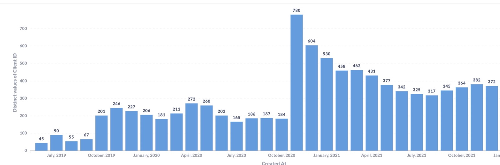
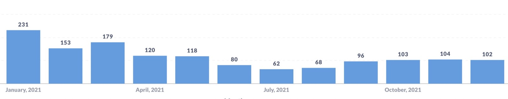
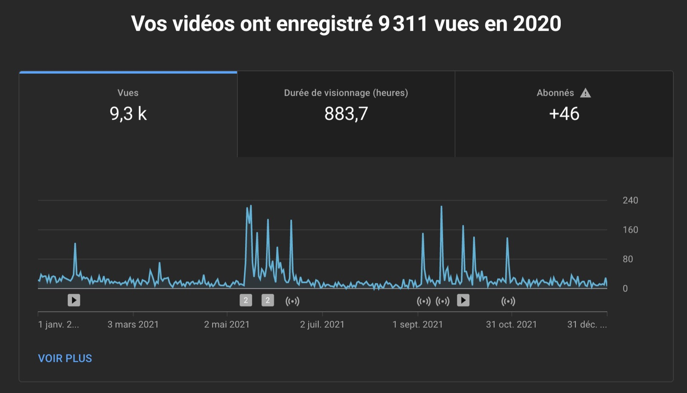
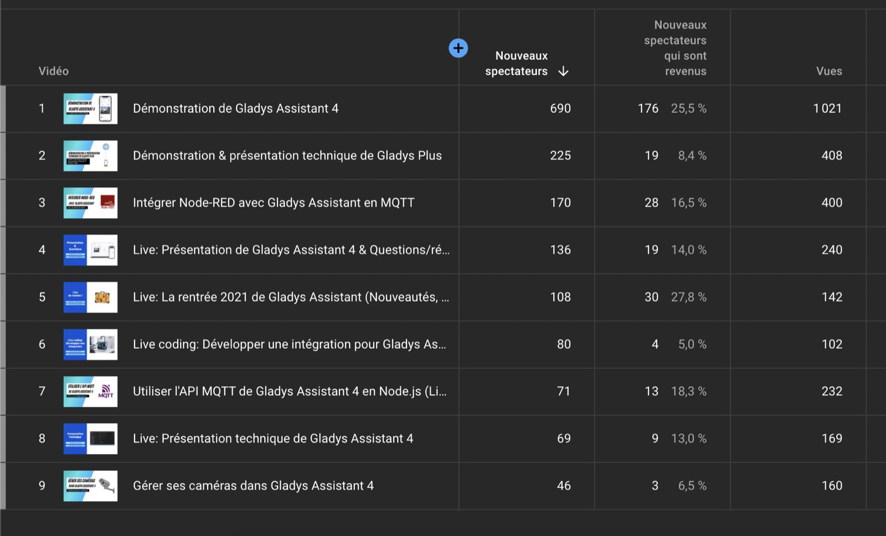

Salut à tous, et bonne année !

C'est la tradition, chaque année j'écris un article pour récapituler tout ce qu'il s'est passé sur la dernière année pour Gladys Assistant.

C'est parti pour le bilan de l'année 2021 🙂

<!--truncate-->

## Que s'est-il passé en 2021 ?

2021 a été l'année la plus productive sur le projet, puisque **nous avons sorti 23 mises à jour**, soit une mise à jour toutes les 2,2 semaines en moyenne !

Cette productivité, c'est le résultat de tout le travail fait en amont en 2019 et 2020 pour mettre en place cette nouvelle version de Gladys (Gladys 4) avec une stack techno plus récente, stack qui nous permet d'être plus confiant sur le code que nous sortons, de tester plus facilement, et donc de sortir des fonctionnalités et des correctifs plus vite.

Et c'est avant tout **l'implication de toute la communauté** qui a permis au projet d'être si véloce.

Sans les PRs de tous les contributeurs, impossible d'avoir une compatibilité si riche, d'avoir un produit si complet, et de répondre si vite à des bugfixes.

MERCI à tous les contributeurs: Alexandre Trovato, Vincent Kulak, Bertrand D'Aure, Cyril Beslay, Corentin Allemand, NickDub, Sescandell, Terdious, Frédéric Le Barzic, Rob McCann, Thibaud Roudier et Nicolas Geissel ! 🙏

Pour revenir sur les fonctionnalités qui ont été développées cette année, on peut citer :

- L'intégration Zigbee2mqtt, la détection de lever/coucher de soleil, contrôle de la luminosité sur le tableau de bord dans [Gladys Assistant 4.2](/fr/blog/gladys-assistant-4-2-is-here)
- Gestion de la présence dans les scènes, condition temporelle dans les scènes, requêtes HTTP dans les scènes dans [Gladys Assistant 4.3](/fr/blog/gladys-assistant-4-3-is-here)
- Détection d'entrée et sortie de zones, condition maison vide/n'est plus vide dans les scènes dans [Gladys Assistant v4.4](/fr/blog/gladys-assistant-4-4-is-here)
- Tableau de bord multiples, intégration Google Home, possibilité de désactiver une scène, contrôler un appareil quelconque dans une scène dans [Gladys Assistant v4.5](/fr/blog/gladys-assistant-4-5-is-here)
- Affichage de graphique de capteurs sur le tableau de bord, comptabilité complète avec tous les appareils Zigbee2mqtt dans [Gladys Assistant v4.6 et v4.7](/fr/blog/display-chart-and-major-zigbee2mqtt-upgrade)

Comme vous pouvez le voir, nous avons pu documenter et écrire des articles de blog pour chaque nouvelle fonctionnalité développée.

C'est grâce à ce nouveau site basé sur Docusaurus qu'il est aussi facile de publier des articles. J'espère continuer dans cette lancée en 2022 et écrire encore plus de contenu.

## Quelques statistiques

La page [/open](/fr/open/) est revenu sur le site, et vous permet de suivre en temps réel le nombre d'instances Gladys qui tourne, et le nombre d'utilisateurs Gladys Plus (et ainsi le revenu du projet).

### L'usage

Depuis la v4, nous faisons une estimation du nombre d'instances actives en comptant le nombre de requêtes de demande de mise à jour faites sur notre infrastructure.

Voilà le nombre d'installations actives par mois depuis le début de la v4 (alpha incluse):

Voici le nombre de nouvelles instances par mois:

En Novembre 2020, Gladys v4 est sorti et il y a eu beaucoup d'articles sur des sites spécialisés, ce qui a boosté les téléchargements pendant les mois qui ont suivi.

L'été 2021 a été très creux en terme d'usage et de nouveaux utilisateurs, ce qui n'est pas étonnant car la France a déconfiné pendant cette période et personne n'était devant son ordinateur tout simplement.

Heureusement en Septembre, la croissance a repris et nous sommes finalement a **372 instances active** fin décembre 2021.

C'est un beau chiffre, mais c'est en deça de ce que j'espérais.

Mon objectif était de 1000 instances actives, on en est loin pour l'instant 😄

### La chaine YouTube

A partir de Mai 2021, je me suis mis sérieusement au YouTube Game 😎

J'ai sorti 5 vidéos et fait 5 live YouTube.

C'est beaucoup de travail car chaque vidéo/live me prend environ 1 journée complète de travail, entre la préparation, la communication en amont du live, le tournage, le montage, la publication (vignette, description, horodatage, posts réseaux sociaux, newsletter, etc...).

10 vidéos représentent donc 10 jours de travail, en sachant que je ne travaille qu'à temps partiel sur Gladys, cela représente donc environ 1 mois de travail en cumulé sur l'année. Ca parait pas, mais c'est un boulot énorme 😅

Les vidéos les plus populaires:

- [Démonstration de Gladys Assistant 4](https://www.youtube.com/watch?v=yP-umEMVcro)
- [Live: Présentation technique de Gladys 4](https://www.youtube.com/watch?v=t6mVCZ5Y9SU)
- [Intégrer Node-RED avec Gladys Assistant en MQTT](https://www.youtube.com/watch?v=bpmHzR8_S5g)
- [Démonstration & présentation technique de Gladys Plus](https://www.youtube.com/watch?v=TmjrBeufjyo)

Sur 2021, la chaîne a fait 9.3k vues et 883 heures de visionnage.

C'est un bon début, et je vais continuer dans cette direction en 2022 car pour moi les vidéos sont un vrai plus pour le projet:

- Grâce à l'algorithme YouTube, les vidéos sont présentés à des visiteurs YouTube qui ne connaissent pas Gladys mais sont intéressés par la domotique/le Raspberry Pi/tous les sujets techs que j'aborde en vidéo. Ces visionneurs découvrent le projet via YouTube et potentiellement viennent installer Gladys par la suite.

YouTube me permet même de voir des statistiques sur ces utilisateurs :

- Les vidéos sont des bons compléments aux tutoriels écrits, car il est souvent plus facile de reproduire ce qu'on voit en vidéo plutôt que ce qu'on voit dans un article écrit. Les utilisateurs se projettent mieux !

Si vous voulez que j'aborde un sujet spécifique en vidéo, n'hésitez pas à m'en parler sur le forum ou sur Twitter, je suis preneur de tout sujet de vidéos.

### Les réseaux sociaux

Sur les réseaux sociaux:

- [@gladysassistant sur Twitter](https://twitter.com/gladysassistant) rassemble 2 744 followers
- [Gladys Assistant Facebook](https://www.facebook.com/gladysassistant) comptabilise 756 likes
- [@gladysassistant sur instagram](https://www.instagram.com/gladysassistant) rassemble 573 abonnés

Et enfin 1 874 followers sur [mon Twitter personnel](https://twitter.com/pierregillesl) !

### La newsletter

Au niveau de la newsletter, vous êtes 3 508 à suivre la [newsletter Gladys Assistant](https://email-list.gladysassistant.com/subscription/1mXJoEWEl).

- 3016 abonnés en français
- 492 abonnés en anglais

C'est une régression par rapport à l'année dernière, mais c'est normal ! J'ai implémenté des règles de détection de "bounce", ce qui a purgé la liste d'anciens emails qui n'existaient plus.

Un email "bounce" quand son destinataire n'est plus joignable : le domaine n'existe plus ou l'email n'existe plus. Cela arrive souvent dans l'audience Gladys, car certains d'entre vous utilisent un domaine perso comme email (ex: prénom_at_nom_de_famille.fr), et finissent par abandonner cette adresse / ne pas renouveller le domaine.

### Le GitHub Gladys Assistant

Nous sommes à 1 879 stars ⭐ sur le [repo Gladys Assistant](https://github.com/GladysAssistant/Gladys)

C'est +21% par rapport à l'année dernière !

Encore une croissance à deux chiffres sur le Github 😍

Je compte sur vous pour nous soutenir sur GitHub en mettant une étoile ⭐ au projet.

## Projets et objectifs pour 2022

### Un produit solide techniquement

Pour moi, les 2 dernières années ont servis à poser les bases d'un logiciel de domotique robuste, stable et simple à utiliser.

Maintenant que les bases sont posées, on avance en vitesse de croisière : les développements sont fréquents, le site évolue à chaque nouvelle fonctionnalité, des articles sont publiés sur le blog régulièrement, je fais des vidéos YouTube pour expliquer chaque nouveauté.

En d'autres termes : fini l'expérimentation et les preuves de concepts, la v4 est bel et bien stable et les process qu'on a mis en place avec la communauté fonctionnent bien.

### Mais l'usage ne suit pas encore

Cependant, l'usage ne reflète pas encore tout le travail effectué. Pour moi nous n'avons pas encore atteint le point où l'acquisition utilisateur fonctionne en automatique.

Il n'y a malheureusement pas encore une croissance régulière sur le produit. On l'a vu sur la courbe d'usage annuelle, lors du lancement le nombre d'installations a été tout de suite très fort ( le résultat des différents articles publiés chez des sites de domotique à forte audience ), mais une fois l'effet lancement passé, il n'y a rien eu de plus.

La croissance est revenu très doucement en septembre, mais ce n'est clairement pas assez.

Il y a plusieurs raisons à cela à mon avis :

- Lors du lancement, des intégrations et des fonctionnalités critiques manquaient ( Zigbee2mqtt par exemple / Gestion des zones / Multi-utilisateurs / Multi-dashboard / Vue Graphique). J'imagine que des nouveaux utilisateurs ont du tester Gladys le mois du lancement, puis laisser de côté. Ces fonctionnalités sont maintenant présentes mais je ne suis pas sûr qu'en dehors de la communauté les gens soient au courant de tous ces développements.

- Notre intégration Z-Wave n'a pas été maintenue faute de mainteneur et n'est clairement pas au niveau. Le Z-Wave reste un protocole qui est encore assez utilisé, surtout chez les "anciens" de la domotique 😄. Un testeur spécialisé (YouTubeur, bloggeur) qui veut faire un article sur Gladys va tester avec ce qu'il a chez lui : souvent du Z-Wave.

A long terme, je ne suis pas certain que le Z-Wave garde une place dans la domotique quand on voit les nouvelles technos : Zigbee à 8€ le capteur et 8€ le stick USB, plus ouvert vs Z-Wave à 60€ le capteur et 25€ le stick USB, moins ouvert. Matter futur standard de domotique qui arrive, en full open-source. Bluetooth Low energy.

Mais bon, à court terme les utilisateurs domotiques dont le Z-Wave est la techno principale ont du mal sur Gladys et cela ne fait pas nécessairement une bonne publicité au logiciel.

- Probablement pas assez de communications à l'extérieur du projet. J'essaie via YouTube de toucher une nouvelle population, mais il faudrait à mon avis que je m'appuie plus sur des médias existants : participer en tant qu'invité sur des live (Twitch/YouTube) ? Contacter plus de médias domotique ? Plus de présences sur des forums tiers ?

Si vous avez des idées / que vous avez des retours / que vous avez un blog / que vous connaissez quelqu'un qui pourrait nous aider à faire connaître Gladys, n'hésitez pas !

### Un peu d'optimisme

Ne vous inquiétez pas, je ne me plains pas 😄

C'est la réalité de tout lancement de produit : rien ne tombe du ciel et il faut parfois des années avant qu'un produit ne "prenne". J'ai des amis dont la croissance était plate pendant des mois, puis croissance verticale, même souvent sans forcément savoir pourquoi... L'essentiel c'est de rester consistent dans le travail et de ne rien lâcher 💪

En tout cas merci à toute la communauté Gladys qui permet à ce produit d'exister.

Merci à tous les contributeurs [Gladys Plus](/fr/plus) qui apportent leur soutien financier au projet tout en bénéficiant de super fonctionnalités : Google Home, sauvegardes, accès à distance chiffré de bout en bout, API ouverte, etc...

Bonne année 2022 à tous, et on se retrouve sur le forum pour parler de tout ça 🙂

Pierre-Gilles Leymarie
