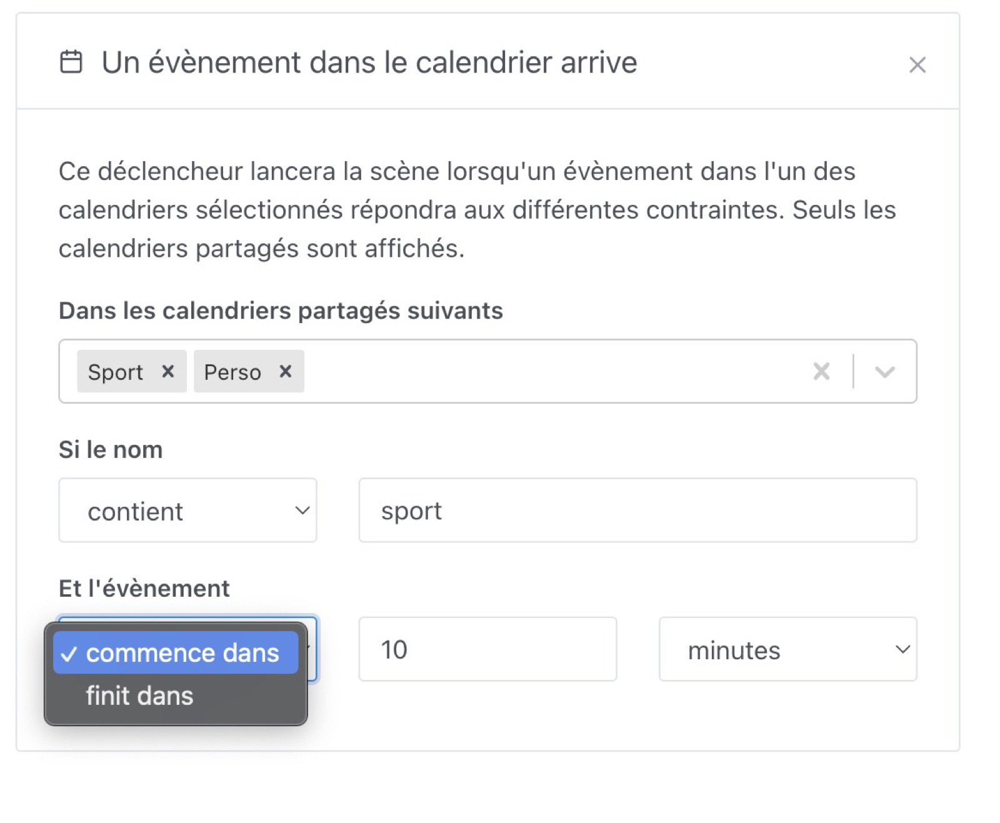
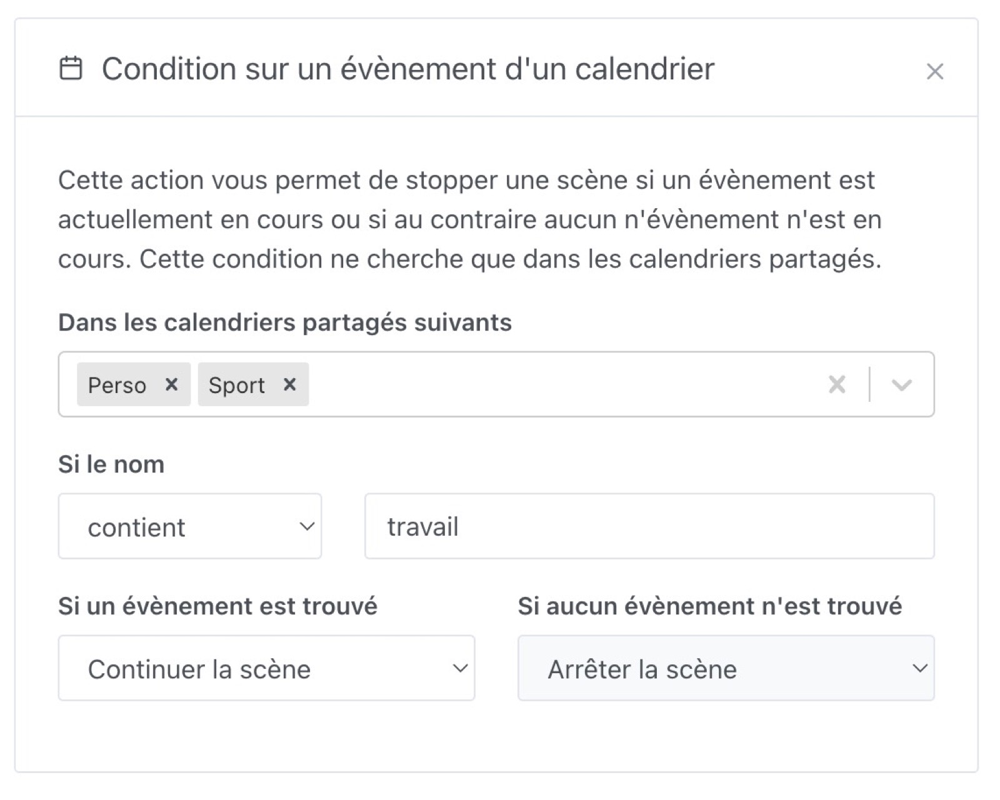
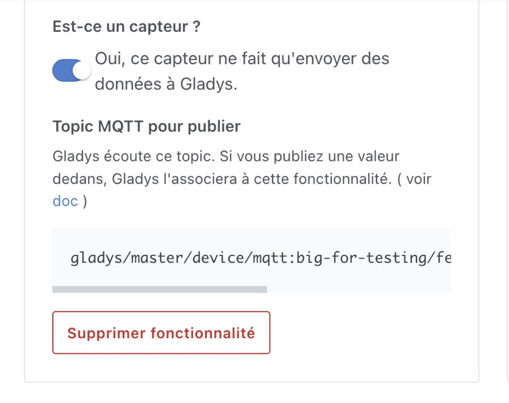
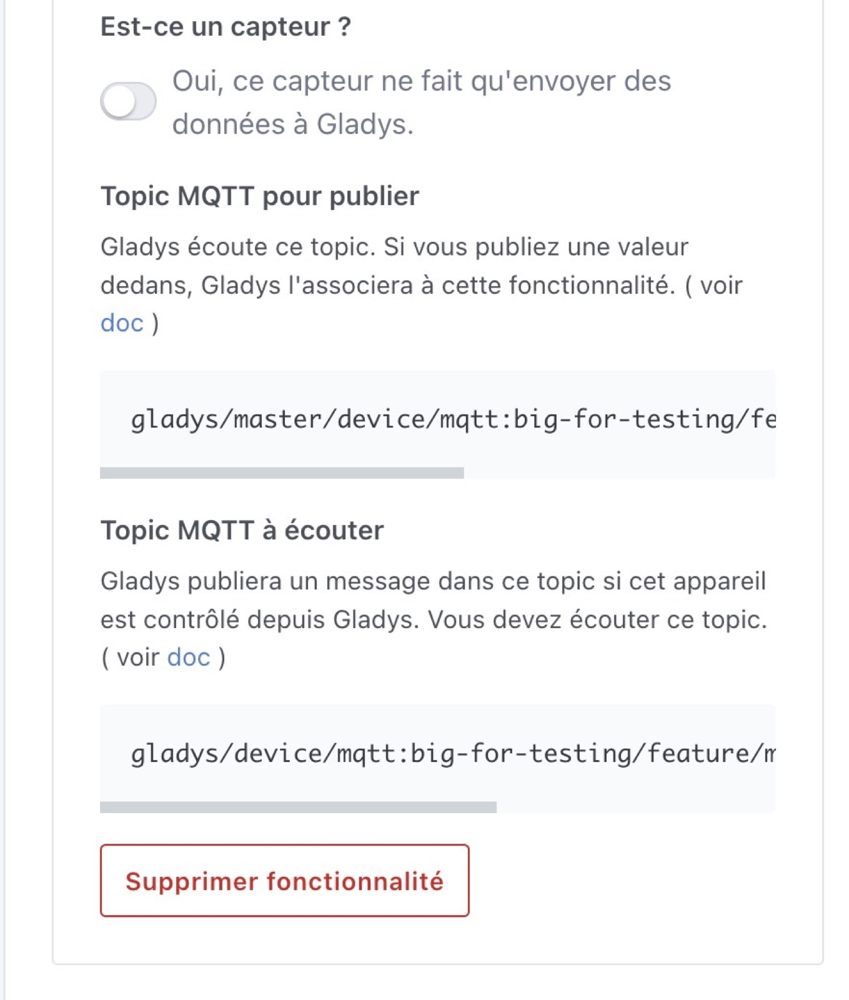

Salut à tous !

Aujourd'hui je suis heureux de lancer une nouvelle version de Gladys, Gladys Assistant v4.8 🥳

Cette version met l'accent sur les calendriers, mais il y a d'autres améliorations qui vont plaire à tout le monde à mon avis !

## Les nouveautés de Gladys Assistant 4.8

### Déclencher une scène quand un évènement d'un calendrier arrive

Imaginez que vous vouliez recevoir une notification quand il est l'heure de partir au sport ?
Que vous vouliez être réveillé pile pour le travail, en fonction d'évènements dans votre calendrier ?

C'est maintenant possible grâce au déclencheur de scène "Un évènement dans le calendrier arrive".

Déjà, il faut avoir connecté son calendrier à Gladys ( Un calendrier iCloud, Google Agenda, Synology, ou n'importe quel calendrier Caldav grâce à notre [intégration Caldav](/fr/docs/integrations/caldav/) )

Ensuite, vous allez dans les scènes et vous créer un déclencheur "un évènement dans le calendrier arrive" :

Vous pouvez filtrer dans certains calendriers, filter par le nom de l'évènement ( contient "piscine", commence par "réunion", "a n'importe quel nom", etc... )

Et ensuite, vous pouvez utiliser l'évènement qui a déclenché la scène, par exemple dans une action "envoyer un message", vous pouvez injecter le nom de l'évènement, le lieu, la date de début, la date de fin :

C'est très puissant, et ça permet de créer des programmations infinies.

### Condition dans une scène quand un évènement est en cours

De la même manière, vous pouvez décider d'ajouter une condition à une scène en fonction de la présence ( ou non ) d'un évènement dans votre calendrier.

Imaginons que vous vouliez empêcher une scène de tourner quand vous êtes en vacances ? Ou au contraire, vous ne voulez qu'une scène ne tourne QUE pendant les jours fériés ?

Vous voulez faire un comportement spécifique si vous êtes en réunion ?

Dans une scène, vous pouvez créer une condition "Condition sur un évènement d'un calendrier" :

De la même manière, vous pouvez utiliser l'évènement dans la scène ensuite, pratique pour pouvoir s'envoyer un message Telegram avec les détails de l'évènement.

### Tourner une image de caméra de 180°

Grâce au travail de [VonOx sur Github](https://github.com/GladysAssistant/Gladys/pull/1297), il est maintenant possible de tourner une image de caméra de 180°, ce qui est pratique si votre caméra est fixée à l'envers.

Dans l'intégration caméra, il y a un simple bouton "Rotation 180°" :

### Amélioration de l'interface de l'intégration MQTT

C'est un changement qui peut paraître tout bête, mais j'ai eu énormément de retour sur le fait que l'intégration MQTT n'était pas claire au niveau des appareils MQTT qui sont des actionneurs.

Il n'était pas clair que l'API MQTT de Gladys fonctionne dans les deux sens : Gladys peut envoyer un message à l'appareil ( lui dire "allume toi" par exemple ), mais peut aussi recevoir des nouvelles valeurs si jamais l'appareil a changé d'état en dehors de Gladys.

J'ai corrigé le tir avec un nouvel affichage.

Dans le cas des capteurs, c'est désormais affiché de cette façon :

Dans le cas des actionneurs, les deux topics MQTT sont maintenant affichés :

### Zigbee2mqtt : Ajout des capteurs de CO & Alarme

Grâce au travail d'Alexandre Trovato sur Github [ici](https://github.com/GladysAssistant/Gladys/pull/1417) et [ici](https://github.com/GladysAssistant/Gladys/pull/1420), il est maintenant possible d'ajouter des capteurs de monoxyde de carbone (CO) Zigbee ainsi que les appareils Zigbee qui exposent une alarme.

## Comment mettre à jour ?

Si vous avez installé Gladys avec l’image Raspberry Pi OS officielle, vos instances se mettront à jour **automatiquement** dans les heures à venir. Cela peut prendre jusqu’à 24h, pas de panique.

Si vous avez installé Gladys avec Docker, vérifiez que vous utilisez bien Watchtower. Voir la [documentation](/fr/docs/installation/docker#mise-à-jour-automatique-avec-watchtower).

Avec Watchtower, Gladys se mettra automatiquement à jour.

## Remerciements aux contributeurs

Encore une fois, merci à tous ceux qui ont contribués à cette release ! On se retrouve sur [le forum](https://community.gladysassistant.com/) si vous voulez parler de cette release :)

## Supporter le projet

Il y a plein de façons de supporter le projet :

- Participer aux discussions sur le forum, aider les nouveaux.
- Contribuer au projet en proposant des nouvelles intégrations/fonctionnalités.
- Améliorer la documentation, qui est open-source.
- Faire un [don ponctuel](https://www.buymeacoffee.com/gladysassistant).
- S'inscrire à [Gladys Plus](/fr/plus).

Merci à tous ceux qui supportent Gladys 🙏
